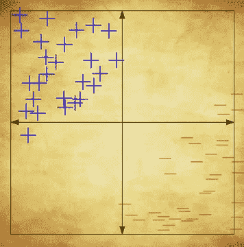
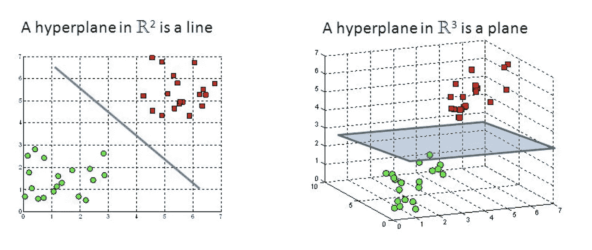
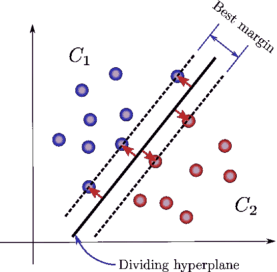
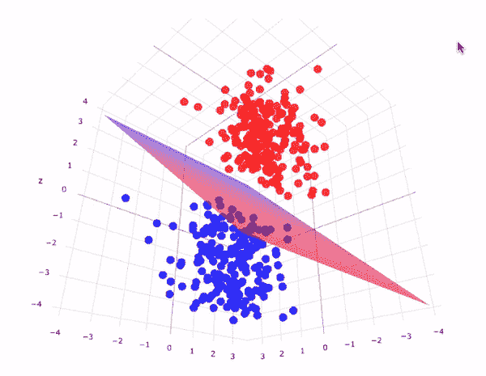
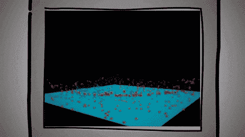

# 简单有趣的支持向量机算法

> 原文：<https://medium.datadriveninvestor.com/support-vector-machine-svm-algorithm-in-a-fun-easy-way-fc23a008c22?source=collection_archive---------1----------------------->

在学习 ML/AI 的基础知识时，SVM 算法是必不可少的，如果你有兴趣了解算法的核心。

在您学习机器学习的过程中，您必须遇到一些基本的机器学习算法，如线性回归、决策树和支持向量机，以便能够对该领域的基础知识有一个坚实的理解，您可以在这里找到线性回归的完整介绍:

 [## 使用 Python 在不到 5 分钟的时间内完成线性回归

### 如果你正在寻找一个快速而有针对性的入门，线性回归在你的 ML 学习之旅中是必须的…

medium.com](https://medium.com/@zahraelhamraoui1997/linear-regression-in-less-than-5-minutes-using-python-2c693dd429cb) 

# 什么是支持向量机？

SVM 是一种受监督的机器学习算法，可用于分类或回归问题。它使用一种称为内核技巧的技术来转换您的数据，然后基于这些转换，它会在可能的输出之间找到一个最佳边界。简而言之，它执行一些极其复杂的数据转换，然后根据您定义的标签或输出计算出如何分离您的数据。

margin

SVM 是如何工作的？

主要目标是以尽可能好的方式分离给定的数据集。最近点之间的距离称为边距。目标是在给定的数据集中选择一个支持向量之间具有最大可能间隔的超平面。SVM 在以下步骤中搜索最大边际超平面:

1.  生成以最佳方式分离类的超平面。左侧图显示了三个超平面黑色、蓝色和橙色。在这里，蓝色和橙色的分类误差较高，但黑色的分类正确。
2.  从最近的数据点中选择具有最大分离的右超平面。

 [## 认知计算——一套被广泛认为是……

### 作为它的用户，我们已经习惯了科技。这些天几乎没有什么是司空见惯的…

www.datadriveninvestor.com](https://www.datadriveninvestor.com/2020/02/19/cognitive-computing-a-skill-set-widely-considered-to-be-the-most-vital-manifestation-of-artificial-intelligence/) 

# 超平面

超平面是在具有不同类成员的一组对象之间分离的决策平面。

**超平面**的尺寸与特征的数量成正比。对于简单的线性回归模型，如果您的数据基于单个特征，那么您的**平面/决策边界**将看起来像左侧图像。如果你有一个以上的特征，那么这个平面将被称为超平面，因为它的数据点现在位于 **3D 矢量中。**随着功能的增加，ML 模型的维数也在增加，很难描绘出 10、20 或 100 维的情况。此外，有一些技术可以降低维数，如 PCA、后向/前向特征消除、高相关性/低方差滤波器等，因为太多的特征建模和分类在计算上是昂贵的。

# 边缘

边距是最近的类点上的两条线之间的间隙。这是从直线到支持向量或最近点的垂直距离。如果两类之间的边距较大，则认为是好的边距，较小的边距是差的边距。

SVM

# 一般化

假设你在纸板上有一堆红色和蓝色的点。你被要求画一条直线来分开它们。你看着这些点，意识到这不可能发生，因为，为了正确地分离所有的点，你必须画一条曲线。

现在你后退一步，看到你正在看一个三维立方体的一面。在这个立方体中，你可以很容易地在某个地方放置一个简单的平面纸板来分隔红色和蓝色的点(因为它们在不同的深度)。

说到 SVM 的概念，它依赖于这样一个事实，即找出三维立方体中纸板的属性比找出二维纸板中弯曲线条的属性要容易得多。所以它只是提取纸板的属性，并将其投影回二维空间。一个简单的三维平面在二维看起来会像一条弯弯曲曲的线。

概括地说，SVM 基本上将给定的数据点投影到真正的高维空间(使用核函数)，得到分离超平面，并将其转换回较低的维度。SVM 用支持向量来定义这个界限。他们是最接近边界并“支持”分离的人。分离边界将是最佳边界(与两组点等距)”。

Support Vector Machine (SVM) — Fun and Easy Machine Learning GIF

# 用 Python 实现

使用其他指标评估模型，如果您有兴趣了解这些指标，请访问:

 [## 你觉得你的机器学习模型完美吗？三思而后行。

### 有时你得到 98%甚至更好的 99%的准确性，你可能会跳，等一下，你的模型可能是…

medium.com](https://medium.com/ai-in-plain-english/you-think-your-machine-learning-model-is-just-perfect-think-twice-2cedd594ce73) 

# 结论

我希望我能给你解释清楚一点，SVM，这是基本算法之一。这是我个人的研究，如果你有任何意见，请联系我。

[Github](https://github.com/zahrael97) ， [LinkedIn](https://www.linkedin.com/in/zahraelhamraoui97/) ， [Zahra Elhamraoui](http://zahraelhamraoui1997@gmail.com/) ， [Upwork](https://www.upwork.com/o/profiles/users/~01e52291fa456a8934/)

# 参考

[1]维基百科

[SVM](https://www.kdnuggets.com/2017/02/yhat-support-vector-machine.html)

【3】[支持向量机](https://towardsdatascience.com/support-vector-machines-for-classification-fc7c1565e3)