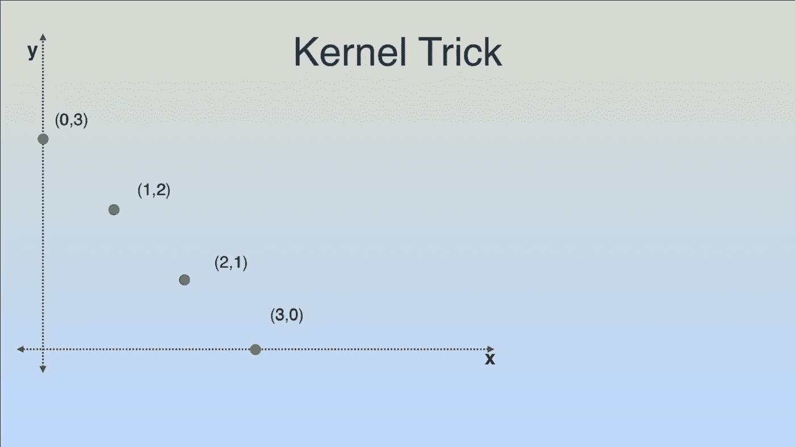
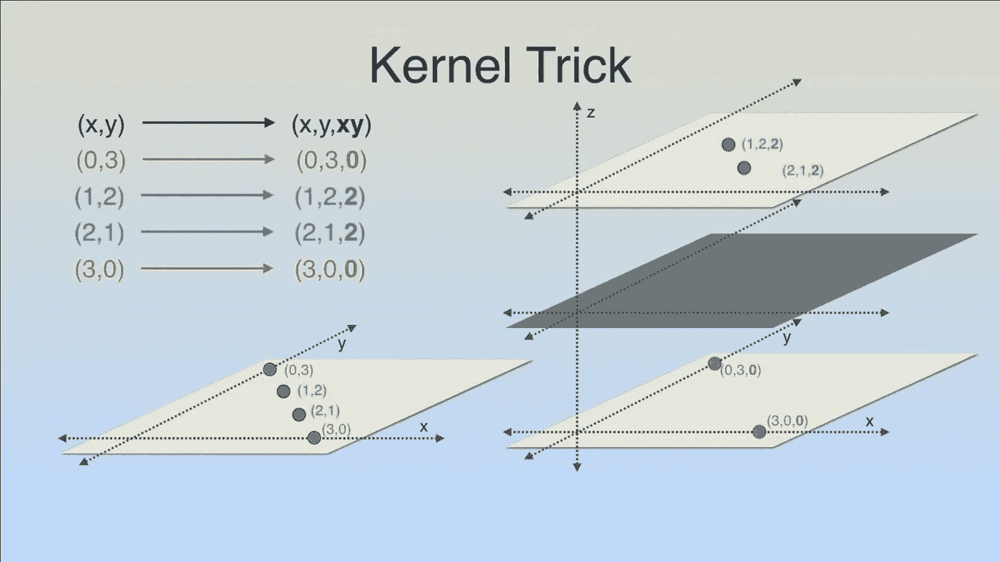
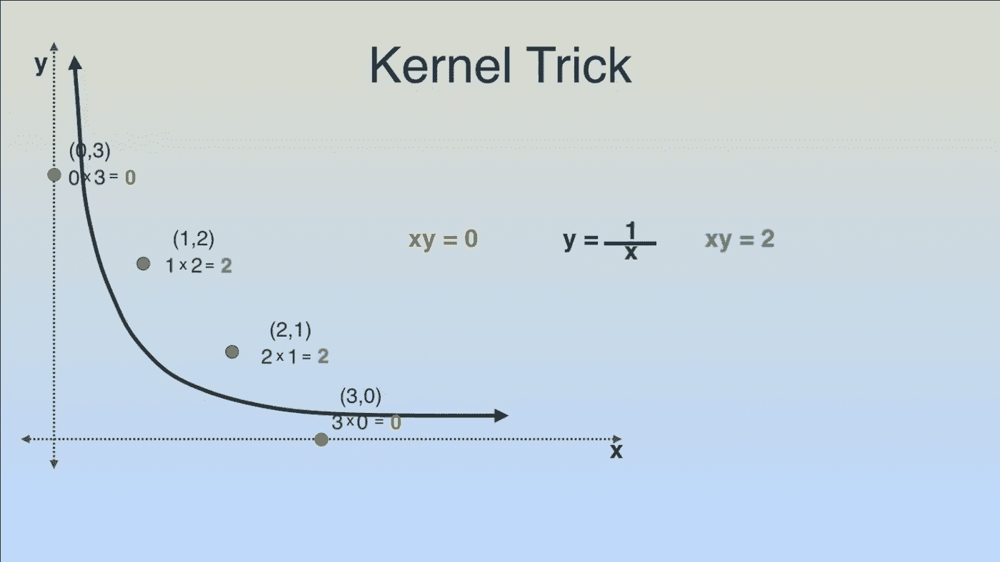

# 支持向量机——对不可分数据分类的简单解释

> 原文：<https://medium.datadriveninvestor.com/support-vector-machines-an-easy-interpretation-of-categorizing-inseparable-data-943631046eec?source=collection_archive---------16----------------------->

在机器学习中，支持向量模型用于基于分类和基于回归的分析的相关学习算法的监督学习。

如果您的数据示例被标记为属于其中一个类，SVM 训练算法会将新数据分配给其中一个类作为非概率二元线性分类器。

SVM 模型是数据点在空间中的表示，映射到每个类别，以便各个类别的示例被尽可能宽的清晰间隙分开。然后，新数据的示例被映射到相同的空间中，并根据它们落在缺口的哪一侧来预测属于哪一类。

除了线性分类，SVM 还可以使用内核技巧对非线性数据进行分类。

当监督学习是不可能的并且数据是未标记的时，采取数据聚类方法将数据分类到一个类别中，这种学习是无监督的并且应用**支持向量聚类**算法。

这种支持向量算法用于将未标记的数据分类到其最近的类别中。

当原始问题在有限维平面中陈述时，在线性空间中对数据进行分类的问题可能是不可能的。

因此，提出了具有更高维度，其中数据可以被分离和分类，以保持低计算负荷，使得可以通过根据核函数来定义而在空间中容易地计算输入向量对。

 [## 一瞬间学会数据科学！？数据驱动的投资者

### 在我之前的职业生涯中，我是一名训练有素的古典钢琴家。还记得那些声称你可以…

www.datadriveninvestor.com](https://www.datadriveninvestor.com/2020/07/23/learn-data-science-in-a-flash/) 

**内核绝招**

核心技巧实际上是在一个平面上给出一个解决方案，而这个平面在问题中本来是不存在的。

如果我们得到如下一组数据，我们会发现这些数据不能用一条直线进行线性分类。

如果我们有下图中提到的 x-y 轴的值，并把它们画在 x-y 的 2D 平面上，我们会发现它不能被分类。

要添加一个新的平面，我们需要有一个第三维度的值，这将很容易区分红色和绿色数据点的类别。

我们将在这里尝试 3 个等式。

1) x + y

2) xy

3) x**2

如上表所述，我们可以清楚地看到，xy 公式已经分离出红色和绿色数据点，其值分别为 0 和 2。

现在添加第三维度作为 z 轴，并在其上绘制 xy 值。我们可以看到，红色数据点向下，绿色数据点向上，这两个数据点很容易分开。

为了在线性空间中显示这一点，我们知道解在 xy=0 和 xy=2 之间，即 xy=1，y=1/x，这正是上图所示的线的形状。

要注意的是，在更高维的特征空间中工作会增加支持向量机的泛化误差，尽管给定足够的样本，该算法仍然表现良好。

感谢阅读！

*原载于 2020 年 9 月 23 日*[*【https://www.numpyninja.com】*](https://www.numpyninja.com/post/support-vector-machines-an-easy-interpretation-of-categorizing-inseparable-data)*。*

## 访问专家视图— [订阅 DDI 英特尔](https://datadriveninvestor.com/ddi-intel)