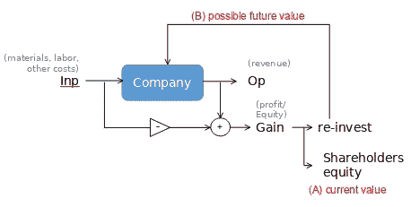
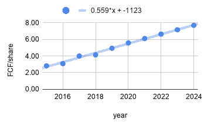
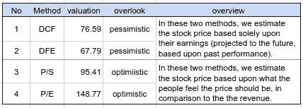

# 你当然知道股票价格。但是你知道它的价值吗？

> 原文：<https://medium.datadriveninvestor.com/sure-you-know-the-stock-price-but-do-you-know-its-value-65ab44dadd04?source=collection_archive---------6----------------------->

# 1.介绍

你正在考虑购买一家公司的股票。根据[有效市场假说](https://www.investopedia.com/terms/e/efficientmarkethypothesis.asp) (EMH)(尤其是[强势形态](https://www.investopedia.com/ask/answers/032615/what-are-differences-between-weak-strong-and-semistrong-versions-efficient-market-hypothesis.asp))股票价格是公司价值最准确的指标。当然，如果是这样的话，没有人能够通过算法交易(尤其是中高频交易)赚钱。现在我们在这里……交易算法日复一日快乐地制造金钱。虽然 EMH 假设理性行为者以尽可能最有效的方式交易股票和期权，但众所周知，市场运动的很大一部分是基于[的非理性繁荣](https://www.amazon.com/Irrational-Exuberance-Revised-Expanded-Third/dp/0691173125)，Twitter 订阅(尤其是[川普的推文](https://journals.plos.org/plosone/article?id=10.1371/journal.pone.0229931))是[市场运动的优秀预测者](http://cs229.stanford.edu/proj2011/GoelMittal-StockMarketPredictionUsingTwitterSentimentAnalysis.pdf)。所以也许，股价终究不是一个公司价值的好指标。如果是这样，你怎么评估一个公司值多少钱？这就是我们希望在本文中探讨的部分内容。

# 2.回归基础

什么*是*一个公司的价值？让我们考虑一个具体的例子。制造椅子的公司有什么价值？德国人对此有一个词——“格式塔”粗略地翻译，它的意思是“整体大于其部分之和。”就椅子而言，一大块木头和一组钉子可能是构成椅子的部件，但就其原始形式而言，这些部件作为一个整体没有什么价值。当一家公司用木头和钉子制造一把椅子时，它赋予了木头和钉子价值。公司提供的所有产品和服务的总价值就是公司的价值。

还有一件事要记住。椅子必须对某人是必要的，或者至少是有用的，人们才能赋予它价值。这种必要性最终赋予了公司提供的产品或服务价值。例如，在当今社会，智能手机是基本通信的必需品。另一方面，实体视频租赁公司的服务不太相关。

这意味着产品的价值在很大程度上取决于其他人愿意支付的价格*和*生产它所需的成本。

哲学的时代结束了。我们来谈谈数字和方程。

让我们看看下面这个过于简化的图表。

一家公司获取材料、劳动力和其他服务( **Inp** ，在他们的魔锅里搅拌它们，生产你购买的商品和服务，为公司创造 ***收入*** ( **Op** )。 ***利润*** 是两者之差(**增益** = **Op** - **Inp** )。许多公司*将部分利润*再投资到研发中。剩余的那部分作为 ***股息*** 在投资者中分配。这就是人们投资一家公司的原因——以股息的形式分享利润。然而，最近，在一些公司中，不支付红利，而是将全部利润投入研发以发展公司已经成为一种时尚。在这些公司中，人们认为，有时在未来，公司的价值会很大。因此，您为增长付出了代价。

股票价格取决于两者——公司以 ***股东权益*** 的形式提供的当前价值，在上图中标记为“(A)当前价值”,以及公司的 ***可能增长*** 标记为“(B)可能未来价值”

它还取决于:

宏观经济因素(人们是否有钱购买公司创造的商品和服务)

(D)情绪(人们*觉得*公司没有社会责任感还是*觉得*公司是自切片面包以来最好的东西。)

在文章的其余部分，我们将*量化*(A)*部分&间接量化* (B)。其余的因素将在其他文章中讨论。在某个时候，我们将创建一个人工智能模型，使用所有这些因素来预测未来的回报。

既然知道了基础，那就来了解一下估值的过程。

# 3.估价过程

从理论上讲，估值是确定一家公司价值多少的过程。有两种主要类型的公司——上市公司和私营公司。除非你是风险基金的所有者，否则所有的私人公司(包括初创公司)都将与你无缘。因此，在这里，我们将重点关注市值和交易量都很大的大型上市公司。拥有大量的交易量是很重要的。这将让你在设计投资策略时有最大的灵活性。

现在我们知道了我们想要投资什么类型的公司，让我们来谈谈估值的过程会产生什么。当你想投资一家上市公司的股票时，你希望估值过程能够产生一个数字*来与股价进行比较。*

> 最终。您希望估值过程生成一个数字，以便与当前股价进行比较。

这将给你一个指示，表明股价目前是被高估还是被低估。以下章节将涵盖大型上市公司的各种估值方法。

# 4.估价方法

公司估价有两种主要方式。仅依赖公司财务报表的估值(如 DFE、DCF)，以及额外考虑市场情绪的估值(P/S、P/E)。这些分类如下:

1.  摊销收益:贴现未来收益(DFE)，贴现现金流(DCF)
2.  盈利率:价格/销售额(PS)和价格/股本(PE)比率。这些都是部分前瞻性的，考虑到了人们的情绪。

在下面的小节中，我们将讨论估值方法背后的数学原理。按照每个描述，我们也将计算微软公司(MSFT)的结果。对于所有计算，我们将使用从[市场观察网站](https://www.marketwatch.com/)免费获得的过去 5 年的数据。一家公司通常在三份财务报表中合并其财务状况:

1.  损益表，
2.  资产负债表，以及
3.  现金流量表

可从“https://www . market watch . com/investing/stock/<ticker>/financials”获取特定股票代码的公司(例如 MSFT)的财务信息，其中您可以用自己选择的股票代码替换“<ticker>”。所有三份财务报表都在 MarketWatch 中整齐地列成表格。</ticker></ticker>

历史股票价格的值可以从[雅虎财经](https://finance.yahoo.com/quote/MSFT/history?p=MSFT)获得。在那里，您可以下载任意粒度、起止日期的历史数据。

在进入评估方法的细节之前，重要的是要注意所有的估价方法都是近似值。因此，通过增加方法的复杂性，你只能做到这一步。当价格波动很大时，简单的方法比复杂的方法更有效。在这种情况下，将复杂性保持在最低限度是有好处的。

## 4.1.未来收益贴现

我们要研究的第一种估值方法是 [DFE](https://www.investopedia.com/terms/d/discounted-future-earnings.asp) 。计算这个值的方法有很多种，像所有其他方法一样，没有正确或错误的答案。*我们将只考虑一种更受欢迎的方法*。有几件事你需要估计一下。首先，你需要确定你想要预测未来多长时间。五年是一个典型的数字。接下来，估计

1.  未来 5 年的*收益*。如果一家公司有稳定的收益记录，我们将从过去 5 年的收益中预测收益。
2.  *终端值*。一种流行的估算方法是将第五年的收益乘以 10。这将添加到第 5 年的收入中。当然还有其他计算方法，但 10 倍乘数法是目前最常用的。
3.  一个*折现率*。这与货币的时间价值有关。一个很好的估计是[9–10%](https://www.investopedia.com/ask/answers/042415/what-average-annual-return-sp-500.asp)这是 2019 年以来间谍的平均回报率。

比如说，你估计在未来几年内，公司的潜在收益是**e**=【*e*₁，……， *e* ₅].接下来，我们要将第五年的收益加上终值。这意味着， **e** = [ *e* ₁，…，10× *e* ₅].注意最后一个数字是 10× *对* ₅，而不是 11× *对* ₅？这些都是估计。不要为小事而烦恼。

接下来生成一组贴现因子，每年一个，如**d**=【1.1⁻，… ,1.1⁻⁵].

最后，计算公司的近似值( *DFE* ):

*DFE*=**e**d

乘积是标量积或[点积](https://en.wikipedia.org/wiki/Dot_product)。现在，让我们以 MSFT 为例。2015–2019 年[每股收益(摊薄)](https://www.marketwatch.com/investing/stock/MSFT/financials)如下:[1.48，2.10，3.25，2.13，5.06]。

如图所示，对未来五年的预测可以表示为:**e**=【5.38，6.099，6.818，7.537，8.256】。现在加上终端值，我们得到**e**=【5.38，6.099，6.818，7.537，82.56】。

鉴于此，我们估计微软的 DFE 为(**e****d**)= 71.45 美元。

## 4.2.贴现现金流

DCF 的计算与 DFE 完全一样，只是它的估计是基于现金流量表中可用的自由现金流。通常情况下，FCF 不记录每股收益，所以需要先计算每股 FCF。

对于微软来说，2015 年至 2019 年间的 [FCF 数](https://www.marketwatch.com/investing/stock/msft/financials/cash-flow)为**f**=【23.72，24.98，31.38，32.25，38.26】。所有数字都以十亿美元为单位。我们还需要知道同一时期内[已发行的稀释股份总数](https://www.marketwatch.com/investing/stock/msft/financials)。这些是**s**=【8.25，8.01，7.83，7.79，7.75】。这些也用十亿股来表示。于是 FCF/股份由**f**/**s**=【2.82，3.08，4.01，4.14，4.94】给出。

将它投射到未来，我们会看到下面的图表:

未来自由现金流的贴现预测值(以及 10×终端)为:[5.07，5.05，4.99，4.90，47.79]，其贴现值之和为 67.79 美元。

## 4.3.价格/销售比率

这个和下一个估值方法部分地将人民的情绪纳入估值。在这两种情况下，我们都想知道，对于每一美元的收入，人们愿意为拥有一股股票付出多少。就像前两种方法一样，收入是从两种不同的申报报表中获得的，因此也是这两种方法的起源。

市盈率就是每股价格除以每股销售额产生的收入。对于微软来说，从[利润表](https://www.marketwatch.com/investing/stock/msft/financials)中得到的 2015 年到 2019 年的收入是**r**=【92.97，84.7，96.02，110.18，125.5】十亿美元。股数为**s**=【8.25，8.01，7.83，7.79，7.75】，如上所述。

同期平均股价(调整后平均收盘)**p**=【42.33，51.83，69.61，99.01，130.70】。MSFT 的历史价格可以从[雅虎财经](https://finance.yahoo.com/quote/MSFT/history?period1=1420243200&period2=1575331200&interval=1mo&filter=history&frequency=1mo)获得。因此，同一时期的市盈率可计算如下:

p/S =**p**×**S**/**r**=[3.76，4.96，5.68，7.00，8.07]

这是人们愿意为每一美元的收入支付的溢价。有许多方法可以将这些信息总结成一个可以直接与股价进行比较的数字。一个简单的悲观比较是采用过去 5 年的平均市盈率，并根据这个平均值估计当前的股票价格。

市盈率估值= (⅕ ∑市盈率)(130)= 5.89×130.7 = 95.4 美元

## 4.4.价格/收益比率

同样，这与市盈率完全相同，只是每股收益取代了每股收益。2015–2019 年 [EPS(稀释)](https://www.marketwatch.com/investing/stock/MSFT/financials)如下:**e**=【1.48，2.10，3.25，2.13，5.06】。这给出了年比率:

市盈率=**p**/**E**=【28.60，24.68，21.42，46.48，25.83】

以类似于市盈率的方式，通过使用过去 5 年的平均市盈率并计算公司公允价格的估计值，可以将价格标签与市盈率相关联:

市盈率估值= (⅕ ∑市盈率)(130) = 29.4 × 130.7 = 148.77

# 5.摘要

作为参考，微软 2019 年*平均*股价在 130 美元左右。我们的估计估值如下:

请记住，这是 2019 年全年的平均估值。到目前为止描述的方法只适用于一年。我们都知道，快速成长的公司的价值变化比这更快。对于这样的公司，必须应用更精细的方法，这些方法将在下一节讨论。

## 5.1.数据粒度

如前所述，上述方法每年只能给你一个单一的估值。如果你的评估是基于季度评估而不是年度评估，你显然可以得到更精确的评估。然后，你可以每季度进行一次估算，而不是每年。这对于高增长率的股票(尤其是科技股)非常重要。

通常可从 MarketWatch 或 Seeking Alpha 获得的自由层数据通常不足以生成比我们已经讨论过的更好的质量评估。他们确实提供了过去五个季度的财务报表。然而，由于许多行业的季节性，仅使用前几个季度进行评估可能是不够的。

如果你有编程能力，你可以考虑从 EDGAR 数据库下载原始数据，并从他们的年度和季度文件中提取适当的财务报告。这些数据不是表格形式的，要从每家公司提取这些信息需要付出很大的努力。有了季度历史数据，就有可能对一家公司的估值做出*更好的估计。我可能会考虑将来写一篇关于这个的文章。与此同时，显然可以为历史季度备案数据付费。有完整的文章致力于比较有偿和无偿的来源，并鼓励用户获得它们。*

## 5.1.改进估计

对价值的估计只是近似值。出于两个原因，我们故意保持这种方式。首先，每个估算的实施细节在不同来源之间有很大差异。要完全涵盖一种方法的所有变化，需要一整本书。第二，每个估计都做了几个假设，这些假设只是近似准确的，并且因公司而异。然而，通过在年度财务数据的基础上额外使用季度财务数据，可以获得简单的数据相关改进。此外，在涉及贴现的计算中，人们可能会考虑对一家公司的最终价值进行更好的估计。

## 5.3.最后的想法

微软 130 美元是否被高估？请记住，我们只解决了问题的一部分——基于*过去财务*的*当前价格估计*。在考虑一只股票是否物有所值之前，还有无数其他标准需要考虑。

# 6.计算器

显然，这些计算都可以自动化。我将创建自动系统，可用于寻找一家公司的估值。我将创建一个 Python 版本和一个 Google-sheets 版本，这样所有背景的人都可以从中受益。一旦文章完成，我将链接下面的文章。

1.  免费:一个基本的基于 Python 的计算器[ [链接](https://medium.com/@sankha.mukherjee_007/company-valuation-with-python-166fe5ebb2c3)
2.  免费:一个基本的 Google-sheets 计算器[ [链接](https://medium.com/@sankha.mukherjee_007/company-valuation-using-google-sheets-27a59f54ea40)
3.  付费:VI 应用

我还想提一下，有许多付费应用程序可以让你轻松获得公司估值。我经常在投资中使用的 [VI 应用程序](https://www.vi.app)就是一个例子。这是一个付费应用程序，提供了比自由层数据更精细的估算。欢迎您使用我的推荐代码 *SM6HA20* 享受 14 天的试用期。**声明:我不拥有或维护该应用程序。然而，我确实每天都在使用它，而且我发现它非常有用。**