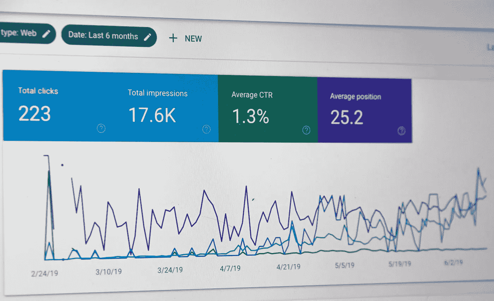

# 用一剂健康的 SEO 飙升到顶部

> 原文：<https://medium.datadriveninvestor.com/surge-to-the-top-with-a-healthy-dose-of-seo-14a55d119836?source=collection_archive---------17----------------------->

## 社交媒体黑客帮助品牌脱颖而出

Photo by Stephen Phillips — Hostreviews.co.uk on Unsplash

所有这一切都是社会战争。在一个拥挤的领域，每个在线的人都用手肘来创造空间和被听到。对于在混乱的经济中寻求任何优势的企业来说尤其如此。

设计师兼数字专家[伊曼纽尔·瓦查](https://twitter.com/eowacha/)说:“网上可见性的竞争是真实的。"每个品牌都想在顾客面前展示自己最好的一面。"

他建议用搜索引擎优化来提升网上形象，搜索引擎优化是一个技术术语，指的是最大化特定网站访客数量的神奇过程。SEO 的目标是确保网站在搜索引擎返回的结果列表中排名靠前。

简而言之，“获得更多流量的[关键](https://moz.com/learn/seo/what-is-seo)在于将内容与搜索引擎优化和社交媒体营销相结合。”

瓦查很好地融入了这个组合。在一次非洲推特聊天中，他解释了一个品牌如何利用社交媒体来建立搜索引擎优化。

 [## 对于搜索引擎优化，文字是关键|数据驱动的投资者

### 搜索引擎优化可以恐吓未经训练。从一开始，它有助于获得正确的缩写…

www.datadriveninvestor.com](https://www.datadriveninvestor.com/2018/12/29/for-seo-the-words-are-key/) 

在线状态不仅仅是在那里，而且是活跃的。获得朋友和潜在客户的认可，将其视为解决和回答问题的可靠、可信的来源。

“展现你的魅力和态度，”瓦卡说。

“通过在线搜索找到的个人或公司的整体存在就是在线存在，”他说。“在线可能意味着拥有一个网站、社交媒体个人资料、LinkedIn 页面、YouTube 频道和任何其他平台。”

任何人都可以在线出席。正是你为完成你的照片所做的事情建立了你的知名度。

“在线可见性和在线状态之间的差别很小，”Wacha 说。“虽然在线存在与存在有关，但在线可见性指的是品牌在线存在的有效性或积极程度的可衡量指标。”

# **活动产生效益**

有效的在线展示始于引人入胜的活跃。一定要回复、评论或者进行对话，而不是沦为一个没有互动的广告牌。

Wacha 认为良好的在线形象符合以下标准:

*   很容易找到。你应该很容易在搜索引擎上找到。一个网站和社交媒体的个人资料必须是高度可见的。使用可能符合用户搜索意图的关键词来优化你的社交媒体渠道，
*   有吸引力和吸引力。消费者喜欢被惊叹。你的网站或社交媒体简介*必须*吸引人、时尚，甚至通过行动号召、时尚照片等吸引人。
*   满足客户需求。回答用户痛点的内容永远是赢家。你发表的有用的文章越多，就能解决用户的问题，帮助他们做出决定，让他们对你的产品或服务有信心，这就越好。
*   建立联系或关系。在你的社交媒体页面上有一个感同身受的客户服务团队对建立持久的联系大有帮助。常见问题应该为用户提供他们需要的并且容易找到的答案。

 [## 让你的整个个人资料成为你最好的一面

### 你的社交媒体档案是你的名片——第一印象为持续的关系定下基调…

blog.markgrowth.com](https://blog.markgrowth.com/make-your-entire-profile-your-best-side-ddf7ae75307a) 

你的网站是你第一次被人们看到的深度外观。是你的第一印象，是活生生的简历。

瓦查说:“如果你想在互联网上有一个家，就建一个网站，声明你的位置。”“一个网站可以展示你的企业或品牌的可信度。在今天的网络空间中没有一个是向潜在客户发出了一个不好的信号。”

# **使用关键字、标签并获取 meta**

自然地写作，把关键词、短语和想法放在内容的前面。然后一定要在整篇文章中放大它们。拥有其他相关资源的链接也有助于扩大搜索引擎优化搜索内容的吸引力。

“对于页面搜索引擎优化，在网站的每个页面上使用一个标签，”Wacha 说。“确保它包含您想要排名的关键字。对于您的元描述，提供一个人类可读的元以显示在搜索结果页面上。

他对本地企业如何提高搜索引擎优化提出了以下建议:

*   社交媒体:发布相关内容。已经拥有社交媒体的品牌应该继续发布内容，以留在顾客的眼中。
*   改善关系:使用社交媒体与其他品牌建立战略伙伴关系，这可以帮助你接触到更广泛的受众或提及你的内容。这提高了你的排名和声誉，尤其是当别人分享你的内容。
*   利用视频:在 YouTube 上发布内容并用关键词标记会提高你的排名。考虑发布视频，总结你最受欢迎的内容。

 [## 获得你的 2 美分价值:预算营销

### 企业家推销他们的企业，以吸引顾客和维持现金流。理想情况下，企业主希望…

blog.markgrowth.com](https://blog.markgrowth.com/get-your-2-cents-worth-marketing-on-a-budget-801786370414) 

根据一个公司的资源，所有者可能想雇佣一个搜索引擎优化专家或代理。

“这取决于客户的需求和预算，”瓦查说。“我建议雇佣一个代理机构。

他说:“从长远来看，搜索引擎优化专家的费用可能会很高，尤其是在公司内部。”。“它们伴随着福利、税收、奖金和其他费用。代理机构通常对他们的每月服务收取单一费用。所以，这可能是一个更好的选择。”

为了监控在线活动，Wacha 推荐以下搜索引擎优化工具:

*   [谷歌分析](https://twitter.com/googleanalytics)一个全方位的搜索引擎优化监测工具包
*   [塞姆拉什](https://twitter.com/semrush)
*   [胡特](https://twitter.com/hootsuite)
*   RankTracker

**关于作者**

吉姆·卡扎曼是拉戈金融服务公司的经理，曾在空军和联邦政府的公共事务部门工作。你可以在[推特](https://twitter.com/JKatzaman)、[脸书](https://www.facebook.com/jim.katzaman)和 [LinkedIn](https://www.linkedin.com/in/jim-katzaman-33641b21/) 上和他联系。