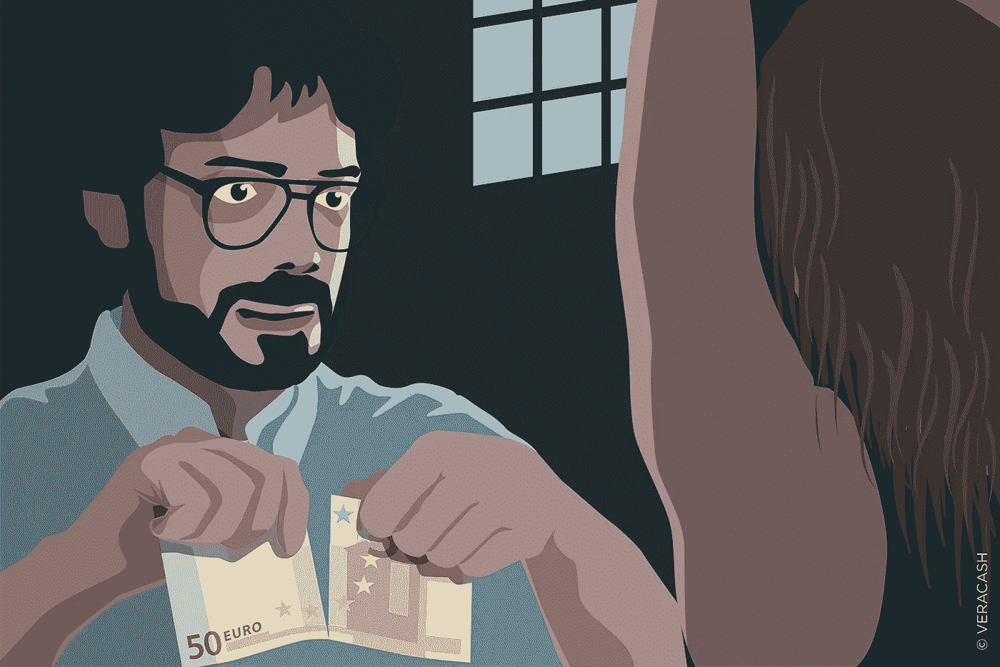
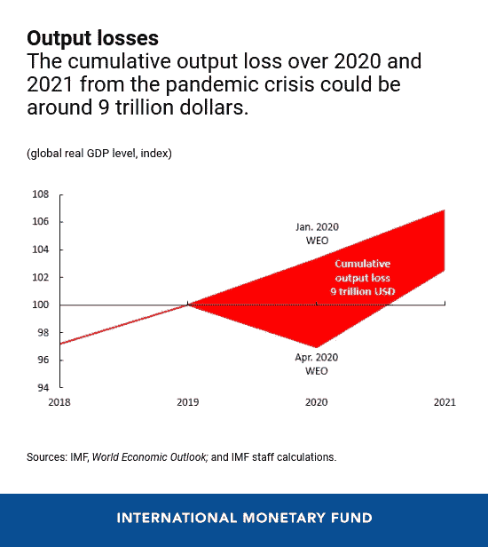
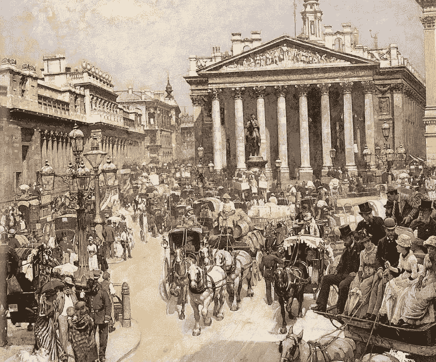
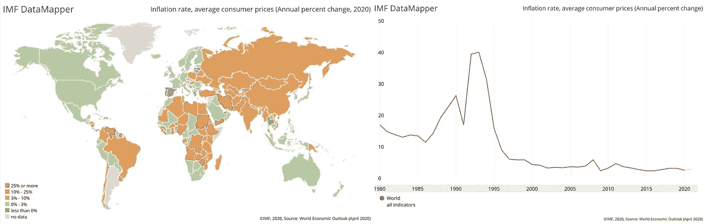
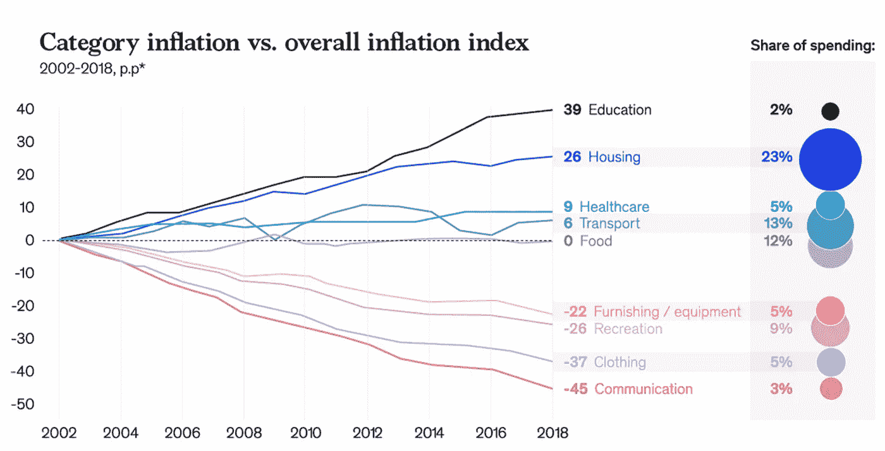
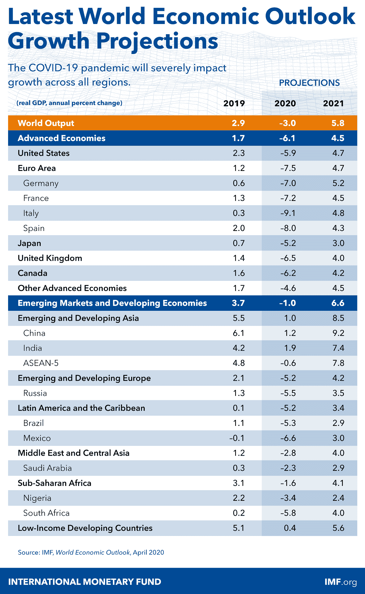

# 在模糊的经济现实中生存

> 原文：<https://medium.datadriveninvestor.com/surviving-a-fuzzy-economic-reality-d61d4063b949?source=collection_archive---------18----------------------->

Source: Veracash

*本文遵循* [*评估经济危机中货币政策的三个步骤*](https://medium.com/datadriveninvestor/3-steps-to-assessing-monetary-policy-amidst-an-economic-crisis-480b42d3c166) *，我们讨论了世界各国政府决策的影响，同时提出了减轻损害的想法。这篇文章不适合胆小的人，它会很长，但是非常重要。*

在最坏的情况下，你会花 10 分钟来构思一个在当前经济现实中采用的策略。最多你会花 10 分钟学习经济学的基本概念，然后你可以用它来概述你自己的理论。

**摘要**

在 70 年代，高通胀是整个经济领域的共同主题，然而，政策和目标的变化带来了 40 年来稳定的印象。许多经济学家预计，这场疫情可能会导致通胀或通缩不受欢迎地卷土重来。

我们的生活已经因为那里的破坏而改变，因此我们未来的轨迹已经发生了彻底的转变。我打赌今年年初我们都有计划，包括我自己。对未来的财政赤字感到担忧似乎是很自然的，许多人可能会认为这些赤字处于战时水平。

毫不奇怪，我们对疫情造成的威胁做出的集体反应，在各个领域引发了巨大的供需冲击波。从一开始，世界就认识到了疫情的影响，截至今年三月初，多达 3.6 万亿美元从全球经济中消失。令人不安的现实已经出现。

 [## 如果资本主义失败了，那么还有什么选择呢？数据驱动的投资者

### 在当前政治领域的修辞之旅中，我们都可以面对面地接触到流行词汇，如…

www.datadriveninvestor.com](https://www.datadriveninvestor.com/2020/03/16/if-capitalism-is-a-failure-then-what-is-the-alternative/) 

通过这篇文章，我旨在 ***驱散恐惧*** 谈论事实，同时脚踏实地。然而，我已经厌倦了描绘一幅未来是一片玫瑰之床的图画，这很可能是真的。如果说我在这次疫情中学到了什么的话，那就是我们无法预知未来会发生什么，一切都可能在一秒钟内发生变化，这适用于好时光和坏时光。

国际货币基金组织估计，到我们摆脱危机时，假设所有措施都得到有效部署，全球 GDP 的累计损失估计为 9 万亿美元，如图所示。如果到 2019 年底，全球国内生产总值估计为 100 万亿美元，那么到今年年底，我们将损失 10%，这相当于砍掉了两年的增长。

但如果这是我们命中注定的地方呢？这就是我们今天要讨论的内容，同样是旨在传播思想进步信息的数据:

1.  事态——价格和通货膨胀。
2.  支持和反对通货膨胀的理由——我会谈到这对你个人的影响。
3.  给定 2，我讨论一个可以采用的潜在策略和框架。

当你读完之后，我希望能帮助你理解:

*   一种与我们所知的现实相调和的方法。
*   一些历史证据来证明什么是有效的。
*   最后，从经济自由的角度考虑资本保全。

*PS:对于金融领域的人来说，可以跳过每一部分的介绍性段落。如果你是一个寻找答案的经济学家，直接进入结论(策略和框架)。*

**现状——物价和通货膨胀**

所以我们都听说过通货膨胀，根据定义，**通货膨胀**是一种量化指标，衡量一个经济体中一篮子选定商品和服务的平均价格水平在一段时间内的增长速度。这是价格总水平的上升，即一个货币单位实际上购买的东西比以前少(Investopedia，2020)。

所以让我们更深入地探究这个词最初存在的原因。在过去很长一段时间里，通货膨胀是与描述我们的中央银行摆弄政策，即货币政策的行为联系在一起的。然而今天，通货膨胀无处不在，你不能错过它，它是商品价格的上涨，它与一种货币的价值密切相关。更具体地说，正如上文所定义的，贸易需求和货币数量之间的失衡导致的总体价格水平的上升，将我们带到了目前的境地。“通货膨胀”的定义只有一个来源，即中央银行。

Bank and The Royal Exchange by William Logsdail (1887)

据记载，最早的两个通货膨胀例子发生在美国和法国。美国殖民地被剥夺了货币交换的手段，这主要是由于一个非常原始的社区。

这导致其成员诉诸替代生存手段，今天被称为信贷。他们签发了信用证，结果造成了贸易和商业的贬值。当时的母国英国在 1764 年禁止了所有州的这种活动，这实际上是导致革命的原因之一。

## 分解一下:

*   纯粹的供给和需求——当流通中的货币超过必要的数量时，货币的价值就会下降，因为这是现代经济学唯一有意义的方式。
*   当货币的流通是根据储备余额发行的，就没有通货膨胀的理由，无论是现金、石油还是黄金，任何可以估价的商品。
*   相反，当流通中的现金没有有形价值时，通货膨胀就以最典型的形式出现。

> 让我们深入了解一下，通货膨胀相当于纸币贬值。

Source: World Economic Outlook (May 2020) ©IMF, 2020

这是目前为止发生的情况，而右边的图表表明，我们已经在 3%左右徘徊了二十多年，我们一会儿会谈到通货膨胀的峰值。左边的地图是经历超过 10%通货膨胀的国家的公平标识符，根据纯粹的人口规模，估计大约 40%的世界暴露于通货膨胀的负面影响，如果不是在短期内，至少在长期内。

Source: McKinsey Global Institute: Inequality: a persisting challenge and its implications.

然而，这并不都是厄运和黑暗——技术和全球化已经明确地让事情变得更好。

就个人而言，**我喜欢确保每年至少将收入的 5-7%用于教育**，这可以是购买书籍、课程、研讨会门票等形式。我们真的不知道 2%显示的教育是否真的考虑了那些费用。我想不会。因此，虽然通讯和服装可能变得更便宜，但教育和住房等基本需求的成本却在增加。下一部分对理解至关重要。

> 信奉神权社会的学者们肯定了一个基本理论，即通货膨胀从根本上来说是实施不平等度量衡的**结果。早期的犹太人和基督徒认为这是一件令人憎恶的事情，正如《T4》中的箴言所描述的那样，该书估计是在公元前 700 年左右写成的。然而，正如我在这里提到的******一样，还有挽回的余地。****
> 
> **这种不平等的度量衡观念的特征是印钞，也就是量化宽松。它伤害了最脆弱的群体，即靠固定收入生活的穷人和老年人。**

**既然我们有了一个关于通货膨胀原理的世界现状的前提，让我们看看世界将走向何方——有三个方向，向上，向下，或者保持不变。我们将谈论上升或下降，因为我看不到一个真正的论点，事情会保持不变。**

# ****通胀进一步上行的情况****

**Source: UCDP/PRIO + Author’s Analysis**

**根据查尔斯·古德哈特的理论，通货膨胀的答案在于历史证明的战争的后果——左边的图表显示了大约 60 年间与国家冲突相关的死亡人数。请注意峰值，并注意基于国家的冲突是 20 世纪死亡人数最多的原因。假设健康状况受到疫情影响的人数将在夏末减少，我们可以预计通胀率在 5—12%之间。实际上，现实情况是，我们还不知道曲线平坦了多远，因此，爆发期的延长将导致实际活动受到抑制，这将进一步导致通胀滞后。**

**我在这里发现了两个相关的图表来展示战后通货膨胀的影响。下图展示了通货膨胀对拉丁美洲和加勒比海地区的影响，我在这里展示了经济在这种冲击下的脆弱性。因此，经济越疲软，冲击就越大。要查看不包括拉丁美洲、 ***的通货膨胀的影响，请单击图例中的紫色线*** (拉丁美洲和加勒比海)并查看其程度:**

*   **请注意，在这两张图表中，80 年代后期的通货膨胀率达到峰值，滞后于 80 年代早期因战争导致的死亡人数。此外，在 80 年代后期的海湾战争等全球冲突之后，观察到了 90 年代早期的通货膨胀高峰。**

**Source: World Economic Outlook (May 2020) ©IMF, 2020 + Author’s Analysis**

*   **同样重要的是要注意到，关于通货膨胀，在战争期间，市场实际上是在评估它的位置，这是以真实的活动或缺乏活动为特征的。**
*   **发达经济体的特点是利率大多低于 5%。**
*   **在这一点上，全球供应链被打乱已经不是什么新消息，相应地，供应限制将推动价格上涨。**
*   **大量印钞正在进行(称为量化宽松或 QE ),外汇储备与流通货币的不平衡预计会推高价格。**

**这一切对我有什么影响？很高兴你问了。**

**如果你今天去超市买了 10 美元的食品杂货，一年后以每年 3%的通货膨胀率，预计你的食品杂货值 10.3 美元，5 年后会是 11.59 美元，大约 20 年后会翻一番。**

**假设你现在的工资是 100 美元。如果你花 10 美元购买食品杂货，那就相当于你收入的 10%。然而，5 年后 3%的通货膨胀率将代表你收入的 11.59%(假设你没有加薪)。额外的 1.59 英镑是用于其他用途或储蓄以赚取利息的钱，现在被通货膨胀吞噬了，这不是你的错。**

> **你 100 美元的价值是今天的价值，而不是明天的价值。明天它的价值会低于这个数字。**

# ****通货紧缩的情况****

**通货膨胀环境的替代方案是通货紧缩环境，许多[主要经济学家也提出了这一点](https://www.ft.com/content/bdd9a68e-848b-11ea-b872-8db45d5f6714)。**

**人们的预期是，我们现在面临的封锁已经蔓延到供应封锁，这反过来导致各行业的需求大幅下降，进一步成为价格下跌的催化剂。因此，最脆弱的部门是旅行和旅游部门，包括航空公司、酒店、餐馆和住房。下图显示了截至 2018 年各国对 GDP 的贡献。**

**Source: World Bank + Author’s Analysis**

**21 个国家的旅游业对全球经济的贡献至少达到 10%或以上。这里显示的 177 个国家中，有 53 个国家的旅游业对 GDP 的贡献超过了全球平均水平 5.4%，达到了惊人的 30%！！**

**在 4 月底，我们还经历了前所未闻的油价下跌——这意味着生产商付钱给买家，让买家从他们手中拿走商品，因为他们担心库存会耗尽。本质上，需求下降可以用以下方式表达:**

*   **全球性事件加上国家采取的各种措施导致的需求急剧减少，仅仅意味着经济活动下降如此之快。购物、休闲和体育活动、旅游以及一长串其他类型的支出都出现了交易量的急剧下降。更不用说失业和收入减少的不幸情况了。**
*   **家庭为他们不需要花费的部门存钱。此外，当你试图弄清楚你下个月是否会得到这份工作时，那辆额外的车不再是必要的了。实际上，这种差异被保留了下来，经济活动受到了冲击。**
*   **就油价而言，这句话概括起来就是:**

> **新冠肺炎疫情是 70 多年来全球能源系统遭受的最大冲击，今年需求的下降将使 2008 年金融危机的影响相形见绌，并导致碳排放创纪录地下降近 8%。**
> 
> **国际能源机构**

*   **国际货币基金组织发布的我们的增长预测是下限，这意味着低产出，相应地表明商品生产将是低的，因此相对消费将保持低水平。我特别高兴地看到，新兴市场受到的冲击将小于发达经济体。我同意 Ben Le Fort 的观点，即不平等可能会对任何即将到来的经济衰退做出重大贡献。**

****

*****现在这一切对我有什么影响？很高兴你问了。*****

**作为一个消费者，很自然地认为低价格是一件好事，但很少人享受到好处，大多数经济受害。**

**价格下跌在短期内是好的，因为它让消费者有能力多花一点钱，这实际上刺激了经济，使其回到正常水平。然而，当价格大幅下跌时，经济就会受到影响，这就是通货紧缩的影响。当价格下跌太多太快时，会发生一些事情:**

1.  **你现在拿着现金等待，看看价格是否会进一步下跌**
2.  **因此，就业岌岌可危，因为在消费者不愿意消费的地方，企业似乎无法维持下去。**
3.  **在许多这样的例子中，尤其是在债务和就业方面，通缩比通胀要糟糕很多倍。**

> **假设你有一笔 100，000 美元的贷款，你的月收入是 5000 美元，在通货紧缩的情况下，这在 3-6 个月内都是不错的。然而，假设你的雇主给你降了 50%的工资，现在会发生什么？你还能每月付款吗？你的银行不会放弃那笔贷款，是吗？现在想象一下大规模的经济规模。**

****新现实中的战略和思维框架****

**现实情况是，消费者价格指数是在 1917 年第一次世界大战期间的高通胀时期创建的，然后使用可获得的食品价格数据计算回到 1913 年。此后的每个十年都有自己独特的特点和挑战。**

**我之前提到过**通货膨胀**是一个经济中一篮子选定商品和服务的平均价格水平在一段时间内增长速度的量化指标。我们的新现实意味着，是时候重新评估我们的篮子了。**

**此外，重要的是我们的国家重新评估他们的债务状况，我在之前的文章中谈到了全球债务负担。如果你生活在一个有债务负担的国家，我强烈建议你阅读这篇文章。**

> **病毒在未来几个月的传播路径存在很大的不确定性，未来几年经济和社会的发展路径更是如此。**
> 
> **[—大卫·迈尔斯，安德鲁·斯科特](https://voxeu.org/article/will-inflation-make-comeback-after-crisis-ends)**

**如果这是真的，从经济自由的角度考虑你的投资组合，无论你是一个拥有小房子和一些现金的普通人，还是一个在贝莱尔有房子的百万富翁。让人们认识到曾经的现实将不复存在，这一点很重要。**

**我们的安全不在于经济体系，而在于有一种生活在自由中的方式，这种自由伴随着彻底的范式转变。如果你的邻居做得好，你也会做得好，这种转变转化为经济自由。我们的思维过程是有线的，因此我们是一个有灵魂的身体装备，然而现实与真相相去甚远。那么谁是我们的邻居呢？**

**据说…**

> **有一个人从耶路撒冷下耶利哥去，落在强盗手中，他们剥去他的衣服，把他打个半死，就丢下他走了。**
> 
> **一个偶然的机会，一个牧师正沿着那条路走下去。当他看见他时，他从另一边走过去了。**
> 
> **又有一个利未人，来到这地方，看见他，也照样从那边过去了。**
> 
> **但有一个撒玛利亚人，行路的时候，来到他所在的地方。耶稣看见他，就动了慈心，来到他跟前，用油和酒倒在他身上，包扎他的伤口。他让他骑上自己的牲口，把他带到一家客栈，照料他。**
> 
> **第二天，当他离开的时候，他拿出两个[银币](https://en.wikipedia.org/wiki/Denarius)，给了主人，并对他说:‘照顾他。除此之外，无论你花多少钱，我回来时都会还你的。**
> 
> **你想，这三个人中，哪一个是落在强盗手中的人的邻舍呢？"**
> 
> **有人回答说:“怜悯他的人。”**
> 
> **“那就去吧，照着做。”——这是给的建议。**
> 
> ****—路加福音—公元 63–68 年****