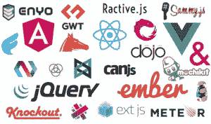
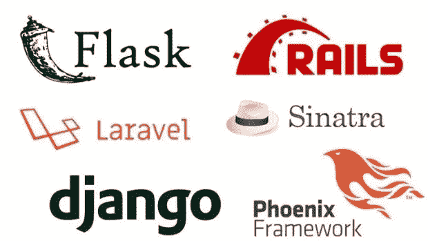
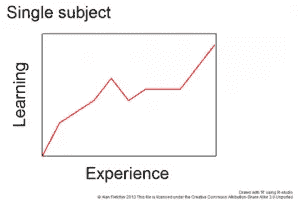
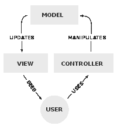

# 在不稳定的数字时代生存

> 原文：<https://medium.datadriveninvestor.com/surviving-in-a-digital-age-of-instability-e04c5538bb89?source=collection_archive---------33----------------------->

## 更新，废弃，一些新的东西出来…几乎每个月…

*A list of all the frameworks. Illustration by Eric Heikes on* [*ericheikes.com*](https://ericheikes.com/may-not-need-framework/)

如果你是一名计算机科学家，你可能已经注意到新的框架不断出现。编程语言不断出现，那些跟不上时代的老语言已经过时了。

# 美女们

对于有经验的程序员来说，这是日常生活中很正常的一部分。新技术喜欢被宣传为未来的事物，**他们说它很漂亮，它会帮助我们，他们说它是当今最热门的框架…** 这些技术好像有一群狂热的追随者。

# 前端美女

*Popular JavaScript frameworks and libraries on* [*rubygarage.org*](https://rubygarage.org/blog/best-javascript-frameworks-for-front-end)

在过去的一年里，我不断学习新的东西来跟上新技术的步伐，但有时似乎越来越多的技术正在涌现。真正困扰我的是，这些技术只是同一块蛋糕的不同部分。例如，想象一下，作为一名前端 web 开发人员，你已经必须学习 HTML、CSS 和 Javascript。但是还有很多其他的东西你*‘应该’*去学习。React，Vue，Angular，Webpack，可能还有一些不错的 ol' jQuery。公平地说，每个框架都有其优点和缺点，每个库/框架都是为了解决尚未解决的问题或由之前的库/框架引起的问题而构建的。

 [## 软件开发过程:如何选择正确的过程？数据驱动的投资者

### 软件是任何企业组织成功的生命线。没有软件的帮助，一个…

www.datadriveninvestor.com](https://www.datadriveninvestor.com/2020/01/16/software-development-process-how-to-pick-the-right-process/) 

相信我，要成为一名前端 web 开发人员，你不需要掌握所有的前端 web 框架，只需要使用让你觉得舒服的东西。让我恼火的是，有这么多不同的框架，让我感到困惑。

# 后端美女

*Popular Web frameworks on* [*nickjanetakis.com*](https://nickjanetakis.com/blog/it-doesnt-matter-what-web-framework-you-use-just-pick-one)

它开始时非常吓人，因为尽管框架之间有许多相似之处，但我们使用它们的方式却非常不同。菲尼克斯、Spring Boot、Ruby on Rails、Django 和 Laravel 是最复杂的 web 框架之一，因为易于使用，所以可以提高开发速度。

除此之外，这些框架中的抽象层次也很难理解。这不仅仅适用于前端框架，因为后端框架也有很多*【魔法】*框架。这些*【magic】*框架对于想要学习编程的人来说非常混乱，其中一些框架的抽象级别如此之高，以至于很难掌握基本知识。最终，你可能会记住代码而不是理解它们。

尽管记忆似乎是这个问题最有可能的答案，坦白地说，它不是。记忆代码是最糟糕的事情，因为不同的编程语言已经有不同的语法，但是基于同一种语言的框架也有不同的语法。这不是最佳答案，这就是我想说的…

# 野兽

*St. George and the Dragon by Peter Paul Rubens*

在英雄的故事中，恶棍在第一场战斗中就制服了英雄。只为英雄强化训练，再次面对反派，一劳永逸地完成故事。这个故事很好地比喻了学习曲线。起初，似乎不可能学会每一件事情来完成一项任务，但是当我们通过分别和重复地做这些任务来“训练”自己时，它变得更容易和更容易理解。

# 学习曲线

*Illustration of a Learning Curve by Alan Fletcher*

我们可以在任务中看到以前从未见过的模式，这是当我们掌握一门学科时，这发生在我们已经走过艰难的学习曲线时。但是要理解这个框架，你需要理解基础、架构、语言等等。学习一种新的算法或者一种新的设计模式并不是一件简单的事情，但是学习这些东西将有助于我们理解的发展。

*Illustration of an MVC architecture on Wikipedia*

这给我带来了两个第二部，**野兽**。学习算法和其他基础计算机科学科目是非常困难和枯燥的，有时我们可能会觉得想要放弃，因为老实说，当我学习算法时，我很难想象这种算法会在什么样的场景中使用，但我对计算机科学和编程的基础了解得越多，我就越容易理解框架，因为它遵循一种模式。例如，Ruby on Rails 和 Django 都是基于相同架构设计的 web 框架。模型视图控制器架构，简称 MVC。如果你理解 MVC 框架的基本原理，那么从 Ruby on Rails 过渡到 Django 只是一个语法问题。在发展方面会有很多相似之处。学习基本的架构模式就像是**野兽**。

# 驯服野兽的重要性

**野兽很难驯服，它们很难理解，而且看起来令人生畏。有时候，完全忽略野兽，试图通过记忆来强迫学习可能更容易。可悲的是，它将以对现有系统的错误理解而告终。从而导致对该系统的实际情况的误解。**

*Hercules taming Cerberus by Peter Paul Rubens*

驯服这头野兽应该是我们所有人应该做的第一件事。就像每个故事中一样，为了拯救美丽的女主角**，你必须驯服可怕的**野兽**。可悲的是，不是每个人都喜欢你的旅程。一些人可能会担心，一些人可能会质疑，还有一些人持怀疑态度。但是你要知道的就是驯服**猛兽**和拯救女主角。我想说的是。是的……理论很烂，学习算法没有用 Rails 建网站好玩，架构好像也不重要。但是关于这些基础的知识将会定义你和你所知道的。**

# **最后的想法**

**我相信，如果我们真正理解了编程的基础，新技术就不会是一个大麻烦。技术不断发展，这是好事！技术的发展是为了改善上一代人的错误，或者给世界带来新事物。人们真的应该拥抱变化。编程知识可能会发生变化。我意识到我应该每个月左右不断提高我对当前技术的了解。这是我们所有人都应该做的一个过程。**

***原载于 2020 年 2 月 26 日 https://www.datadriveninvestor.com**的* [*。*](https://www.datadriveninvestor.com/2020/02/26/surviving-in-a-digital-age-of-instability/)**