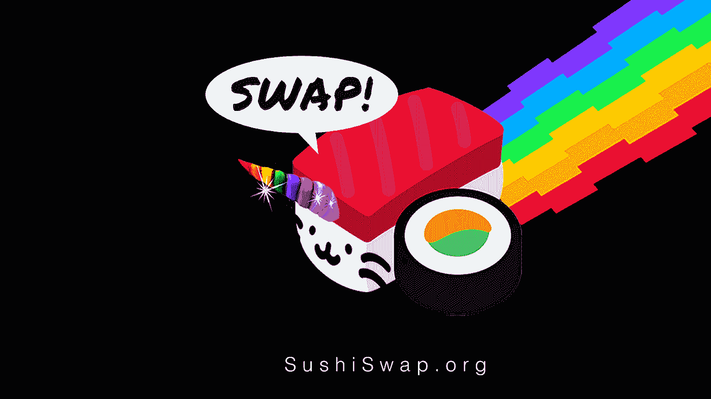
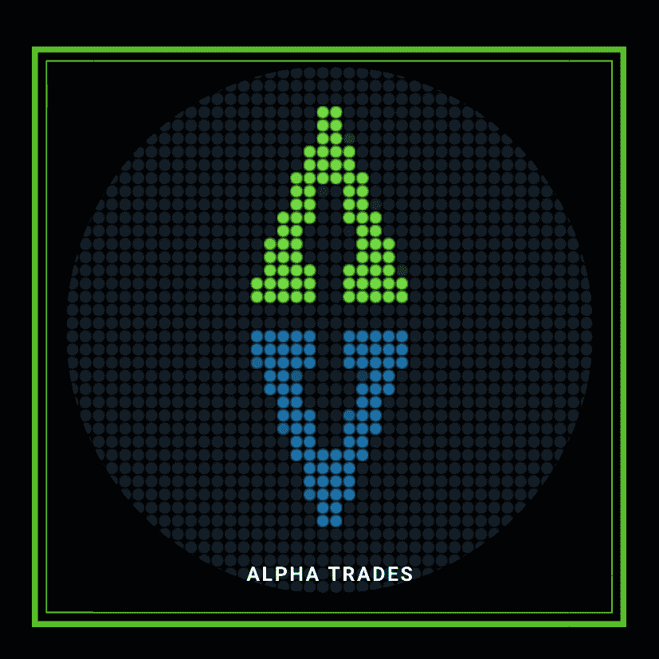

# SushiSwap，一个令人讨厌的故事

> 原文：<https://medium.datadriveninvestor.com/sushiswap-an-unsavory-tale-4b6ea11d1e1b?source=collection_archive---------7----------------------->

## 苏珊·沃普的突然起伏

更新时间:2020 年 9 月 11 日

 [## 破解比特币与美元的关联密码

### 如何在你的交易策略中使用 DXY-SPX-BTC 相关性

medium.com](https://medium.com/datadriveninvestor/es-breaking-the-code-of-bitcoins-correlation-with-the-greenback-e2f55cb88477) 

你知道，当一半的 DeFi 项目带有与食品相关的名称时，金融变得越来越奇怪了(是的，$hotdog 是一个真实的东西)。

市场上增长最快的 DeFi 协议之一，在协议(AUP)项下三天内获得超过 7 亿美元的资产，是…

在这里忍耐一下，

*SushiSwap* 。

你会喜欢这个项目的标志，一只猫-寿司-独角兽的混血儿在彩虹屁上翱翔于网络空间。

SushiSwap DeFi Logo

[SushiSwap](https://medium.com/sushiswap/the-sushiswap-project-c4049ea9941e) 势如破竹，在 AUP 突破[14.7 亿美元](https://cointelegraph.com/news/yield-farming-frenzy-pushes-uniswap-daily-volume-over-1-billion)，使其成为少数几个 DeFi“独角兽”之一。这个项目的寿司象征物在几天内从 0.70 美元飙升至 10 美元以上。

在大约三天的时间里，该资产的总市值从不到 60 万美元跃升至超过 2 . 29 亿美元。我偶尔不得不以胎儿的姿势躺在地板上，问:“为什么？”

# SushiSwap 的销售宣传

SushiSwap 是 Uniswap 的一个分支，以应对后者缺乏分权治理的问题。如果你觉得意外的话，没有官方审计。

SushiSwap 通过[流动性挖掘](https://academy.binance.com/blockchain/what-is-yield-farming-in-decentralized-finance-defi)分发其 SUSHI 治理令牌。

寿司是一种治理象征，它利用了 Uniswap 所不能提供的东西；社区治理和永久寿司奖励给那些赌注他们的令牌。

假设地球上不超过三个人知道这意味着什么，我会给你留下一些有用的教育信息。

[币安学院指南](https://academy.binance.com/economics/your-guide-to-sushiswap)

你需要知道的: SushiSwap 因创始人的“公平发布”方式而获得了一些病毒式的吸引力。没有对风险投资、社区治理、利润分享和[吸血鬼](https://decrypt.co/40671/uniswap-moves-billions-to-pass-coinbase-maker-in-defi-metrics#__next:~:text=Using%20so%2Dcalled%20%E2%80%9Cvampire%20mining%2C%E2%80%9D%20SushiSwap%20encourages,billion%20locked%20in%20SushiSwap%20smart%20contracts.)的优待。

[分散化金融初学者指南(DeFi) |作者比特币基地|比特币基地博客](https://blog.coinbase.com/a-beginners-guide-to-decentralized-finance-defi-574c68ff43c4)

[什么是 Uniswap，它是如何工作的？|币安学院](https://academy.binance.com/tutorials/what-is-uniswap-and-how-does-it-work)

 [## 完美的加密交易策略|数据驱动的投资者

### 如果你在交易游戏中已经有一段时间了，你可能听说过“支点”和“VWAP”前者听起来像…

www.datadriveninvestor.com](https://www.datadriveninvestor.com/2020/08/31/the-perfect-crypto-trading-strategy/) 

# 一个显而易见却难以捉摸的庞氏骗局？

早期的流动性巨鲸提供了巨大的流动性，并从储蓄资产中获得了巨大的收益。在这个游戏中，你越早去寿司店越好。

寿司的通货膨胀率高得惊人。寿司的总发行量从 8 月份的 250 万份激增至 9 月 8 日的 7430 万份。更多的买家涌入寿司，而不是卖家，因为鲸鱼拿着他们的袋子，但继续生产更多的寿司。

这导致了资产价格猛涨至每枚硬币近 12 美元的 FOMO 式下跌。接下来你知道，[币安](https://www.binance.com/en/support/articles/ac34042b96d04b5e8464613f27567353)列出了寿司。不打算喊“勾结”，但…

由于在币安交易所上市，鲸鱼有足够的流动性和合理的滑点，可以在 FOMOers 上出售它们的寿司。第一波带来了 3 亿美元的寿司抛售。所有新制作的鲸鱼寿司，都落入了派对宾客的手中。

最后，随着整体市场大幅回调，飓风中的飓风——科技股大抛售，比特币崩盘，最终 DeFi 破裂。寿司的价格在 24 小时内下跌了 70%以上。

# SushiSwap 创始人的一个大胆举动

SushiSwap 的匿名创始人“诺米厨师”在寿司社区兑现了价值超过 1300 万美元的寿司发展基金。主厨声称，如果他们撤资并承诺继续开发该平台，对项目的健康发展会更好。

据报道，加密资产交易所首席执行官萨姆·班克曼-弗里德[已经接管了 SushiSwap。这个消息让一些人松了一口气，更不用说寿司的价格因易主而翻了一番。其他人对老厨师拿出超过 1200 万美元的资产来开发这个项目不太高兴。](https://decrypt.co/41002/sushi-price-doubles-after-creator-shifts-control-to-ftx-ceo)

# SushiSwap 正在动摇 DeFi 的基础。

这个故事展开得比我写的还快；SushiSwap 正在将[价值 8 . 3 亿美元](https://www.coindesk.com/sushiswap-uniswap-migration-defi-amm-wars)的加密资产转移到一家社区所有的自动做市商(AMM)。

这证明了对社区拥有的项目进行直接投资的发展趋势。

苏珊的未来会怎样？请分享评论，让我们知道你的想法。有内幕消息吗？请给我们发消息，留下回复，发个烟雾信号。啊，我差点忘了:

# 这是一个动荡的市场，你需要一个策略。

阿尔法交易团队本周深入研究市场、密码和经济。当谈到抛出一些图表和提供交易者心理服务时，我们无愧于“阿尔法”这个绰号**找到你的优势**最新剧集:

[完美的加密交易策略——YouTube](https://www.youtube.com/watch?v=msaG_wjX6p4&t=204s)

[如何为比特币准备一个血腥的九月|十月 Alt Szn 会跟进吗？——YouTube](https://www.youtube.com/watch?v=6pWe2JWZ9gg)

# 放弃

Alpha Trades，LLC 提供的信息不用于制定任何财务决策，也不是购买、持有和/或出售特定证券或金融工具的请求或建议。

访问 Alpha Trades 的完整服务条款:[https://bit.ly/3faVeeV](https://bit.ly/3faVeeV)

**访问专家视图—** [**订阅 DDI 英特尔**](https://datadriveninvestor.com/ddi-intel)