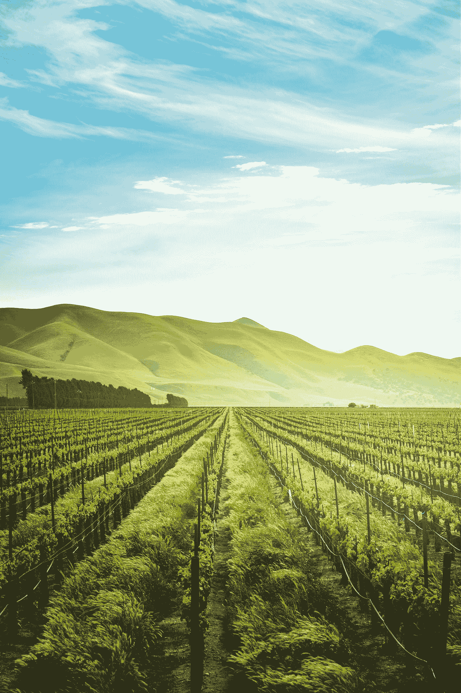

# 可持续农业创业公司 HermetiaPro 讲述他们的创业故事

> 原文：<https://medium.datadriveninvestor.com/sustainable-ag-startup-hermetiapro-tells-their-entrepreneurial-story-7cc4e98640ff?source=collection_archive---------22----------------------->

Photo by [Adele Payman](https://unsplash.com/@adele_payman?utm_source=medium&utm_medium=referral) on [Unsplash](https://unsplash.com?utm_source=medium&utm_medium=referral)

硅谷创新者与 2019 年创业推介大赛获奖者 HermetiaPro 畅谈他们的创业之旅，以及他们在过去一年中学到的有益于新创始人的东西。

在[www.valleyinnovators.com](http://www.valleyinnovators.com)了解更多关于硅谷创新者推介大赛和创业社区的信息

 [## 在创业之旅中，拥抱学习|数据驱动的投资者

### 好像建立一个数百万美元的公司还不够困难，企业家必须额外照顾他们的…

www.datadriveninvestor.com](https://www.datadriveninvestor.com/2018/10/16/on-the-entrepreneurial-trek-embrace-the-learning/)