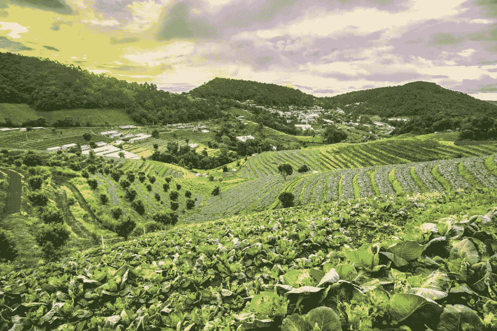
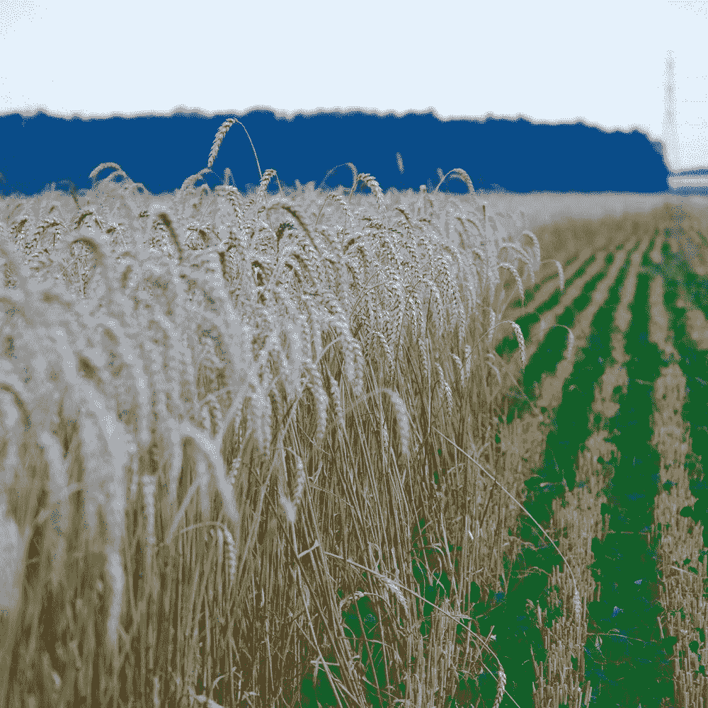
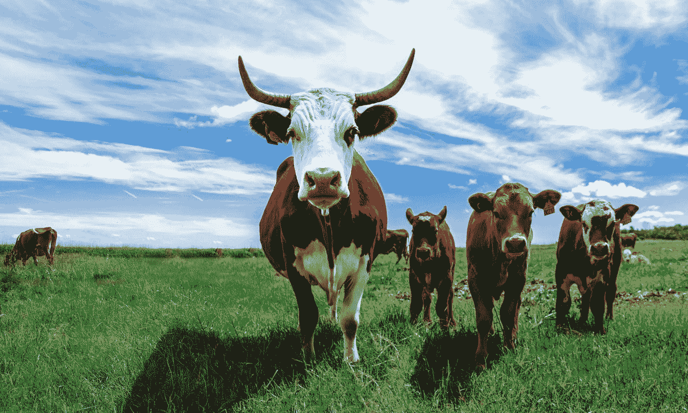
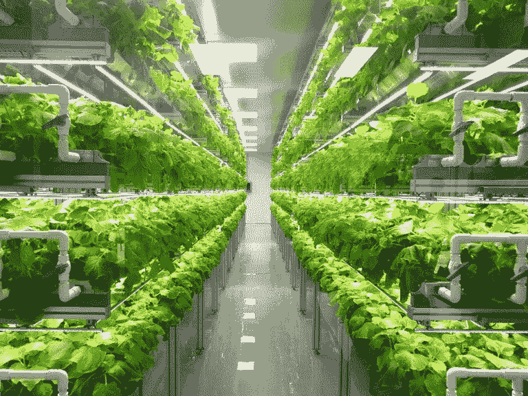

# 持续农业

> 原文：<https://medium.datadriveninvestor.com/sustainable-agriculture-7a73499ef0c4?source=collection_archive---------14----------------------->

你想过你的食物是从哪里来的吗？它可能经过了数千英里才到达你的盘子里？关于一些农民如何在破晓时分起床为我们收割蔬菜？如果你的答案是否定的，没关系，我也从来没有真正做过，但在过去的一个月里，我一直在园艺，学习了很多关于植物的知识，我意识到这很难。关于植物的健康有很多因素需要考虑，一个小小的问题就可能毁掉你的整个产品。这让我想到，一定有更好的种植方式，而不仅仅是把种子种在地里，然后抱最好的希望，我发现这种方式就是通过**可持续农业。**

A pretty farmland picture

首先，什么是可持续农业？嗯，简单地说，这是**农业，可以长期进行而不会降低质量或影响环境**。它使用可再生材料，通常使用较少的空间和资源来帮助改善生物多样性，减少浪费和污染。与传统农业相比，可持续农业使植物即使在地球气候变化的情况下也能继续生长，传统农业中任何问题都会导致产量大幅下降。

 [## 忘记石油吧，水是未来。数据驱动的投资者

### 我们不会耗尽燃料的替代品。能源行业曾经是投资者的荣耀，无论…

www.datadriveninvestor.com](https://www.datadriveninvestor.com/2018/11/14/forget-about-oil-water-is-the-future/) 

## 传统农业的问题

其中一个问题是气候变化。我相信现在每个人都知道这些年来全球气温一直在稳步上升。这对植物来说是一个巨大的问题，因为它导致了生态系统的许多变化，打破了植物和动物的平衡。这也导致了许多小问题，比如水的可获得性。干旱正在使植物所需的地下水干涸，突如其来的洪水冲走了土壤中的重要养分。这导致生产的质量和数量下降。

另一个影响植物的问题是污染。不仅来自塑料和其他非生物降解材料，还来自进入土壤的石油、化学品和杀虫剂。它们会导致植物生病，长出褐色斑点和皱缩的小块，或者根本不生长，这取决于污染对根和种子的干扰程度。如果它们污染了水源或剥夺了土壤的养分，甚至会影响未来的作物。

减少植物数量的最后一个问题是城市扩张。由于我们继续在世界各地进行建设和扩张，农民种植农产品的空间越来越小。他们不能只是把作物靠得更近，因为要正常生长，植物需要足够的空间和空间来呼吸。

尽管有这些问题，农民还是被期望为不断增长的人口提供同样数量或更多的农产品！他们应该怎么做？显然，我们需要彻底改变我们对农业的看法。

Cover crops being removed

## **覆盖作物**

改善农业的第一个方法是覆盖作物。这些作物像黑麦、荞麦、三叶草或高粱，种植这些作物是为了土地的利益，而不是为了生产。它们是在“淡季”种植的，也就是那块地里的主要作物还没有生长的时候，这样他们就可以为它准备好土壤。

然而这并不是他们所做的全部。覆盖作物非常有助于保护土地免受通常会在淡季蔓延的杂草的侵害。他们可以通过引入新的昆虫和野生动物来帮助改善该地区的生物多样性，并通过吸收和牺牲自己来消除土壤中的任何疾病和细菌。它们有助于减少水的流失和侵蚀，因为它们在土壤中产生更多的孔隙，让水填充并深入地下。最后，它们将更多的养分放入土壤中，起到覆盖物的作用，这有助于保护土壤免受恶劣天气的影响。

所有这些好处使它们在处理传统农业的问题时非常有效，因为它们有助于保护和保存土壤中的水和养分，并消除对可能破坏土壤的化学肥料的需求。他们还可以清除土壤中的其他污染，这有助于拯救所有未来的作物。

Some nice little cows that can help make farming sustainable

## **植物和家畜的整合**

传统农业问题的第二个解决方案是整合植物和牲畜。这听起来确实是这样的，**在种植农作物的同一个农场里饲养奶牛和鸡等家畜**。

这种解决方案有很多好处，例如粪肥是一种很好的植物肥料，可以帮助消除对化学药品的需求。它还可以帮助抑制土壤中的任何疾病，使土壤更健康，对植物更好。另一方面，植物可以帮助动物提供食物。通常情况下，不符合标准的作物会被扔掉，任其腐烂，但动物并不关心食物的形状，只关心它的味道好不好。如果农民使用覆盖作物，任何粒状作物对牲畜都有好处，可以帮助降低他们购买食物的成本。

从经济角度来看，在农场里既有牲畜又有植物可以帮助农民在冬季不能种植植物时获得收入。这将有助于他们购买任何必要的工具来提高产量和生产率。

整合植物和牲畜甚至没有那么难！农民可以使用的方法主要有两种:**场内整合**和**场间整合**。第一种是像乳品厂这样的专业化企业扩张以增加农作物和其他动物。第二种是两个或更多的专业化企业共享土地和资源，这样它们就不必增加另一个领域的额外负担。

That’s some healthy looking soil

## **土壤培肥**

下一个解决方案是土壤肥沃化。这是通过**将微生物，基本上是非常小的细菌，直接添加到土壤或种子中来帮助植物生长，并为未来的植物丰富土壤**。有许多不同类型的微生物，它们有不同的工作，以不同的方式帮助植物。

一种类型被称为氮牧马人，它收集土壤中能找到的任何氮，并通过植物的根将其输送给植物。这对植物至关重要，因为氮有助于产生光合作用所需的叶绿素，这意味着植物的生长。低氮水平会导致植物枯萎和死亡。

**解磷菌**是另一种土壤富集微生物。他们的工作是帮助分解土壤中的磷，以便根部更容易吸收。磷在帮助植物生长和健康方面非常重要，因为它是植物能量单位 ATP 的组成部分。没有能源，植物就不能生长。

最后，**真菌屏障**是在根和茎周围制造屏障以保护植物免受有害真菌侵害的微生物。如果植物没有这些屏障，那么真菌会削弱植物的生长，导致它们不健康。

除了帮助植物生长和健康，微生物还将帮助解决传统农业的一些问题。在土壤微生物的帮助下，获取养分和水分的任何问题都将变得不那么突出或完全消失。

Lots of leafy greens growing vertically

## **垂直农业**

最后一个解决方案是垂直农业。这是使用**堆叠托盘垂直种植植物的过程**。我知道这听起来很疯狂，但实际上非常有效。他们使用人造光和自然光、反射面和旋转托盘来模拟行内的温室。这意味着它们可以在 T21 的任何地方生长，因为这个地方不需要完美的天气条件。事实上，它们在很多地方都有种植，从旧的海运集装箱到摩天大楼。

这种耕作方式也将植物从散布着外壳或苔藓的水床中培育出来，而不是使用土壤。这消除了植物因土壤不健康而无法生长的任何问题，但仍能从外壳和苔藓中获得植物所需的所有营养。

垂直农业有很多好处，其中大部分属于保护自然资源的范畴。它为多代植物循环利用水，这使得它比传统农业节约 90%的用水**。来自植物的任何额外营养也被外壳和苔藓吸收，然后重新用于更多的植物。此外，垂直农业可以防止许多破坏农作物的常见害虫，从而提高产量和生产力。**

这种解决方案解决了传统农业的几乎所有问题，因为它保存和重复利用水和养分，并且不受气候影响。它避免了污染，因为材料或油/化学物质很难进入托盘，除非有人把它们放在那里。最后，它不会受到城市扩张的影响，因为它长大后不需要一英亩又一英亩的土地来生长。

## **关键要点**

*   传统农业存在许多问题，我们需要创造新的耕作方法
*   覆盖作物可以帮助解决与土壤和污染相关的问题
*   整合植物和牲畜可以大大提高产量和生产力
*   土壤肥沃使用许多不同的微生物来帮助植物和土壤的健康
*   垂直农业将减少没有足够空间的问题，并有助于所有相关材料的生产率

感谢您阅读我关于可持续农业的文章！希望你喜欢它，现在知道一两件关于农业的事情。如果您有任何意见或问题，请随时给我留言或通过 [LinkedIn](https://www.linkedin.com/in/paige-gugeler-0273a6175/) 联系我。另外，如果你想读更多我的文章，看看这篇关于基因组学的文章！