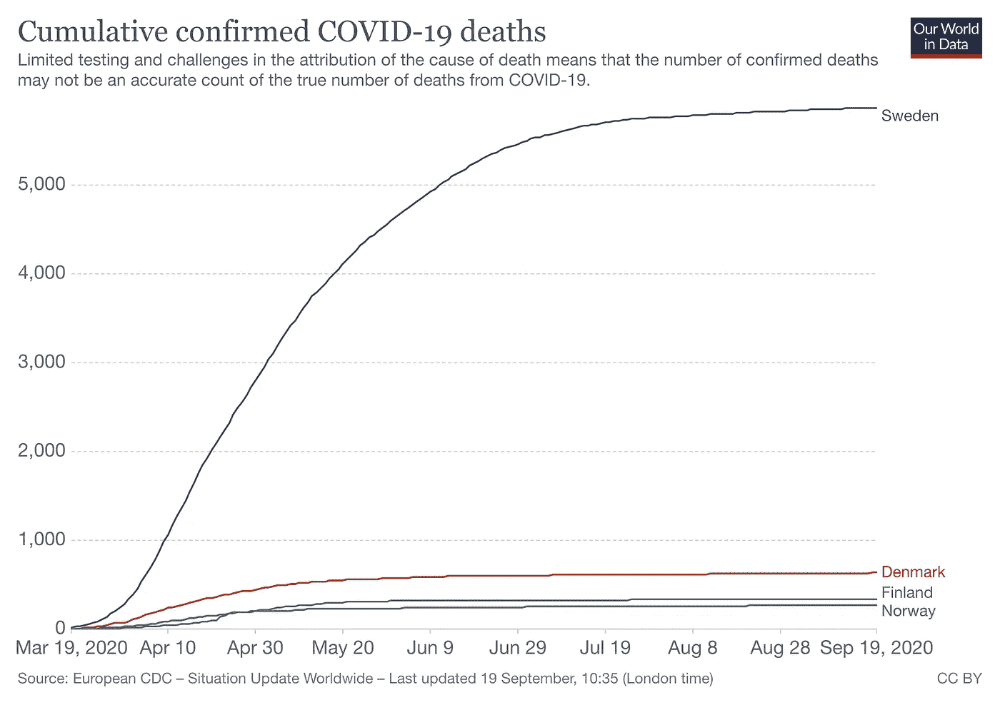

# 瑞典似乎打败了新冠肺炎

> 原文：<https://medium.datadriveninvestor.com/sweden-seems-to-have-defeated-covid-19-76743c3035c8?source=collection_archive---------6----------------------->

Photo by [Laurent Perren](https://unsplash.com/@laurent_perren?utm_source=unsplash&utm_medium=referral&utm_content=creditCopyText) on [Unsplash](https://unsplash.com/s/photos/sweden-crowd?utm_source=unsplash&utm_medium=referral&utm_content=creditCopyText)

一位著名的丹麦流行病学研究人员[称](https://www.thelocal.se/20200919/swedens-pandemic-may-be-finished-danish-researcher?utm_source=dlvr.it&utm_medium=twitter)由于全民免疫水平足够高，瑞典“现在可能已经消灭了这种流行病”。

哥本哈根尼尔斯玻尔研究所的生物复杂性教授金·斯奈朋向[政治报](https://politiken.dk/indland/art7929231/Tog-vi-fejl-om-flokimmunitet-De-meget-lave-svenske-smittetal-tyder-p%C3%A5-det)解释道:

> “有迹象表明，瑞典人已经获得了对这种疾病的免疫力，加上他们正在采取的防止感染蔓延的一切措施，足以将这种疾病控制住，”

但是广泛的免疫并不是没有代价的。瑞典在早期因其应对病毒的宽松方式而获得国际关注。自那以后，该国遭受的死亡人数似乎比任何邻国都要多。

Source: Our World In Data

在编写本报告时，瑞典已有 5865 例 Covid 死亡，比丹麦(635 例)高 9.2 倍，尽管瑞典的人口仅是丹麦的 1.76 倍。

然而，鉴于病毒传播的指数性质，不能说整个差异是不同公共政策的直接结果。在所有条件相同的情况下，一个人口是另一个国家两倍的国家，其病例数预计会比另一个国家多得多。

无论如何，时间会证明瑞典的策略是否值得付出代价。与此同时，幸存的人们现在可以看到隧道尽头的一丝曙光。

[*本文原载于 2020 年 9 月 20 日的 Australians.news 上，作者为 Steven Psaradakis*](http://australians.news/2020/09/sweden-seems-to-have-defeated-covid-19/) *。*