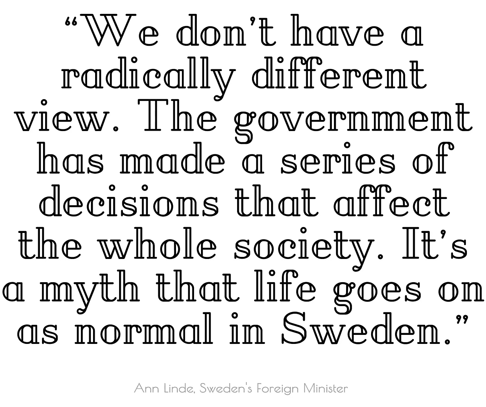
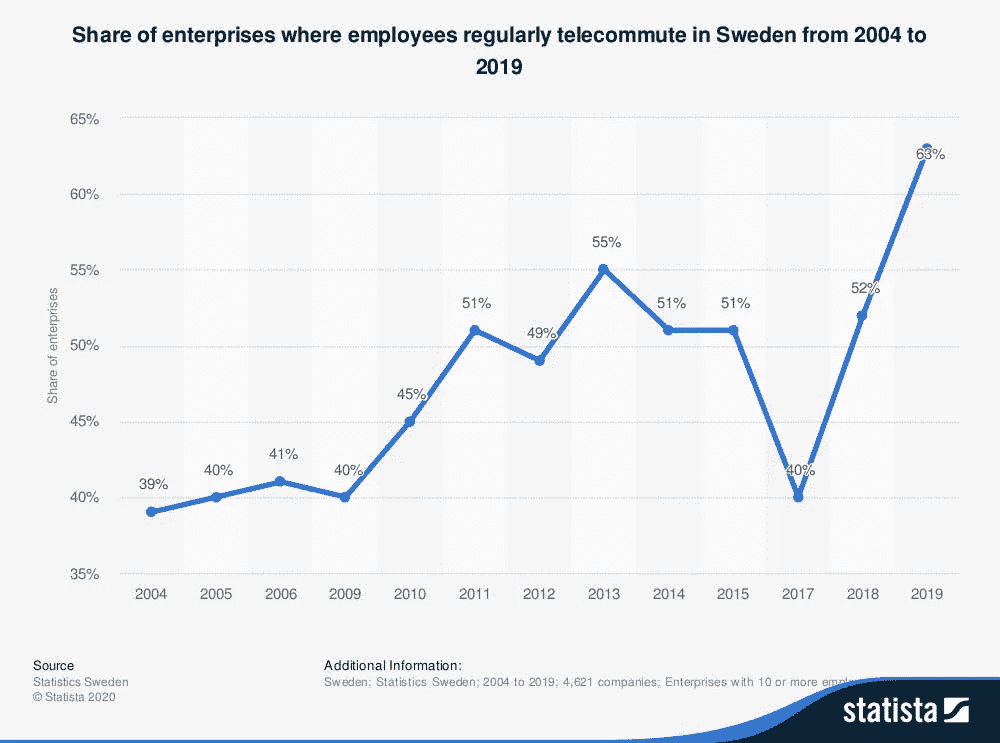
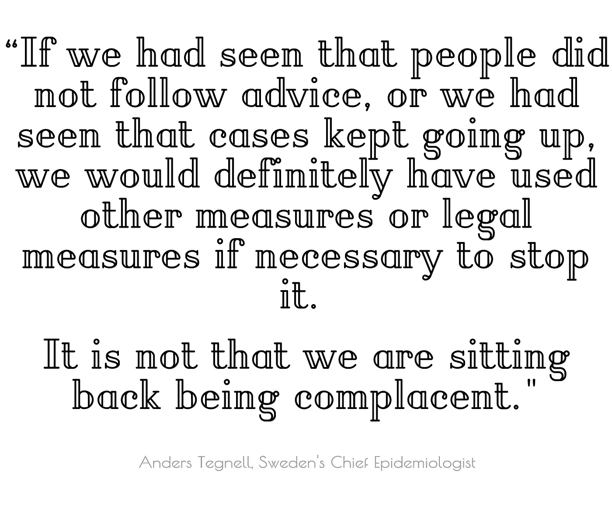
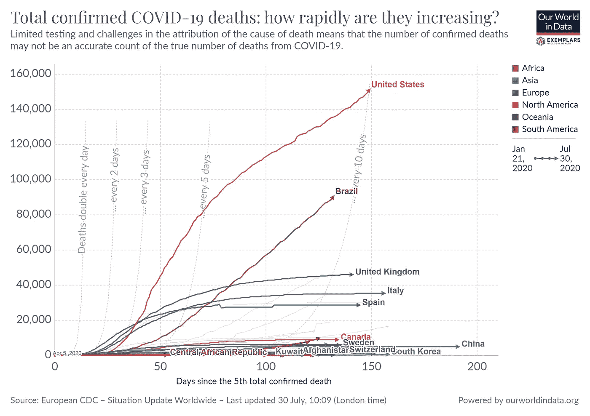
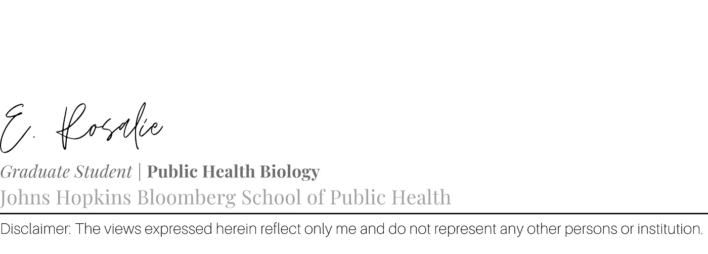

# 瑞典首席流行病学家澄清了该国对新冠肺炎疫情的反应

> 原文：<https://medium.datadriveninvestor.com/swedens-chief-epidemiologist-sets-the-record-straight-about-the-country-s-covid-19-response-24c92b22a0e4?source=collection_archive---------8----------------------->

by 3ab2ou

## 同行评议政治

## 瑞典首席流行病学家代表他的国家发言，结束了对瑞典方法的猜测和不准确的说法。

瑞典在很大程度上向公众提供了指导，希望新冠肺炎也能遵守。许多人以瑞典为例，说明更严格的方法反应过度且没有必要。如果这是真的，或许批评者对美国反应的看法是正确的。

## 似乎不太可能找到比安德斯·泰格内尔更合格的人。

瑞典的首席流行病学家回答了关于他的国家备受争议的反应的问题，在播客[公共卫生随叫随到](https://johnshopkinssph.libsyn.com/126-sweden-and-covid-19)的采访中，他与约翰霍普金斯大学教授、儿科医生和公共卫生专家约书亚·沙尔夫斯坦博士[坦率地交谈。](https://johnshopkinssph.libsyn.com/126-sweden-and-covid-19)

Sharfstein 要求 Tegnell 解释瑞典的做法，以及他认为瑞典的做法与其他国家有何不同。

> “我认为在很多方面都是相似的，因为我们都在努力让这种疾病在我们的社会中缓慢传播。”
> 
> **“在我们的目标上，瑞典与其他任何国家都没有什么不同。我们的不同之处在于我们做这件事的方式。我们通过法律工具和自愿建议的混合发展了社会距离，这在很大程度上是基于我们通常与瑞典公共卫生措施合作的方式。**
> 
> **这在很大程度上是建立在赋予个人很多责任以避免将疾病传播给他人的基础上的。然后，我们可以依靠这些传统，这些法规，并与许多建议一起工作，但也可以在个人很难保持社会距离的领域采取法律措施。**

安德斯拒绝接受他的国家对新冠肺炎没有做出什么回应的说法。瑞典文化不同于许多其他地方，因为它通过请求实现了[显著的一致性](https://sverigesradio.se/artikel/7441596)。

据手机信号塔证实，在复活节周末，前往瑞典热门度假目的地的旅游人数下降了 96%。即使在首都 T2，高楼的整体活动也减少了 75%。在距离测量的绝对峰值，美国看到[与正常情况相比流动性下降了 35%到 63%。](https://www.thelancet.com/journals/laninf/article/PIIS1473-3099(20)30553-3/fulltext)

瑞典外交部长反驳了世界各地头条新闻的说法。“我们没有完全不同的观点。政府做出了一系列影响整个社会的决定。瑞典的生活一如既往，这是一个神话。”

安德斯指出，法律措施是有选择性的，但也是有用的。接触者追踪和隔离是该国使用法律手段的两个领域。瑞典有一项传染病法案，官员们用它来管理餐馆的容量和经营。瑞典将公众集会和集会限制在 50 人以内，但对正式的命令提出了建议，公众基本上都遵守了这些建议。

全国性的要求包括强烈建议任何生病的人呆在家里。美国也提出了类似的要求，但是临时工和没有病假的人几乎没有选择。瑞典基本上消除了贫困，特别是在老年人和有孩子的家庭中，已婚夫妇获得的养老金和补贴几乎相当于他们退休前的收入。

这种差异意味着瑞典人可以遵从要求，而许多美国人没有选择。与此形成鲜明对比的是， [80%的美国人现在靠薪水过活，几乎没有证据表明他们缺乏职业道德。](https://www.forbes.com/sites/zackfriedman/2019/01/11/live-paycheck-to-paycheck-government-shutdown/#67e213f04f10)

安德斯分享道，“健康保险让这一切成为可能。人们从呆在家里的第一天起就会得到报酬。”瑞典人可能在没有医生证明的情况下呆在家里长达两周。政府还敦促人们尽可能在家工作，但这已经远远领先于世界上许多其他地区。

Share of enterprises where employees regularly telecommute in Sweden from 2004 to 2019\. During the survey period in 2019, 63 percent of companies had employees who regularly telecommute | Statista

知道了这一点，该国可以根据瑞典的现实情况调整政策。

Sharfstein 进一步探讨说，“一些人认为瑞典模式是说这取决于个人，但听起来你是说瑞典模式是你希望人们遵循的指导，而且大体上，人们已经遵循了它。是真的吗？”

> “是的，我会说这是非常真实的。”安德斯毫无保留。"四个月后，80%的人继续听从我们的建议。"

沙夫斯坦似乎天生就有能力读懂观众的心思，他问道:“如果人们不听从建议，会发生什么？”瑞典证实其人民遵守建议，并在必要时补充法律措施。

接着，他问道，“如果人们没有保持距离，这会让你改变你正在做的事情吗？或者你认为你会坚持‘由人们来决定做什么？’"

> “不，这在很大程度上是基于我们看到了我们给出的建议的效果，”安德斯强调说，“实际上现在我们的病例数量正在迅速减少。”

他问道:“如果世界上的另一个地方也给出了(瑞典的)建议，但人们没有遵循，病例真的激增，并且有很多 Covid 疾病，如果他们说，‘不要责怪我们，我们正在遵循瑞典模式’，那就不对了，对吗？”

“不。”安德斯回答说，“不，”是一个完整的句子，尽管他友好地扩展。“如果我们看到人们不听从建议，或者我们看到案件不断上升，我的意思是，如果有必要，我们肯定会采取其他措施或法律措施来阻止这种情况。我们并没有坐以待毙，沾沾自喜。”

## 触及文化差异

Sharfstein 问及关于瑞典老年人死亡率较高的报道。批评者指出重症监护室的开放床位，称瑞典不把临终关怀的人送到医院。

“一些报道称，人们从长期护理机构被送入医院的情况非常罕见。你认为这是一个公平的批评吗？”安德斯回应道。

> “是的，这是一个观察，但不是批评，因为长期护理机构中的这些人都很老了。他们病得很重。这些人不是你通常会承认需要重症监护的那种人，因为他们活下来的机会极其渺茫，而且我要说，如果你把他们放在重症监护中，这在伦理上是有问题的，如果他们患有任何其他类型的疾病，你不会这样做，因为这将增加他们的痛苦。这不会真正让他们生命的最后几天有任何质量。”

安德斯补充说，进入重症监护的标准在该国没有改变，所以没有从临终关怀转移到医院的人在正常情况下不会被转移到那里。这与美国的文化不同，在美国，不管年龄大小，都可能出现更具攻击性的反应。

“人们应该得到他们需要的护理，但他们不应该得到不必要的有害护理。这是非常重要的，”他解释说，这个国家对获得医疗保健的信念。

Sharfstein 问及瑞典受到的批评。“人们说瑞典太宽松了。你对此有何感想？”安德斯的反应可能会让美国人觉得不同寻常。

> “几天前，我们看到了支持我们政策的最新数字，这些数字仍然非常非常高。80%的人说他们听从了我们的建议。对该机构的信任度约为 75%至 80%……公众对我们的信任度仍然非常高。”

当被问及对瑞典的回应有哪些批评时，安德斯给出了一个透明的回答。

> “死亡人数，当然，死亡人数是一个问题，一些我们真的希望不会发生的事情。我们现在知道我们能做些什么来避免它在瑞典的其他地方再次发生。我们知道，如果这些老年之家、长期护理机构……确实对人员进行了高水平的测试，就有可能将这些设施保持在非常低的水平。”

## 安德斯对美国新冠肺炎的反应

当被问及美国州长声称瑞典激励他们决定不在推荐后没有佩戴口罩的地区发布命令时，安德斯说:

> “我认为你需要时刻关注你所做事情的结果。我们瑞典人认为，我们所做的工作取得了相当积极的成果，尽管开始时死亡人数太高。当我们采取措施时，情况变化很快。我们一直在跟踪我们所做的事情的影响，并一直在微调我们的措施。
> 
> 我们把允许聚集的人数从 500 人减少到 50 人。我们在老人院采取了一些措施。今年夏天，我们参观了不同的旅游设施。有些是不允许打开的，有些可以打开，但有一定的限制。你不能自鸣得意，认为你的策略会奏效。

为了确保他恰当地描述了瑞典的方法，Sharfstein 做了进一步的探索。“瑞典的方法可能是从激励人们自愿采取行动开始，但如果他们不这样做，瑞典的方法不是说‘我想我们没有别的办法了。’"

真正的瑞典式方法是问我们必须做什么才能得到想要的结果，从自由开始，然后根据需要继续前进。

安德斯补充说，“我们可以采取其他措施，然后或者寻找合法的方式，或者让其他行为者让人们更容易接受我们的建议，比如政府改变我们医疗保险的监管规定，让人们可以呆在家里而不会失去收入。”

瑞典新冠肺炎的反应并不是对所采取行动的限制，而是一种让公众自己做必要事情的态度。他们根据观察到的依从性和效果进行评估和再评估。就这一点而言，不管是哪个国家，很少有人会谴责这种做法。有希望的是，安德斯·泰格内尔的这种透明的澄清导致了在“瑞典方法”之后不完美建模的地点的行动

那么，美国做得怎么样？我们对它的感觉是主观的。这是一张新冠肺炎确诊总死亡人数和各国病例增长速度的图表。

[Subscribe](https://mailchi.mp/83919fc1b8f5/novelscience) | editor@novel-science.com | [Twitter](http://twitter.com/nobelprose) | [Facebook](http://facebook.com/e.rosalie.sci.writing) | [Medium](https://medium.com/@e.rosalie) | [NOVEL SCIENCE](http://novel-science.com/)

## **参考文献**

*   播客[公共卫生随叫随到](https://johnshopkinssph.libsyn.com/126-sweden-and-covid-19)，第 126 集，瑞典和新冠肺炎为本文提供了基础。
*   通过 Envato 数字资产授权的图像。