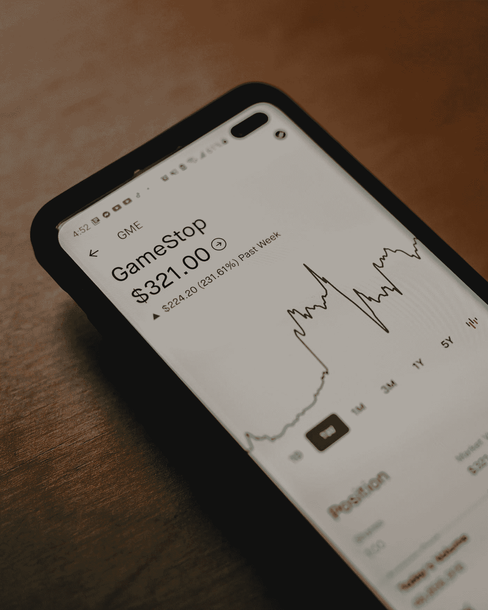
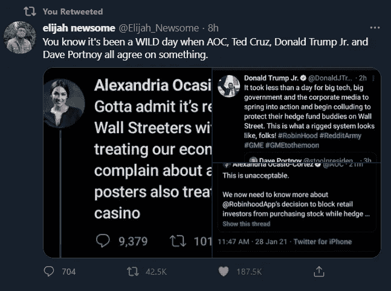
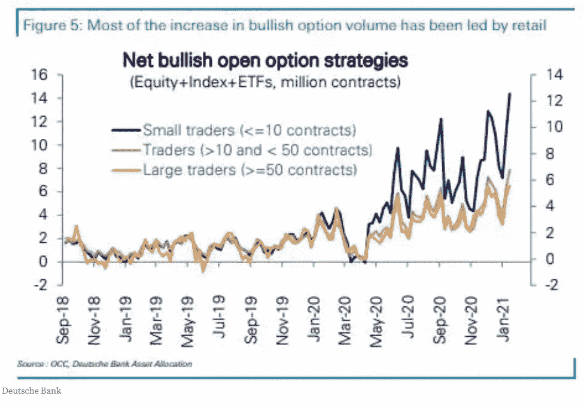
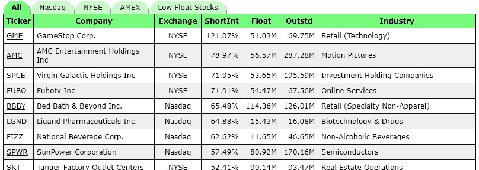
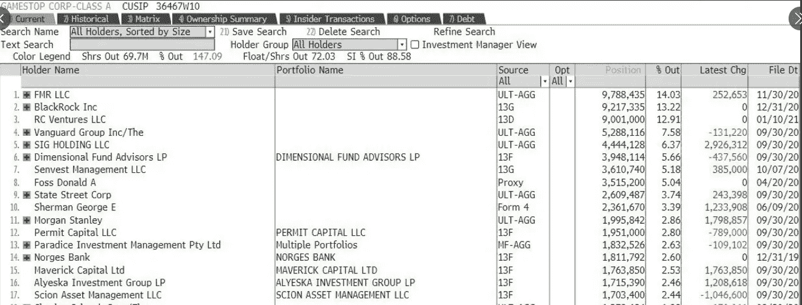
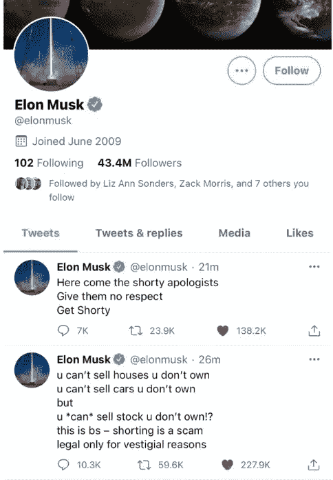
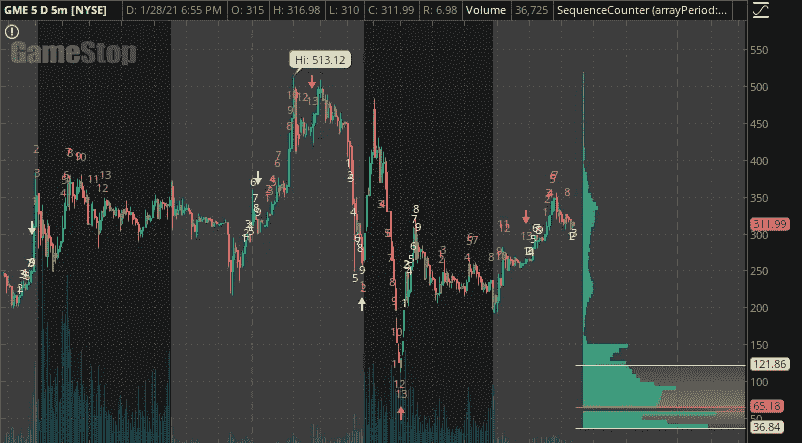
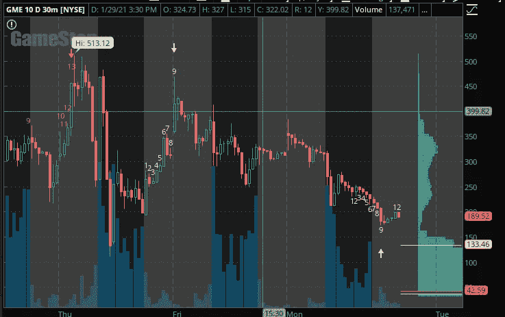

# 被痞子商人席卷而来——贪婪的怪物来了

> 原文：<https://medium.datadriveninvestor.com/swept-up-by-the-riffraff-traders-the-greed-monster-cometh-968aa32bc7a7?source=collection_archive---------19----------------------->

## 互联网如何与华尔街对抗

Photo by [Clay Banks](https://unsplash.com/@claybanks?utm_source=medium&utm_medium=referral) on [Unsplash](https://unsplash.com?utm_source=medium&utm_medium=referral)

# 2021 越来越疯狂了

围绕 GameStop 股票的金融肥皂剧席卷全球，甚至在政治对手之间达成了一些协议，如小唐纳德·特朗普(Donald Trump Jr .)、亚历山大·奥卡西奥·科尔特斯(Alexandria Ocasio-Cortez)和特德·克鲁兹。

[https://twitter.com/Elijah_Newsome](https://twitter.com/Elijah_Newsome)

**免责声明**:这不是财务建议。这些观点是我自己的，我不是金融专业人士。我只是一个热爱交易的人，多年来一直是 r/WallStreetBets Reddit 社区的一员。

# 我们中的一员——华尔街赌注是什么？

对于任何一个仍在圈外的人来说，r/wallstreetbets 是 Reddit.com 的一个在线社区，让人想起 80 年代的交易场内虚张声势，分享与市场相关的迷因、他们赌博的损失，以及描述他们交易想法的半生不熟的(主要是)尽职调查。当然有未经加工的钻石，但坦率地说，往墙上扔足够多的垃圾，一些最终会粘在一起。[任何关注我在 Medium 上的工作的人都知道，我推荐使用 r/wallstreetbets (WSB)进行交易聊天，因为那里可能有一些有利可图的想法和建议](https://medium.com/swlh/how-to-create-a-dashboard-to-dominate-the-stock-market-using-python-and-dash-c35a12108c93)。尽管我必须承认，社区里流传的一个笑话是颠倒 WSB 的想法，因为大多数想法都会导致糟糕的交易和亏损。

通常，当在 reddit 社区发布期权交易的巨额亏损时，最初的海报(OP)会受到同行交易员的数字化欢呼，如“我们中的一员”和“让这个白痴成为模特”虽然语言似乎古怪和贬义，但这都是表示亲昵的术语，同时欢迎一个人加入这个以积累大量交易损失而闻名的社区。事实是，交易是一个艰难的游戏，他们让交易者感觉好一点，可以和大钱和聪明钱一较高下。

尽管主流媒体希望你相信这是一群“孩子”，但我已经在这个社区漫游了多年，并与一些来自不同年龄和各行各业的合法技术和富有的交易者聊天。大多数孩子没有数万美元或更多的钱来赌博。有些人知道，但大多数人不知道。

# 太久没有读到关于短挤压

既然你对 WSB 社区有所了解，是时候回答每个局外人都在问的问题了:为什么 GameStop 的价格在几天内从 20 美元涨到 300 多美元？

我来告诉你要点:自去年 3 月 Covid 下跌以来，手头有时间的散户投资者一直在大举入市。这导致了一些有趣的尽职调查…

[https://www.businessinsider.in/stock-market/news/increased-retail-trading-is-largely-responsible-for-elevated-stock-prices-and-record-high-options-activity-says-deutsche-bank/articleshow/80468916.cms](https://www.businessinsider.in/stock-market/news/increased-retail-trading-is-largely-responsible-for-elevated-stock-prices-and-record-high-options-activity-says-deutsche-bank/articleshow/80468916.cms)

大约一年前，WSB 会员 u/DeepFuckingValue 发表了一篇关于 GameStop 公司的帖子，认为这是一个潜在的被低估的回归游戏。当华尔街看到一家表现不佳的公司步 Blockbuster Video 的后尘时，一些人看到了一场正在酝酿中的史诗般的交易。尽管许多人怀疑这一论点，但随着时间的推移，越来越多的人认为这是一个具有强大挤压潜力的交易，因为对冲基金等市场参与者在 GameStop 破产上下了很大的赌注。

使用公开信息，任何人都可以看到 GameStop 的短期兴趣处于极端水平。空头利息是指已经被卖空(T3)但还没有被赎回(T5)或平仓(T5)的股票数量(T2)。想亲眼看看吗？证券交易所通常在每个月底发布报告，显示公司的短期利益。例如，纳斯达克交易所在每个月的月中和月末发布一份简短的利息报告。

[https://www.highshortinterest.com/](https://www.highshortinterest.com/)

## 什么是卖空？

简而言之，当有人卖空股票时，他们会借入股票在公开市场上卖出，希望在股价下跌时以更低的价格买回，从而将差价收入囊中。尽管听起来很恶心，但卖空是一种必要的罪恶。卖空的问题在于风险。有了足够的市场需求，股票的价格就会上涨，使得卖空者持有股票的成本非常高，从而将他们挤出头寸，迫使他们在损失变得太大之前回购股票。他们弥补空头头寸的需求增加了更多的买入压力，推高了股价。短期挤压对市场来说并不新鲜。

我不建议没有交易经验的人尝试卖空。卖空风险高，上涨空间有限。一只股票的价格只能低至 0，但可以高至有人愿意支付的价格，因此卖空的风险是无限的。

电视转播最多的一次短兵相接发生在两个亿万富翁之间:卡尔·伊坎和比尔·阿克曼。当阿克曼宣布他在康宝莱公司有大量空头头寸时，卡尔·伊坎开始在该公司建立多头头寸，并最终将阿克曼挤出他的位置，达到 10 亿美元。卖空者守口如瓶是明智的。

# 但是 GameStop，真的吗？

不仅仅是 Reddit 上的一些随机交易者将 GameStop 视为潜在的交易对象……请看下图，了解持有该公司多头头寸的机构。

Financial Institutions with Long Positions in GameStop ([source](https://twitter.com/SamanthaLaDuc/status/1355639146497376258/photo/1))

就连金融界的传奇人物，如《大空头故事》中 Scion Asset Management LLC 的迈克尔·伯利博士(dr . Michael Burry)**也认为 GameStop 是一家被低估的公司，有东山再起的潜力。他的公司[报告截至 9 月 30 日](https://www.bloomberg.com/news/articles/2021-01-27/michael-burry-calls-gamestop-gain-unnatural-insane-dangerous)拥有 GameStop 2.4%的股份，远远早于零售交易界的大多数人。贝莱德(BlackRock)和先锋(Vanguard)等其他几家大型机构也持有该公司大量股份。**

**除了持有多头头寸的大型金融机构之外，大约在 2020 年 11 月[有消息称，Chewy.com 的联合创始人瑞安·科恩收购了**GameStop 12.9%的股份，并进入董事会，试图让该公司扭亏为盈**](https://www.cnbc.com/2020/11/20/former-chewy-ceo-ryan-cohen-urges-gamestop-to-become-the-amazon-of-video-games.html) **。从那以后，形势开始转变。最终，消息在 Reddit 上传播开来，说短期紧缩是不可避免的，互联网开始涌入 GameStop 交易。没有人能预测到购买 GameStop 的股票会成为类似于 17 世纪 30 年代郁金香狂热的全球现象。****

# **愤怒和贪婪的故事**

**随着交易变得拥挤，r/WallStreetBets 上的交易员对华尔街变得愤怒，并采取了一种“我们对抗他们”的心态。他们相信，通过购买和持有尽可能多的股票，他们将导致大规模的卖空，并有效地让做空 GameStop 的基金和交易员破产。WSB 说用钻石手握住，不要卖！来自世界各地的一些极其热情的 Redditors 和散户投资者聚集在 WSB，分享他们在 2008 年金融危机后贫穷和挣扎中成长的个人故事。他们中的许多人理所当然地将 2008 年后他们家庭的处境归咎于金融机构。**

**读者和海报一样，人们对购买和持有 GameStop 是打击腐败的亿万富翁的方式产生了共鸣，这让人想起了十年前的 T2 占领华尔街运动。这种现象导致了对 GameStop 股票的大量需求，因为大量散户交易者希望买入并持有，这给对冲基金一个隐喻性的中指。由于需求如此之大，在不到一周的时间里，每股价格从 17 美元涨到了 450 多美元。Reddit 声称这只是开始…**

# **自由市场只有在富人赔钱之前才是自由的**

**史诗般的空头紧缩引起了国际社会的关注，因为它不再关乎金钱，而是向华尔街基金发出了一个信息，这些基金在历史上一直利用其金融和政治权力掠夺较低的社会经济阶层。WSB 认为，他们在自己的游戏中击败了基金，击中了它们最受伤的地方:它们的钱包。**

**2021 年 1 月 27 日，WSB 的交易员们得到了商界巨鲸的支持，如埃隆·马斯克、马克·库班、查马斯·帕里哈皮蒂亚等。他们都为散户投资者与做空 GameStop 的对冲基金进行斗争而欢呼。**

****

**[https://twitter.com/elonmusk/status/1354890601649610753](https://twitter.com/elonmusk/status/1354890601649610753)**

**2021 年 1 月 28 日，当 GameStop 在盘前几个小时创下新高时，许多散户交易者不允许公开交易，一些看似前所未有的事情发生了。Robinhood、TD Ameritrade 和查尔斯·施瓦布等知名经纪公司宣布将阻止用户购买更多 GameStop 股票。其他几个受欢迎的短消息剧，如 AMC 和诺基亚也在一段时间内受到限制或被封杀。甚至我使用的经纪人 Ally 也在短时间内阻止了购买。然而，他们仍然允许销售。**

**愤怒是如此激烈，甚至政敌发誓要共同努力，找出幕后发生的事情，因为这些行动导致了恐慌性抛售，导致股价减半，并扼杀了很多动力。根据互联网的报道，交易者已经开始成群结队地离开罗宾汉，尽管有些媒体说恰恰相反。从长远来看，这一切对罗宾汉的影响会很有趣，因为它暴露了一些真正的问题。**

****

**GME Stock price on ThinkOrSwim by TDAmeritrade 01/28**

# **登月是假的**

**当经纪人限制购买心爱的股票时，散户交易者遭受了巨大的打击，而不是股价在大规模卖空的推动下乘火箭飞向月球。限购引起了轩然大波，美国证券交易委员会提起了诉讼，针对罗宾汉的集体诉讼开始在 WSB 流传。此外，许多使用 Robinhood 的散户投资者已经戴上锡纸帽子，大喊*违规操作*，因为 Robinhood 的最大客户之一基金 Citadel 与一些因做空 GameStop 和其他公司而遭受巨额损失的基金有直接联系。**

**到 2 月 1 日，虽然一些人仍在喊阴谋，但流动性问题似乎困扰着券商，并导致他们限制购买订单，而不是他们与对冲基金的联系。这样的事情已经不是第一次发生了。早在 2008 年金融危机时，[由于流动性相关问题](https://www.sec.gov/news/press/2008/2008-211.htm)和整体市场信心，证券交易委员会限制卖空。看起来买盘是有限的，因为市场结构根本无法承受大量投资者涌入同一只股票。**

**2021 年 2 月 1 日 GameStop 的价格实际上已经下跌，因为有限的购买粉碎了势头。320 左右开盘，220 左右收盘。还会有短暂的挤压吗？有些人这样认为，但我不会打赌。**

****

**GME Stock price on ThinkOrSwim by TDAmeritrade 02/01/2021**

# **从未停止的挤压**

**当 GameStop 的股票传奇仍在继续，全球各地大量手握钻石的交易者继续持仓等待大规模做空时，我坐在那里猜测这一切将如何结束。我认为散户投资者持有 GameStop 会被压垮，最终会遭受巨大损失，希望他们以 300+的高价卖出。所有这一切中最大的讽刺是，WSB 本质上是在用未管理的风险对抗未管理的风险。如果他们真的想伤害对冲基金，他们早就像我一样做了，把钱留着…**

****

**[https://depositphotos.com/328253416/stock-photo-juicy-ripe-yellow-lemon-your.html](https://depositphotos.com/328253416/stock-photo-juicy-ripe-yellow-lemon-your.html)**

**我很幸运，在大肆宣传之前，以每股 17.50 英镑的价格买入了 GameStop 的股票。我在市场上摸爬滚打过，我会第一个告诉你，我远没有钻石手。当我看到我的股票在一周内从 17.50 涨到 300+的时候，我拿了钱，宣布自己战胜了资金。我的观点是，我的账户比他们的账户更好，这是一个巨大的回报。我妻子同意。**

**认为每个人和他们的兄弟都可以挤进一个行业，同时变得富有是一种幻想。我可能是错的，但市场似乎不是那样运作的。华尔街背后的大资金永远不会让小人物赢太久。我真的相信，虽然 WSB 的散户投资者开始炒作，但幕后的大资金闻到了水中的血腥味，并在 GameStop 中建立了他们的头寸。证据就在那里，因为我很少看到散户交易者带着价值数百万美元的买入和卖出订单横扫期权市场。这些都是大资金和精明资金采取的行动。**

**大资金解除他们的头寸，让手握钻石的散户买单，这只是时间问题。**

# **不要投资 MemeStonks**

**虽然这不是对所有戏剧性事件的完美描述，但它应该让你知道为什么每个人都在谈论 GameStop。虽然我不是金融专业人士，这些也不是交易建议，但我想告诉你:如果每个人都在买入，我想卖出。如果每个人都在卖，我想买。自己做决定，但是要明白这些交易在这个时候是过度拥挤的，如果你喜欢留着你的钱，并且不了解风险管理，应该尽量避免。**

# **谢谢大家！**

*   ***如果你喜欢我的作品，* [*关注我的《媒介》*](https://medium.com/@erickleppen) *了解更多！***
*   **[*通过订阅*](https://erickleppen.medium.com/membership) 获得对我的内容的完全访问和帮助支持！**
*   ***我们来连线一下*[*LinkedIn*](https://www.linkedin.com/in/erickleppen01/)**
*   ***用 Python 分析数据？查看我的* [*网站*](https://pythondashboards.com/) ！**

**[**—埃里克·克莱本**](http://pythondashboards.com/)**

** [## 埃里克文章的终极指南

### 我的所有内容按主题组织…

erickleppen.medium.com](https://erickleppen.medium.com/the-ultimate-guide-to-erics-articles-d32df8241353)  [## 成为持续盈利的交易者——两条规则

### 我如何停止在市场上赔钱

medium.com](https://medium.com/datadriveninvestor/become-a-consistent-and-profitable-trader-two-rules-8cc93574c4ad)**