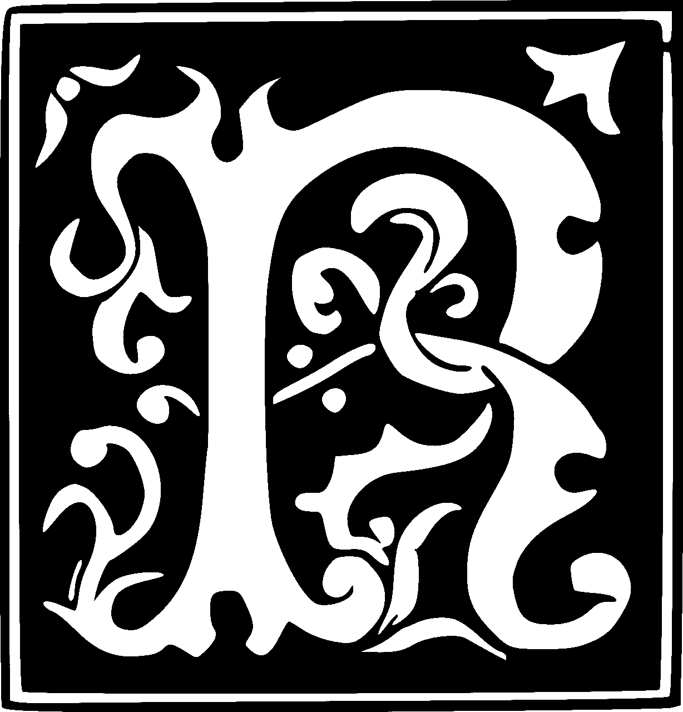
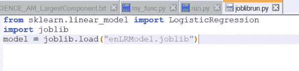
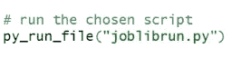
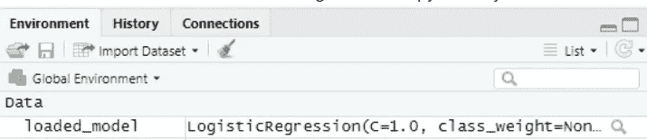

# 将对象从 Python 导出/切换到 R

> 原文：<https://medium.datadriveninvestor.com/switching-objects-from-python-to-r-d8b2207ff7fb?source=collection_archive---------1----------------------->

## 导出(Py)，读取(R)，执行(R)

## 挑战

最初的编码是用 Python 完成的，但是如果你需要把用 Python 创建的对象转换成 R……嗯，有两种解决方案，

1.  你可以用 r 重写整个代码。
2.  你可以尝试通过一个包或者一个函数把 Python 代码转换成 R。

第一种选择很费时间，尽管它会很有效且误差较少。第二种方法耗时少，简单快捷，尽管这可能会导致一些意想不到的错误。

这是一个挑战，我和我的团队必须参与我们的最终项目。这是一个独特的挑战，但感谢几个包或库的作者事先想到了这一点。从上面的选项中，我们选择了第二个选项。我决定写这篇文章，因为网上的解决方案感觉很分散。因此，我打算把我们发现的所有有用的东西都加到一篇文章里。

# 导出 python 对象/模型


(Source: Pexel)

有两个函数允许导出 python 类/模型/函数。

*   [**腌菜**](https://docs.python.org/3/library/pickle.html)**——腌菜通俗地说就是将蔬菜(如黄瓜)放在盐/醋或类似的溶液中保存一段时间，你可以随时使用。python 中的 pickledd 将 python 对象转换为字节流，而对 pickle 对象的 unpickling 操作正好相反。这是 python 中序列化和非序列化的一个流行选项。Pickle 允许保存用户定义的类。**

***命令:转储&负载***

*   **[**Joblib**](https://joblib.readthedocs.io/en/latest/why.html) — Joblib 允许 python 中的轻量级管道。它保持底层算法不变。这允许节省计算并在各种数据集上再现。这对大数据集有好处。**

***命令:转储&负载***

**[本文](https://machinelearningmastery.com/save-load-machine-learning-models-python-scikit-learn/)为您提供了使用这两个包的例子，如果您想要一个可视化的视角。**

****注意:**如果您试图使用任一种机制来保存和加载模型和其他对象，那么在两种场景中使用相同的环境总是明智的。在某些情况下，它将不受支持，您将得到各种错误，直到您在 dump 和 load 中拥有相同的环境(python 版本，包括 scikit)。**

**然而，很明显这是不安全的，建议你(使用 pickle 或 joblib)对你确定的数据进行拆包。**

**一旦导出了相关的 python 对象或模型，下一步就是在 r。**

# **从 R 调用 python 对象**

****

**(Source: Pixabay)**

**r 有“网状”包装，这是一个救生圈。**

**注意:然而，为了避免任何困难，事先要确保你的 R 版本是最新的。因为我们的 R 版本没有更新，所以我们面临着各种模糊错误的困难。**

**首先你需要安装和加载 reticulate 包。**

**然后，您需要定义将要使用的 python 环境的位置。**

```
[use_python](https://rstudio.github.io/reticulate/reference/use_python.html)("/usr/local/bin/python")
```

## **创建虚拟环境(可选)**

**如果 R 给你错误，没什么好担心的！您可以在命令提示符下使用 anaconda 或 python 在项目目录中创建一个虚拟环境。确保您激活了虚拟环境。(您也可以在不使用时停用它)。**

```
pip install virtualenv
```

**[此链接](https://packaging.python.org/guides/installing-using-pip-and-virtual-environments/)提供了一个全面的逐步创建虚拟环境的方法。**

**一旦你创建了一个虚拟环境，按照下面的命令(windows)来获得精确的位置。**

> **其中 python
> …/env/bin/python.exe**

**(对于 linux，将“where”替换为“which”。)**

**将相关 python 包导入到环境中。**

**在 R 环境中，如果使用虚拟环境，请使用 below 命令，而不是 use_python()**

```
[use_virtualenv](https://rstudio.github.io/reticulate/reference/use_python.html)("myenv precise location")
```

**_______________________________________________________________**

# **R 中的最后步骤**

**多亏了 Reticulate 包，您可以下载在 R 环境中使用的各种 python 包。**

```
np <- [import](https://rstudio.github.io/reticulate/reference/import.html)("numpy", convert = FALSE)
pd <-[import](https://rstudio.github.io/reticulate/reference/import.html)("pandas", convert = FALSE)
```

**我想要的是将 Python 中创建的模型加载到 r。**

**接下来，我做的是创建一个单独的。包含加载模型的代码的 py 文件。**

****

**接下来，在 R 环境中读取这个文件。**

****

**检查模型是否已加载。**

****

***备选方案:您也可以通过朋友执行的 source_python()命令来读取该文件——我没有尝试过这种方法。***

**瞧，你完成了！:)**

## **参考**

**[](https://pypi.org/project/joblib/) [## joblib

### Joblib 是一组在 Python 中提供轻量级管道的工具。特别是:透明的磁盘缓存…

pypi.org](https://pypi.org/project/joblib/)  [## 从 R 调用 Python

### reticulate 包为 Python 模块、类和函数提供了一个 R 接口。

rstudio.github.io](https://rstudio.github.io/reticulate/articles/calling_python.html) [](https://machinelearningmastery.com/save-load-machine-learning-models-python-scikit-learn/) [## 使用 scikit-learn-Machine Learning Mastery 在 Python 中保存和加载机器学习模型

### 找到一个准确的机器学习模型并不是项目的终点。在这篇文章中，你会发现如何拯救…

machinelearningmastery.com](https://machinelearningmastery.com/save-load-machine-learning-models-python-scikit-learn/)  [## 使用 reticulate 包从 R 运行 Python 代码

### 在数据科学界，关于 R 和 Python 孰优孰劣一直存在争论。从我的角度来看，两者都…

rstudio-pubs-static.s3.amazonaws.com](https://rstudio-pubs-static.s3.amazonaws.com/407460_396f867ce3494d479fd700960879e22c.html) [](https://scikit-learn.org/stable/modules/model_persistence.html) [## 3.4.模型持久性-scikit-学习 0.23.1 文档

### 在训练一个 scikit-learn 模型之后，需要有一种方法来持久化该模型以供将来使用，而不必…

scikit-learn.org](https://scikit-learn.org/stable/modules/model_persistence.html) [](https://support.rstudio.com/hc/en-us/articles/360023654474-Installing-and-Configuring-Python-with-RStudio) [## 使用 RStudio 安装和配置 Python

### 遵循以下步骤代表了通过 reticulate…将 Python 与 RStudio Connect 结合使用的最小工作流

support.rstudio.com](https://support.rstudio.com/hc/en-us/articles/360023654474-Installing-and-Configuring-Python-with-RStudio)  [## 从 R 调用 Python

### reticulate 包为 Python 模块、类和函数提供了一个 R 接口。

rstudio.github.io](https://rstudio.github.io/reticulate/articles/calling_python.html) 

## 其他有用的链接:

[](https://bookdown.org/ndphillips/YaRrr/dataframe-column-names.html) [## 亚尔！海盗休息指南

### dataframes 的一个优点是每一列都有一个名称。您可以使用这些名称来访问特定的…

bookdown.org](https://bookdown.org/ndphillips/YaRrr/dataframe-column-names.html)  [## R 简介

### 这是对 R(“GNU S”)的介绍，它是一种用于统计计算和图形的语言和环境。r 也差不多…

cran.r-project.org](https://cran.r-project.org/doc/manuals/R-intro.html#Index-vectors)**