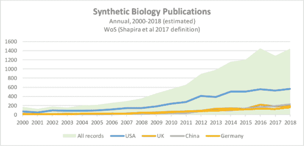
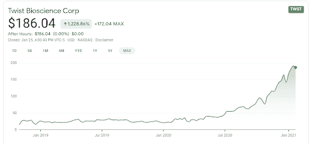
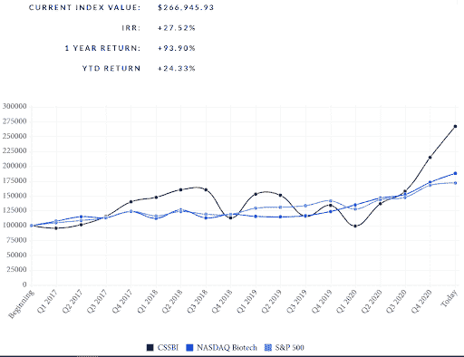

# 合成生物学——创业的黄金地带？

> 原文：<https://medium.datadriveninvestor.com/synthetic-biology-golden-land-of-startups-4ea3e6ecf67?source=collection_archive---------17----------------------->

Source: Getty Images

[合成生物学](https://en.wikipedia.org/wiki/Synthetic_biology)是生物技术的一个分支，是关于从零开始或从自然界的模板中创造新的生物部分。它通常与可用于研究的基因或蛋白质有关，但越来越多地用于农业、工业、医学甚至计算机等商业领域。

在 Tau Ventures，我们是数字健康(除了企业和更小程度的自动化)的投资者，但越来越多地发现，合成生物学为整个生物技术更加软件驱动铺平了道路。这是有道理的，因为创造或重新利用新的生物制剂需要高度的计算机模拟，而它的孪生燃料是不断增加的数据量和不断增加的计算能力。举个例子，两年前的 2019 年 3 月，我们写了[车库时刻——生物技术终于为创业做好准备的 3 个理由](https://www.linkedin.com/pulse/garage-moment-3-reasons-why-biotech-finally-ready-startups-garg/)。我们没有想象出一个全球性的疫情，但如果有什么不同的话，那就是它加速了合成生物学的长期趋势。这篇文章高度概括了三个面向有抱负的企业家的核心趋势。

**1)学术引擎**

合成生物学，像生物技术一样，已经存在了很长时间，可以说是从农业的黎明开始，那时我们正在选择产量更高的植物。但在现代意义上，该领域可以说是从 70 年代末基因泰克制造人工胰岛素开始的，又过了 50 年才成熟。这类似于许多计算机科学家谈论的人工智能冬天。我们的科学知识现在突飞猛进是意料之中的，其幅度是惊人的。下图显示了我们在 2000 年至 2018 年之间基本上增长了 10 倍，这实际上是一种保守的说法，在我们说话的时候，具有更近数据的元研究正在发表，但搜索谷歌学术的关键词或引文可以让我们看到学术引擎是如何加速的。

**2)商业飞轮:合成生物学 2.0**

Twist Biosciences 使用专有的微孔板和液体处理机器人制造 DNA。在许多方面，它是合成生物学 1.0，即一家为其他用例提供铲子的公司。财务表现并不是衡量成功的完美标准，但 Twist 仍然是这类公司取得惊人成功的象征。

但这不再是关于资金雄厚的大型上市公司。例如，Culture Biosciences 按需提供生物反应器，表明初创公司现在可以为其他初创公司提供动力。GRO 生物科学公司(从哈佛著名的乔治·丘奇实验室分离出来)正在这个堆栈上构建，并制造氨基酸(超过 20 种自然产生的氨基酸),这些氨基酸可以成为细菌的新用例。事实上，在 Tau Ventures，我们看到世界正在向合成生物学 2.0 发展，后者的应用性更强。我们现在越来越多地构建功能，而不仅仅是构建结构。我们现在不只是制造基因，而是制造蛋白质。不再仅仅提供铲子，这些工具现在变得无处不在，我们正在构建解决方案。

**3)黄金之地:在公开市场表现强劲**

一个行业中一个强健的市场是一个自上而下的衡量兴奋度和可用资本的标准。往回走，股票表现良好表明有很好的退出机会，更多的私人资金，也就是风险投资资金，以及更多的人才流向这个领域。虽然还没有关于合成生物学的权威索引，但数据科学家 [Calvin Schmidt](https://www.linkedin.com/in/calvin-schmidt-57005949/) 维护了一个可以说明整体情况的索引。一个自然的问题是——这可能是一个泡沫吗？绝对的。但在 Tau Ventures，我们看到了一个分水岭，一个科学知识(“学术引擎”)和应用(“商业飞轮”)水平的转折点。前方有巨大的挑战——意想不到的后果、临床试验、隐私、伦理——但有一点是肯定的，那就是没有回头路。

*原载于* [*数据驱动投资人*](https://www.datadriveninvestor.com/2021/02/01/synthetic-biology-golden-land-of-startups/) *，《我很乐意在其他平台上辛迪加。我是*[*Tau Ventures*](https://www.linkedin.com/pulse/announcing-tau-ventures-amit-garg/)*的管理合伙人和联合创始人，在硅谷工作了 20 年，涉足企业、创业公司和风险投资基金。这些都是专注于实践见解的有目的的短文(我称之为 GL；dr —良好的长度；确实读过)。我的许多文章都在*[*https://www . LinkedIn . com/in/am garg/detail/recent-activity/posts*](https://www.linkedin.com/in/amgarg/detail/recent-activity/posts/)*上，如果它们能让人们对某个话题产生足够的兴趣，从而进行更深入的探讨，我会感到非常兴奋。如果这篇文章有对你有用的见解，请评论和/或给文章和* [*Tau Ventures 的 LinkedIn 页面*](https://www.linkedin.com/company/tauventures) *点赞，感谢你对我们工作的支持。这里表达的所有观点都是我自己的。*