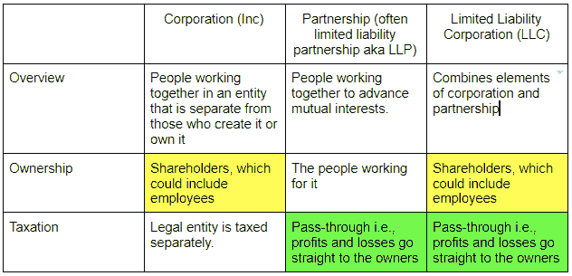

# 合成股权——对创业公司的利与弊？

> 原文：<https://medium.datadriveninvestor.com/synthetic-equity-pros-cons-for-startups-e9a29e3025f1?source=collection_archive---------25----------------------->

在美国，有限责任公司是一个新现象——怀俄明州在 1977 年率先成立，美国国税局在 1988 年发布了全面的税收规则，到 1996 年，所有 50 个州都有了有限责任公司法规。按照定义，有限责任公司几乎是公司和合伙企业的混合体，既有优势(如税收)，也有劣势(如无法发行期权)。这就是“合成股权”发挥作用的地方，作为有限责任公司补偿员工的一种越来越普遍的方式。但是在我们关注这个问题之前，本文将从一些基本的定义开始。

**1)基本定义**

有许多方法来组织你的业务，下面是一个非常非常简单的表格:

同样，上面的高层次总结有很多错综复杂的地方。例如，上面的描述最具体地适用于最常见的变体，称为 C 公司。如果你满足某些(严格的)标准，你可以成为 S 公司，这实际上是通过征税。还有一个 B 公司，这是一个关于社会和环境绩效的认证。

**2)为什么创业公司是有限责任公司？**

虽然大多数创业公司都是有限责任公司，但有很好的理由成为有限责任公司，因为它基本上可以节省你的金钱和时间。关于第一个话题，如果你有一个股份有限公司，你和你的实体都将被国税局征税，但如果你有一个有限责任公司，它将被征税更像一个独资企业。你还可以保护你的资产免受公司诉讼，这在公司的早期阶段尤其有用。关于第二个话题，有限责任公司很容易建立，进行修改，还允许你选择一个位置。在你的主要业务州建立你的实体通常是有意义的，但是在有些情况下，你可能想以其他方式或额外的方式建立你的实体。例如，特拉华州以非常友好的商业法律而闻名，如果你经营一家医疗保健公司，你可能需要在你经营的每个州都有一个实体。

**3)激励计划**

有限责任公司没有员工持股计划，所以所有关于期权和股票的讨论都被排除在外。那么，有限责任公司怎么还能给员工股份呢？最常见的方式是给他们分红。它本身不是股份，而是一段时间内有限责任公司价值增长的一部分，可能包括授权时间表。同样，有限责任公司可以提供增加成员的权利，而不是提供利润。最后，可能最简单的方法是发行幻影股。从法律上来说，这不是一份股份，而是模拟的一份股份，员工在支付时缴纳所得税，本质上将其视为奖金。

**4)合成股权——利弊**

对员工的好处应该是不言而喻的——股票通常比现金更能激励员工。有限责任公司的好处是没有额外的所有者，因为即使你这样对待员工，他们也没有投票权，如果他们离开，也不能保留股票，而且没有二次销售的麻烦。然而，面临的挑战是有限责任公司需要支付最终交易的成本，这对于一家经营不善的公司来说是不可行的。同样，在资产负债表中，它们被记为负债，而不是权益。最后，考虑到大多数创业公司仍然是公司，向当前和未来的雇员解释这一切是很重要的。

*原载于* [*数据驱动投资人*](https://www.datadriveninvestor.com/2021/01/24/synthetic-equity-pros-cons-for-startups/) *，《我很乐意在其他平台上辛迪加。我是*[*Tau Ventures*](https://www.linkedin.com/pulse/announcing-tau-ventures-amit-garg/)*的管理合伙人和联合创始人，在硅谷工作了 20 年，涉足企业、创业公司和风险投资基金。这些都是专注于实践见解的有目的的短文(我称之为 GL；dr —良好的长度；确实读过)。我的许多文章都在*[*https://www . LinkedIn . com/in/am garg/detail/recent-activity/posts*](https://www.linkedin.com/in/amgarg/detail/recent-activity/posts/)*上，如果它们能让人们对某个话题产生足够的兴趣，从而进行更深入的探讨，我会感到非常兴奋。如果这篇文章有对你有用的见解，请评论和/或给文章和* [*Tau Ventures 的 LinkedIn 页面*](https://www.linkedin.com/company/tauventures) *点赞，感谢你对我们工作的支持。这里表达的所有观点都是我自己的。*