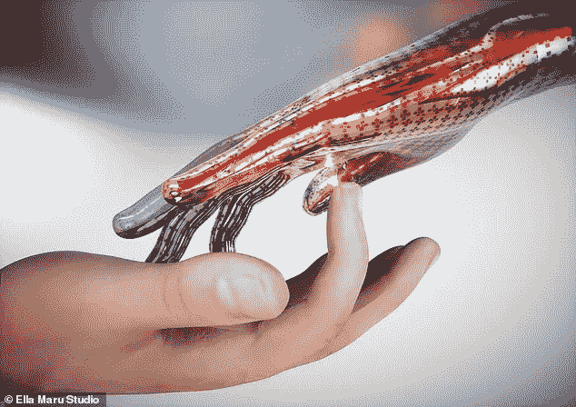

# 人造皮肤设计

> 原文：<https://medium.datadriveninvestor.com/synthetic-skin-designed-28ae9c88e296?source=collection_archive---------20----------------------->

澳大利亚 RMT 大学的科学家创造了一种合成电子皮肤，它对疼痛的反应与人类皮肤相同。

寻找一种模拟人类对疼痛反应的方法一直是研究人员的目标，现在他们希望这项新发明将有助于在未来创造逼真的假肢和改善皮肤移植。

电子皮肤利用触发即时反应的电信号来复制人类神经对疼痛刺激的反应。

该项目的首席研究员 Madhu Bhaskaran 教授表示，该原型是下一代生物医学技术和智能机器人技术的重大进步。

 [## AI 和医学影像创业公司？6 大趋势|数据驱动的投资者

### “IBM Watson 健康成像”是医疗保健的未来吗？谷歌详细说明了人工智能对胸部 x 光的分类…

www.datadriveninvestor.com](https://www.datadriveninvestor.com/2020/08/30/ai-and-medical-imaging-startups-6-key-trends/) 

“当压力、热量或寒冷达到令人痛苦的阈值时，我们的人造皮肤会立即做出反应”

这项最新研究是未来开发复杂反馈系统和交付智能假肢的关键一步。

这项研究发表在《高级智能系统》杂志上，该设备注册为临时专利。

这种痛觉皮肤是该团队之前创建的三个原型设备的组合，热刺激(红色云)和压力(蓝色云)一起工作，以创建电流来模拟人类由疼痛触发的神经。

一个是使用可拉伸电子设备的结构开发，尽管它是透明和薄的，但它为材料提供了强度。

其他的是比人的头发薄 1000 倍的涂层，对热量和电子记忆细胞做出反应，模仿大脑保留先前潜在危险信息的方式。

第三个成功地整合了所有三种技术。

巴斯卡兰说:“我们基本上创造了第一个电子体感器，复制了人体复杂的神经元系统、神经通路和受体的关键特征，这些系统驱动我们对感官刺激的感知。”

“这意味着我们的人造皮肤知道用手指轻轻触摸一根针或意外用它刺伤自己之间的区别——这是一个重要的区别，以前从未通过电子技术实现过。”

**进入专家视角—** [**订阅 DDI 英特尔**](https://datadriveninvestor.com/ddi-intel)