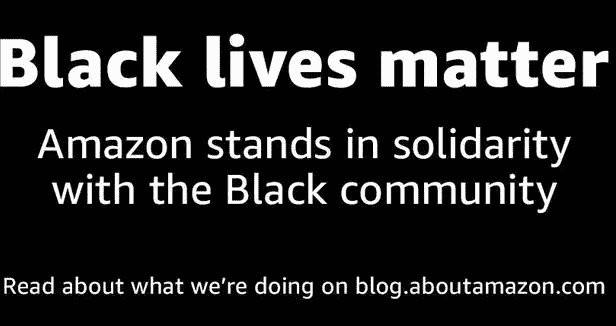
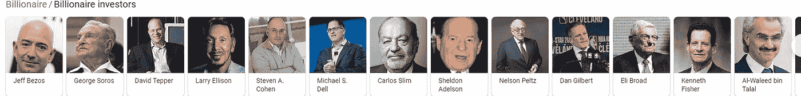

# 系统性种族主义有利可图。股权不是。

> 原文：<https://medium.datadriveninvestor.com/systemic-racism-is-profitable-equity-is-not-fca84663c5a8?source=collection_archive---------3----------------------->

## 为什么你的公司满足于不冷不热的团结声明

Photo by [Christian Wiediger](https://unsplash.com/@christianw?utm_source=medium&utm_medium=referral) on [Unsplash](https://unsplash.com?utm_source=medium&utm_medium=referral)

4 月 15 日，数以百万计的美国人在 T2 填写个人联邦纳税申报表，屏住呼吸，看看他们是否有欠款或得到退款。如果他们得到退款，他们通过购买他们最大的需求过着奢侈的生活:一个新的水槽，一辆二手车，一夜的休息，通过偿还债务/支付教育费用获得社会流动的机会…如果他们有欠款，他们会勒紧腰带，开始支付计划，寻找兼职，推迟社会流动的机会。

美国最大的公司在 4 月 15 日的表现比我们任何人都要好。大多数人不欠他们从所有美国同胞身上获得的数十亿利润。2018 年[没缴税的有哪些？巨型亚马逊、流媒体教父网飞、达美航空和霍尼韦尔国际。我们以亚马逊为例。](https://publicintegrity.org/inequality-poverty-opportunity/taxes/trumps-tax-cuts/you-paid-taxes-these-corporations-didnt/)

Statement of Solidarity that You Can Assume Is Meaningful without Having to Click Through and Read Any Policy, Reports, Legislation, Etc….

作为对亚马逊黑人的命也是命声明的回应，杰夫·贝索斯说他收到了许多类似这样的煽动性邮件:

戴夫写道:“当我发现你支持黑人的命也是命的声明时，我正在向你的公司下订单。“坚持你的立场，我们会看着你的利润下降并对此一笑置之。我和你的业务关系已经结束了。”

杰夫·贝索斯的回应可以归结为:“你是那种我很乐意失去的客户。”

听起来很棒，对吧？巨大的巨人有一颗心。毕竟，企业价值观是美国经济的支柱。不完全是。像许多其他公司一样，亚马逊最近在社交媒体上采取了空洞的立场，原因只有一个:**它目前的公关很好。**在当前的环境下，说黑人的命也是命不再激进。这是应该做的“正确的事情”。就像耐克支持科林·卡佩尼克一样，当这个品牌主要受到有色人种和自由派进步人士的支持时，数学是有意义的。这为他们赢得了顾客。

然而，亚马逊的资金踪迹并没有给黑人和棕色人种的生活带来衷心的政治和经济支持，而是导致了亚马逊出售给警察部队的面部识别软件。2018 年，美国公民自由联盟发现，这个软件不成比例地错误识别了来自国会的有色人种，并将他们与被捕者的照片进行了匹配。

 [## 保护主义、政治和经济动荡|数据驱动的投资者

### 美国股市昨日出现 400 多点的大幅反转，为未来的事情发出了警告信号。市场…

www.datadriveninvestor.com](https://www.datadriveninvestor.com/2018/06/28/protectionism-politics-economic-turmoil/) 

当你向 ICE 出售虚拟主机服务，与当地警方合作提供监控，报复那些为改善工作环境而组织起来的少数族裔工人，解雇并诽谤一名带头指控的前雇员，无视种族平等评估的推动，无视为我们的气候减少污染的呼吁时，我有消息要告诉你。面包正在成型。

2017 年，减税和就业法案本来可以成为一个巨大的机会，帮助低收入和中产阶级的有色人种积累财富，并开始缩小世界亿万富翁和我们其他人之间的经济差距。相反，国会在制定和立法该法案时反其道而行之，将 190 万美元的大部分用于为富人和数十亿美元的公司提供大量税收优惠的政策。

平均而言，每年约有 30 家公司申报的美国税收为零或更少。ITEP 发现，2018 年声称没有欠美国税的公司数量增加了一倍多。这只是最近的一个结构性种族主义的例子，它支撑着我们的政府、法律和经济政策。*是的，肯定有有色人种的亿万富翁，别担心，我很快就会写下他们。*但如果只是随机搜索亿万富翁投资者呢？你会得到这个的。

Looks about white.

《福布斯》2020 年亿万富翁排行榜从*开始，“地球上最富有的人也不能对冠状病毒免疫。”*人们死于冠状病毒、贫困、种族主义和绝望，而你呢？世界亿万富翁？你比 2019 年下降了 7000 亿美元？他妈的呜呜呜。去拿。出去。的。给你。与。那个。一团糟。

“现在繁荣和税收与经济政策研究所新发布的一份报告， [*种族、财富和税收:减税和就业法案如何加剧种族财富差距*](https://prosperitynow.org/resources/race-wealth-and-taxes) ，发现 TCJA 不仅给日益严重的整体经济不平等问题增加了不必要的燃料，而且还加剧了已经巨大的种族财富差距，达到了惊人的程度。”税收和经济政策研究所

那么，为什么如此多的公司最终做出这些半心半意，不冷不热的立场，并在他们的社交媒体频道上弹出黑屏广场，而他们的商业模式恰恰否定了经济和可操作的正义的呼吁？简单。

> 在美国，如果我们能从中赚更多的钱，我们什么都愿意说。

系统性的种族主义非常有利可图，推动公平是痛苦的。昂贵。清算的成本总是比你想象的要高。通俗地说，我们需要不舒服。你可能认为你知道这些，但是你完全接受了吗？

你的 CEO 会不舒服。你的捐赠者会不舒服。
你的板子会不舒服。
你的领导会不舒服。
你的利益相关者会不舒服。

做好准备，面对不适、呼吁、尴尬、痛苦、艰难的决定，承认你或你的公司在这个问题上有所贡献，并从法律和财务上不公平的政策中受益。付给一个公关实习生写其他公司的声明很容易。安全。

它让这些公司赢得了声誉，而无需他们深入挖掘并向我们展示他们的董事会或财务状况。没有工资透明度。没有解决种族主义的根本原因，导致他们的许多底层员工是黑人和棕色人种。不改变任何劳动法。没有向任何救助基金捐款。没有支付任何赔款。而没有以任何有形的方式投资于一个公平的社会。

真的吗？一份社交媒体声明，听起来与“这三句话可以抹去我们多年的种族主义政策”一样深感关切，略带歉意，但充满希望，应该就足够了吧？他们希望如此。不是的。

如果你的公司发表黑人的命也是命声明？那是最低限度。

当他们开始处理痛苦和政策的时候叫醒我。

**访问专家视图—** [**订阅 DDI 英特尔**](https://datadriveninvestor.com/ddi-intel)