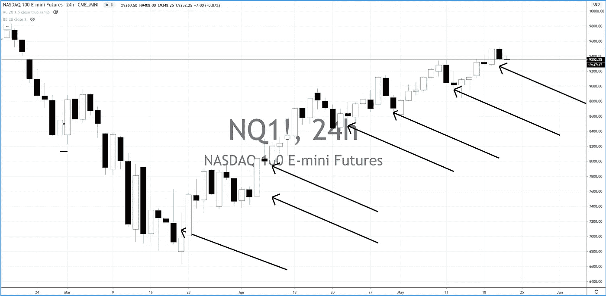
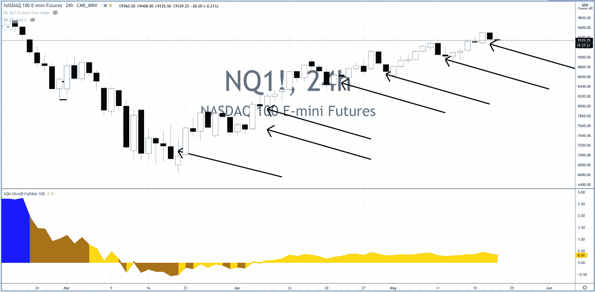

# 系统交易与价格行为

> 原文：<https://medium.datadriveninvestor.com/systems-trading-vs-price-action-f98fd60213bf?source=collection_archive---------10----------------------->

# 每种技术在 CoVid19 市场危机后的表现如何

我最近一直在进行大量的讨论，为什么我一直把目前的牛市称为平静的市场机制，嗯，平静的市场机制。什么是市场机制？

需要说明的是，一个多月来，我一直将目前的市场(股票指数)称为牛市安静状态，非常欢迎你尝试一下我上个月在 YouTube 上做的直播，看看我的想法

https://youtu.be/uOPEuOuN4HA

【https://youtu.be/vnh-yIWQ6ec 

[https://youtu.be/o9MGZ7x1z1w](http://email.c.kajabimail.net/c/eJwdTs0OwiAYe5pxMSF8wAfuwGHEn3jw5M2LYQMdOp2ZTJ1PL5o0aZsmbb1B9L4m0XDGGUOeSSDXFOgSSmuXFqSVbFFVtpCsoRd3dnW8utjRW0ikNXNUTIbgyhJg7qQC4Y6oHWqVjeCCdKZN6f4oRFXwVcbUj2mkdciyL7frvX7DB14k_DoPPnTxGYbpEL0BRKEkKq7JYJp2iA_f5yzfOP33m_5KktnFFGabRcGFAgXyC70UPOo)

[https://youtu.be/d_cYAWhUAOE](http://email.c.kajabimail.net/c/eJwdjr0KwjAAhJ-mWYSQ_9ohQ0IrODmIiFPJX220tdKmQt_eKBzcwcHd5yXn3lsQJUEEIU6yUU5KiGGDK60bjZlmqFZKFww5-DQPY-No4gBfIYFeOmaZ43RvsMBdaSndI-Gd6SojRGkrCgbZp_ReCqoKcsjapjWt0IYcfetu6tpf1KkB4bfZ-jDET5i3NnqJOaeCcUFKMEvXz3HxU-4yxv3_76YRJHmOKeyOdUGoyATsCyGcPbo)

[https://youtu.be/sr7eifUntow](http://email.c.kajabimail.net/c/eJwdjssKwjAURL-m2QghN89mkUWDCq7FtSTN1UarlTYq_r1RGJiBAzOTnFIpRZIdZ5wxxasJxQ0FugHr_caD9JKtu843kvX0Gi4h5lvII71jIYNjWto2Wt0zAzaK1sTQMqviKQAgb5GMbijlsTSia_i26jM9y5NGrHGZDebT4V6mN8Ff5zHhmF84f445OVBKaKk0N2R2_TDnJU2V1Rvn_34_3Uhx-1xwtVs3XGjQIL8oLj4l)

最重要的一点是，市场日复一日地在$NQ 和$QQQ 上展示这些惊人的卖出设置，却只能看到它们被叫停，价格上涨。

事实上，最大的启示是那次重大低点的力量逆转，当时世界正处于最悲观的时期，全球央行大举介入。

作为这里的系统交易者，我们不关心导致它的新闻，但需要一些价格行为知识来理解那里正在发生什么。

如果没有别的，这可能是尊重价格告诉我们什么，相对于指标告诉我们什么有多重要的最佳表现之一。

我总是指出，SQN 是一个滞后指标，需要很长时间才能让船转向 SQN，但当它转向时，通常是一帆风顺的。目前,$NQ 的 SQN 仍未进入牛市平静期，然而市场交易却呈现出教科书般的牛市平静特征。

公牛安静的特征是什么？第一个特征是市场印出了最悲观和最完美的卖出设置模式，它失败了，一次又一次的卖出设置。

仅在图表上，就有 8 个，算上 8 个，漂亮卖出设置。这 8 个人都在 Twitter、美国消费者新闻与商业频道和彭博新闻上(更不用说 ZeroHedge 了，但这是一个注定失败的原因)一遍又一遍地呼吁市场见顶和“熊市第二回合下跌”。却一次又一次地大错特错。

我心爱的 SQN 指标错过了，差很远。

这就是为什么指标仅仅是有帮助的。他们在那里是为了把事情放在上下文中，但不是我们想要的圣杯。

然而，FVBO 策略已经连续三次做空。这就是我们如何明智地使用指标。

我们让市场机制(SQN)告诉我们，我们正处于一个中性的机制中，因此根据我们的回溯测试，我们知道 FVBO 策略是目前为止在这个机制中交易的最佳策略。

所以我们等待一个 FVBO，做多或做空，接受它，并以+1.4R 获利

3/3 = +4.5R

我们还知道，我们可以大幅估算这一交易，在横向交易中使用 FVBO 的风险为 5%至 10%(根据 SQN)。

因此，虽然价格波动是王道，但我们可以在 1%的风险下做多，或者我们可以等待 FVBO 设置，并建立庞大的头寸。

两者都是非常低干预的策略，因为我们不需要做很多工作，只是让它们发挥出来。

价格行动方法很好，因为我们可以在每次回调时继续加仓，不用太担心被止损，因为我们知道市场只会继续上涨，让空头看起来像白痴一样，日复一日。

FVBO 的方法很好，因为我们只需要坐以待毙，等待一个设置，进入它，然后无情地获利，知道我们是逆势交易，我们需要击中它，退出它！

我希望这是有用的