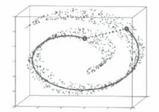
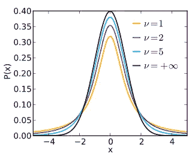
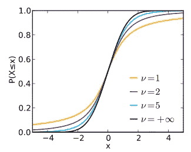
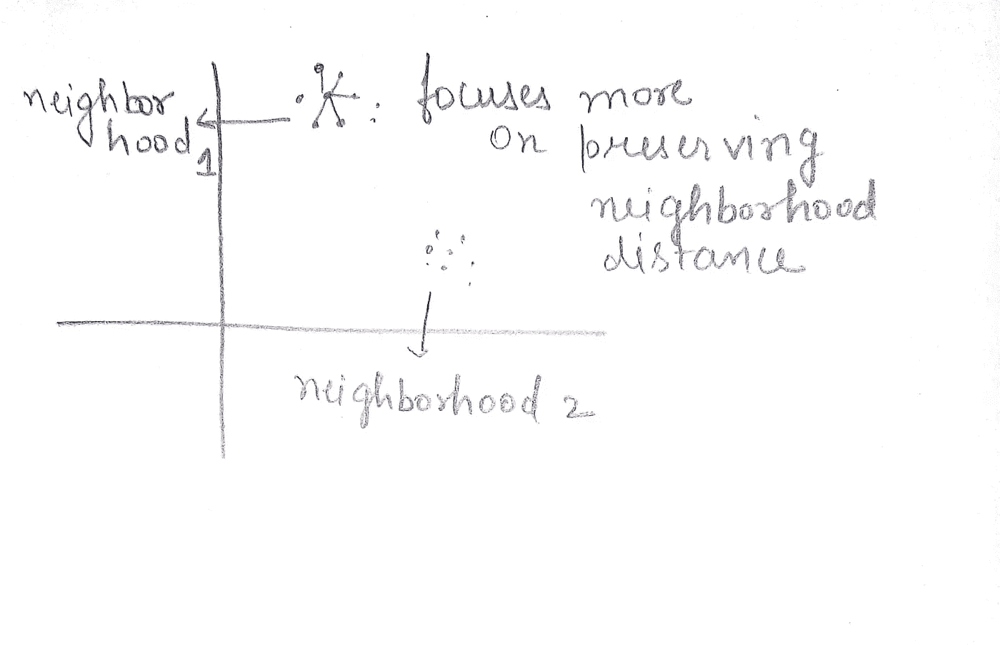

# T-SNE(T-分布式随机邻域嵌入)

> 原文：<https://medium.datadriveninvestor.com/t-sne-t-distributed-stochastic-neighbourhood-embedding-4112e9c1232f?source=collection_archive---------2----------------------->

还记得你上一次处理有高维数据的**机器学习**问题或任何常见的 NLP 任务时，你对文本进行了矢量化处理，得到了大维度。**你刚刚做了什么？**大多数人会说他们只是降低了维度。他们只是在谷歌上搜索了 StackOverflow 或机器学习大师的 3-4 行代码，然后在没有正确了解它的情况下使用了它。

但是理解工作是**专家做的事情。仅仅使用代码并不是每次都能奏效，尤其是当你要从事任何基于研究的项目时。**

在我的上一篇博客中，我写了降维及其必要性。我还解释了主成分分析，即降维的基本算法之一。所以这篇博客期望对降维有一个总体的了解，它的需求和所有的一切。

今天我将介绍**T-分布式随机邻居嵌入(t-SNE)** ，这是一种最先进的降维算法。

但首先，让我们了解 PCA 和 t-SNE 之间的基本区别。

# PCA 和 t-SNE 的区别。

PCA 是起源于 1901 年的一种相当基本和古老的技术。而 SNE 霸王龙是 2008 年才出现的新生事物。

PCA 的目的之一是降低你的维度，捕捉你的数据的全局结构。然而，从 PCA 目标函数中，我们知道 PCA 只能捕获特征中的线性结构。t-SNE 算法以非常不同的方式工作，并且专注于在到低维数据的一些映射中保持高维数据的局部距离。

 [## 将定义 2020 年就业前景的五大数据科学和机器学习趋势|数据驱动…

### 数据科学和 ML 是 2019 年最受关注的趋势之一，毫无疑问，它们将继续发展…

www.datadriveninvestor.com](https://www.datadriveninvestor.com/2020/02/19/five-data-science-and-machine-learning-trends-that-will-define-job-prospects-in-2020/) 

PCA 将无法找到这条非线性(实线)路径，但是如果我们只关注沿着最近的点，看起来您会找到实线所示的路径。

所以重要的是-

→ PCA 试图**保留数据的全局形状**，而 t-SNE 则更注重保留数据的局部结构**。**

**→全局只是指任何图形的完整形状。而局部主要指主图中的小簇。**

> **在讨论这个算法之前，我想你必须对 t 分布有所了解。**

# **什么是 t 分布？**

**也称为学生 t 分布，它与正态分布一样，是对称的钟形分布，但尾部较重，这意味着它更容易产生远离平均值的值。尾部的粗细由称为自由度的参数决定，较小的值表示尾部较重，较大的值使 t 分布看起来类似于均值为 0、标准差为 1 的标准正态分布。**

******

Probability density and Cumulative distributed function for Student’s t** 

# **什么是 SNE 霸王龙？**

****T-分布式随机邻居嵌入(t-SNE)** 是由 [Laurens van der Maaten](https://en.wikipedia.org/w/index.php?title=Laurens_van_der_Maaten&action=edit&redlink=1) 和 [Geoffrey Hinton](https://en.wikipedia.org/wiki/Geoffrey_Hinton) 开发的用于[可视化](https://en.wikipedia.org/wiki/Data_visualization)的[机器学习](https://en.wikipedia.org/wiki/Machine_learning)算法。这是一种[非线性降维](https://en.wikipedia.org/wiki/Nonlinear_dimensionality_reduction)技术，非常适合在二维或三维的低维空间中嵌入用于可视化的高维数据。具体而言，它通过二维或三维点对每个高维对象进行建模，以这种方式，相似的对象通过附近的点进行建模，而不相似的对象通过远处的点以高概率进行建模。**

**这就是维基百科页面上关于 SNE 霸王龙的内容。该算法有两个要点。**

1.  **这是一种非线性降维算法。**
2.  **它的工作方式是，相似的对象由附近的点建模，不相似的对象由远处的点建模的概率很高。**

**所以它的名字 SNE 霸王龙听起来可能有点太专业了。但是我们会很直观的理解。这是一种专门为可视化目的而构建的降维算法。并且在无监督学习中被大量使用。还有其他技术，如多维标度(MDS)、Sammon 映射等。**

# **-邻居，嵌入？**

****邻域**直观地说，**点**的**邻域**是包含那个**点**的一组**点**，在这里可以从那个**点**向任意**方向移动一定量，而不会离开**集合**。在这里，您可以将集合引用到不同的集群，这些集群引用任何分类任务中的不同类。****

**插入邻居的图像**

**嵌入是一个特殊的术语，简单地说就是将输入投射到另一个更方便的表示空间。**

**想象一下，我们在 d 维空间中有任何数据，我们只想将其可视化为 2d。**

**设 d 维中的点表示为 x(i ),因此对于 d 维空间中的每个点 x(i ),我们必须在 2d 空间中的 x(i)虚线中找到它的对应点。这样的事情叫做嵌入。因此，基本上在高维空间中选取一个点，并将其放置在低维空间中，这就是所谓的嵌入。**

# **几何直觉**

**该算法背后的几何直觉是，它专注于保持一个点的邻居的距离，而不在邻居中的点可以被放置在低维空间中的任何地方。**

****

**如上图所示，我们可以看到两个局部聚类，t-SNE 算法更注重保持局部聚类的距离。就像它保留了邻域 1 和邻域 2 中的点之间的**距离**，但是当一个点在第一个邻域中而另一个点在第二个邻域中时，它不会保留两个点之间的距离**。****

*****我们可以说它产生了邻域保持嵌入*** 。**

# **拥挤问题**

**因为 SNE 霸王龙试图保持邻居之间的距离，但这也可能产生问题。**

> **你自己先试着想想？？🤔**

**让我们尝试将一个二维集群映射到一维集群。把二维地图当成正方形的角。设正方形有 a，b，c，d 4 个角。当你试图保持邻里距离时。如果你为 a-b，b-c，c-d 这样做，那么你将不能为 a-d 保存它。这里出现了一个问题，叫做**拥挤问题。****

**更正式地说，当我们从高维映射到低维时，不可能保持所有的邻域距离，这被称为**拥挤问题****

> **那么什么有助于解决拥挤问题呢？？**

**答案是 **t** 。是的， **t 分布函数**。这有助于在创建嵌入时保持最大可能的邻域距离。它是如何工作的超出了这篇博文的范围。我会包括很多优化和统计操作。**

# **它是如何工作的？**

**为了更直观地了解它的工作原理，我建议您访问一下这里的并尝试不同的参数，熟悉它的工作原理。**

**t-SNE 是一种迭代算法，最终，它希望达到嵌入的最佳阶段，保留最大可能的距离。两个主要参数是**步长**和**困惑度**。**

****步长**由于 t-SNE 是一种迭代算法，因此步长是控制最大迭代次数的参数。默认情况下，它是 1000。当与 SNE 霸王龙一起工作时，你必须尝试几个值才能得到好的结果。**

****困惑度**指的是您希望保持这些点之间距离的邻居的数量。也就是说，如果我们假设困惑度= 5，那么对于每个点，该算法将保持其前 5 个邻域点的距离，并将留下其他点。你必须在训练时尝试不同数量的困惑值，但是**永远不会**让它**等于数据点的数量。****

# **密码**

**TSNE 是一种迭代算法，在给定的数据上进行训练需要相当长的时间。所以首先需要的是耐心。**

**下面给出的代码很好理解。你不能做的一件事是只尝试一个困惑和迭代值。你需要一次又一次地和它们一起玩，并把数据可视化，以充分利用 SNE 霸王龙。**

**n_components 是指要减少的维数**

# **结论**

**t-SNE 如此受欢迎是有原因的:它非常灵活，经常能找到其他降维算法找不到的结构。不幸的是，正是这种灵活性使得解释起来很棘手。在用户看不到的地方，算法会进行各种调整，整理其可视化效果。**

> **希望你理解得很好😊**

**在那之前，祝你学习愉快，保持安全！！**

**如果你喜欢，请鼓掌👏👏。**

****也请看看我以前的博文。****

**[**主成分分析降维**](https://medium.com/analytics-vidhya/principal-component-analysis-for-dimensionality-reduction-432e718beed?source=your_stories_page---------------------------)**

**[**Yolo 物体检测变得容易**](https://medium.com/analytics-vidhya/yolo-object-detection-made-easy-7b17cc3e782f?source=your_stories_page---------------------------)**

**[**P 值、T 检验、卡方检验、ANOVA，什么时候使用哪种策略？**](https://medium.com/@2017167/p-value-t-test-chi-square-test-anova-when-to-use-which-strategy-32907734aa0e?source=your_stories_page---------------------------)**

**[**了解数据科学的假设检验**](https://medium.com/@2017167/understanding-hypothesis-testing-for-data-science-df952bbc1ef9?source=your_stories_page---------------------------)**