# 初学者 Tableau 教程

> 原文：<https://medium.datadriveninvestor.com/tableau-tutorial-for-beginners-43483adf719?source=collection_archive---------0----------------------->

## Tableau 数据可视化完全初学者指南

Photo by [Daniel Korpai](https://unsplash.com/@danielkorpai?utm_source=unsplash&utm_medium=referral&utm_content=creditCopyText) on [Unsplash](https://unsplash.com/t/technology?utm_source=unsplash&utm_medium=referral&utm_content=creditCopyText)

> 一幅画最大的价值是当它迫使我们注意到我们从未期望看到的东西。

# 什么是 Tableau？

Tableau 是商业智能行业中使用的一个强大的数据可视化工具。它有助于将原始数据简化为易于理解的格式。

使用 Tableau 分解复杂的数据并生成有价值的见解要容易得多。这些见解可以被公司用来制定数据驱动的决策。

# 为什么是 Tableau？

有了大量的数据分析和可视化工具，为什么还要选择 Tableau 呢？

1.  Tableau 允许你**快速**创建强大的可视化效果。在 Excel 中创建同样的图表需要几十分钟，而你只需几秒钟就能完成。
2.  Tableau 使用了可视化科学领域的**最佳实践**。你的数据会以外行人容易理解的方式展示出来。
3.  你可以在 Tableau 中制作**交互式仪表盘**，任何人都可以点击并摆弄它，从数据中获得洞察力。
4.  Tableau 最吸引人的一点是，你不需要知道如何编写代码来使用它。学习 Tableau 不需要任何技术背景或编程经验。

Photo by [Adeolu Eletu](https://unsplash.com/@adeolueletu?utm_source=unsplash&utm_medium=referral&utm_content=creditCopyText) on [Unsplash](https://unsplash.com/s/photos/data-science?utm_source=unsplash&utm_medium=referral&utm_content=creditCopyText)

由于这些原因，Tableau 吸引了来自不同领域的人们的兴趣，比如商业分析师和研究人员。

# **还不服气？**

让我用一个例子来展示 Tableau 中的数据可视化是多么强大。

几周前，我的大学教授给了我们一项任务。我们必须在同一个数据集上运行多个机器学习模型，并比较它们之间的性能。

## 为了说明这种比较，我决定使用 Python 中的几个**库:**

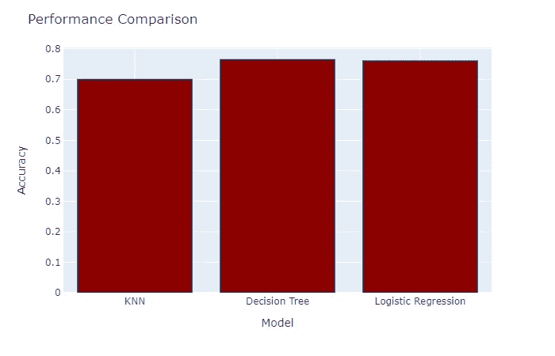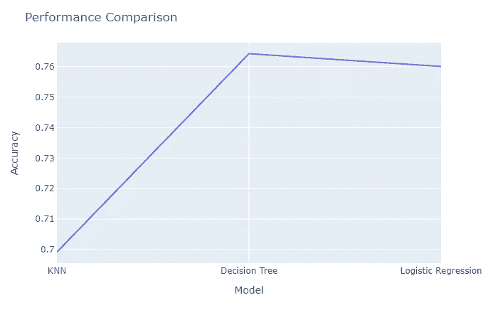

这些图表还不错。

然而，在任务截止日期之前，我仍然有一些空闲时间，所以我决定摆弄数据，并尝试一些其他的可视化工具。

## 在短短几分钟内，这里是我在 Tableau 中创建的一些图表:

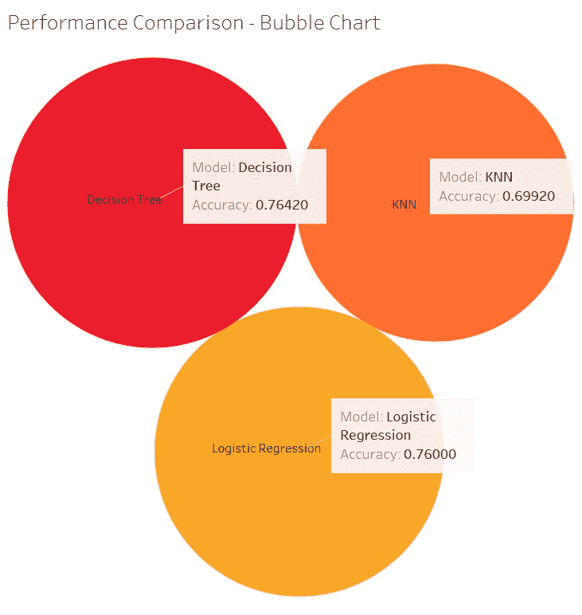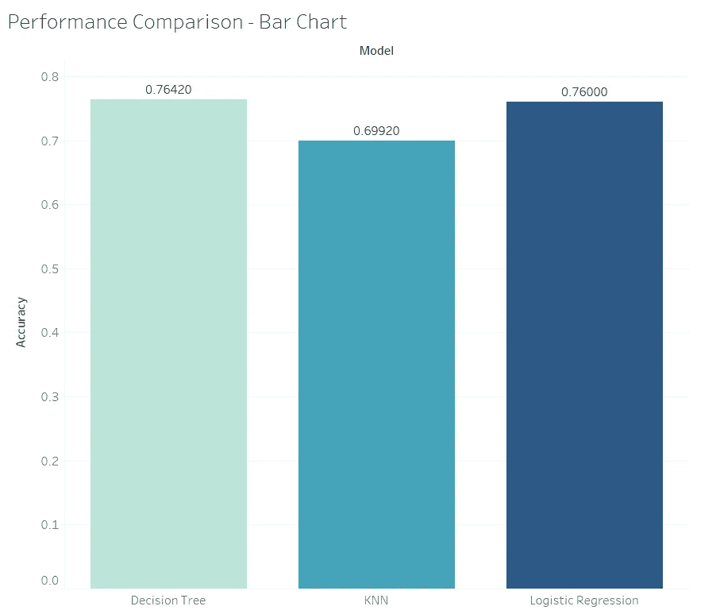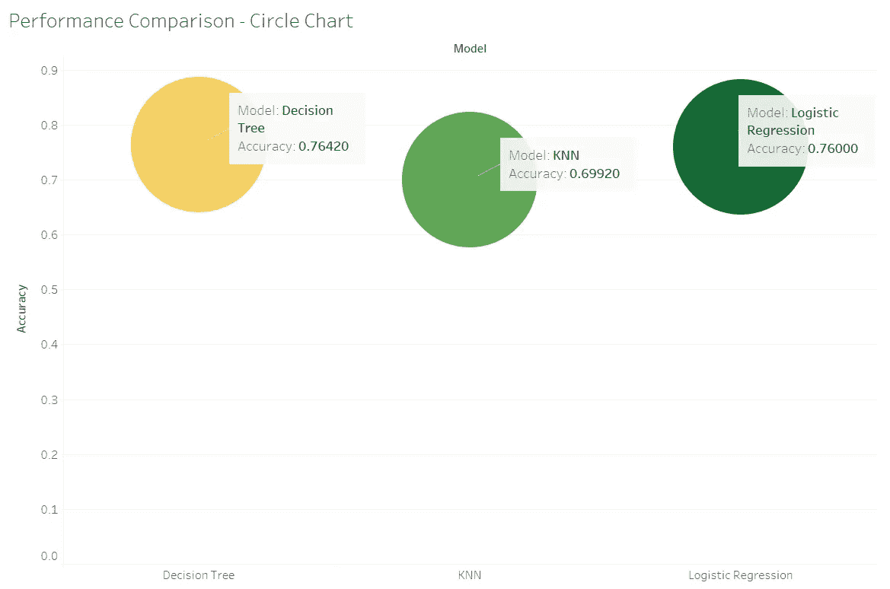

我用 Python 创建的前两个图需要大约 15 行代码来生成。

我只用了大约 5-10 分钟就在 Tableau 中创建了类似的图表。

如果你没有什么编程经验，Tableau 将是你完美的数据分析工具。

您可以从一组复杂的数据中创建简单的可视化，并以可理解的格式呈现给其他人。

现在，我将向您展示 Tableau 的基础知识——如何在数据中找到趋势，回答数据问题，并通过可视化来讲述故事。

遵循本指南中的步骤不需要以前的数据分析或编码经验。

在我们开始使用 Tableau 之前，本教程将带您了解数据可视化的基础知识，以及一些简单的统计分析。

在学习任何可视化数据的分析工具之前，记住这些技术是非常重要的。您可以将这些技巧应用于您正在处理的任何现实生活场景或数据集。

所以，拿一杯咖啡，拿起纸和笔，边走边记笔记吧！

如果你想更深入地研究数据分析领域，我还会在最后列出一些额外的学习资源供你探索。

> 培养学习的热情。如果你这样做了，你将永远不会停止成长。

# 第一步:数据

我们将在本教程中使用的数据集是 [Kaggle 的泰坦尼克号数据集](https://www.kaggle.com/c/titanic)。下载 [train.csv](https://www.kaggle.com/c/titanic/data?select=train.csv) 文件，保存为 Excel 工作簿。

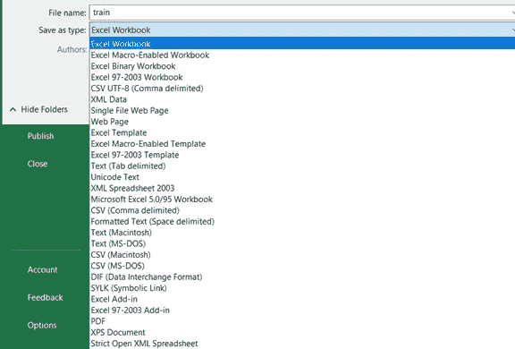

Save train.csv as an Excel workbook

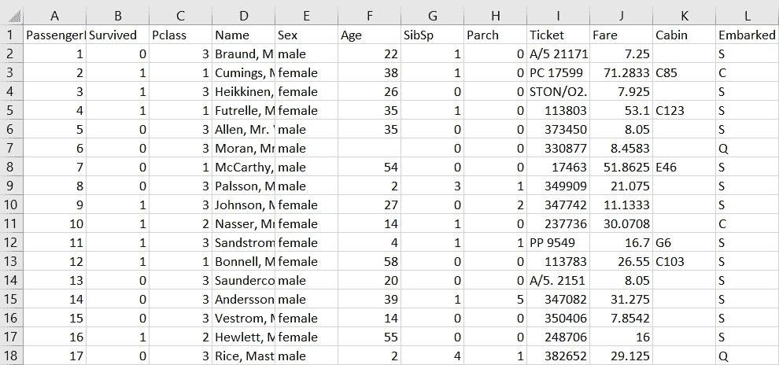

The data

这个数据集中有 12 个变量。以下是一个概述:

1.  **乘客 Id:** 每位乘客的唯一 Id
2.  **Pclass:** 客运类；第一、第二和第三。第一个是上层阶级，第三个是下层阶级。
3.  **名称**
4.  **性**
5.  **年龄**
6.  **SibSp:** 在编兄弟姐妹和/或配偶人数
7.  **Parch:** 船上父母和/或子女人数
8.  **车票:**车票号码
9.  **票价**
10.  **小屋**
11.  登船:登船港
12.  **幸存:**是否有乘客在泰坦尼克号上幸存。值 1 表示乘客幸存，值 0 表示他们没有。

## 数据问题

任何数据科学家都会告诉你，进行数据分析最重要的部分是在头脑中有一个数据问题。

你想用这些数据回答什么问题？你想解决什么问题？有没有你正在寻找的趋势或关系？

对于这种数据分析，我创建了一个简单问题的列表，我们可以通过可视化泰坦尼克号数据集来回答:

1.  ***泰坦尼克号上有多少人幸存？***
2.  哪种性别更有可能在泰坦尼克号上幸存？
3.  乘客所处的阶级对他们的生存有影响吗？
4.  ***年轻人更有可能在泰坦尼克号上幸存吗？***
5.  支付更高票价的乘客更有可能在泰坦尼克号上幸存吗？

在我们进行数据分析之前，了解数据集中变量的类型是很重要的。

使用 Tableau 时，您需要知道**数字变量**(一种度量)和**分类变量**之间的区别。你还需要知道**离散变量**和**连续变量**之间的区别，以及如何将它们可视化。

让我给你解释一下。

## **数字变量:**

顾名思义，数值变量是可以测量的变量。它们也被称为数量变量，以数值的形式出现。

数值变量有两种类型—离散型和连续型。

## 离散变量:

离散变量的值是通过计数获得的。

比如 ***一个罐子里的糖果数量*** 就是一个离散变量。

## 连续变量:

连续变量的值通过测量获得。任何可测量的量，如时间、距离和温度，都是连续变量。

例如 ***一个班学生的身高。***

## 分类变量:

分类变量代表可以分组的数据类型。

例如， ***种族，性别，年龄组***

现在你已经理解了变量类型之间的区别，我们可以进入下一步了。

# 步骤 2:下载并安装 Tableau

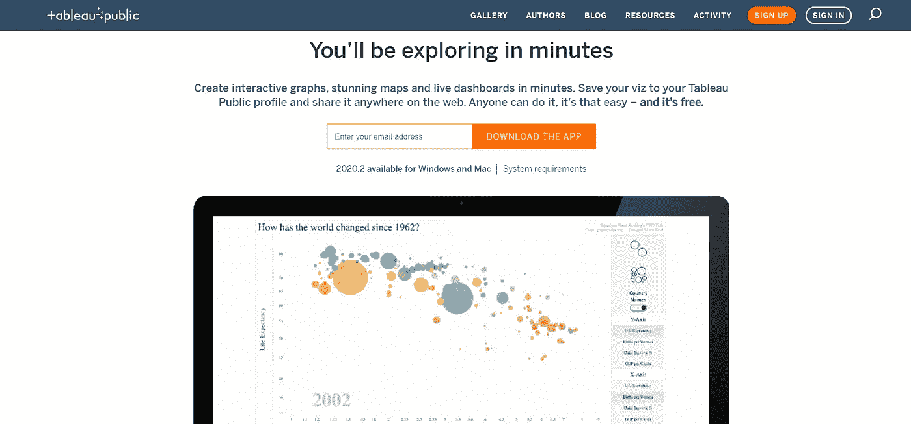

点击[这个](https://public.tableau.com/s/download)链接下载 Tableau Public 并安装到你的电脑上。Tableau Public 是一项免费服务，允许任何人创建交互式可视化。

这是 Tableau 软件的免费版本，允许您使用大多数软件功能。您可以连接到 CSV 文件、Excel 电子表格和文本文档。

但是，您将无法在本地计算机上保存您的工作。您必须保存并从 Tableau Public 访问它。

# 步骤 3:连接数据源

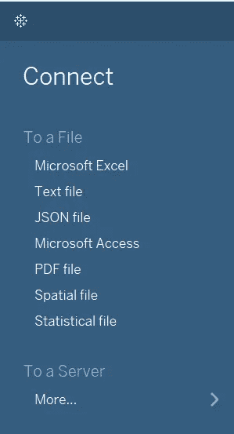

安装完成后，打开 Tableau Public。您将在窗口的左侧看到一个类似这样的窗格。

要连接到我们的数据，请点击 Microsoft Excel。然后，找到我们刚刚创建的 Excel 电子表格并打开它。

您将看到一个如下所示的窗口:

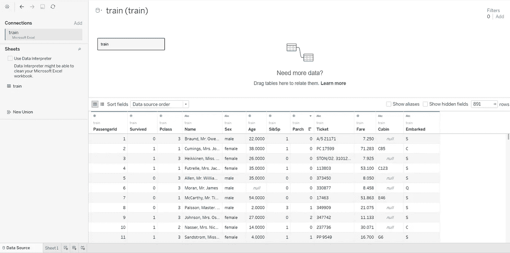

数据已成功加载到 Tableau 中。

# 第四步:数据分析

要开始分析数据，点击屏幕左下角的*表 1* 。

您将看到以下屏幕出现:

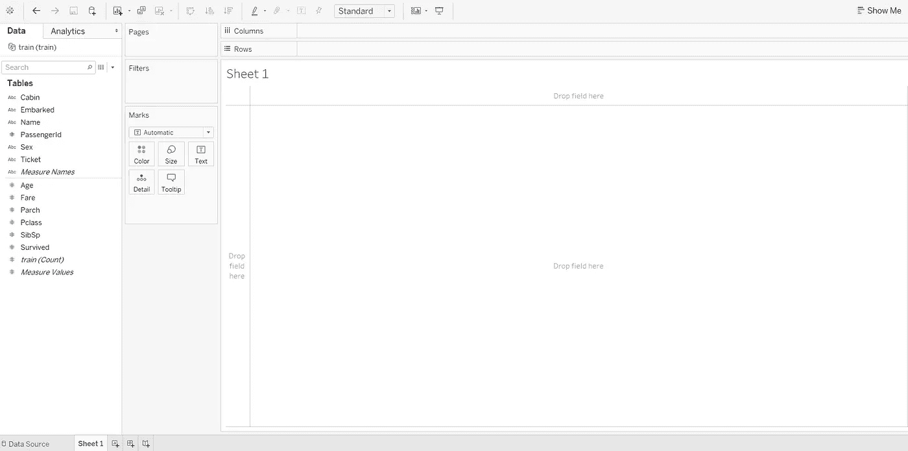

请特别注意数据窗格(在屏幕的左侧)。您将看到不同的变量名。

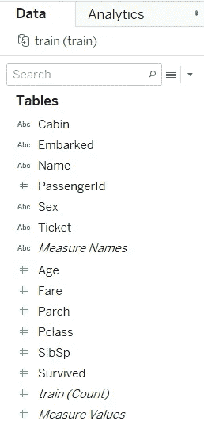

关于 Tableau 对变量进行分类的方式，你需要知道两件事:

## 数据类型

首先，Tableau 给每个变量分配一个数据类型— *字符串、日期时间、小数等。*

查看每个变量并确保数据类型正确是很重要的，因为 Tableau 可能会出错(例如，Tableau 可能会错误地将 Datetime 对象分类为字符串)。

然而，在这种情况下，Tableau 似乎已经为每个变量分配了正确的数据类型。我们不需要在这里做任何更改。

## 度量和维度

Tableau 还将变量分为**度量**和**维度**。

度量是可以聚合或用于数学运算的变量类型。

维度是不能聚合的字段。

您可以将度量视为连续变量，将维度视为离散变量(如果不记得区别，请参考教程的第一步)。

让我们再看一下数据窗格:

窗格上半部分的变量，如“Cabin”和“apolloed”被归类为**维度。**

下半部分的变量，如“年龄”和“费用”被归类为**度量**。

Tableau 可能会错误地将变量指定为维度或度量值。在这种情况下，Tableau 已经这样做了两次。我们需要重新定义这些变量。

我们将再次查看数据集，以确定定义不正确的变量。

幸存的变量 *Pclass* 和*被分类为测量值或连续变量。*

然而，这些变量是离散的。虽然它们是数字，但它们代表一个类别，而不是某种数量。

例如，看一下变量“幸存”值 1 表示一个人在泰坦尼克号上幸存，值 0 表示他们没有。这是一个分类变量。

在开始可视化数据之前，我们需要更改这些错误定义的变量。

要做到这一点，你只需要拖放。点击错误定义的变量，并将其拖至窗格的**尺寸**部分。

完成后，它应该是这样的:

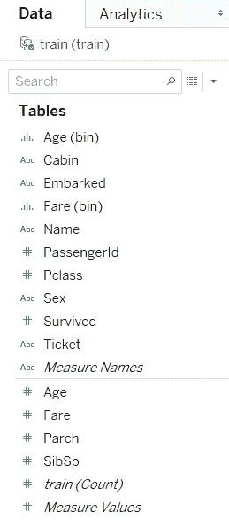

在**测量**部分只有四个变量，其他的都被归类为一个维度。

现在，我们可以从可视化过程开始。

# 步骤 5:数据可视化

## 直方图

我们将从可视化一个变量开始。当可视化数据集中一个数值变量的分布时，使用直方图。

1.  首先，我们将可视化变量“年龄”的分布

为此，我们首先需要创建年龄组的箱或区间:

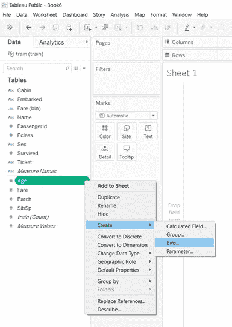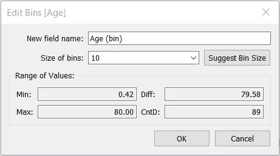

选择尺寸为 10 的箱子，然后点击“确定”

变量“年龄(bin)”应出现在您的数据窗格中:

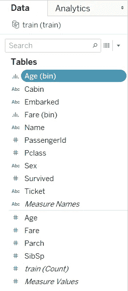

要显示我们刚刚创建的年龄组，请将“Age (bin)”变量拖到屏幕顶部的“Columns”窗格中。然后，将“train(Count)”变量拖到行窗格中:

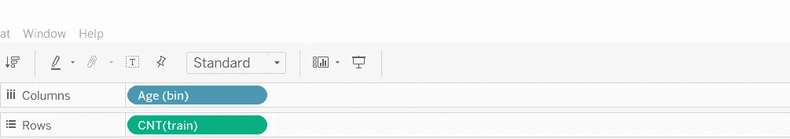

完成此操作后，您将看到如下所示的直方图:

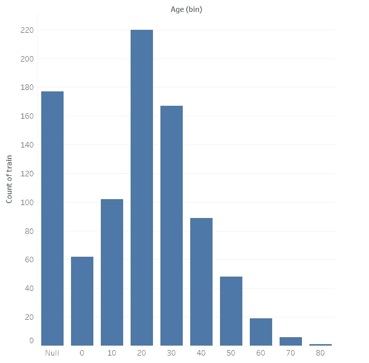

Age Distribution of Titanic Passengers

这是我们数据集中年龄分布的一个很好的清晰的可视化。但是，可以改进。

如果仔细观察，您会注意到 X 轴上的值“Null”。

要删除空值:

*   点击“年龄(bin)”旁边的下拉菜单，然后点击“显示过滤器”

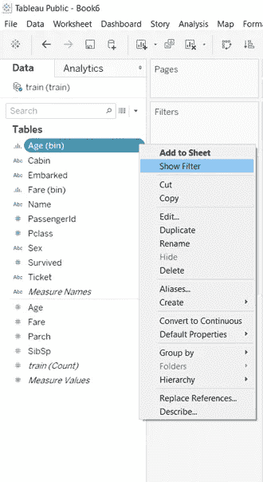

屏幕右侧应出现以下内容:

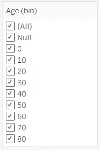

取消选中“null”旁边的复选标记，您将不再在直方图中看到 Null 值:

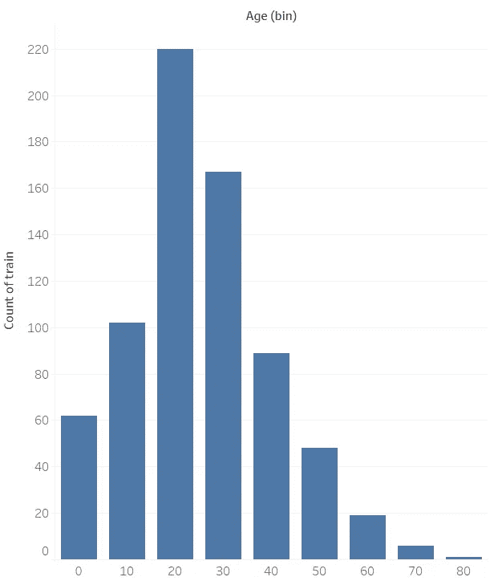

Age Distribution of Titanic Passengers

如果您想要更改垃圾箱的颜色，请将“年龄(垃圾箱)”变量拖到标记卡中的颜色按钮上:

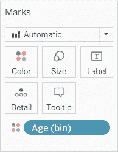

然后，单击颜色->编辑颜色来选择调色板:

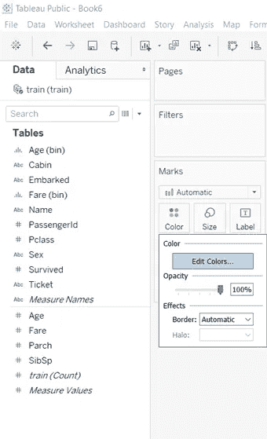

选择你喜欢的颜色，点击“分配调色板”，然后点击“确定”现在你将有一个你选择的颜色直方图:

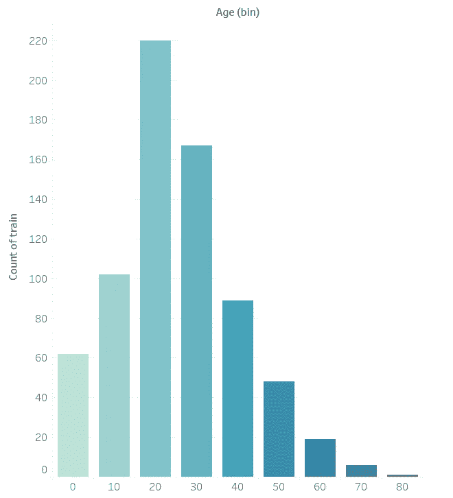

2.类似地，我们现在可以想象可变的“费用”

重复整个过程，创建乘客票价直方图。这一次，使用大小为 30 的箱子。

您的图表看起来应该如下所示:

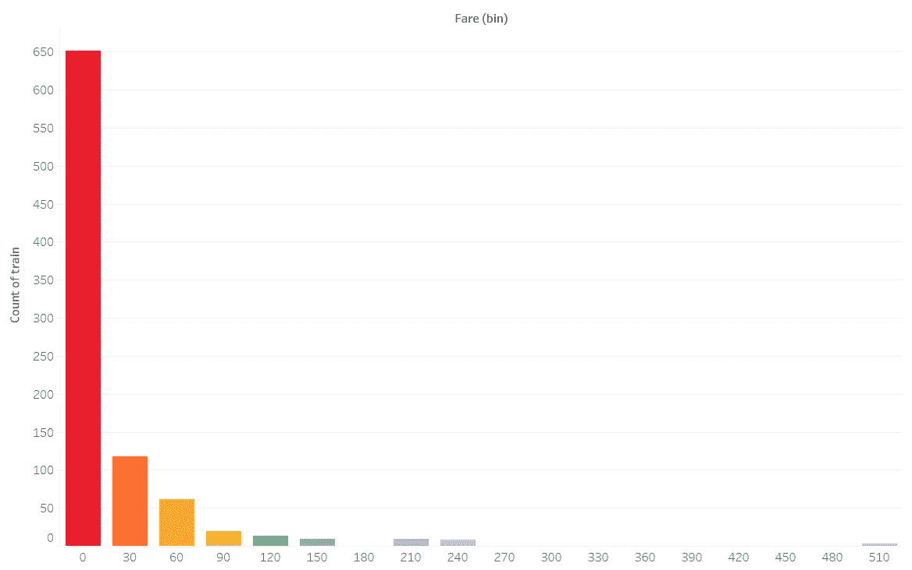

## 计数图

类似于我们为变量“年龄”和“费用”创建的直方图，我们可以为分类变量创建计数图。

*   首先，我们将可视化变量“存活”的计数

*注意:从列部分和标记卡中删除变量‘Age(bin)’。每次您想要创建一个新的可视化时，您都必须这样做。*

只需将变量“Survived”拖到列部分，将变量“train(Count)”拖到行部分。

然后，将变量“幸存”拖到标记卡中的颜色按钮上，并选择一个调色板:

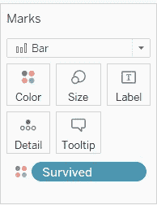

图表看起来是这样的:

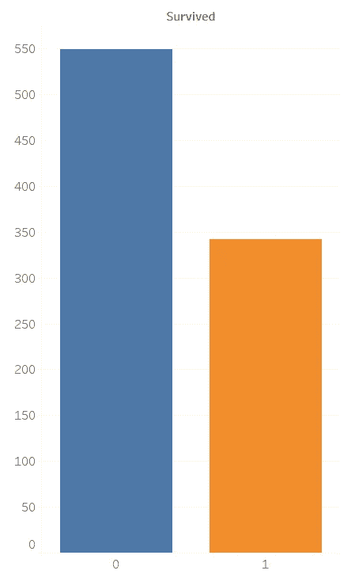

您可以做同样的事情来可视化数据集中剩余的分类变量。

*   Pclass

按照与前面相同的步骤，您应该会得到如下所示的可视化效果:

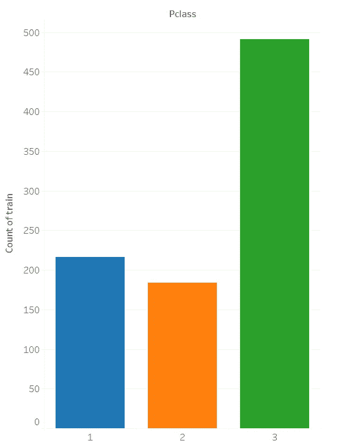

## 条形图

条形图非常适合可视化多个变量之间的关系。

***女性乘客比男性乘客更有可能在泰坦尼克号上幸存吗？***

要回答这个问题，我需要在计数图中显示两个变量——“存活”和“性别”。根据您想要获得的洞察力类型，您可以通过以下任一变量对其进行着色:

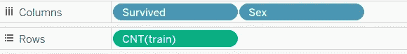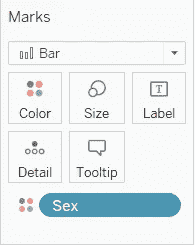

最终的情节将是这样的:

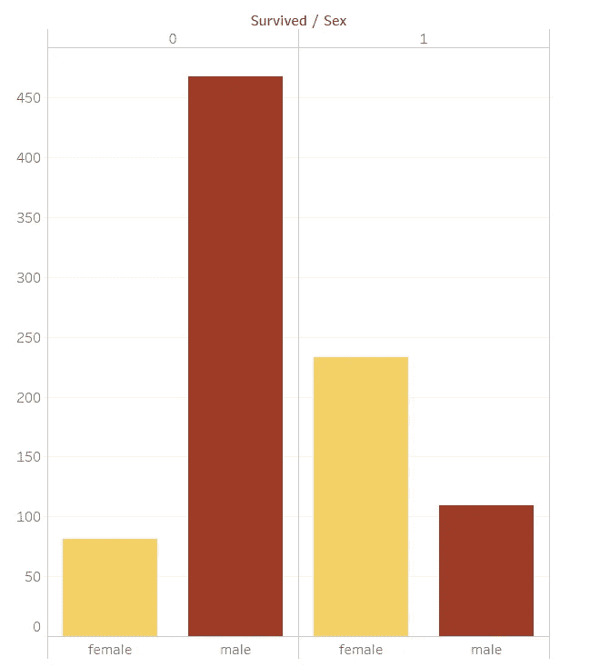

Survived and Sex

只要看一下这张图表，我们就能发现一种相关性——女性乘客似乎比男性乘客更有可能在泰坦尼克号上幸存下来。

## 泰伯劳标记卡

在进入下一个可视化之前，您需要了解 Tableau 的一个重要特性——标记卡。

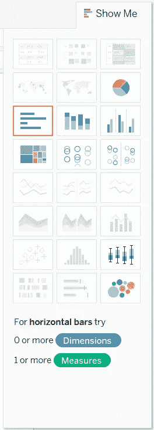

Marks Card

点击页面右上角的“演示”按钮，您可以找到 marks 卡。在这里，您可以看到不同类型的图表。

Tableau 允许您使用不同类型的图表来可视化相同的数据——有气泡图、树状图、箱线图等。

你可以看看其中的一些，花些时间创建不同的图表。

但是，在使用这些工具可视化数据时要小心。其中一些图表可能看起来很漂亮，但不一定是最佳的可视化实践。

使用过于复杂的图表可能会使其他人难以阅读和解释，所以要谨慎行事。

## 堆积图表

另一种可视化上述“性别”和“存活”变量的方法是使用堆积图。

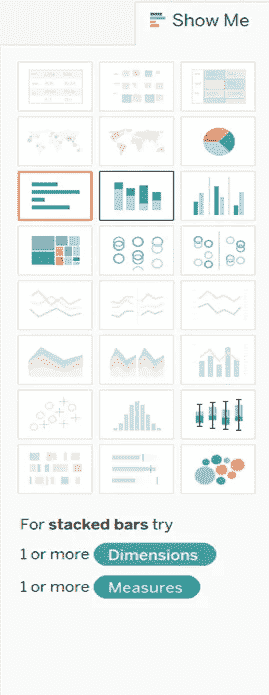

Select the stacked chart option from the Marks Card

单击看起来像堆积条形图的卡片。

你应该会看到一个类似这样的图表。变量“性别”的条形不再并排显示。相反，它们相互堆叠在一起。

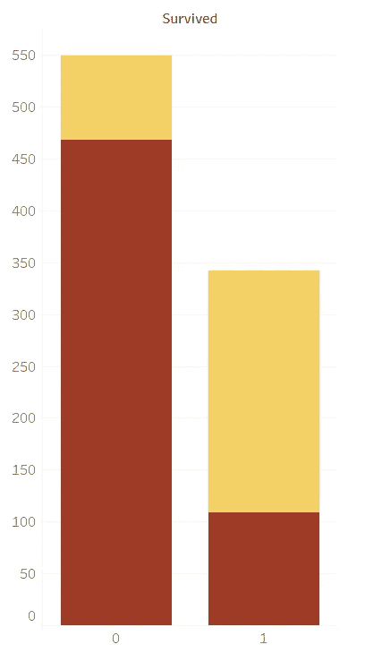

Stacked Chart — Survived and Sex

## 更多可视化

应用我们在上面学到的知识，我们可以创建可视化来找到以下数据问题的答案:

注意:我建议把问题写下来。然后，创造你自己的形象，尝试自己回答这些问题。

***乘客中的 a 类人是否对他们在泰坦尼克号上幸存有什么影响？***

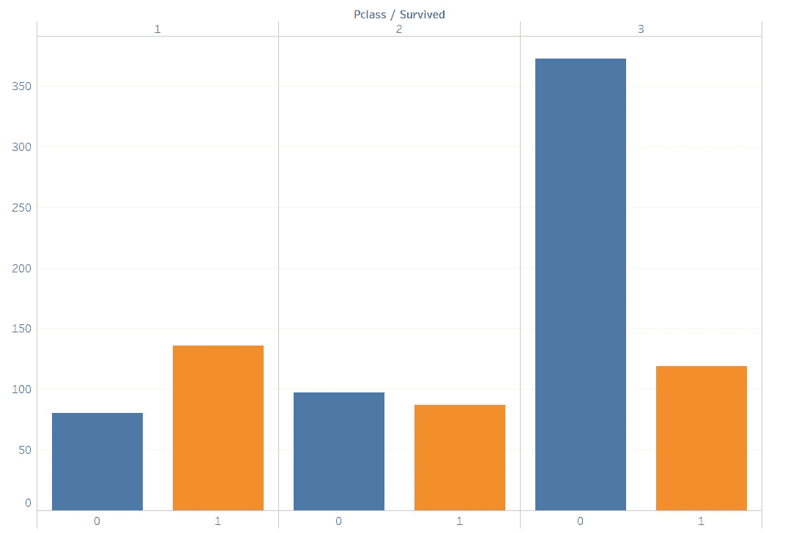

看起来三等舱的乘客比其他任何一等舱的乘客生还的可能性都要小得多。

乘客出发的港口对他们的生存有影响吗？

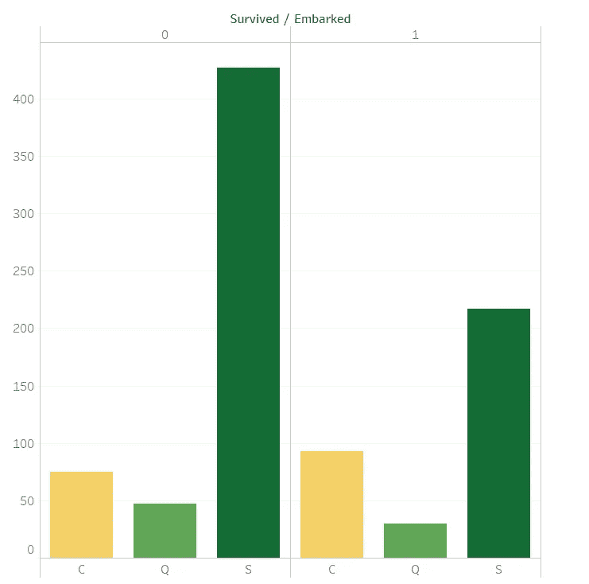

变量“上船”和“幸存”之间似乎没有明显的关系。

年轻乘客更有可能在泰坦尼克号上幸存吗？

*注意:要回答这个问题，您可以使用变量“年龄”或“年龄(Bin)。”*

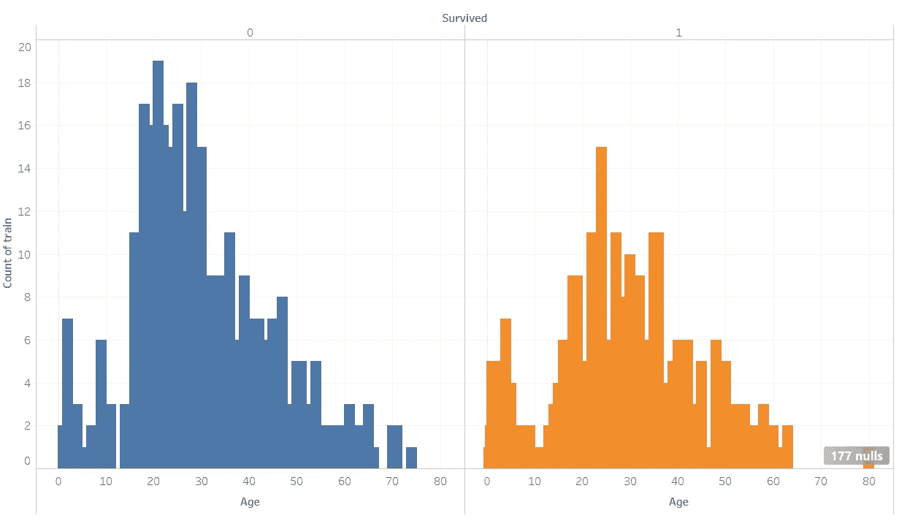

Age and Survived

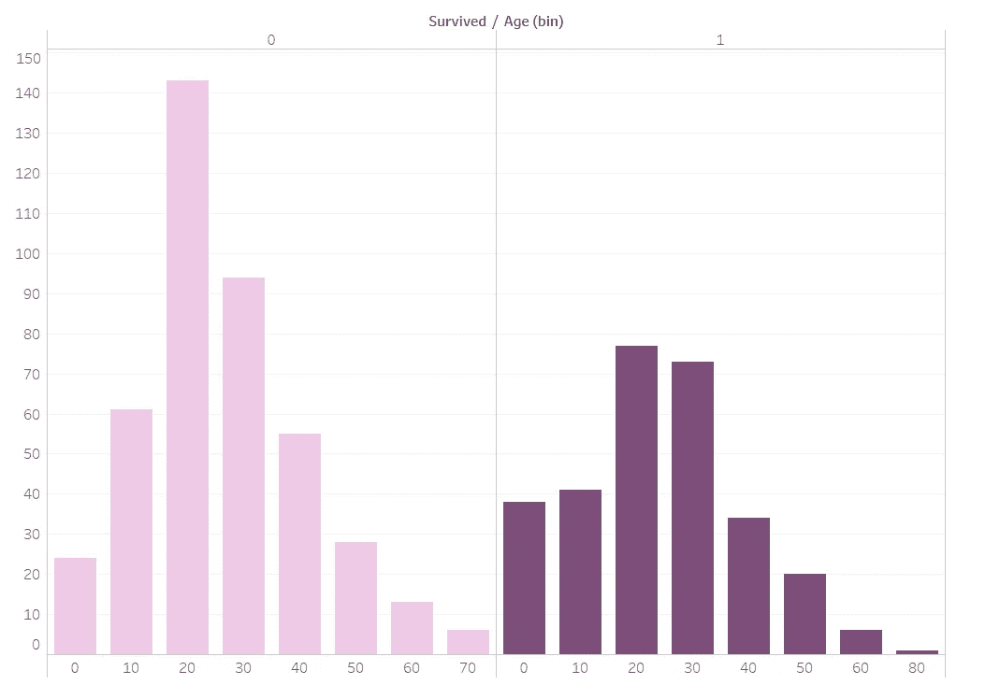

Age and Survived

泰坦尼克号幸存乘客的年龄分布与未生还乘客的年龄分布相似。年龄和存活率之间似乎没有什么关联。

支付更高票价的乘客更有可能在泰坦尼克号上幸存吗？

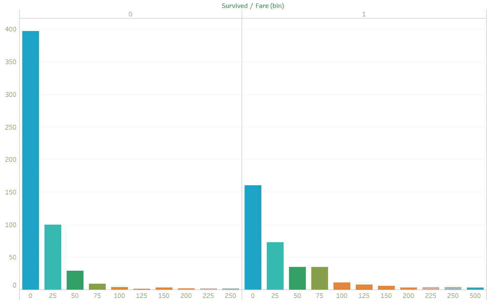

*注:为了获得更清晰的图片，我将 bin 尺寸改为了 25。*

可以观察到，支付更高票价(50 美元及以上)的乘客比购买更便宜机票的乘客存活率更高。

## 可视化多个变量

当你需要同时可视化两个以上变量之间的关系时，Tableau 是一个很好的工具，因为有太多的方法可以做到这一点。

为了给你看一个例子，我将把变量“年龄”、“性别”和“存活”之间的关系形象化

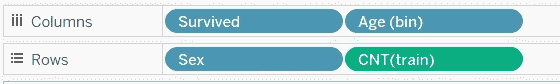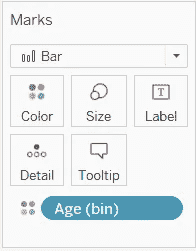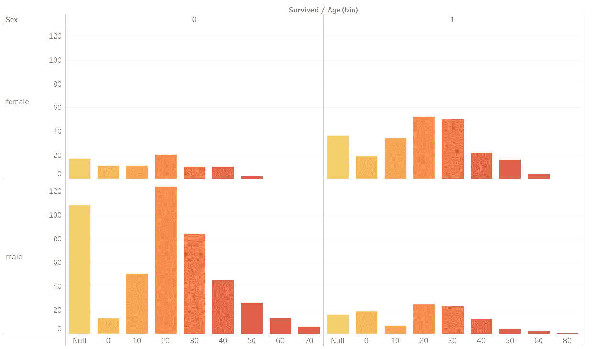

Survived and Age group with Sex

有许多不同的方法可以做到这一点，这取决于你想要突出的变量。

你可以重新定位图表，尝试给不同的变量着色，看看什么能最好地回答你的数据问题。

有时候，用许多不同的方式想象相同的变量会给你一个全新的视角。

我现在将更多的变量形象化，以找到它们之间的关系，您应该自己尝试这些变量。

票价、性和幸存

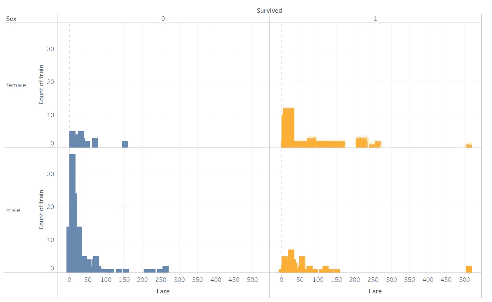

票价'，' Pclass '，'幸存'

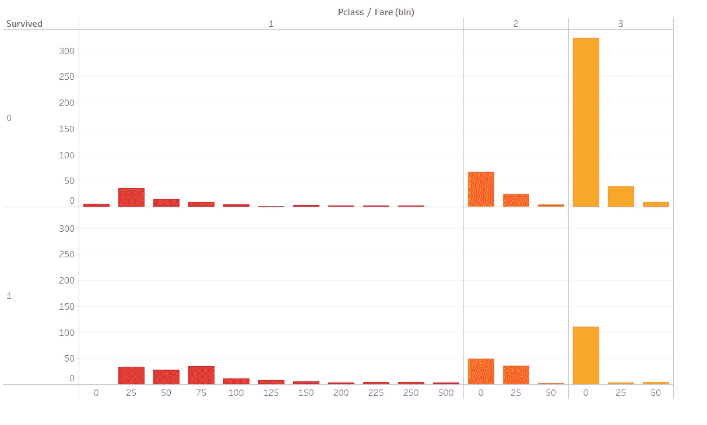

年龄'，' Pclass '，'幸存'

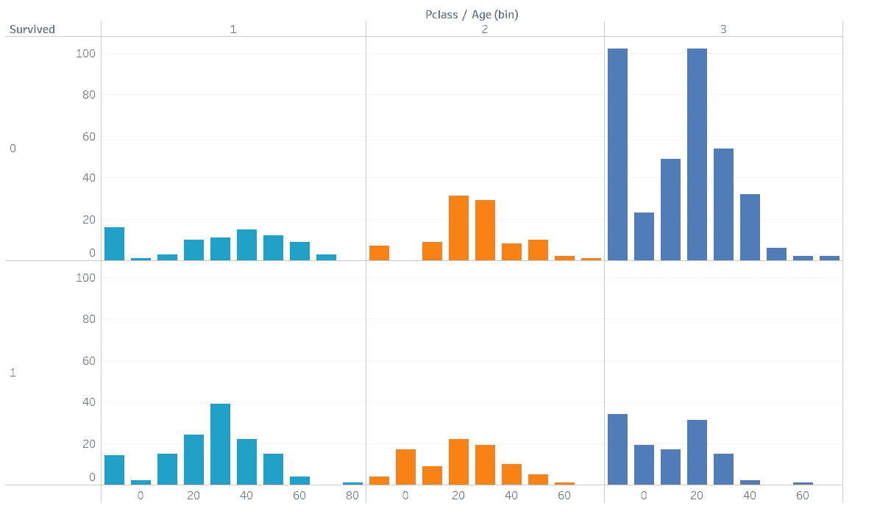

# 6.标记、工具提示和注释

使用标记、工具提示和注释可以让人们更容易阅读你的图表。

但是，您应该明智地使用这些方法，以避免过多的信息使您的图表混乱。

## 工具提示

工具提示是指针悬停在可视化效果上时显示的详细信息:

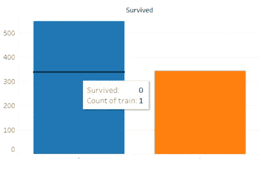

Survived Count — Tooltip

您可以选择将信息添加到工具提示中，而不将其添加到可视化中。

重新创建上面的生存计数图。然后，您需要做的就是将要添加的变量拖到标记卡中的工具提示按钮上:

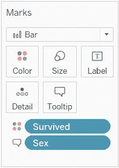

这样，每当有人将指针悬停在您的图表上时，他们将能够看到以下附加信息:

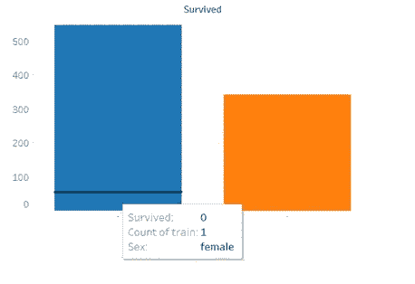

Survival Count with Tooltip

正如您在上面的图表中所看到的，工具提示中有关于乘客性别的信息，这些信息没有显示在图表中。

注意:我不建议这样使用工具提示。当可视化分类变量时，最好使用不同的色调或单独的列。我创建这个只是为了向您展示将来如何使用工具提示。

## 释文

可以将工具提示上的信息显示为图形上的注释。

这样，你可以在你的图表上标出一个特定的标记或点，让读者很容易看到它。

这在可视化地图中的位置数据时特别有用，因为您可以对特定区域进行注释并引起注意。

以下是注释图表的方法:

1.  右键单击直方图，然后单击注释->标记

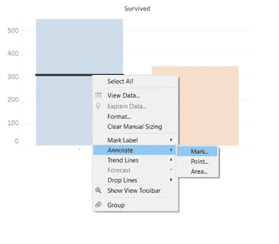

2.会出现这样的屏幕。您可以选择删除不想要的标记，然后单击“确定”

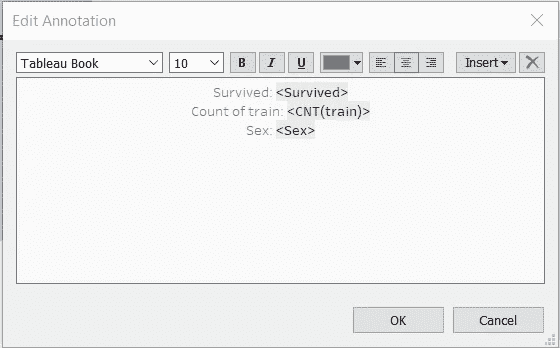

现在，您将看到注释如下所示:

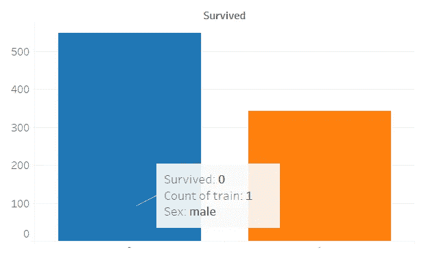

# 然后…我们结束了！

我希望这篇教程能帮助你开始使用 Tableau 进行基本的数据分析和可视化。

当然，Tableau 中的数据可视化还有更多的内容，我们仅仅触及了表面。

如果您有兴趣学习更多关于探索、分析和可视化数据的知识，我建议您使用以下**免费学习资源**:

Photo by [Thought Catalog](https://unsplash.com/@thoughtcatalog?utm_source=unsplash&utm_medium=referral&utm_content=creditCopyText) on [Unsplash](https://unsplash.com/s/photos/books?utm_source=unsplash&utm_medium=referral&utm_content=creditCopyText)

1.  [数据可视化与 Tableau 沟通](https://www.coursera.org/learn/analytics-tableau) —杜克大学

这是一个完整的初学者课程，带你了解商业分析和数据探索的基础知识。这是一个 5 门课程的专业，教你如何应用统计分析来做出商业决策。

它将带您了解如何使用 SQL 查询数据、统计技术、业务分析、表格和数据通信/讲故事。

这门课程是免费旁听的，但如果你想获得证书，你需要付费。

2.[数据科学和可视化表格——速成班](https://www.freecodecamp.org/news/tableau-for-data-science-and-data-visualization-crash-course/)(免费代码营)

这是一个帮助你开始使用 Tableau 的速成课程，是一个 29 分钟的视频。

如果你想马上开始使用 Tableau，这是一门你应该学习的课程。

如果你通过观看视频教程比阅读文章学得更好，我会推荐这个课程。

3.[数据分析基础](https://courses.edx.org/courses/course-v1:UTAustinX+UT.7.11x+2T2017/course/) — edX

这门课不会教你 Tableau。我将它添加到列表中，因为我认为它是理解统计思维和数据分析的一个很好的资源。

它教你数据探索背后的概念，以及如何提出正确的数据问题。它还略微深入学习数据科学所需的数学和统计概念。

这个类中的可视化是用 R 编程实现的。然而，没有事先编程经验是必需的，他们会告诉你如何从头开始。

## 技术>工具

Photo by [Haupes Co.](https://unsplash.com/@haupes?utm_source=unsplash&utm_medium=referral&utm_content=creditCopyText) on [Unsplash](https://unsplash.com/s/photos/tool?utm_source=unsplash&utm_medium=referral&utm_content=creditCopyText)

就我个人而言，我觉得学习技术，或者某件事情背后的方法远比学习实现它的工具更重要。

如果您学习了执行数据分析和可视化的技术，您可以轻松地使用不同的工具来完成这项工作。

一旦你学会了统计分析和数据可视化背后的科学，你就可以很快明白如何使用不同的工具来实现它——R/Python 库、Excel、Tableau、PowerBi 等。

总是优先学习技术而不是学习工具。

## 本文到此为止！感谢阅读:)

> 学习的乐趣在学习中是不可或缺的，就像呼吸在跑步中一样。