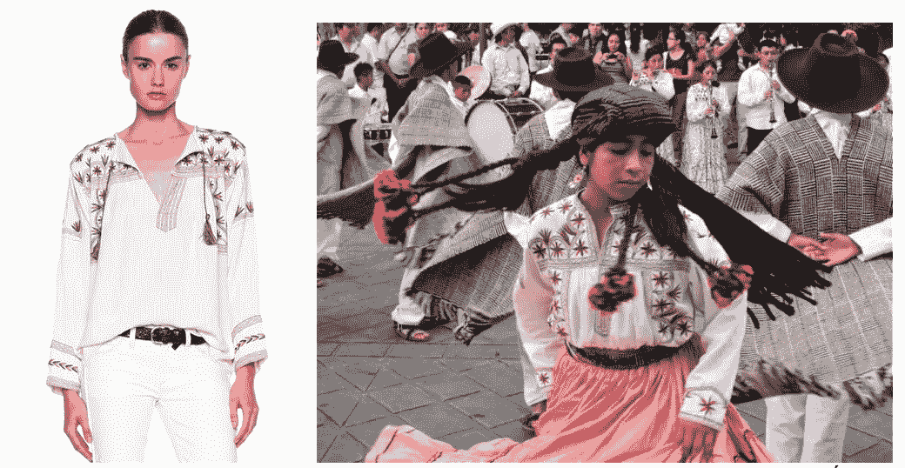
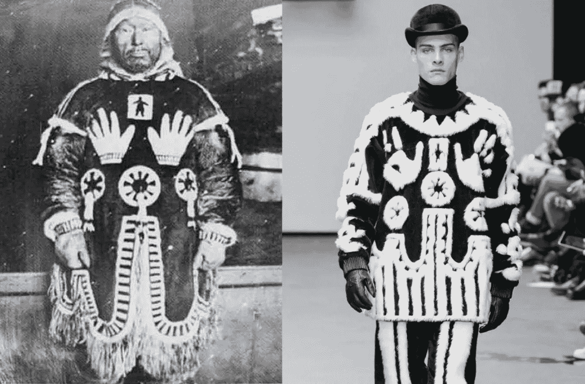
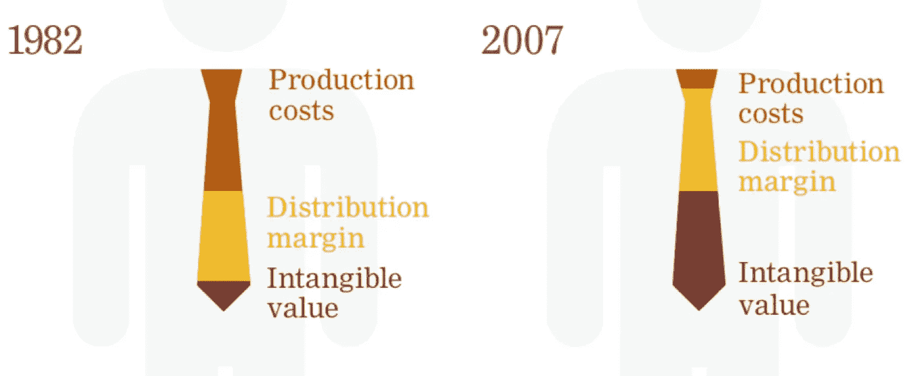

# 解决时尚产业中的文化挪用问题

> 原文：<https://medium.datadriveninvestor.com/tackling-cultural-appropriation-in-the-fashion-industry-4202a06a440e?source=collection_archive---------6----------------------->

真实性已经成为衡量现代时装设计艺术价值的流行标准。根据缪西娅·普拉达的说法，“我们所有的文化都来源于其他文化，但是真正的文化是当你能够把你自己的东西(加入到已经存在的东西中)并推动事物向前发展的时候。“本着这种思维方式，时装设计师努力通过重塑传统文化表达方式(TCEs)来创造*正宗的*服装和配饰，这些传统文化表达方式是嵌入在传统艺术作品中的设计元素

技合企业是土著社区的创造性产品。对土著人民来说，这种文化遗产反映了他们社区的文化遗产和社会身份。此外，它们可能具有精神意义、宗教意义或与政治观念如自决的联系。[尽管 tce 代代相传，但在这一过程中，它们经历了无数次进化适应、模仿、复兴、复兴和再创造](https://www.wipo.int/edocs/mdocs/tk/en/wipo_grtkf_ic_37/wipo_grtkf_ic_37_7.pdf)。当时装设计师将 tce 融入他们的设计中，并在其中加入他们自己的艺术风格时，他们正在为 tce 的文化演变做出贡献，并拓宽了它们的使用范围。

**Australian Aboriginal TCE.** Image by Mint Images.

当时装设计师在没有承认、得到授权和/或补偿来源社区的情况下使用 tce 时，就会出现文化挪用的问题。文化占有被描述为对土著艺术和设计的殖民占领，因为它可以延续不准确的陈规定型观念，使土著人民边缘化，并使公司能够以 TCE 持有者为代价获利。

**Figure 1: Appropriation of the Mixe *Huipil*.** As part of her Spring/Summer 2015 Étoile collection, Isabel Marant integrated embroidery elements in her collection (left) that are stylistically identical to those that the Mixe people apply on their *huipil* (right), a traditional blouse with a rich cultural heritage. Since Isabel did not ask the Mixe people for permission to use their TCE, compensate them, or acknowledge the community as a source of inspiration, she was rightly accused of appropriating Mixe culture. Images sourced from Vogue (left) and Remezcla (right).

## **利用法律系统**

为了打击文化侵占，土著人民需要为他们的传统文化遗产寻求知识产权保护。知识产权工具——如商标、版权、地理标志和专利——可以为土著社区提供法律杠杆，他们可能需要这些工具来监督谁可以使用他们的 tce 以及他们如何使用它们。

土著社区需要投资于知识产权战略，使他们能够实现自己的目标，无论这些目标是什么。在任何情况下，土著社区必须认识到以知识产权为中心的商业模式(即特许权协议、商标许可等。)具有巨大的潜力，为它们创造出口收入，并调整使用 tce 的服装和配件的利润分配。如果土著社区做不到这一点，时尚品牌可以从文化产品的销售中吸收所有的财务收益。

**Figure 2: Revenue Potential of the Maasai’s IP.** Indigenous to the Nile Valley,the Maasai people live in Kenya and Tanzania in present-day. Per Light Years IP, [about 1000 companies have used the Maasai people’s TCEs](http://lightyearsip.net/the-maasai/), such as the red and blue checkered designs shown above, often times without compensating them. In an effort to tap into the income potential of their cultural IP — capable of generating [$150 million per year](http://lightyearsip.net/how-big-is-the-issue/) in revenue — the [Maasai are applying for trademark protection for their TCEs and developing a process for commercial users to apply for trademark licenses](http://lightyearsip.net/the-maasai/). Image by Christopher Wilson.

不幸的是，现有知识产权法律中存在许多漏洞，阻碍了土著人民获得他们渴望的知识产权保护。这些差距从具体的技术限制，如版权保护的有限期限，到一般的概念和操作分歧，如与获取知识产权相关的财务费用。因此，土著社区需要确保他们遏制文化盗用的方法不仅仅以知识产权管理为中心。

## **创办企业**

无论土著社区是否拥有知识产权，他们都可以将自己推销为 TCEs 无可争议的所有者。如果他们能够有效地做到这一点，他们将能够通过 TCEs 影响消费者对时尚产品的看法和市场价值；他们在最终市场国家的影响力越大，就越容易因其对文化产品的贡献而获得应有的荣誉和认可。尽管 TCE 持有人不一定需要知识产权来开发引人注目的营销宣传材料，但利用知识产权资产的品牌推广工作尤其有效。

**Figure 3: The Inuit People’s Success with Branding.** In 2015,Salome Awa, a woman of Inuit descent, accused KTZ of appropriating a sacred Inuit design. To substantiate her allegations and brand the TCEs featured on KTZ’s Inuit-inspired garment (right) as Inuit property, Salome was able to reference Northern Voices: Inuit Writing in English, a book that has a photo of Salome Awa’s great-grandfather wearing the garment with the TCEs of interest (left), and *The Journals of Knud Rasmussen*, an Isuma-produced film with scenes that show Inuit actors wearing a replica of Salome’s great-grandfather’s garment. Salome’s efforts sparked consumer backlash and led KTZ to remove their Inuit-inspired garments from sale online and in stores. Image sourced from Dazed.

随着他们建立品牌，越来越多的时尚公司开始认识到他们是受文化启发的产品的合法利益相关者，土著社区需要通过参与合资企业、战略联盟和其他合作努力来扩大他们的企业联系。通过这样做，他们可以获得特殊的利益，如与时装设计师谈判具体设计细节的能力，以及在事实发生之前解决文化挪用问题。

**Figure 4: What is in it for Fashion Companies.** The figure above shows just how influential intangible assets, such as brand image, have become in shaping the final retail price for ties and points to an overarching shift in what informs consumer taste in fashion at large. By partnering with indigenous communities, fashion brands can earn a stamp of authenticity, enjoy competitive advantages, and address the wants of a growing number of [conscious consumers who are willing to pay extra for products from brands that commit to positive social impact](https://www.nielsen.com/wp-content/uploads/sites/3/2019/04/global-corporate-social-responsibility-report-june-2014.pdf) — thereby appreciating their intangible capital. Image sourced from Light Years IP.

## **把所有这些放在一起**

时尚界的文化挪用问题围绕着 TCE 持有者无法在最终市场国家保持对其 TCE 的控制。为了解决这一问题，本文建议 TCE 持有人设计一个策略，以最大化他们的法律杠杆，并加强他们在最终市场国家的市场存在，*协同*。

尽管土著社区的愿景应该是实现自给自足，但他们最初可能需要寻求外部援助，以落实本文提出的建议。幸运的是，有许多政府间组织、非营利组织和国家政府愿意通过提供政治支持和投资能力建设计划来帮助它们解决时尚文化挪用问题，如世界知识产权组织(WIPO)、光年知识产权(Light Years IP)和 Roots Studio。