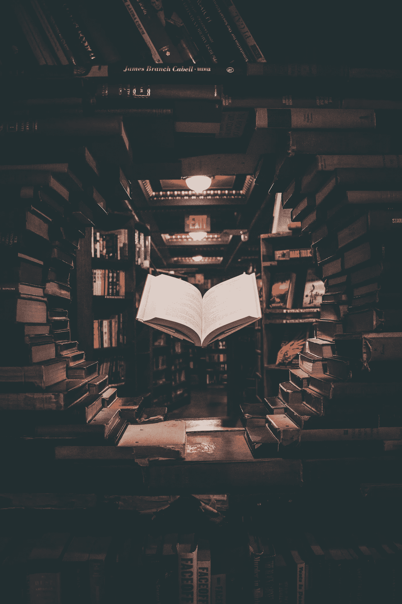
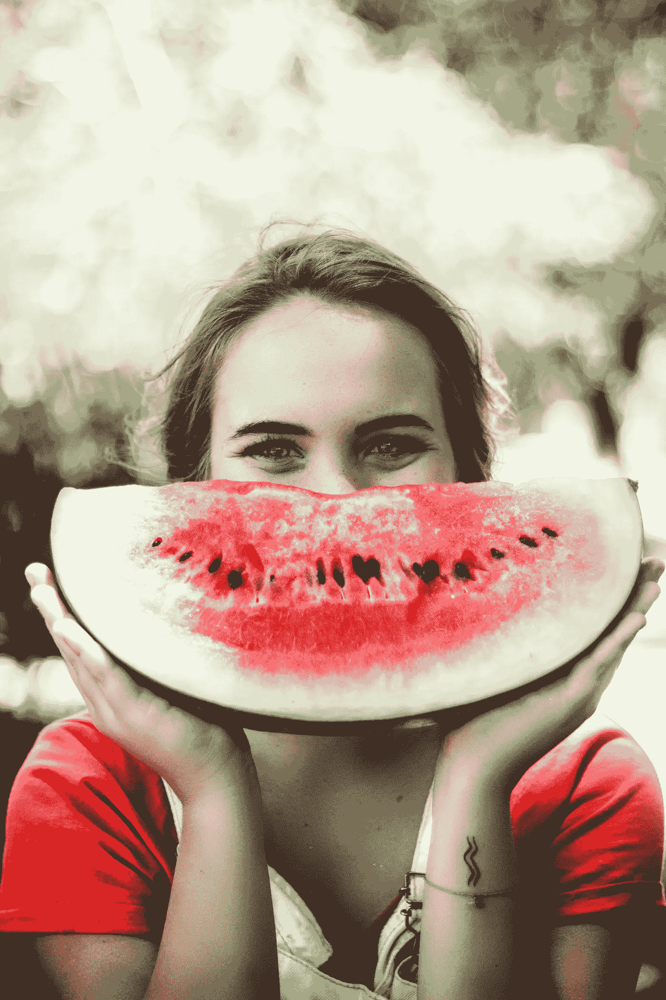

# 策略:调整你生活表现的 5 个关键习惯

> 原文：<https://medium.datadriveninvestor.com/tactics-5-key-habits-to-tune-up-your-life-performance-c4b7a23b3a80?source=collection_archive---------12----------------------->

Picture from Unsplash

## 是时候把另外五个有用的(下一级)习惯纳入你的生活了。你觉得呢？在我看来，如果你遵循这五个步骤，你的生活将会更上一层楼。

你有没有包括五个基本习惯来调整你的生活？如果你还没有，[回到帖子](https://medium.com/@Melichar/tactics-5-key-habits-to-improve-your-life-5974bab323dc)仔细阅读。你需要处于巅峰状态才能走得更远，进入下一个级别。这都是关于一致性。

# 1.阅读

> “不是所有的读者都是领导，但所有的领导都是读者。”—哈里·杜鲁门

吉姆·奎克说，阅读是一种超能力。我们很多人都得到了同样的结果，只是因为我们不是狂热的读者。最近，我读了更多的书，我必须说，我感到更满足，更有希望，也不那么担心了。

知识的希望就在那里；我们唯一需要做的就是寻找。

Picture from Unsplash

*首先是*——正如[汤姆·比尔尤](https://www.youtube.com/watch?v=AWRx6f4blzM)所说，我们必须迷路。听播客，与不同的人交谈，阅读不同的书籍。以这种方式，开始塑造我们的观点，如果我们将知识结合起来，并与我们的价值观和目标保持一致，我们就为第二步做好了准备。

其次，现在你开始阅读与你的使命、使命和个性紧密相关的书籍。你开始建立你的技能，选择与你紧密联系和产生共鸣的书籍。

在过去三周左右的时间里，我每天都在练习阅读，至少 30 个阿敏日，你会发现你的思维方式和创造力有所不同。

你可以偶尔设法每周读一本书以上。但是，假设你一年管理 52 本书，这是一般 CEO 的阅读量。相当他妈的史诗！

[Picture from Unsplash](http://Photo by Joshua Earle on Unsplash)

# 2.显示

在你的生活中开始看到结果是令人惊奇的。但是这是怎么发生的呢？我真的相信一个有所收获的人和一个没有收获的人之间的区别在于反思。

反思是一个相当枯燥的过程。这是经常看到的，做过的。因此，这正是问题的关键。我们必须剖析那些我们没有得到结果的任务。

第一步:坚持同样的习惯一两个星期

*第二步:*评估这样的日常工作对你来说如何

*第三步:*根据结果调整你的方法

# 3.策划小组

你想更上一层楼吗？是的，我也是。成功的人与成功的人之间的区别在于他们周围的那群人。你以前听过这句话，但是问问你自己，诚实地回答。

人类面临的最大挑战不是我们不知道的事实，而是我们不按照我们知道的事实行事。这不是一个零和的情况，你只是让自己周围的人让你变得更好，而你没有付出任何回报。

Photo by [Austin Distel](https://unsplash.com/@austindistel?utm_source=unsplash&utm_medium=referral&utm_content=creditCopyText) on [Unsplash](https://unsplash.com/s/photos/mastermind?utm_source=unsplash&utm_medium=referral&utm_content=creditCopyText)

事情不是这样的。你要么是给予者，要么是匹配者，要么是接受者。正如亚当·格兰特指出的，许多人都是索取者，并且总是以自我为中心看待自己。

> 在我的生活中，有多少人让我变得更好，我也变得更好？

*第一步:*决定你必须遵循的原则，然后走出去，努力学习这些[原则](https://www.mateomelichar.com/opt-in-846e2acd-c63c-46b6-b84a-c24c53c1a9f3)，并将它们融入你的生活

第二步:确保你的[在前进的道路上体现](https://medium.com/datadriveninvestor/mindset-pain-reflection-progress-d393f516d8f4)，但是现在是时候开始吸引志同道合的人了。

*第三步:*做一个给予者；走出你的方式，给予别人。善良，真诚，关注他人而不是自己。

# 4.微笑

微笑是有感染力的；它让我们成为更好的人。人们被诚实、真诚的微笑所吸引。你经常微笑吗？

## 英国文化委员会微笑着

那么，当我们微笑的时候，我们的大脑在想什么呢？想象我们处在一个愉快的情境中，就像在地铁上偶遇一个老朋友。当我们的大脑感到快乐时，就会产生内啡肽，神经元信号会传递到你的面部肌肉，引发微笑。

Photo by [Caju Gomes](https://unsplash.com/@cajugos?utm_source=unsplash&utm_medium=referral&utm_content=creditCopyText) on [Unsplash](https://unsplash.com/s/photos/smile?utm_source=unsplash&utm_medium=referral&utm_content=creditCopyText)

这是快乐正反馈循环的开始。当我们微笑的肌肉收缩时，它们会向大脑发出信号，刺激我们的奖励系统，并进一步增加我们快乐激素或内啡肽的水平。简而言之，当我们的大脑感到快乐时，我们就会微笑；当我们微笑时，我们的大脑感觉更快乐。

你觉得强颜欢笑很难吗？别担心。只要和微笑的人在一起。瑞典的一项研究发现，当你看着对你微笑的人时，确实很难保持一张长脸。微笑是会传染的！看到人们微笑会刺激我们的镜像神经元抑制我们的面部肌肉控制，从而引发微笑。‘你笑，我笑’是科学事实！

此外，微笑还能带来健康益处，比如减少焦虑，降低血压和心率。据估计，一个微笑给我们大脑带来的快乐程度相当于拥有 2000 块巧克力或得到 16000 块巧克力。因此，我们不需要巧克力和现金来快乐。一个微笑就可以了！

[Picture By Michael Dam](https://unsplash.com/photos/mEZ3PoFGs_k)

# 5.感激

对生活中发生的所有事情心存感激。养成习惯当你醒来的第一件事，感激你能移动你的腿，你的身体，你能享受现在的生活。

正如玛吉·沃雷尔所说:

感恩是生活中最强大的补药，然而我们经常关注我们生活中缺少的东西和我们没有的东西，而不是我们 T2 做的一切。它让我们生活在匮乏之中，助长怨恨、自怜和无力感。所以，警惕你的思想，当你发现自己沉迷于失去的东西时，把注意力重新集中在你已经拥有的东西上。因为无论事情看起来多么可怕，总有一些值得感激的事情。

> 庆祝哪怕是很小的事情——从冬日的阳光到夏日的炎热(你还活着！)，从你阅读这篇文章的能力(许多人不能)，到你头上的屋顶(许多人会喜欢)，从你蹒跚学步的孩子的乱发脾气到你十几岁的孩子凌乱的房间(啊，孩子的祝福)——可以对你的健康和幸福产生深远的影响。[培养感恩会放大你生活中的幸福，激发积极的情绪，让你不会把小问题闹大。那些习惯于永远只关注自己所缺少的东西——他们不能做或没有的东西——的人将永远是痛苦的……不管他们有多少名声或财富！不要成为他们中的一员，如果你曾经是，现在就决定改变它(像奥普拉那样给自己买一本感恩日记！)](https://twitter.com/intent/tweet?url=http%3A%2F%2Fwww.forbes.com%2Fsites%2Fmargiewarrell%2F2015%2F10%2F08%2Ftwelve-steps-to-change-your-life-tony-robbins-style%2F&text=Cultivating%20gratitude%C2%A0amplifies%20your%20blessings%2C%20fuels%20positive%20emotions%20%26%20keeps%20you%20from%C2%A0making%20small%20problems%20big.)

因为如果说我和托尼·罗宾斯共度的周末强化了什么的话，那就是改变你的生活所需要的就是决定是时候站出来做这件事了。

—

Photo by [Lefty Kasdaglis](https://unsplash.com/@lefty_kasdaglis?utm_source=unsplash&utm_medium=referral&utm_content=creditCopyText) on [Unsplash](https://unsplash.com/s/photos/questionmark?utm_source=unsplash&utm_medium=referral&utm_content=creditCopyText)

# 需要知道未来 30 天要做什么吗？

给你，是时候让你上路了？需要一个结合健康、健身和心态的蓝图，点击[这里](https://www.fatimakhechai.com/upgradeyourlifeguide)。我和两个强大的[教练](https://www.fatimakhechai.com/)联手做心态和[信仰体系](https://www.inspired.world/)。

 [## 健身房 10 年的 10 条人生经验|数据驱动的投资者

### 走错一步，他们就会掉下去。两位登山者优雅地回到了地面。他们在那里…

www.datadriveninvestor.com](https://www.datadriveninvestor.com/2020/02/03/10-life-lessons-from-10-years-in-the-gym/)