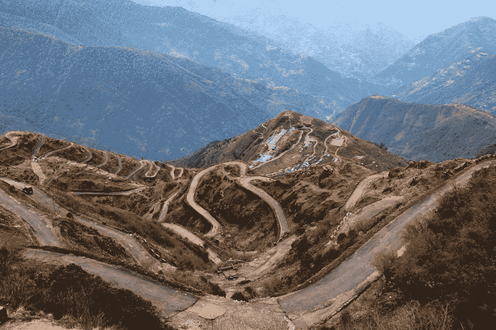
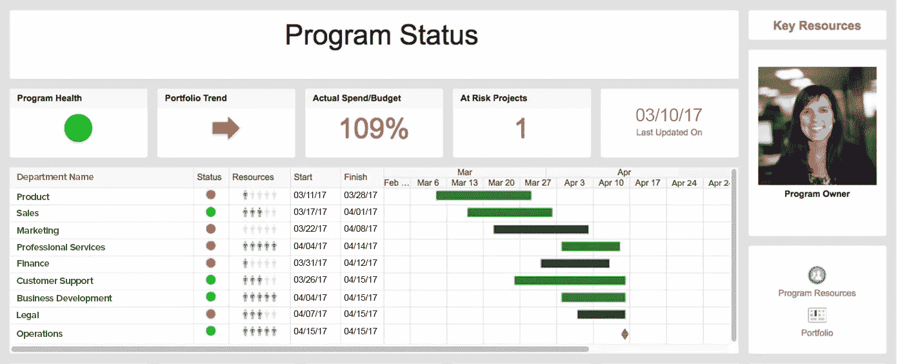

# 战术:锦标赛表现符合路线图

> 原文：<https://medium.datadriveninvestor.com/tactics-championship-performance-meets-roadmap-d8fc880d0026?source=collection_archive---------9----------------------->

[Picture By Amit Jain](https://unsplash.com/photos/pQ04riRO9wM)

## 今天为你准备了什么？已经是周末了，我们正在完成计划中的最后一点点工作。外面的天气有风但很晴朗。不考虑未来就去外面闲逛是很诱人的。不是吗？

# 正在走向成功还是落后了？

为了能够完成冠军级的表演，我们必须训练，即使我们感觉不到。为了能够在最高水平上表演，我们不得不忍受无聊并继续学习。为了在我们的工作中做到最好，我们需要开发一个强大的课程。一旦我们有了这些，我们需要将它们转化为计划，并将计划转化为路线图。

> 为了更上一层楼，我们需要一个计划来指引我们，我们需要一张可以遵循的地图和一张在汹涌的水中航行的路线图。—菲特巴德

# 什么是路线图？

根据 Smartsheet.com 的说法,*路线图*是一个项目基本部分的高层次、易于理解的概述。这是一个你可以与任何人分享的资源，它提供了工作目标、关键里程碑、关键交付物、依赖性和可能的风险的快速快照。

 [## 健康品牌源于定位|数据驱动的投资者

### 品牌定位是 Phemelo Segoe 的激情之一。她是一名企业家、健康教练和米尔部落的创始人…

www.datadriveninvestor.com](https://www.datadriveninvestor.com/2019/01/11/healthy-brands-grow-from-positioning/) 

项目经理(您)编制项目路线图，并在项目启动前和项目启动期间将其作为重要的沟通工具，以设定适当的期望、分享高级计划并强调未来工作的重要组成部分。

它不一定要那么复杂，但它应该能帮助你明确你的目标。让我们假设你想在接下来的六个月内变得健康和健美

—

根据商业文件，你应该遵循一个简单的流程。

1.  设定你的时间表。
2.  建立你的工作流程(健康、健身、心态目标)。
3.  制定每个工作流程中的高级活动(健身房、桑拿浴、食物类型)。
4.  如果有高风险区域，添加标签(每周五聚会/大量酒精)。
5.  输入你的关键里程碑(每周周日，我会检查)。
6.  清楚地解释你的文档的状态(我是否在轨道上？/我对自己和他人负责吗？).

[Picture By Jaromir Kavan](https://unsplash.com/photos/vv-oEGlN-4E)

# 测试您的路线图清单

*   用朋友或同事作为试验品来检查你的健康路线图。
*   他们应该能够在看到路线图和项目时间表后的 1 分钟内理解它们。
*   这是它区别于标准“项目计划”的地方

—

不要忘记健康食品的重要性，不断向最好的学习。我的朋友莎拉是营养、肠道、[、健康](https://www.frazzledontoast.com/the-alkaline-diet-myth-busting-1/)等方面智慧的绝佳来源。去吧，学习，变得更健康。

—

> "没有计划的目标只是一个愿望."―安托万·德·圣·埃克苏佩里