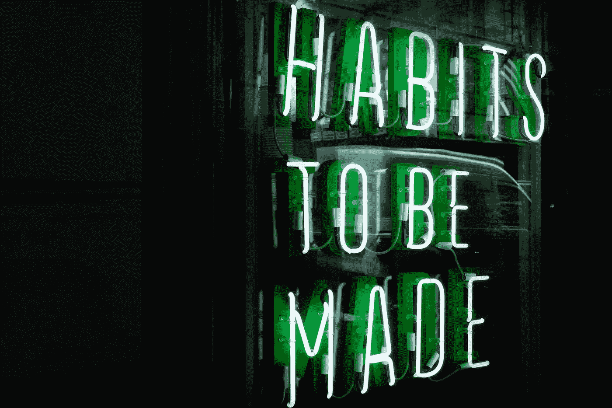

# 战术:快速养成习惯

> 原文：<https://medium.datadriveninvestor.com/tactics-creating-habits-fast-f5601e0196e?source=collection_archive---------19----------------------->

Picture from Unsplash

## 很多时候，我们都在努力养成新习惯并坚持下去。我认为这是因为我们试图咬太多的蛋糕。我们也需要设置我们的环境来使我们成功。养成习惯是一种技能，而不是运气。

# 从哪里开始？

要明白仅仅依靠意志力是不够的。你的意志力会耗尽，例如，如果你研究一个无聊的话题，它可能不会带你通过它。让我邀请福格博士来解释 T2 微小习惯 T3 背后的科学。

如果你讨厌在跑步机上跑步的单调，但每天都把自己拖到有氧运动室，相信自我折磨最终会成为一种习惯——这不是英雄行为；这是一个糟糕的设计。

[B.J .福格](http://www.bjfogg.com/)，斯坦福大学的行为科学家和研究员，他研究行为变化已经超过 20 年。做一些你不喜欢的事情，然后又不能把它永久化，这比什么都不做更不利于改变的使命。

为了创造一个真正的终身习惯，重点应该是训练你的大脑在微小的调整中取得成功。福格博士认为，然后从成功中获得信心。要做到这一点，你需要设计一些行为改变，这些改变既容易做到，又能无缝地融入到你现有的日常生活中。以自动性为目标。

Picture from Unsplash

> “你需要把情感和话题结合起来，才能记住它”。—吉姆·奎克

# 关键习惯洞察

这里有三个关键的见解，你可以立即运用它们来实现你的目标:

## 1.养成习惯是一种技能

习惯的形成是一项随着练习而变得更好的技能。因此，你越是采取小行动并保持下去，就越容易加入新的行动。

## 2.较小的变化比重大的变化要好

做出小的改变比重大的改变要容易得多。对于小换班，你的动力水平不一定要超高；对于重大的艰难改变，你的动力必须很高并且保持很高。

## 3.挑选微小的习惯

挑选你生活中想要的小行为。不要选择那些感觉像是一种义务或者你“应该”做的事情。

虽然这看起来似乎违背直觉，但为微小的改变设定目标(比如每天用牙线剔牙)会给你成就感和动力，让你想继续下去。随着这种感觉像雪球一样越滚越大，你会期待增加更多的行为，最终实现你梦想的改变！

## 4.从小处着手。

“朝着你的目标迈出一小步——一小步；你会觉得这很荒谬，”福格说。因为它是完全可及的，你更有可能完成这个行为，不管你感觉到多少动力。

## 5.找个靠山。

在你的生活中选择一个现有的常规，作为你新行为的触发器。停车、刷牙或洗澡都是可以触发新习惯的常规行为。

“不管你是否意识到，你有各种各样的套路，”福格说。“我把这些锚称为你可以连接到你微小行为的锚。关键是要选择哪种常规是你小而简单的行为的正确触发点。”

Picture from Unsplash

> “在培养新习惯方面，你可以利用行为的关联性。养成新习惯的最好方法之一是找出你每天已经养成的习惯，然后把你的新习惯放在首位。这叫习惯堆积。”—詹姆斯·克利尔

 [## 面向 Noobs |数据驱动型投资者的数字身份

### 聪明人如何在增强现实中创造身份价值？我最近刚满 40 岁。作为一个生物…

www.datadriveninvestor.com](https://www.datadriveninvestor.com/2019/02/28/digital-identity-for-noobs/)