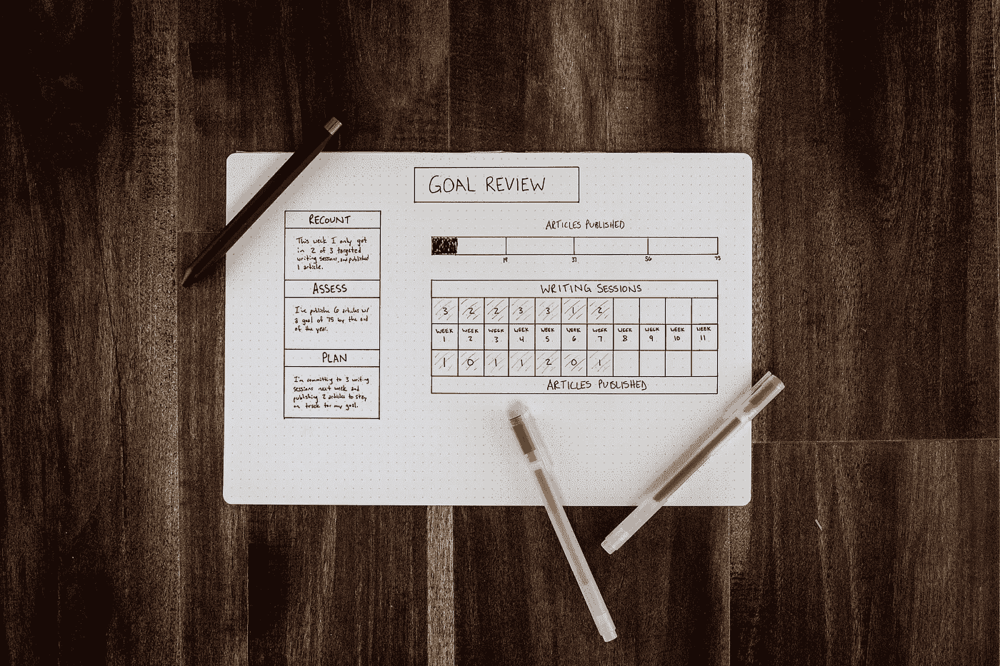

# 战术:意图，目标，执行！

> 原文：<https://medium.datadriveninvestor.com/tactics-intentions-goals-execution-ff30023109a7?source=collection_archive---------17----------------------->

[Picture By Social Cuts](http://Photo by S O C I A L . C U T on Unsplash)

## 今天，坚持自己的观点至关重要。你一直在计划；你一直在思考你做了什么，你是如何完成的。你必须执行你的计划。你需要将严格的计划和“硬核”的执行结合起来。

昨天，我和一家企业公司的 EMEA 销售主管聊天。让我们叫她珍妮丝。她一直非常鼓舞人心，我们谈到了规划是多么伟大，但更重要的是执行。

那么，珍妮丝对计划和执行有什么看法？让我解释一下。你可以尝试计划每件事，但相反，它是建立小项目和活动，并出去测试它。最有可能的是，你可能会失败，这将迫使你回到原点。

> “当我们接受第一次做一件事可能很难看，我们接受混乱和失败，我们不必假装完美。”—菲特巴德

# 意图和目标

在我看来，第一，你有一个想做某件事的想法，从那里开始，你设计你的目标，然后走出去，按照你的计划去行动。

意图是你计划(或打算)去实现的想法。如果你有所指，那就是一种意图。你的目标、目的或宗旨就是你的意图。这是你打算做的事情，不管你是否成功。

 [## 良好的生活是习惯的形成|数据驱动的投资者

### 过度思考是过度紧张。仅仅几个简单的习惯就会在一天中产生巨大的影响。那是…

www.datadriveninvestor.com](https://www.datadriveninvestor.com/2020/01/17/a-good-life-is-habit-forming/) 

一个**目标**是一个人或一群人设想、计划并致力于实现的未来或期望结果的想法。人们通过设定最后期限，努力在有限的时间内达到[目标](https://en.wikipedia.org/wiki/Goal)。

> 让我们说，你有一个好的意图去理解饮食和你的肠道的关系，但是这就足够了吗？一个好的意图并不意味着你会按照这个意图去做，除非你决定反复地学习、阅读和尝试，直到你正确地理解了这个关系。

动作是做某事的事实或过程，通常是为了达到目的。

以下是一些关键词:

> 步骤，措施，活动，运动，工作，工作，努力，发挥，操作，行动，采取步骤，采取措施，采取主动，移动，采取行动，反应，做某事。

# 简化，简化，简化

[Picture By Isaac Smith](https://unsplash.com/photos/8XlMU62ii8I)

如果你把你的目标想成一系列里程碑和接触点，而不是一大块一大块，你的大脑和你会更容易联想到它并执行它。

人类需要有一个大大的‘为什么’如果你没有读过西蒙·西内克的书，[黄金圈](https://www.youtube.com/watch?v=IPYeCltXpxw)。

你需要遵循强烈的动机，并确保你衡量进展。

> "进步的最大秘密是——一致性."—菲特巴德

# 拥抱奋斗和毅力

因此，拥抱学习曲线，对你的朋友和家人负责。向他们展示你正在朝着更大的目标努力，你需要并且想要成功。不要想当然；我们放弃得太频繁太快。

围绕一些真实的东西建立你的自尊，而不是一些脆弱的东西，比如当你说你会做某事，但你没有做到的时候接受它！

做一个尊重奋斗和毅力的女孩和男孩。围绕执行你的目标建立你的自尊。坚持自己的观点，为自己走出去尝试新事物而自豪，即使这很可怕。

> “成功不是偶然的。这需要努力工作、坚持不懈、学习、研究、牺牲，最重要的是，热爱你正在做的事情或学习做的事情。”—贝利