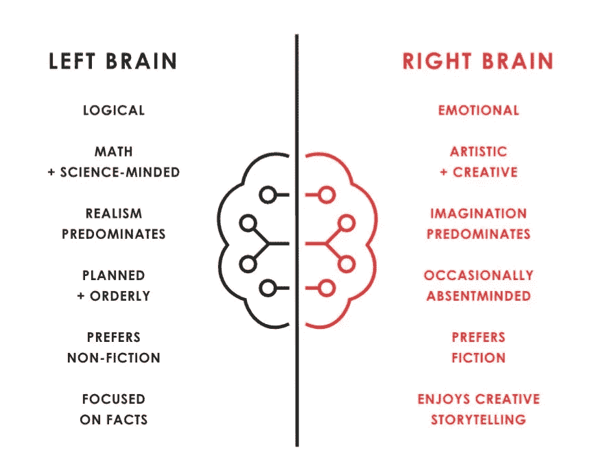
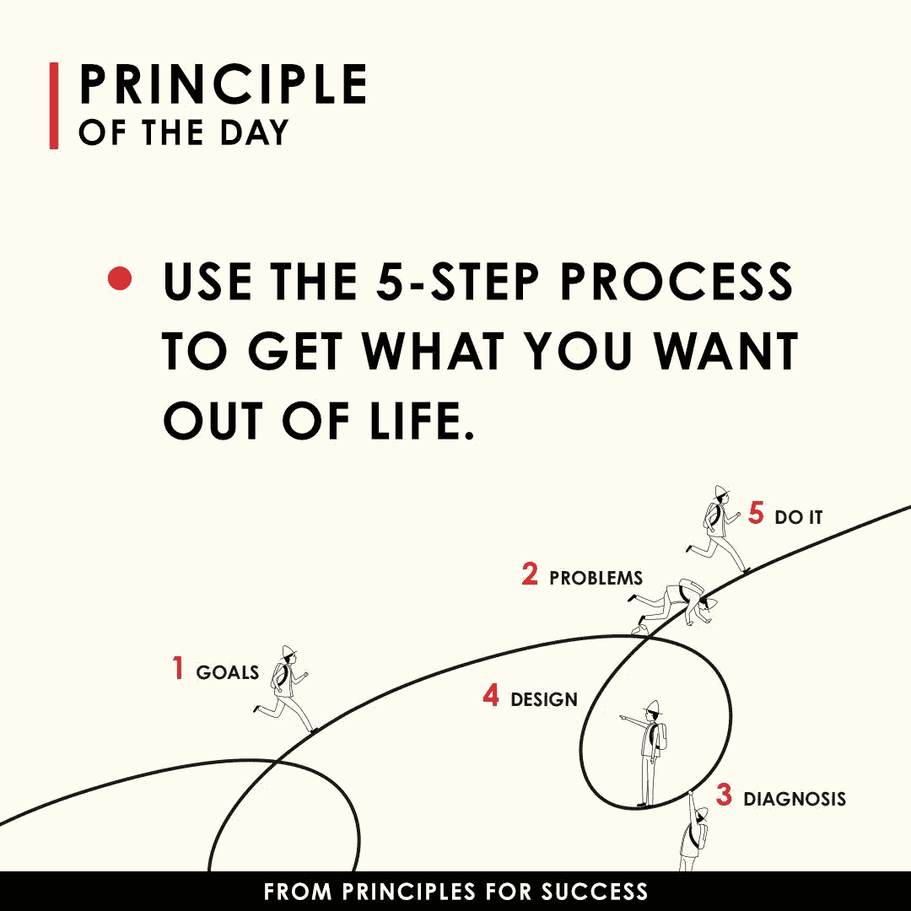
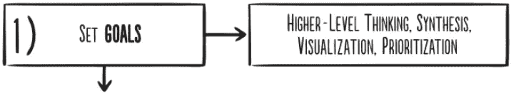
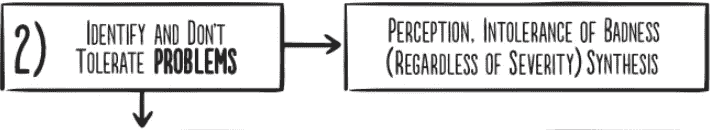
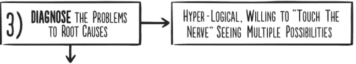
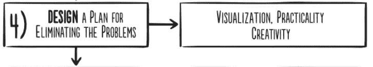
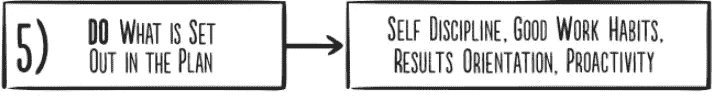

# 策略:使用 5 步过程，从生活中得到你想要的

> 原文：<https://medium.datadriveninvestor.com/tactics-use-the-5-step-process-to-get-what-you-want-out-of-life-d620a34d0c2b?source=collection_archive---------12----------------------->

Photo by [Alejandro Barba](https://unsplash.com/@albrb?utm_source=unsplash&utm_medium=referral&utm_content=creditCopyText) on [Unsplash](https://unsplash.com/s/photos/principles?utm_source=unsplash&utm_medium=referral&utm_content=creditCopyText)

## 你每天做什么？你执行，然后你反思。但是你得到你想要的了吗？你拥抱现实并处理它了吗？在前一部分中，我们讨论了雷伊·达里奥书中的一些原则。

让我们继续今天的话题，自己想想此刻你从生活中得到的是什么，到目前为止有什么结果。

你得到你想要的了吗？我必须说，每次我看雷的书，我都会从梦想回到现实。这是一个以“脚踏实地”的观点看待事物的过程。

Ray Dalio; Principles

# 2.从生活中得到你想要的东西的五个步骤

Ray Dalio; Principles

**2.1 有明确的目标**

a.分清轻重缓急:虽然你几乎可以拥有任何你想要的东西，但你不可能拥有你想要的一切。

b.不要混淆目标和欲望。

c.通过调和你的目标和愿望来决定你在生活中真正想要的是什么

d.不要把成功的表象误认为是成功本身。

e.永远不要因为你认为一个目标无法实现而排除它。

f.记住，伟大的期望创造伟大的能力。

g.如果你具备以下条件，几乎没有什么能阻止你成功:

a)灵活性

b)自我问责

h.知道如何处理好你的挫折和知道如何前进一样重要

**2.2 识别和不容忍问题**

a.将痛苦的问题视为对你尖叫的潜在改进。

b.不要因为问题植根于令人不快的严酷现实而逃避面对问题。

c.明确指出你的问题。

d.不要把一个问题的原因误认为是真正的问题。

e.区分大问题和小问题。

f.一旦你发现了问题，不要容忍它。

**2.3。诊断问题，找到问题的根源**

a.在决定做什么之前，关注“是什么”。"

b.区分近因和根本原因

c.认识到了解某人(包括你)是什么样的人会告诉你你能从他们那里得到什么。

**2.4。设计一个方案**

a.往前走之前先往回走

b.把你的问题想象成一台机器产生的一系列结果。

c.记住，实现你的目标通常有很多途径。

d.把你的计划想象成一个电影剧本，你想象随着时间的推移谁将做什么。

e.写下你对所有要看的东西的计划，并对照它来衡量你的进展。

f.认识到设计一个好的计划并不需要很多时间

**2.5 推动完成**

a.不执行计划的伟大计划者将一事无成。

b.良好的工作习惯被大大低估了。

c.建立清晰的衡量标准，以确保你在遵循你的计划。

奖金:

**2.6 记住，如果你找到解决方案，弱点并不重要**

a.看看你犯错误的模式，并确定在 5 步过程中的哪一步你通常会失败。

b.每个人都至少有一件或几件大事阻碍了他们的成功；找到你的并处理它。

**2.7 了解自己和他人的心理地图和谦逊**

所以，在这里，你有它，通过它，并学会应用这个过程，每一天。

 [## 良好的生活是习惯的形成|数据驱动的投资者

### 过度思考是过度紧张。仅仅几个简单的习惯就会在一天中产生巨大的影响。那是…

www.datadriveninvestor.com](https://www.datadriveninvestor.com/2020/01/17/a-good-life-is-habit-forming/)