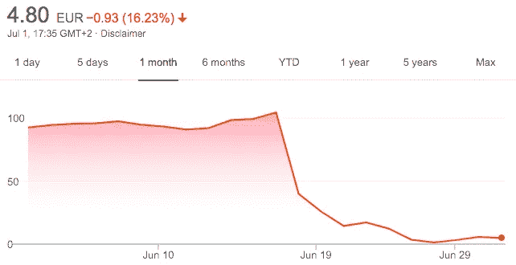

# Wirecard 和 EY 的污点之恋

> 原文：<https://medium.datadriveninvestor.com/tainted-love-of-wirecard-and-ey-d0dd4f4d71ee?source=collection_archive---------0----------------------->

## 或者是一个 20 亿美元失踪丑闻的故事

[By Imelda via Unsplash](https://unsplash.com/photos/p-ER1gHMTYY)

那些从事金融工作或者只是用 Wirecard 记账的人都知道，这家曾经备受赞誉的德国支付处理公司已经破产，原因是据称有 20 亿美元从公司账户中蒸发，或者根本就不存在。这个故事深入探讨了最近发生的一系列事件，以突出人类贪婪的价值及其对市场、Wirecard 客户和投资者的尊重影响。换句话说，这与其说是一个德国金融市场监管者被其争强好胜的女朋友背叛的爱情故事，不如说是一个关于 Wirecard - EY 关系幕后真实发生的事情以及高层友谊如何能够成就或摧毁你的假设。

## 为没有得到服务的人服务

Wirecard 最初是一家支付处理公司，它不怕弄脏自己的手，为那些形象达不到银行直接打交道的标准的公司服务。我们主要强调色情行业，坦率地说，从商业角度来看，这没有太大的问题，因为这是一个非常大的市场，必须以某种方式提供服务，尽管银行很乐意但不能直接与这些实体打交道，考虑到他们的高风险，像 Wirecard 这样的公司成为这两个对立世界之间的伟大沟通者。

 [## 加速科技银行的数字化:云和人工智能成为疫情赢家|数据驱动的投资者

### 疫情新型冠状病毒的经济效应正在把斗争推向每个国家的主要产业…

www.datadriveninvestor.com](https://www.datadriveninvestor.com/2020/05/12/speeding-up-the-digitalization-of-the-tech-banking-cloud-and-ai-as-the-pandemic-winners/) 

成为一家支付处理公司的好处在于，你不必追逐众多的个人客户，因为你可以只专注于大型平台，那些已经拥有大量用户基础的平台。举个例子，想想匈牙利廉价航空公司 Wizz Air，Wirecard 一直愉快地提供服务。这是一家一旦加入就会自动向您的处理系统添加大量支付的公司，这反过来导致利润大大增加，因为像 Wirecard 这样的公司通过对他们处理的每笔交易收取费用来谋生。这类公司也从借记卡发行中赚钱，但人们通常认为这远非领先产品。

## 遇见你的英雄

凭借着一波增长，Wirecard 迅速跻身德国最优秀的科技公司之列，也正是在那时，高层管理恋情开始了。首先，让我们快速浏览一下该公司在其漫长的存在过程中所取得的主要里程碑。

Wirecard 成立于 1999 年，由于互联网泡沫后不久的肆虐，Wirecard 几乎陷入困境，但正是在那个时候，Markus Braun 加入了该公司，注入了急需的资本，并将其完全转向服务上述未被服务的群体。不久后，Wirecard 成为一家上市公司，其股票在德国股票指数 TecDAX 交易，该指数跟踪该国科技行业 30 家最大公司的表现。值得注意的是，该指数涵盖了在营业额和市值方面排名低于 T2 DAX T3 的公司。

尽管如此，增长的浪潮从未停止，到 2018 年 9 月，Wirecard 终于加入 DAX，进入了德国商业名人堂的最高梯队。这一时刻的不可思议之处在于，此举将资产负债表价值第二大的银行[商业银行](https://www.bloomberg.com/profile/company/CBK:GR)挤出了指数，同时使 Wirecard 成为养老基金的自动投资牛！

通往这一蓝筹股市场指数的道路见证了 Wirecard 在蓝色星球上几乎所有大陆的国际扩张，这正是该公司的权力之旅开始全面生效的时候。

## 哨子和鼓风机

作为一家上市公司，Wirecard 的股票，就像任何其他交易资产一样，会受到市场涨跌的影响。这些通常来自所有可能的方向，通常从新闻文章开始，自然 Wirecard 周围有很多噪音。

2015 年，英国《金融时报》开始了[wire card 之家](https://ftalphaville.ft.com/2015/04/27/2127427/the-house-of-wirecard/)报道系列，他们质疑该公司的报道做法，并强调了可能的股价操纵。当时，报告的会计漏洞不像 20 亿美元的丑闻那样严重，这一丑闻在 2020 年初几乎摧毁了该公司，但仍高达 2.8 亿美元。随后，其他举报者揭露了结构不良的报告做法，测试了 Wirecard 股票及其承受打击的能力。

> 但是…

该公司没有降低会计不当行为的指数增长，而是决定继续前进，推出类似战争游戏的应对措施，以消除违规者。英国《金融时报》记者开始被 Wirecard 的关联个人跟踪，诉讼四处蔓延，德国金融监管机构联邦金融监管局(BaFin)禁止股票卖空，并追查对冲基金和其他市场参与者，这些人曾试图从欧洲最大金融科技公司(该公司被该国精英广泛认为)的负面信息流中获利。

BaFin 是否知道公司内部到底发生了什么，是否只是在一些内部高层管理安排的推动下，帮助掩盖了 Wirecard 的不当行为，这仍有待披露。然而，退一步，从各个角度来看，它们对 EY 报告标准的依赖至少可以说是盲目的，这一点变得非常清楚。

## 毕马威介入

毕马威的报告于 2020 年 4 月发布，是投资者对 Wirecard 遭到枪击的新闻报道做出反应的结果，报告强调了获取信息的难度，并再次质疑簿记做法的正确性。这自动意味着所有在 EY 制造的审计报告都在审查之下，并提高了举报者提供的信息变得非常真实的可能性！

> 繁荣

一个月后，6 月 5 日，联邦金融监管局开始清理现场(试图抹去自己的痕迹？)并向 Wirecard 提起刑事诉讼。从那时起，故事结束，音乐停止，墙壁开始倒塌。Wirecard 变得有毒，每个人都逃离了(尽管没有多少人能做到)。

## 曾经我奔向你，现在我逃离你

崩溃结束了。Wirecard，就其现状而言，不会被挽救，也不会反弹，即使它神奇地证明，从一开始就不存在的失踪的数十亿美元不会影响公司的账目。举报者现在可以自信地吹嘘臭名昭著的“我告诉过你”，而一度受到压力的英国《金融时报》就丑闻发表文章，就像一个发疯的打印机。但是损失呢？

作为一家上市公司，这意味着有大量的个人、交易员、基金和银行现在必须计算他们的损失。Wirecard 股票花了两天时间才从 100 美元跌到 2 美元，几乎把公司股票变成了一文不值的废纸。此外，成功发行的€5 亿欧元债券现在是“无息俱乐部”的正式参与者，这意味着将不会有投资回报，而债券本身在丑闻爆发时已经以 0.2 美分至 1 美元的价格交易，这使其成为自 2008 年金融危机以来第一只获得星星的欧元债券。

Bloomberg Quicktake

## 紧密联系、贪婪和“声誉良好”的公司

公司管理层取得的一系列成就。首先，他们无可争议地达到了许多其他公司做梦都想不到的高度，但随后又艰难、快速、不可逆转地冲了下去。

那么这一切背后的原因到底是什么，这一切究竟是如何发生的？我们试着通过权衡上述事实来一起回答吧！

如前所述，你的人脉越广，展现在你面前的可能性就越大。Wirecard 的管理层看到了稳定和扩张的业务增长，他们乘坐电梯，来到大楼顶部的鸡尾酒吧，碰巧的是，EY 的高层管理人员坐在那里，喝着饮料，欣赏着风景。据推测，正是在那个时候，第一个市场操纵思想的种子被种下，其主要目标是向投资者和公众提供“改变的”信息，实际上以对双方都有利的方式控制股价。值得注意的是，这些不是公司的目标，而是个人的目标。

至少这对 ey 管理层来说是合理的，否则他们为什么要降低 EY 著名的审计质量，并参与报告操纵呢？！一定有什么，因为现在 EY 的未来是严峻和黯淡的，因为相信他们的判断的投资者现在起诉该公司，试图归还他们承担的一部分损失。

> 值得吗？大概不会。

不幸的是，对于 Wirecard 来说，毕马威并不那么顺从，根据他们的最终报告，与 EY 相比，他们显然对柜台交易不感兴趣。然后，正如通常发生的那样，这拖垮了整个 Wirecard，冲走了这种行为和协议通常依赖的薄弱基础。

最后但并非最不重要的一点是，这应该是对我们所有人的一个很好的提醒，大公司是由人领导的，而人容易贪婪，这通常是非法行为的原因，即使是有信誉的实体也会变成一个假设。

## 线卡故事更新

*   [彭博](https://www.bloomberg.com/news/articles/2021-04-17/ey-s-wirecard-audits-faulted-by-german-parliament-investigator)进一步报道了 EY 未能报告 Wirecard 不当行为。(17.04.2021)
*   [德意志银行因有线卡纠纷](http://Financial Times: Deutsche Bank may ditch EY as its auditor after Wirecard scandal.
    https://www.ft.com/content/39e8aec5-5422-47e5-88e8-45e22b94cc4c)取消其 EY 合同。(26.05.2021)

## 访问专家视图— [订阅 DDI 英特尔](https://datadriveninvestor.com/ddi-intel)