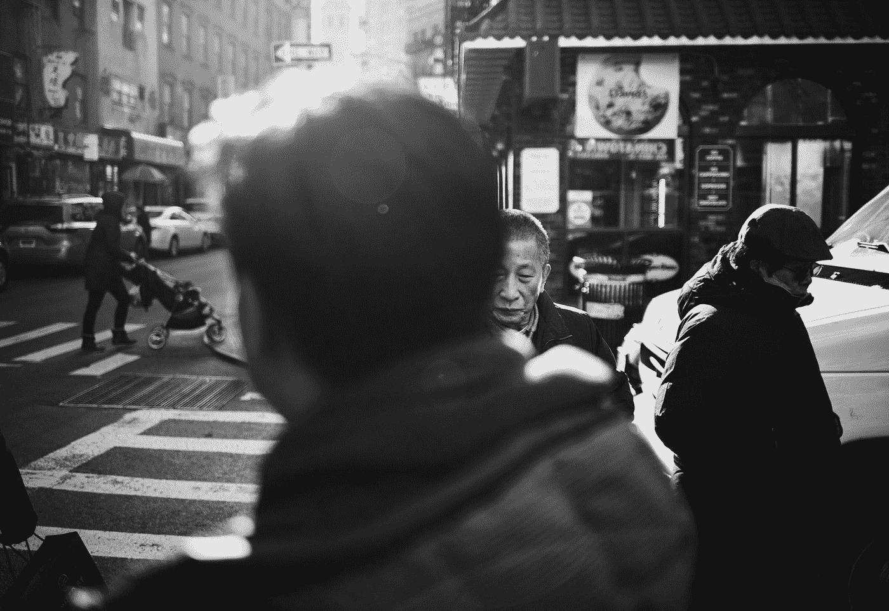
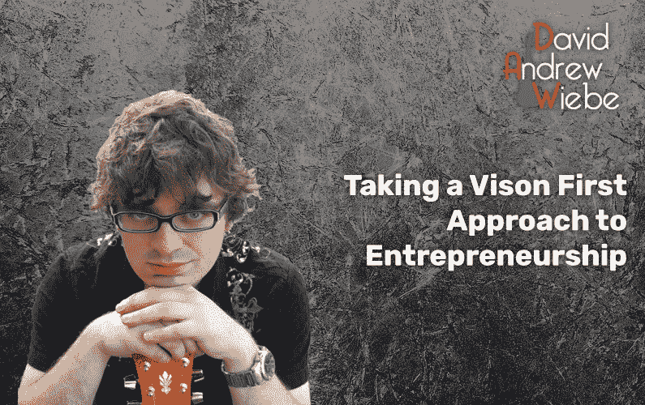

# 以愿景为先的创业方法

> 原文：<https://medium.datadriveninvestor.com/taking-a-vision-first-approach-to-entrepreneurship-a69249f28a52?source=collection_archive---------30----------------------->

Photo by [Nicholas Green](https://unsplash.com/@nickxshotz?utm_source=medium&utm_medium=referral) on [Unsplash](https://unsplash.com?utm_source=medium&utm_medium=referral)

我正处于沮丧的顶点。我的智囊团可以看出。

他们告诉我，不管我有多沮丧，我都应该坚持这个过程至少一年，然后再决定它是否有效。

我能看出其中的智慧。但我并没有感到任何沮丧。这一切都没有改变，直到我终于去休息。

在那里，我开始接受以愿景为先的创业方式的智慧。

# 开辟道路

我们进入自由职业、商业或其他非传统职业的原因是因为我们有一个想法。这个想法让我们兴奋不已，以至于不采取行动似乎很愚蠢。

然而，当需要对我们的业务做出决策时，我们往往采取完全不同的方法，忘记了我们的根源，放弃了它赖以建立的基础。

当我们开始创业时，我们开始对可能性感到兴奋，忽略了所有良好的感觉和相互矛盾的指导。不管别人说什么，我们都坚持这个想法。

但在某个时候，事情变得完全不同了。这变成了钱的问题。

# 金钱第一，眼光第二？

商业只不过是一个产生收入的系统。

我曾在一次网络活动中听到过这句话，当时，它似乎意义深远。

没错，商业应该是一个系统。它应该会产生收入。如果可能的话，应该就这么简单。

但是这个公式中缺少了太多的人性，生活，冒险，甚至实现。我从未听过有人说他们不想要那些东西，却过度关注他们没有得到的结果。

《福布斯》撰稿人[克里斯·西维克](https://www.forbes.com/sites/work-in-progress/2010/10/21/career-fulfillment-why-it-matters/?sh=2db3c3b64af0)说:

> *职业成就感可以改变你的现实。*

哇哦。

我试着在我的生意中把钱放在第一位。这让我的工作时间越来越长，而回报却越来越少。

你可能会认为事实正好相反——工作更努力、时间更长会带来更大的商业成果。我的经历绝不是这样。

同样，很多业务都是反直觉的。

# 等钱…

一度，商业是关于愿景的。为你也为我。

我们看到了为自己和他人创造一些东西的可能性。我们看到了双赢，甚至可能是三赢。

基于这一愿景，我们做出了尽快推进这一计划的决策。

但是在某个时候，旧的程序开始起作用了。突然间，我们停止了信心的飞跃，而是开始等待资金的到来。

“没有钱，我无法发起那项倡议。”

"我在等钱进来，这样我就可以在广告上投入更多。"

“我正在攒钱买那个将会改变游戏规则的应用程序。”

这可能会抑制增长。但我们还是这样做了，因为这似乎是明智的做法。正确的方法。公认的方式。

我们忘记了我们的事业是建立在什么基础上的，它抛弃了所有的“理智”,而倾向于抓住并驱使我们的未来愿景。

# 你的心呢？

当我们开始创业的时候，我们没有用头脑看到我们的未来。我们用心去看了。我们感受到了它。

但是在某些时候，决策变成了头脑知识。对环境做出反应，而不是积极主动地将我们的愿景变为现实。

正如转型喜剧演员[凯尔·塞奥斯](https://kylecease.com/)经常说的，我们应该用我们的心而不是我们的头脑来领导，因为我们的心比我们用我们的头脑想出的更好的主意。

问题是我们经常变得不耐烦，没有[沉思](https://davidandrewwiebe.com/meditation-what-works-for-me/)或与自己坐在一起足够长的时间去感知我们的心想要对我们说什么。

因此，我们不是从一个清晰和可能的空间创造，而是从一个未解决的痛苦、成瘾、创伤等等的空间创造。

# 那么，我该如何采取视觉优先的方法呢？

正如书中建议的 [*真人超铀。步骤 I-V*](https://davidandrewwiebe.com/realitytransurfing) 由 Vadim Zeland(附属链接)我们必须把愿景放在第一位。如果我们首先遵循我们的愿景，金钱就会随之而来。

这不一定容易或简单。因为恐惧会碍事。

我们可能会看着自己的银行账户，对自己说，“不，跟着感觉走太冒险了。”

我们可能会考虑到我们到目前为止所取得的成就，然后说，“那太好了，但是我还不够好。”

这并没有阻止我们创业。但是现在我们已经走上了这条路，并且一次又一次地被挑战和失望击倒，我们开始对自己失去信心。

但仅此而已。这是个好消息，因为我们可以中断这种流动，回到信仰的道路上。

通常，如果我们真的想把愿景放在第一位，这就是我们必须开始的地方。因为我们通常会发现自己处于沮丧或失望的循环中。

打断心流可以简单到花两周时间去反思。[这对我很管用](https://davidawiebe.medium.com/lessons-from-2-weeks-in-vernon-5dc739a7210e)。

然后，问题是找到什么让你对再次创业感到兴奋。你想到的想法可能看起来很疯狂。他们甚至看起来不可能。

但是如果你优先考虑这些想法，你会发现自己又一次把愿景放在了第一位。

# 视觉第一的方法，最后的想法

在你的业务中采取愿景优先的方法并不容易。因为这往往涉及到豁出去。

但是你必须记住这正是你开始的方式。你抛弃了别人可能称之为明智的想法，还是给自己冒了一次险。

除此之外，这是一个在模式出现时识别它们的问题。每一个承诺都伴随着挑战。如果你反抗 T1，游戏就结束了。回到起点。如果你拥抱它，你会越过它，发现自己正站在目的地。

但正如我常说的，肉就是旅程，所以你最好享受旅程！

*原载于 2020 年 12 月 7 日*[*【https://davidandrewwiebe.com】*](https://davidandrewwiebe.com/taking-a-vision-first-approach-to-entrepreneurship/)*。*