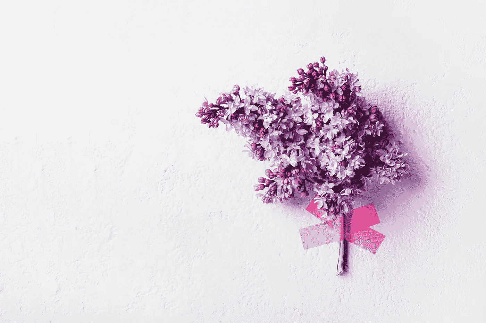

# 照顾好自己，迎接挑战

> 原文：<https://medium.datadriveninvestor.com/taking-care-of-myself-and-staying-present-in-challenges-2d94e0e6791a?source=collection_archive---------38----------------------->

## 如何先照顾好我内心的快乐

[https://www.canva.com/p/artbrn/](https://www.canva.com/p/artbrn/)

触发器每天都在发生，在我们所处的时代更是如此。某人说了或做了某件事，从而触发了。排队的人问你为什么不能站得远一点，或者你说了一些别人不喜欢的话，遭到了愤怒的盯视。

这是一种感觉，它肯定是存在的。

因为有如此多的恐惧和不确定性，所以找到让我感到安全和踏实的事情是非常关键的。

 [## 定义新冠肺炎时代的“生活”|数据驱动的投资者

### 我和妻子即将进行一个月的自我隔离，以避免感染冠状病毒。我们都 70 多了…

www.datadriveninvestor.com](https://www.datadriveninvestor.com/2020/04/23/defining-life-in-the-time-of-covid-19/) 

环境也有很大的不同。学会如何在所有的愤怒和挫折中保护自己的能量，在治愈自己的过程中是如此重要。放下我自己的信念，比如*“让人们一直开心”、“不要让别人不开心”、“T1”和*“不要表达你的感受”*，是一项正在进行的工作，因为这些想法不再为我服务了。*

专注于我自己和我自己的能量提醒我回到我自己。赶上其他人会消耗我的精力，因此，我专注于改变我无法改变的事物和/或人。我只能改变我能控制的事情。我能控制的是我对它们的反应。我可以专注于服务于我的精神，而不是生气和感受内心的愤怒。

我可以去大自然中散步/跑步，当我与其他跑步者、母亲和他们的孩子、鸟类、足球场上的飞球一起穿梭于繁忙的公共空间时，我会提醒自己在场。在繁忙的空间中航行迫使我活在当下，这样我就可以躲避和应对我无法控制的事情。当事情变得棘手时，我提醒自己继续前进，专注于我的呼吸——这是对我自己生活的一个很好的比喻。继续前进，采取行动，即使它是如此具有挑战性，以至于我想放弃和停止。通过痛苦和挫折，我不断提醒自己*“这一切都会过去的。”*

做一些事情，如散步/跑步，听个人发展视频，与支持和富有同情心的人联系，为我的灵魂和精神服务，这些都是非常重要的。对我来说，提醒就是不断采取行动，尽我所能让自己站出来——即使别人不理解和/或不听，我知道我在为自己做正确的事情，不管他们怎么想。

采取行动创造自信和对自己的信任。这意味着我的话是有意义的——最重要的是，对我自己和他人。出席会议、面试、承诺=小赢创造动力。随着时间的推移，小胜利会创造更大的胜利。

允许自己找到适合自己的解决方案，对于相信我内心的指引/直觉是很有价值的。我必须不断提醒自己，我会找到适合我的最佳解决方案…即使我此时此刻看不到它们就在我面前。

所以如果你正面临挑战，感觉希望已经没有了，那就和自己签到，提醒自己那些带给你快乐的事情。这种简单的心态转变可以改变你的情绪，也许会在困难时期创造更多的轻松和舒适。

**订阅** [**卡罗琳咨询**](https://www.carolynconsulting.com/) **获取更多更新。**

## 访问专家视图— [订阅 DDI 英特尔](https://datadriveninvestor.com/ddi-intel)