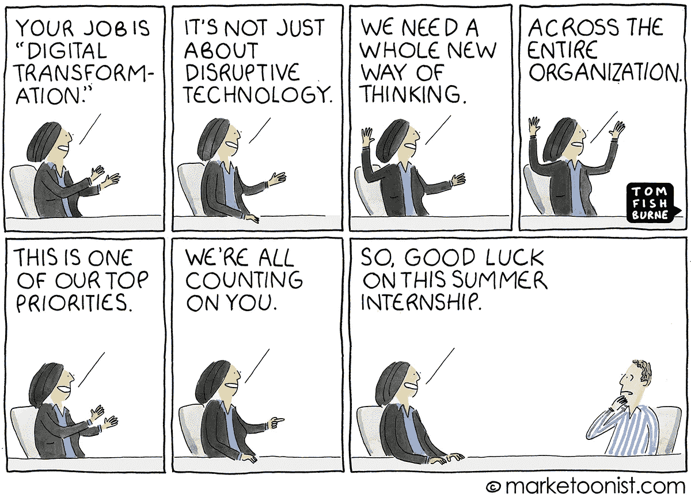

# 热门话题——数字工作场所

> 原文：<https://medium.datadriveninvestor.com/talk-of-the-town-digital-workplace-30387a4d6c1f?source=collection_archive---------12----------------------->

## 是工具还是全新的程序？

数字工作场所在市场上有许多不同的定义，由供应商、业务最终用户、研究分析师和影响者给出。尽管它的定义不一致，但我们已经找到了一个更好的解决方法，而且这样看起来更好。

我们没有走词源学的路线，而是通过确定“数字工作场所”的目的。正如我们所想的，它是关于在任何给定的工作场所减少混乱的。

## 混乱的职场是什么样子的？

*   成堆的文件
*   混乱的操作
*   令人厌烦的过程
*   在不需要的工具上下大赌注
*   不开心的员工
*   咄咄逼人的管理
*   团队合作徒劳无功
*   持续的生产力损失
*   停滞的收入

所有这些必须给你一个感觉，你是否在这种情况下。许多组织在数字化转型的学习方面进行了大量投资，但在执行方面却很少或没有影响。

 [## 数据驱动始于数据素养|数据驱动的投资者

### 光是听到“数据”这个词就令人生畏。老实说，只有 21%的全球员工对自己的工作充满信心

www.datadriveninvestor.com](https://www.datadriveninvestor.com/2020/03/22/data-driven-starts-with-data-literacy/) 

鉴于数字工具无穷无尽的可用性，预示着更好的工作未来，对于应用程序领导者或任何商业用户来说，这是一个令人厌倦的旅程。有几个基本部分需要结合在一起，才能形成一个*整体解决方案*，以加强数字化转型工作。

## Gartner 说，

> 数字化工作场所使新的、更有效的工作方式成为可能；提高员工参与度和敏捷性，并利用面向消费者的风格和技术。

## IDC 认为，

> 随着现代企业中的数字工作场所变得越来越复杂，它也变得越来越独立于硬件平台。从高层管理人员到兼职员工，每个人都应该能够使用各种通信渠道，从任何设备和任何地理位置参与业务运营并访问企业资源。
> 
> 响应速度和实时决策能力对于现代企业的成功至关重要。

很多时候，组织试图仅仅通过查看浮华的新闻和供应商做的公关噱头来复制流行的决策。**应用负责人**和采购职位的负责人必须首先深入了解*运营*和*组织需求。*

现实情况是，一个组织中有几个具有独特功能的部门，了解系统中每个利益相关者的需求确实很难。

为了缓解这种令人不安的局面，市场上出现了由[**低代码/无代码**厂商](https://kissflow.com/)造成的大规模混乱。其任务主要是分散软件/解决方案，并将“**数字化**”的力量从 IT 转移到任何类型的商业用户。

这一特殊的运动将软件在线性和垂直市场的使用提升到了一个全新的水平。随着优化和创新**业务流程/流程**的能力越来越强，应用领导者在生产力和业务成果方面实现了巨大的飞跃。

## 数字工作场所是一个单一的统一平台还是一堆工具？

> 一大群人主张数字化工作场所是一套相互集成的工具，以获得更好的员工体验。
> 
> 另一个群体对数字工作场所有着彻底的期望— [单一平台](https://kissflow.com/digital-workplace/top-priorities-for-a-thriving-digital-workplace/)作为任何类型用户(员工、客户、合作伙伴等)完成任何类型工作的直观界面。

Gartner 将数字化工作场所确定为“ [**新工作核心**](https://www.gartner.com/en/documents/3953515/hype-cycle-for-the-digital-workplace-2019) ”。这意味着在接下来的几十年里，员工将会最喜欢的几种工具的出现。主要分为 4 个不同的分类，

> 1.协同工作管理
> 
> 2.WS(工作流协作)
> 
> 3.MS(会议解决方案)

然而，数字工作场所的实际可用性和设计只能由最终用户认可。

这可能是一种全新的意识形态，作为高管之间的讨论而存在，并以员工系统中的一堆应用程序而告终。

或者，它可能会成为一个巨大的破坏者，需要一个单一的整体平台来实现更好的业务运营，并通过有效的团队合作/ [协作](https://kissflow.com/collaboration/top-5-workplace-collaboration-tools-for-business/)来实现更好的结果。

## 将被继续…