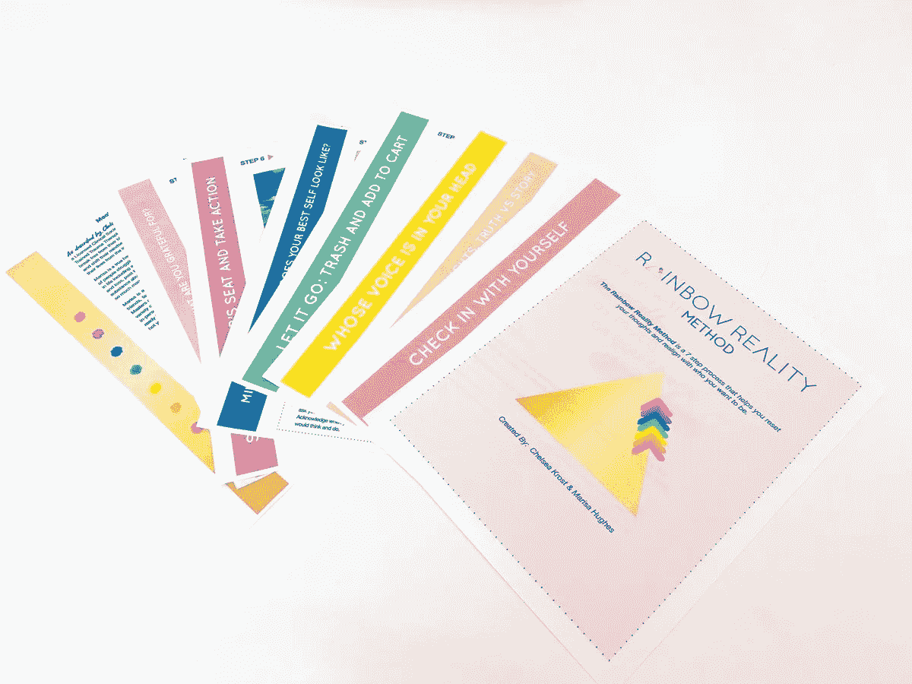
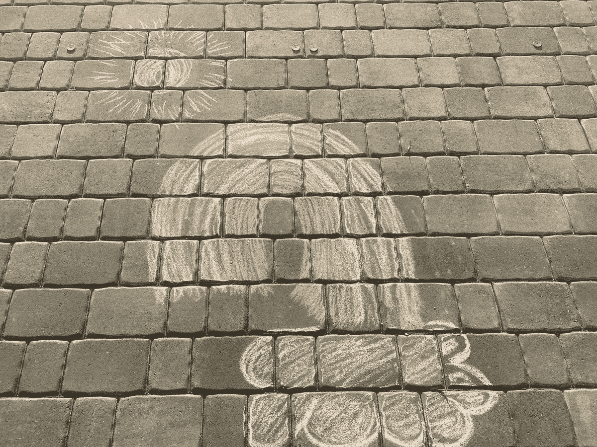

# 利用恐惧获得力量

> 原文：<https://medium.datadriveninvestor.com/tap-into-fear-for-strength-bbf54673b632?source=collection_archive---------14----------------------->

## 尊重并理解如何疏导普遍的恐惧

压力会激发人们的创造力。管理恐惧可以重新引导能量，在精神上和身体上——在职业上和个人上——产生好的效果。

急剧变化的时代需要变革狂热者的工业力量技能，其中[莫尼卡·伯格](https://twitter.com/monicaberg74/)声称是特许会员。她将自己的智慧和对现实生活的认识结合在一起，与处于人生不同阶段的众多男性和女性进行了令人信服的交谈。

今天的世界对许多人来说是一个未知的领域，包括千禧一代的首席专家和顶级营销和品牌策略师[切尔西·克罗斯特](https://twitter.com/ChelseaKrost)。在她的#MillennialTalk Twitter 聊天中，她与伯格谈到了引导弥漫社会的恐惧。

在一场前所未有的危机中，如果背景中没有一点恐惧，那是不正常的。采取合理的预防措施有助于内心平静。

“恐惧的感觉没有错——尤其是现在，”伯格说。“它很高，非常真实。尊重现在的恐惧并理解它是自然的是第一步。

她说:“这种类型的恐惧被称为‘健康恐惧’，有着重要的作用。”“这是我们内部的警报。它帮助我们对自己的幸福做出重要而谨慎的决定。当我们采取有力的行动时，我们的恐惧减少了一半。”

我想起了美国神学家雷茵霍尔德·尼布尔的话:“请赐予我平静去接受我不能改变的事情，赐予我勇气去改变我能改变的事情，并赐予我智慧去分辨两者的不同。”

伯格利用了这种情绪。

“当我们谈论消除恐惧时，我们谈论的是不合逻辑的恐惧，”她说。“这些通常来自于对我们无法控制的事情的痴迷。在这个时候，专注于我们可以控制的事情是消除这种不健康和无益的恐惧的一种方式。”

# **避免不必要的压力**

克罗斯特说，所有这些似乎都是同时发生的，“没有必要给自己施加不必要的压力。我们都有权去感受我们拥有的任何感觉，只要它们没有战胜我们。

“在这个不确定的时期，我们能做的就是关注我们能控制的，”她说。“为了更接近最终目标，你可以采取什么有目的的行动？婴儿的步伐和婴儿的胜利至关重要。”

管理恐惧的最好工具是事实。你需要一个健康的视角来看待你所面临的事情，这样你才能采取最明智的行动。

“我们可以改变我们的想法，但这个疫情肯定是真实的，我们都应该承认它是粗糙的，”克罗斯特说。“这也会过去的。我们忘记了自己到底有多坚强和有韧性。”

最好的防御之一是不接受恐惧是事实。

“转变恐惧体验的最快方法是挑战恐惧背后的想法，”伯格说，他认为当恐惧的想法出现时，人们应该问自己三个问题:

*   我身边有什么与这种思想相矛盾的？
*   如果这个可怕的想法成为现实，我能采取什么行动呢？
*   这种想法是基于现在，还是基于我的恐惧？

“以这种方式挑战你的想法会让你回到那一刻，”伯格说。“你可以专注于你能控制的事情。”

恐惧会让人身心不安。

“我们身体对恐惧的生理反应几乎完全是自主的，”伯格说。“我们不会有意识地触发它，但我们可以开始熟悉我们身体的特定反应。

“这来自我们的杏仁核:我们大脑的一部分，它释放引发战斗或逃跑反应的神经递质，”她说。“它是恐惧和肾上腺素分泌的生理症状的原因，在紧急情况下，肾上腺素分泌可以拯救我们的生命。”

# **没有相同的响应**

尽管人们各不相同，但他们对恐惧的反应也是如此。

“症状因人而异，”伯格说。通常包括心率加快、呼吸急促、头晕、出汗、颤抖，有时甚至出现恶心、消化功能障碍和昏厥

克罗斯特补充了恐惧和焦虑的其他表现方式:

*   头痛
*   紧实的胸部
*   慢性疲劳
*   皮疹

在最恐惧的时候，生活中的大小事情仍然有感恩的空间，甚至是树上的鸟儿和新一天的阳光。

伯格说:“当我们陷入绝望或恐惧的境地时，很难转变为感激，但挖掘感激之情将有助于缓解这些感觉。”

“此时此刻，你会惊讶地发现有多少事情值得你感激，”她说。“它们包括你的健康，你所爱的人的健康，你冰箱里的食物，你拥有的技术。利用你身边的环境是融入这种欣赏的快捷方式。”

做笔记是一种有用的、令人放心的练习。

伯格说:“每天开始练习写下三件你感激的事情，不管是在你的手机里、日记里还是仅仅在你的脑海里。”“你会让自己在一天中寻找更多美好的事情，而不是令人沮丧的事情。”

克罗斯特用感恩的方式来反击消极的想法:

*   大声说出来练习。
*   写我的日记。
*   通过移动冥想。
*   画画的时候。
*   烹饪。
*   创造性的释放和重置。

# **惬意舒适**

伯格讨论了应对技巧，以帮助管理幽居热和隔离。

“我的第一个建议是开始练习 hygge(T1)，这是丹麦的舒适艺术，”她说。“鉴于我们足不出户，创造舒适的环境不仅有助于舒适，还可以非常鼓舞人心。

“如果可以的话，出去走走，”伯格说。“阳光对我们的身心健康是必不可少的。即使是绕着街区走 30 分钟也有助于缓解幽居病。只是一定要和别人保持六英尺的距离。”

在线联系至关重要。

“利用技术的力量，”伯格说。“对于那些与世隔绝的人来说，你仍然可以与你所爱的人保持数字联系。我强烈建议每天都这样做。”

Krost 对抗幽居症的主要武器之一是她的[彩虹现实法:7 步让你的心态复位](https://www.rainbowrealitymethod.com/)。

“这是一个很好的心态重置工具，你可以通过自己和家人一起工作，”她说。“选择专注于你能控制的事情，活在当下，重新定位你想成为的人，从而找到你的力量。

克罗斯特说:“在这种与世隔绝的环境中，我们更多地求助于科技，保持与自然的联系是非常重要的。”。

为了消除恐惧，伯格建议问两个问题:

*   如果我不害怕，我会做什么？
*   恐惧从我这里偷走了什么？

人们可以将恐惧转化为创造力，而不是掠夺思想和身体。

“找到你能控制的东西，然后控制它，”伯格说。“重组你的办公室。清理你的衣柜。订购种子来种植一个花园。如果你有立即做这件事的能力，那就去做吧。

“学点新东西，”她说。“网上几乎什么都有教程，从尤克里里琴到编织再到水彩画。如果你真的雄心勃勃，你可以开始学习一门新的语言，或者参加网上大学课程。许多人现在甚至是免费的。”

# **步活泼**

保持体力活动是必不可少的。

“移动你的身体，”伯格说。“你可以去上在线舞蹈课。即使只是随着你喜欢的播放列表摇摆，也是一种让能量在体内流动的好方法。如果你感到特别焦虑，按下播放键，尽情跳舞。”

克罗斯特发现简单的娱乐可以让人平静。

“我不知道我有多喜欢粉笔艺术，我有多想念绘画，”她说。“与你的艺术自我联系起来的感觉真好。这是一种非常好的治疗和情感释放方式。”

从全球角度来看，一场影响数十亿人的危机提供了一幅大画面和重大教训。

伯格说:“在我们这个追求即时满足的现代社会，我们已经忘记了如何去关心他人。”“我们已经忘记了，我们只和我们当中最弱小的人一样强大。这种病毒清楚地表明了这一点。

“我看到的教训是，用一种社区意识重新联系彼此，”她说。“当如此多的人类同胞处于痛苦、疾病或饥饿之中时，我们不可能真正感到满足。”

伯格希望出现更好的前景。

她说:“这场危机将使我们所有人重新意识到，我们如何才能更好地引导我们的社会走向互相关心和支持。”

克罗斯特看到了一线希望。

“随着城市继续被封锁，世界各地城市地区的空气污染似乎已经减少，”她说。

# **革故鼎新**

应对危机是反对现状的最好论据。“这是我们一贯的做事方式”不再是答案。

“想想你的生活发生了巨大变化的所有方面，”伯格说。“你是否发现，没有了你过去认为快乐‘需要’的东西，你也能轻松地生活？

“我们非常幸运，”她说。“我们正以全新的方式意识到这一点。这种欣赏可以改变我们体验生活的方式，就像用新鲜的眼光看待事物一样。”

变化延伸到工作生活中。

“从专业角度来说，这让我们真正决定我们是在做自己喜欢的事情，还是因为错误的原因而过度劳累，”伯格说。“然后是它如何帮助我们简化流程。”

她加入了完整生活的关键要素。

“充实的生活始于感恩，”伯格说。“当我们用对活着的感激之情填满我们的杯子和内心时，我们就与宇宙的创造力量结盟，不管这对你意味着什么。

“随着我们展现更深层次的感激，我们也开始培养我们的快乐和幸福，”她说。“这是所有创造力的所在地。当我们富有创造力时，我们以美好而深刻的方式生活、表达和体验生活——从我们的人际关系到我们的职业生涯。”

这些都不会是细微的变化。

伯格说:“当我们充满感激和喜悦时，我们会从根本上分享和提供善意。”“我们与周围的人联系并激励他们。然后我们的目标就实现了。没有什么比这更有成就感了。”

Krost 保留了她充实生活的主要成分:

*   有目的地生活
*   让自己快乐并感到幸福
*   拥有强大的支持系统

**关于作者**

吉姆·卡扎曼是[拉戈金融服务公司](http://largofinancialservices.com/)的经理，曾在空军和联邦政府的公共事务部门工作。你可以在[推特](https://twitter.com/JKatzaman)、[脸书](https://www.facebook.com/jim.katzaman)和 [LinkedIn](https://www.linkedin.com/in/jim-katzaman-33641b21/) 上和他联系。