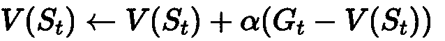
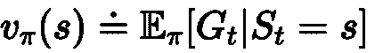
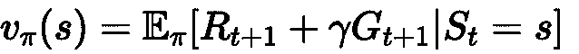
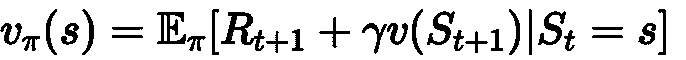
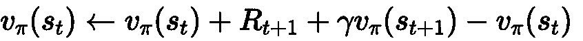
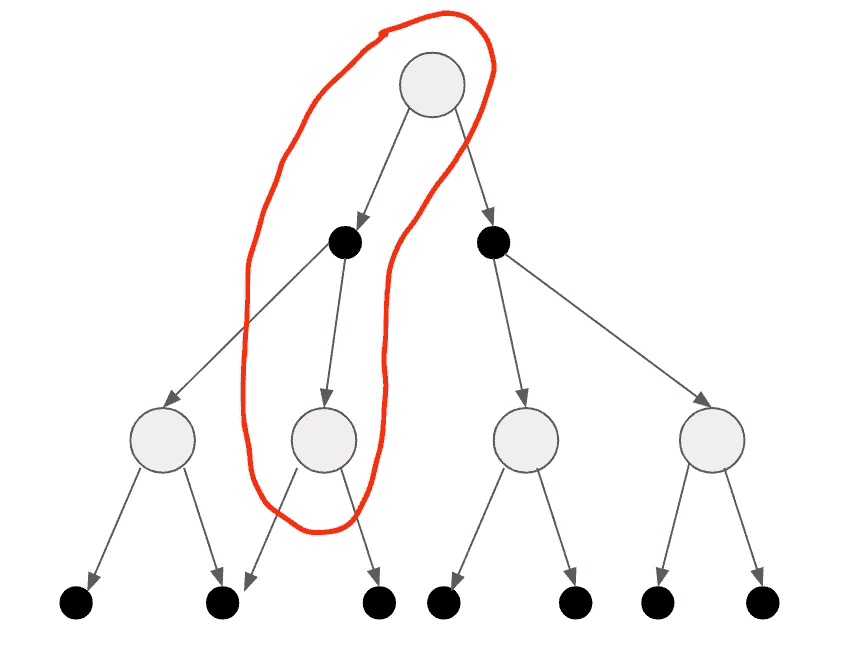
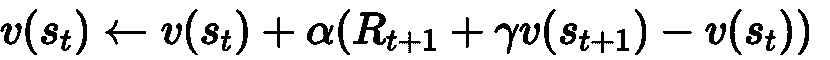
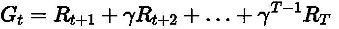

# TD 学习——解决评估问题

> 原文：<https://medium.datadriveninvestor.com/td-learning-solving-the-evaluation-problem-7f63b658414c?source=collection_archive---------6----------------------->

在[上一篇博文](https://medium.com/datadriveninvestor/reinforcement-learning-monte-carlo-for-policy-evaluation-312fd2e8331d)中，我们已经讨论了蒙特卡罗如何解决无模型环境的评估问题。

但是蒙特卡洛也有它的缺点。当考虑连续序列时，它并不理想。例如，核反应堆的冷却系统怎么样。也许只是我…但是如果这能一周七天没日没夜地工作，那就太好了。没有吗？

我们想在实际播出许多不同的剧集之前，对*的状况有一个估计。这对于我们的核反应堆例子来说很有意义，在这里，我们不想等到达到事件的结束状态“因爆炸而灭绝”之后，才考虑改变坏状态的值。*

这就是时间差异学习或 TD 学习算法发挥作用的地方。同样，我只展示如何解决评估/预测问题。为了简单起见，我将集中讨论 v_π(s)。

# TD(0)学习

先说 TD(0)。

就像上一篇关于蒙特卡洛的文章一样，我们正面临着一个无模型的环境，而且一开始还不知道转移概率。代理仍然需要首先通过经验了解底层环境。

然而，为了避免等到一集结束，我们需要唤醒我们的老朋友**贝尔曼方程式** …耶！

我们使用我们所知道的贝尔曼方程来更新一个状态的值，但是这次我们没有考虑所有未来可能的结果。我们遵循策略π一步，并通过从状态 s_t 采取动作 *a* 而结束于状态 s_t+1。

请记住，对于增量蒙特卡罗，我们在本集结束时做了以下工作来更新 v(s ):

现在，我们不用等到这一集结束才得到 G_t，而是看一看**贝尔曼期望方程**:

v_π(s)就是 G_t 的期望值，我们知道可以将 G_t 分解如下:

即时报酬 R_t+1 和 G_t+1，这正好是下一个状态 *s* 的贴现状态值:

我们最终用期望的即时回报加上期望的贴现状态值来代替 G_t，这是遵循π策略的下一个状态的值。

所以，现在在贝尔曼*期望*等式中，我们有一个期望。这意味着我们考虑了所有可能状态的概率，以及通过遵循策略π从 s 得到平均值可能得到的回报。但是在无模型的环境中，我们事先不知道转移概率。

我们使用该知识来修改上面用于增量蒙特卡罗方法的公式，以更新 v_π(s)。我们只需从贝尔曼期望方程中去掉期望，并用 G_t 代替:

该公式告诉我们如何在采取每一步后更新 v_π(s ),而不是等待获得完整的 G_t。代理按照策略π从状态 s_t 采取动作 a。通过采取该动作，代理最终处于状态 s_t+1。对于那个状态，我们有一个估计，一个猜测，它的状态值 v_π(s_+1)。我们用它来更新 vπ。

右边是我们对 s 的当前状态值的估计，在 TD 学习中 R_t+1 + γv_π(s_t+1)称为 **TD 目标**。这样做的原因是，我们希望我们的当前状态更接近目标。我们通过获取 TD 目标和当前状态的差值并将其加到我们的当前值上来实现这一点。

这种使用不完整情节和对未来状态值的估计来逐步更新状态值的技术被称为**自举**。在每次迭代的每一步，我们更新每个 v_π(s)的估计值。

TD(0): Instead of considering the complete trajectory, only one step is considered to update the current state-value.

但现在你会说:但这怎么能行得通呢，沃尔特？我的意思是我们只考虑一种可能的结果，然后直接更新 vπ(s)。我们最终可能进入的所有其他状态都不会被认为是更新状态值！

是的，Billy，你是对的，但是如果我们像在蒙特卡洛那样运行很多很多次，那么代理可能会选择不同的路线并在不同的州结束。通过多次重复这个过程，我们越来越接近真实的状态值。

让我们也把步长α放回到公式中。α是一个介于 0 和 1 之间的值，它描述了添加的值对 v(s)的旧值的影响程度。它告诉我们离目标有多远:

# 偏差和方差权衡

偏差和方差指的是我们更新 v(s)时的**目标**的估计值。在 TD 的情况下，它是 TD 目标 R_t+1 + γv_π(s_t+1 ),在蒙特卡罗中，它是完整的轨迹 G_t。

## 偏见

先说**偏置**。偏差告诉我们，目标代表了环境中真正的潜在目标。在 TD(0)学习的情况下，偏差可能非常高，因为贴现状态值γv_π(s_t+1)只是一个估计值，它是不断更新的。“真实的”γvπ(s t+1)可能完全不同。

另一方面，对于蒙特卡洛来说，情况并非如此，因为我们使用估计的状态值**而不是**，而是使用到达轨迹终点后获得的 G_t。而且我们知道 v_π(s) = G_t，不用估计。我们不是在那里自举，只是使用我们观察到的真实回报。

## 差异

当然，对于蒙特卡洛来说，在遵循随机策略π的两个不同轨迹中，同一个状态的 G_t 可能完全不同。对于一个轨迹，它可能有一个很高的值，而对于另一个轨迹，它可能有一个很低的值。这叫做**方差，**嗯，因为数值变化**。**蒙特卡洛中的方差可能非常高，因为状态值取决于完整的轨迹:

每个轨迹的每个贴现 R_t+i 可以是不同的，因为我们有一个随机政策和一个环境，它以一定的概率将我们的代理人抛向不同的状态。两者都给轨迹的每个部分增加了一些随机性(或“噪声”)。

相反，TD(0)的方差很低。为什么？因为我们只考虑一步。我们对下一个 R_t+1 有一些随机性，但仅此而已。在这一步之后，我们直接更新我们对状态值的估计。

## 感谢阅读！

在接下来的文章中，我将讨论 TD(n)和 TD(λ)。