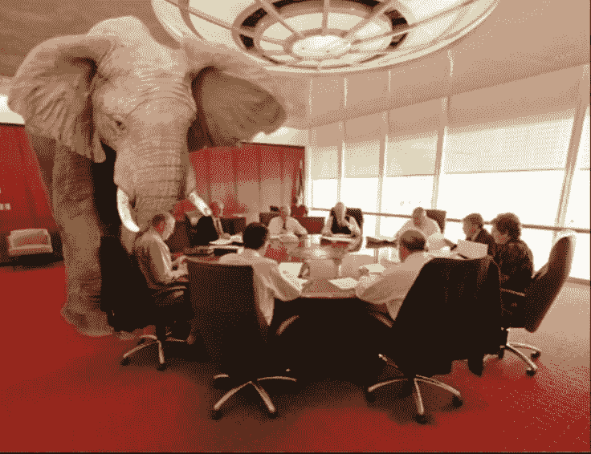

# TDS 诊断:你看不出来——钢琴里的大象践踏其实是天才！

> 原文：<https://medium.datadriveninvestor.com/tds-diagnosis-cant-you-see-the-elephant-trampling-in-the-piano-is-actually-a-genius-473aa8c44d14?source=collection_archive---------24----------------------->

## :(我真傻，我在想阴谋和假新闻

inc.com

从阅读 Julio Vincent Gambuto 的精彩文章**的评论到**，我被这个*非常非常*中肯的评论所打动:

> “一篇优秀的文章，写得很好，发人深省。如此悲伤，你遭受了这么多的 TDS，你不能帮助自己试图指责总统。这是我们走到一起的大好机会，而你，像所有那些患有 TDS 的人一样，将它视为另一个玩指责游戏的机会。好难过。”

看了这篇评论我了解到有一种痛苦叫做 TDS。这有点像发现房间里有一头大象。大象踩在钢琴上——他实际上是个天才！

forbes.com

大象的冠状病毒漫谈给人们注射消毒剂和紫外线——根据他后来的说法——具有讽刺意味。那是一个巨大的天才发现！

## 大象终于把“美国第一”

美国有最多的冠状病毒病例。
美国因冠状病毒死亡的人数最多。2600 万美国人失去了工作。

# 信息泛滥的时代

我们生活在一个信息泛滥的时代，我们都容易受到错误信息和虚假信息的影响。困难的是知道什么是真相，什么不是真相。

我们能相信谁和什么？哪些信息是不可信的，相对于我们所看到的、听到的、相信的和看到的，我们能做些什么来保证安全？

当科罗纳危机开始袭击我们时，当危机在许多人中间造成不确定感、恐惧和不安全感时，这是在挪威提出的一个问题。

我可以诚实地承认，我是那些被淹没在灾难性新闻中的信息淹没的人之一，电视上每天都在播放关于病毒及其威胁的广播。结果是，我被坐在电视上的分类科学家抓住了，他说我们必须关闭，我们必须立即关闭整个社区，一切。我接受了这位研究员的观点，说了同样的话:我们必须关闭，我们必须严格，我们必须呆在家里，任何人都不能出去。

 [## 冠状病毒；惊慌失措；字里行间的 z |数据驱动的投资者

### 围绕冠状病毒的话题；更准确地说，新冠肺炎几乎占据了整个新闻预报的头条…

www.datadriveninvestor.com](https://www.datadriveninvestor.com/2020/03/23/coronavirus-a-to-panic-z-between-the-lines/) 

后来我们获得了新的信息。除此之外，我还阅读了一些研究人员的文章和信息，这些研究人员对健康和医学科学进行统计。研究人员指出，统计数据显示，当我们将季节性流感与新冠肺炎进行比较时，数字很明显:虽然我国每年冬天的季节性流感平均每天导致 21 人死亡，但当前的冠状病毒疫情平均每天导致 4 人死亡。

在挪威，季节性流感导致的年均死亡人数约为 900 人，而我们现在统计的新冠肺炎病毒导致的死亡人数为 202 人。因此，如果我们比较每日和每年的死亡率，季节性流感的致命性是四到五倍。

在挪威，当局不太擅长会见疫情。国民议会(Storting)在 2019 年收到了反对派提出的建立坚实的疫情防备的建议，但政府拒绝了这一建议。

当疫情病毒开始在挪威蔓延时，挪威政府几乎完全没有准备好应对新的形势，由于病毒的威胁和对医院和医疗保健将被许多重症患者淹没和摧毁的担忧，挪威政府于 3 月 12 日决定几乎完全关闭企业、商店、餐馆、咖啡馆和酒吧、幼儿园、学校、中学和大学、理发店、理疗师等小型企业，并部分关闭交通部门和整个文化和体育界。

社交距离，经常洗手和不超过五个人同时聚集是命令。人们被鼓励呆在家里，如果可能的话，在家工作。

这背后的驱动力是对电视广播每天发布的新闻稿造成和维持的病毒污染的普遍恐惧。政府和负责的国家卫生研究所的卫生专家日复一日地在电视上描述危险和将要实施的措施。据政府消息来源称，2020 年这些措施的成本至少为 1，860 亿挪威克朗。

在 2020 年 4 月底的今天，政府已经开始重新开放这个国家，但仍然有许多活动、企业和学校仍然关闭，显然这将是今年夏天。

回想起来，人们发现该国的严重关闭范围太广，带有恐惧的特点。大约经过。闭关六周后，现在的情况是挪威感染人数很少，为 7 667 人，占人口的 0.14%(截至 2020 年 1 月 1 日为 5 367 580 人)。专家说，这个数字可能会更高，可能是 1%。

根据我们今天所掌握的、但显然在 3 月份还不具备的新知识，可以说，如此极端和强有力的措施更多地是基于恐惧和不确定性，而不是真实的事实。

政府现在正着手谨慎地重新开放挪威，在许多人看来，重新开放不太可能很快发生，这将导致许多公司面临重大财务问题，许多公司可能会破产。此外，国家的缓慢重新开放并没有使个人不受影响，围绕着关闭和严格规则的消极心理后果有着巨大的黑暗数字。

当然，我们人类将永远暴露在不确定性和恐惧中，这可能会导致不总是很好的行动。国家就是这样被关闭的，让我们国家损失了差不多两千亿。但幸运的是，这些是我们今天可以承受的成本，因为我们的国家有非常坚实的经济。与所有其他国家不同，我们有可以依赖的国家石油基金，但这仍然引发了下一个问题:

# 在我们这个信息泛滥的时代，假新闻及其同类正在发生什么？

## 这对我们和社会有什么影响？

领导人做决定的方式和他们的决定当然会深深地影响人民。

虚假信息总是被领导者所利用，他们需要影响和巩固他们在民众中的权力基础。人民普遍的不安全感——以及普遍的不满——给了当权者政治和社会权力去做坏事。

我看到不同国家之间有明显的区别。在许多国家，我们可以看到民众的高度信任。我们信任我们的领导人，我们设法一起讨论并找到好的解决办法。如果我们看到我们的领导人做错事，我们可以接受，到下次选举时，我们投票要求改变。

但在其他国家，人们悲惨地分裂，反对者坐在各自的阵营里，互相扔石头。我们现在在我们的时代看到了这一点，国际政治高层的一些行为者与高层政治家传统上并不一致，即基于民主理想，也基于理性和情感，基于事实和什么对社会和个人最好。

这一直是我们在挪威以及许多其他国家的理想目标。但如今，政客们不再总是努力诚实行事，不依靠操纵和谎言。我们今天在几个大国看到一种新型的国家领导人，在一些国家看到“强人”掌权，近年来我们在许多国家看到对人民自由的限制有所增加。

用 Julio Vincent Gambuto 的话说，冠状病毒危机之前和之后的根本问题在于:

> 我们当中最大的误解是，我们不关心彼此，这种误解每天都在这个国家造成深刻而痛苦的社会和政治紧张。白人不关心美国黑人的问题。男人不在乎女权。警察不关心他们服务的社区。人类不关心环境。这些与事实相去甚远。我们在乎。我们只是没有时间做任何事情。([胡里奥·文森特·甘布托](https://forge.medium.com/@juliovincent?source=post_page-----6a8ce3f0a0e0----------------------))

 [## 为终极煤气灯做好准备*

### 你没有疯，我的朋友

forge.medium.com](https://forge.medium.com/prepare-for-the-ultimate-gaslighting-6a8ce3f0a0e0)