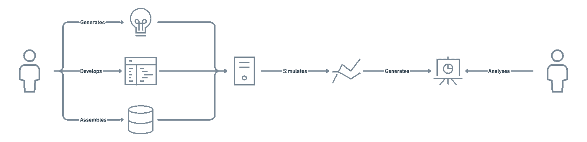
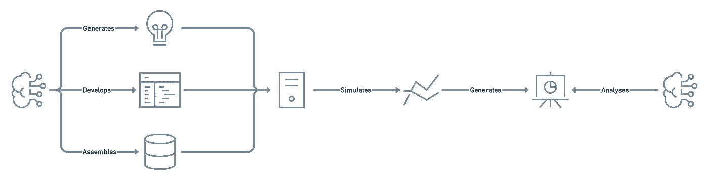
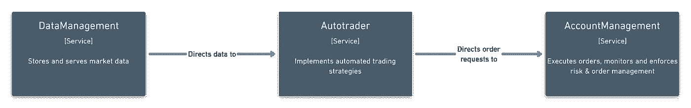
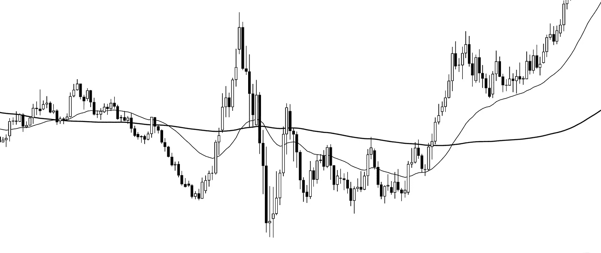
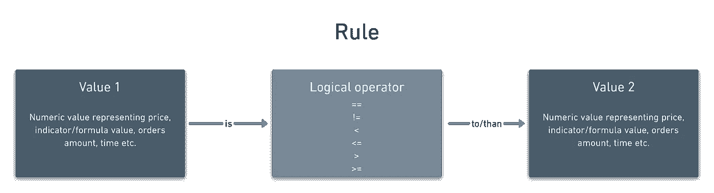
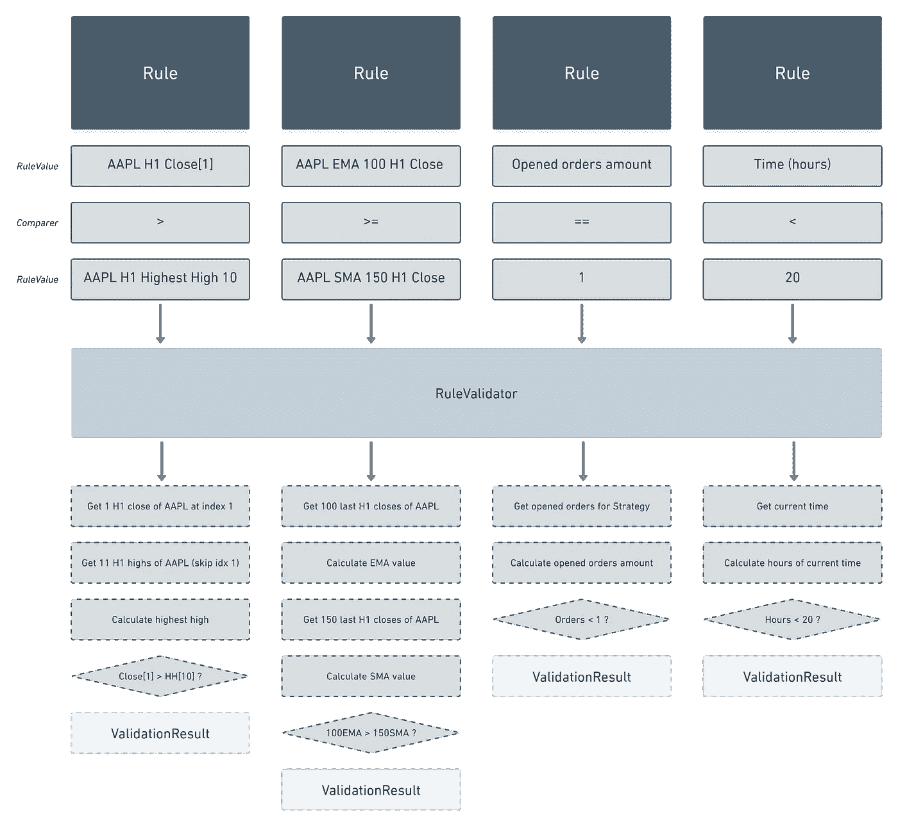
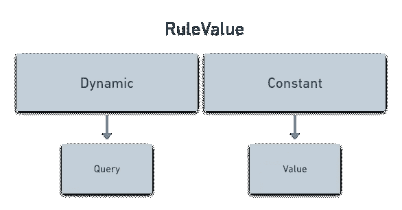
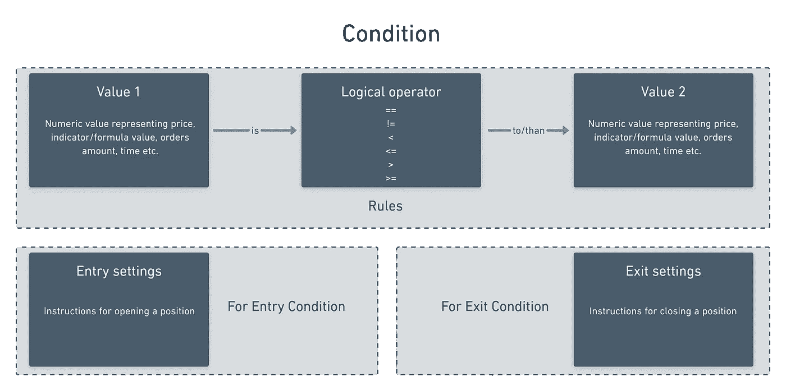
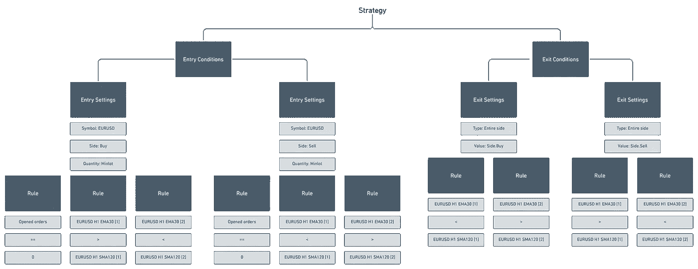
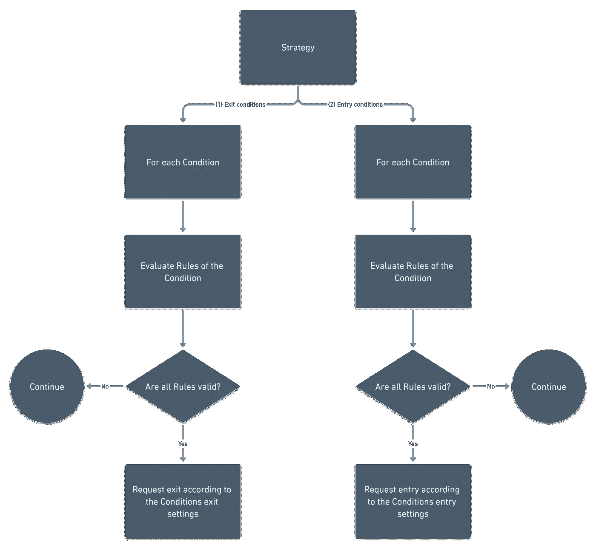

# 如何自动生成交易策略

> 原文：<https://medium.datadriveninvestor.com/teaching-a-machine-to-trade-3ef31d5918b3?source=collection_archive---------1----------------------->

## 为研究人员构建定量分析工具&神经网络



Trading strategy research cycle

交易模拟为策略的稳健性提供了快速客观的反馈。与纸质交易或实时交易相比，自动化回溯测试大大加快了研究周期，但现在大部分效率都被人为因素抵消了。如果我们能让一台机器快速试验各种公式和指标，以提出一个策略，那会怎么样？

如果我们可以告诉一个算法“尽量将我们投资组合的最大提取率保持在 15%左右”，“将一个单独的头寸保持至少 20 天”，以及“保持投资多样化”，那么剩下的就看你的了。你可以交易任何你喜欢的工具(只要它是流动的，在给定的账户规模下可以交易),只要你认为合适，只要你有信心跑赢基准，你就可以持仓。



一个有效的定量分析工具需要自动获取、解析和清理数据，拥有大量的指标和其他用于制定策略的公式，能够模拟交易结果，并最终生成大量的结论报告。

上面提到的一切的核心是一个自动交易引擎。它不仅可以被人类研究人员用来开发策略，而且还提供了现成的构建模块，神经网络可以将这些模块组合起来，用可计数的策略进行实验。一个可以用于执行模拟和步行前进分析，以及在现场市场条件下进行交易系统。

由于我一直将一个完整的对冲基金建模为微服务解决方案，我们将遵循相同的模式，只关注涉及评估策略和通知订单何时应该打开或关闭的职责。



The entire solution is explained further in [this part](https://robertmaidla.medium.com/designing-hedge-fund-microservices-from-scratch-c370e2fda4c8)

作为解决方案的主要技术手段。NET 核心，代码示例用 C#编写。

# 畴层

在详述自动交易引擎的逻辑机制之前，让我们将我们的构建模块归类到具体的模型中。换句话说，让我们弄清楚我们的域看起来会是什么样子。

用一个具体的例子建模总是更容易，因此让我们使用经典的移动平均线交叉作为我们的样本策略——当 EMA(30)交叉在 SMA(120)上方时买入欧元兑美元，两条移动平均线都基于小时收盘，位置在相反的交叉上反转。



EMA30 (thin line) and SMA120 (thick line) attached

## 规则

当报价进来时，我们应该检查是否满足定义的进场或出场条件。为此，我们需要计算移动平均线，并将它们相互比较。无论哪种策略，在某一点或另一点都必须嵌入一条规则，规定*“为了 x 发生，y 必须大于(或等于)/小于(或等于)/等于 z”*。

> 通过陈述哪两个价值以及如何相互比较，我们得到了任何战略的最重要的组成部分。姑且称之为**规则**。



策略可以由可列举的规则组成。在我们的示例策略中，输入买方订单将由以下规则定义:

```
EMA30 [1] > SMA120 [1]EMA30 [2] < SMA120 [2]
```

*[x]定义给定期间的时间索引，0 为当前正在进行的期间，1 为最近关闭的期间，2 为之前的期间，以此类推。*

这两个规则都由指标计算组成。我们还可以有包括未结/已结订单数量、时间或常数值的规则。不管组合是什么，最终，我们都需要对两个数值进行比较。数值可以是常量、预设值或动态值，必须根据比较结果进行计算。



Samples of various rules (above) with the means of arriving at the conclusions (below)

我们示例策略的规则包括动态值(计算移动平均值)，未平仓订单的数量是动态值，当前时间是动态值，等等。在开发术语中，动态规则值本质上是一个我们可以预先定义的查询，实际值/结果会随时改变。



## 情况

最终，规则必须导致一个行动——打开或关闭订单。我们可以灵活地组合任何规则组合，用某个动作来响应。把组合想成:*“如果这些规则都有效，我们应该这么做”*。

> 通过组合订单指令和一组规则，我们得到一个进入或退出的**条件**。

我们可以采取的两个行动是打开和关闭订单。在引擎盖下，它们甚至可以被视为向经纪人发送请求的单个动作(无论是提高总头寸还是平仓/平仓现有头寸)，但由于它们在策略的生命周期中具有完全不同的概念意义，我更愿意将它们视为单独的动作。因此，我们可以定义两个条件，一个用于进入，一个用于退出。两者都由一组规则组成(这些规则必须对要满足的条件都有效),并且每个规则都有相应的进入或退出设置。



输入设置包含输入订单所需的参数。最起码，我们需要知道交易应该采取的符号，订单的一方，和它的大小。我们还可以包括附加数据，如注释、获利和止损属性。有人可能会说，设定目标相当于退出订单，不应该包含在进场设定中。但是，只有在满足退出条件的规则时，才会使用退出设置。如果我们希望订单具有“个人”的退出设置(例如固定目标)，我们应该将该信息保存在接近进入设置的位置。

```
public class **EntrySettings** : ValueObject, IEntryOrExitSettings
{
    public EntrySettings(
        **Symbol** symbol, 
        **OrderSide** side, 
        **OrderQuantity** quantity,
        **OrderComment** comment,
        **OrderTakeProfit**? takeProfit=null, 
        **OrderStopLoss**? stopLoss=null)
    {if (quantity.Unit == OrderQuantityUnit.PercentageOfEquityRisk&& stopLoss?.Unit != OrderTargetUnit.Point)
            throw new InvalidOperationException("Order size based on equity risk can't be calculated without a definite stop loss.");

        Symbol = symbol;
        Side = side;
        Quantity = quantity;
        Comment = comment;
        TakeProfit = takeProfit;
        StopLoss = stopLoss;
    }

    public **Symbol** Symbol { get; }
    public **OrderSide** Side { get; }
    public **OrderQuantity** Quantity { get; }
    public **OrderComment** Comment { get; }
    public **OrderTakeProfit**? TakeProfit { get; }
    public **OrderStopLoss**? StopLoss { get; }
}
```

这里一个有趣的问题是如何动态定义订单大小，因为有多种声明方式。例如，我们可以有一个固定的订单规模(股票或手数)或一个动态的规模(余额或可用股本的 x%)。此外，当宣布止损或目标时，我们也可以有不同的策略——以价格单位表示的与进场的固定或动态距离，纯货币利润/损失(同样，固定或动态)等。我们不想限制策略开发者的能力。

动态订单规模的解决方案是将单元的类型和实际值包装在一个`OrderQuantity`类中。然后，实际的订单执行机制将根据单元类型知道使用哪个公式和给定值来计算订单大小。

```
public class **OrderQuantity** : ValueObject
{
    public OrderQuantityUnit Unit { get; }
    public double Value { get; }
}public enum **OrderQuantityUnit**
{
    Unit = 1, *// Actual value (i.e shares or lots)* SmallestUnit = 2, *// Minimum amount for the order (Value will multiply the smallest unit to get the eventual order size)* PercentageOfBalance = 3, *// The order at the point of entry should make up this % of the entire balance* PercentageOfEquity = 4, *// The order at the point of entry should make up this % of the available equity* PercentageOfEquityRisk= 5 *// How much of equity should be put under risk (for this, order must have a SL value)* }
```

让我们对具有公式定义单元类型的订单目标使用类似的策略。订单管理机制可以配置为基于单元类型进行操作，并相应地使用给定值。

```
public abstract class **OrderTarget**
{
    protected OrderTarget(OrderTargetUnit unit, double value)
    {
        Unit = unit;
        Value = value;
    }

    public OrderTargetUnit Unit { get; }
    public double Value { get; }
}

public class **OrderTakeProfit** : OrderTarget
{
    public OrderTakeProfit(OrderTargetUnit unit, double value) 
        : base(unit, value)
    {
    }
}

public class **OrderStopLoss** : OrderTarget
{
    public OrderStopLoss(OrderTargetUnit unit, double value) 
        : base(unit, value)
    {
    }
}
```

当退出条件被满足时，打开位置的一些部分应该被关闭。同样，这里有许多策略，从关闭一个订单，所有的立场基于他们的一方，一个完整的符号，最近的订单等。我们可以在这里使用类似的模式，类型定义如何使用给定的退出值。这里需要注意的一点是，我们不希望退出规则影响其他策略的头寸，因为这可能会导致严重的后果。我们将制定一般风险管理规则来监控整个投资组合，这将不是汽车交易商的责任。

```
public abstract class **ExitSettings**: ValueObject, IEntryOrExitSettings
{
    public ExitSettings(ExitType type)
    {
        Type = type;
    }

    public ExitType Type { get; }
}public enum ExitType
{
    EntirePosition = 1, *// Only affecting the position opened by the strategy* EntireSide = 2, *// Only affecting the position opened by the strategy* PercentageOfPosition = 3, *// Only affecting the position opened by the strategy* LastOrder = 4, *// Only accounting an order opened by the strategy* OldestOrder = 5, *// Only accounting an order opened by the strategy* EntireSymbol = 6 *// Only accounting an order opened by the strategy* }public class **LastOrder** : ExitSettings
{
    public LastOrder() : base(ExitType.LastOrder)
    {
    }
}

public class **EntireSymbol** : ExitSettings
{
    public Symbol Symbol { get; }

    public EntireSymbol(Symbol symbol) : base(ExitType.EntireSymbol)
    {
        Symbol = symbol;
    }
}

public class **PercentageOfPosition** : ExitSettings
{
    public double Percentage { get; }

    public PercentageOfPosition(double percentage) : base(ExitType.PercentageOfPosition)
    {
        Percentage = percentage;
    }
}
```

注意，由于各种出口类型的实际值有不同的类型，我已经将出口类型包装到单独的类中，所有这些类都来自同一个`ExitSettings`基类。

## 战略

能够制定可枚举的规则组合来进入或退出交易已经是一个通用的解决方案，但就其本身而言，它并没有为我们提供策略所需的所有功能。以我们目前的均线交叉策略为例，它满足了我们的所有需求，但是如果我们想在势头对我们有利时增加头寸或增加任何其他条件呢？我们目前可以声明一个单一的进入和退出条件，但是现在我们想要组合另一组规则，这将触发具有不同设置的进入。简而言之，这需要再退一步，能够结合众多条件。

> 通过结合各种进入和退出条件，我们得到一个 T2 策略 T3。

```
public class **Strategy**{
    public StrategyId Id { get; }
    public string Description { get; }
    public ImmutableList<EntryCondition> **EntryConditions** { get; private set; }
    public ImmutableList<ExitCondition> **ExitConditions** { get; private set; }

    public Strategy(
        StrategyId id
        string description,
        IEnumerable<EntryCondition> entryConditions, 
        IEnumerable<ExitCondition> exitConditions)
    {
        Id = id;
        Description = description;
        EntryConditions = entryConditions.ToImmutableList();
        ExitConditions = exitConditions.ToImmutableList(); if (EntryConditions.IsEmpty || ExitConditions.IsEmpty) 
            throw new InvalidOperationException();
    }
}
```

现在我们可以组合规则(由动态值组成)来组成进入或退出条件，我们可以组合条件来对市场条件做出多种反应。有了 4 层(规则值、规则、条件和策略)，我们可以灵活地实现我们喜欢的任何自动化技术交易系统。此外，我们可以在一个账户上同时运行多种策略，并且我们可以将多个账户组合成一个投资组合。



Sample strategy model visualized

回到最初的目标，我们最终可以建立一个神经网络来试验不同的规则和进/出设置，看看哪一个被证明是最有利可图的。唯一需要硬编码的组件是对`RuleValues`的实际查询和对入口/出口的设置，其他的都可以组合或动态生成。更重要的是，一个策略并不局限于一个单一的符号，依赖于一个单一的时间框架。

# 应用层

现在我们已经定义了核心领域模型，让我们设置从接收新数据点到请求订单的管道。

首先，我们需要创建并激活一个策略。利用 [CQRS](https://martinfowler.com/bliki/CQRS.html) 的良好实践，我们应该使用一个命令来初始化一个新的策略对象(使用提供的条件)并将它存储在某个地方。为了简化，让我们使用一个 [singleton](https://docs.microsoft.com/en-us/dotnet/core/extensions/dependency-injection#service-lifetimes) 提供者，它保存了一组激活的策略。将策略保存在内存中可以节省我们的数据库之旅，因为每个新的数据点都需要访问活动的策略。然而，为了弹性，策略应该保存在数据库中，并在应用程序启动时预加载到`StrategyProvider`服务中。当应用程序运行时，我们可以在任何需要的时候激活或停用一个策略。在激活策略时，应用程序还应该订阅基础符号的价格馈送。

自动交易机制感兴趣的主要入站消息是一个新数据点。这些信息以事件的形式到达我们的服务——更具体地说，是`SymbolUpdatedEvents`。该事件包含有关新数据点的信息(外汇的要价/出价、股票的交易价格和交易量)。

然后我们需要找出哪些策略对这个数据点感兴趣。为此，我们需要检查每个活动策略的每个进入和退出条件，并浏览所有规则，以查看是否有任何潜在的动态值依赖于该符号。考虑到单个符号每秒可以产生数十个数据点，这听起来像是大量的循环。我们也可以在一个策略产生的时候确定它的符号。然而，只有当规则的符号在策略的整个生命周期中保持不变时，才能做到这一点。稍后会详细介绍。



How the strategy should be assessed upon a suitable SymbolUpdatedEvent

对新数据点的策略评估发生在`AssessStrategies`命令中。我们从注入的`StrategyProvider`服务中获取主动策略，过滤掉对符号不感兴趣的，评估条件。任何成功评估的条件(意味着条件中的所有规则都有效)都将导致执行请求，无论是退出还是进入。这是通过相应的命令来完成的，这些命令将委派任务，实际的执行不是自动交易者的责任，而是由我们系统中的另一个服务来处理。然而，条件评估的方式值得更仔细的检查。

[](https://www.datadriveninvestor.com/2020/12/09/9-lessons-learned-about-stock-trading-during-covid-19/) [## 新冠肺炎期间股票交易的 9 个教训|数据驱动的投资者

### 在你浏览之前，让我告诉你一些关于我自己的情况。我是…

www.datadriveninvestor.com](https://www.datadriveninvestor.com/2020/12/09/9-lessons-learned-about-stock-trading-during-covid-19/) 

自然，我们希望系统尽可能高效和有弹性，因此我们应该异步和并行地评估感兴趣的策略的所有条件。但是，如果其中一个进场规则规定，例如，未平仓订单的数量应该小于 1。在处理数据点之前打开订单，输入条件将不会得到成功的评估。然而，如果相同的数据点导致成功的退出条件并因此退出，它将使进入条件有效。如果我们在几毫秒内获得新数据，这可能不是一个大问题，但是如果数据以每天的时间间隔处理呢？结论是，我们应该在进入之前评估退出条件，同时我们可以跨策略分别并行运行它们。下面是命令处理程序内部的策略评估。

```
public async Task<Result> Handle(**AssessStrategiesCommand** command, CancellationToken cancellationToken)
{ *// EXITS* var interestedStrategiesForExits = _strategyProvider.Strategies
        .Where(strategy => strategy.ExitCalculationSymbols.Contains(command.DataPoint.**Symbol**));

    var exitEvaluationResults = await Task
        .WhenAll(interestedStrategiesForExits.Select(strategy => **_exitEvaluator.Evaluate(strategy.ExitConditions)**));

    var exitDetails = exitEvaluationResults
        .Where(result => result.IsSuccess)
        .SelectMany(result => result.Details);

    exitDetails
        .ToList()
        .ForEach(async details => 
        await _commandProcessor.ExecuteCommand(new **RequestExitCommand**(command.Actor, details.Settings)));

    *// ENTRIES* var interestedStrategiesForEntries = _strategyProvider.Strategies
        .Where(strategy => strategy.EntryCalculationSymbols.Contains(command.DataPoint.**Symbol**));

    var entryEvaluationResults = await Task
        .WhenAll(interestedStrategiesForEntries.Select(strategy => **_entryEvaluator.Evaluate(strategy.EntryConditions)**));

    var entryDetails = entryEvaluationResults
        .Where(result => result.IsSuccess)
        .SelectMany(result => result.Details);

    entryDetails
        .ToList()
        .ForEach(async details => 
            await _commandProcessor.ExecuteCommand(new **RequestEntryCommand**(command.Actor, details.Settings)));

    return Result.Success();
}
```

前面例子中的策略类缺少`Entry`和`ExitCalculationSymbols`属性。这两个都是下面的`CalculationSymbols`类的实例:

```
*/// <summary>
/// Determines the symbols whose data points trigger calculations
/// </summary>* public class **CalculationSymbols** : ValueObject
{
    public bool IsAny => Symbols.IsEmpty;
    public ImmutableList<Symbol> Symbols { get; private set; }
    public bool Contains(Symbol symbol) => Symbols.Contains(symbol) || IsAny;

    public CalculationSymbols(IEnumerable<Symbol> symbols)
    {
        Symbols = symbols.ToImmutableList();
    }

    public CalculationSymbols(params Symbol[] symbols)
    {
        Symbols = symbols.ToImmutableList();
    }

    public static CalculationSymbols Any()
    {
        return new CalculationSymbols();
    }

    public static CalculationSymbols Merge(params CalculationSymbols[] calculationSymbols)
    {
        return new CalculationSymbols(calculationSymbols.SelectMany(x => x.Symbols).Distinct());
    }

    public static CalculationSymbols Merge(IEnumerable<CalculationSymbols> calculationSymbols)
    {
        return new CalculationSymbols(calculationSymbols.SelectMany(x => x.Symbols).Distinct());
    }
}
```

在`Entry` -和`ExitEvaluator`中，我们分别评估每个条件。这种额外的包装使`AssessStrategiesCommand`处理程序更加简单，并使我们能够将所有评估的条件打包成一个单独的`Response`包，供策略执行。如果多个条件给出肯定的评价，这是为执行分配权重或优先级的地方。

成功评估后，返回一个带有执行细节的`Response`对象。`Details`包含关于所有被验证的规则的信息(用于提供信息，以了解哪些规则确实触发了退出)和实际的执行设置(在域部分中有详细描述)。

这两种评估机制几乎是相同的，但是我选择将它们分开并复制，因为它们可能需要单独的优化(例如，如果策略一开始就没有未结订单，就没有必要评估退出条件)。

```
public class **EntryEvaluator** : IEntryEvaluator
{
    private readonly IConditionEvaluator _conditionEvaluator;

    public EntryEvaluator(IConditionEvaluator conditionEvaluator)
    {
        _conditionEvaluator = conditionEvaluator;
    }

    public async Task<EntryEvaluationResult> **Evaluate**(IEnumerable<EntryCondition> conditions)
    {
        var details = await GetDetails(conditions).ToListAsync();

        return details.Any() ? EntryEvaluationResult.Success(details) : EntryEvaluationResult.Failure();
    }

    private async IAsyncEnumerable<EntryDetails> **GetDetails**(IEnumerable<EntryCondition> conditions)
    {
        foreach (var condition in conditions)
        {
            var conditionEvaluationResult = await _conditionEvaluator.Evaluate(condition);
            if (conditionEvaluationResult.IsSuccess)
                yield return new EntryDetails(conditionEvaluationResult, condition.Settings);
        }
    }
}
```

条件计算器只是在给定的条件下验证每个规则。然后它组装一个`ConditionEvaluationResult`，而 T6 又包含`RuleValidationResults`。一个条件是否成功取决于是否所有的规则都有一个成功的内部比较。

```
public class **ConditionEvaluator** : IConditionEvaluator
{
    private readonly IRuleValidator _ruleValidator;

    public ConditionEvaluator(IRuleValidator ruleValidator)
    {
        _ruleValidator = ruleValidator;
    }

    public async Task<ConditionEvaluationResult> **Evaluate**(Condition condition)
    {
        var ruleValidationResults = await Task.WhenAll(condition.Rules.Select(x => _ruleValidator.Validate(x)));
        return new ConditionEvaluationResult(ruleValidationResults);
    }
}
```

我们正接近战略的核心——比较。在此之前，我们需要计算规则中的动态值。请记住，一个规则有两个值，它们将根据定义的逻辑运算符进行比较。这两个值中至少有一个需要是动态的，否则，我们的比较将总是产生一个恒定的响应。

由于动态规则值依赖于某种外部数据(或数据序列)，我们必须考虑到查询无法获取所有必要数据来计算值的可能性。如果其中一个潜在值是基于不完整的数据计算的，我们不会希望在规则内进行比较。因此，在这种情况下，`CalculationQuery`处理程序返回一个失败，这反过来将自动导致一个无效的规则验证。

```
public class **RuleValidator** : IRuleValidator
{
    private readonly IQueryProcessor _queryProcessor;
    private readonly IValueComparer _valueComparer;

    public RuleValidator(IQueryProcessor queryProcessor, IValueComparer valueComparer)
    {
        _queryProcessor = queryProcessor;
        _valueComparer = valueComparer;
    }

    public async Task<RuleValidationResult> **Validate**(Rule rule)
    {
        var ruleValues = await Task.WhenAll(new[]
        {
            GetRuleValue(rule.Value1),
            GetRuleValue(rule.Value2)
        });

        var calculationErrors = ruleValues
            .Where(x => x.IsFailure)
            .Select(x => x.Error)
            .ToArray();

        if (calculationErrors.Any())
            return new RuleValidationResult(calculationErrors);

        var comparisonSucceeds = _valueComparer.Compare(ruleValues.First().Value, rule.LogicalOperator, ruleValues.Last().Value);
        return comparisonSucceeds
            ? RuleValidationResult.Success()
            : RuleValidationResult.Failure(ResultError.WithError("Value comparison did not succeed"));
    }

    private async Task<Result<decimal>> **GetRuleValue**(RuleValue ruleValue)
    {
        return ruleValue switch
        {
            ConstantRuleValue x => Result<decimal>.Success(x.Value),
            DynamicRuleValue x => await _queryProcessor.ExecuteQuery(x.Query),_ => throw new ArgumentOutOfRangeException()
        };
    }
}
```

## 动态值查询

用技术术语来说，获取动态值本质上是一个查询。查询处理程序必须获取所需的数据序列，然后对数据执行特定的公式。为此，我们需要知道时间框架和数据序列的符号。由于公式可能依赖于多个符号(例如在计算比率时)，我将这些符号包装在前面提到的`CalculationSymbols`类中。

计算会消耗大量内存，这就是为什么在相同的数据集上重复相同的计算是不合理的。由于可能有多种策略同时运行，我们很容易发现自己依赖于相似的底层计算。让我们使用一个名为`CalculationQuery`的包装类，它可以在以后用于在这种情况下执行缓存逻辑(或者我们可以使用`CalculationQueryHandler`)。

```
public abstract class **CalculationQuery**<TResult> : Query<TResult>
{
    public TimeFrame TimeFrame { get; }
    public CalculationSymbols Symbols { get; }

    protected CalculationQuery(TimeFrame timeFrame, CalculationSymbols symbols)
    {
        TimeFrame = timeFrame;
        Symbols = symbols;
    }
}
```

计算的实际公式将保存在一个具体的`CalculationQuery`处理程序中。在这里，您可以看到在我们没有获得足够数据的情况下如何返回一个失败。目前，只实现了简单的移动平均线。我们可以以`CalculationQueries`的形式定义无数的指标或任何其他计算，供最终开发人员使用。移动平均查询如下所示:

```
public class **MovingAverageCalculationQuery** : CalculationQuery<Result<decimal>>
{
    public AppliedPrice AppliedPrice { get; }
    public DataSeriesIndex Index { get; }
    public DataSeriesLength Length { get; }
    public MAMethod Method { get; private set; }
    public Symbol Symbol => Symbols.Symbols.Single();

    public MovingAverageCalculationQuery(
        TimeFrame timeFrame, 
        Symbol symbol,
        AppliedPrice appliedPrice,
        DataSeriesIndex index,
        DataSeriesLength length,
        MAMethod method) 
        : base(timeFrame, new CalculationSymbols(symbol))
    {
        AppliedPrice = appliedPrice;
        Index = index;
        Length = length;
        Method = method;
    }

    internal class **Handler** : ICalculationQueryHandler<MovingAverageCalculationQuery, Result<decimal>>
    {
        private readonly IDataSeriesProvider _dataSeriesProvider;

        public Handler(IDataSeriesProvider dataSeriesProvider)
        {
            _dataSeriesProvider = dataSeriesProvider;
        }

        public async Task<Result<decimal>> **Handle**(MovingAverageCalculationQuery query, CancellationToken cancellationToken)
        {
            var dataSeriesResult = await _dataSeriesProvider.Provide(query.Symbol, query.TimeFrame, query.AppliedPrice, query.Length, query.Index);
            if (dataSeriesResult.IsFailure)
                return Result<decimal>.Failure(dataSeriesResult.Error);

            var dataSeries = dataSeriesResult.Value;
            return query.Method switch
            {
                MAMethod.Simple=> Result.Success(dataSeries.Values.Average()),
                _ => throw new NotImplementedException()
            };
        }
    }
}
```

现在剩下的唯一事情就是比较这两个值。这是在一个`ValueComparer`服务中完成的，该服务解析逻辑操作符类型并比较两个值。

```
public class **ValueComparer** : IValueComparer
{
    public bool Compare(decimal value1, LogicalOperator logicalOperator, decimal value2)
    {
        return logicalOperator switch
        {
            LogicalOperator.Equal=> value1 == value2,
            LogicalOperator.NotEqual=> value1 != value2,
            LogicalOperator.GreaterThan=> value1 > value2,
            LogicalOperator.GreaterThanOrEqual=> value1 >= value2,
            LogicalOperator.LesserThan=> value1 < value2,
            LogicalOperator.LesserThanOrEqual=> value1 <= value2,
            _ => throw new ArgumentOutOfRangeException()
        };
    }
}
```

# 后续步骤

当前的解决方案提供了实现和模拟技术交易策略的核心逻辑。然而，今后仍有许多问题需要关注。

## **潜在问题**

由于系统是异步的，所以确保每当对新数据点做出反应时，在获取数据序列时也考虑到它是很重要的。例如，如果我们得到一个下午 1 点的报价(这将开始一个小时的周期),并且我们对我们的一些查询使用一个小时的时间间隔，那么在处理相应的计算查询时，数据系列提供者必须已经在一个小时的数据系列中考虑了该报价。因此，启动工作流的事件被称为`SymbolUpdatedEvent`，而不是`DataPointReceivedEvent`(数据组装逻辑应该考虑到这一点)。

多个进/出条件同时为真怎么办？如果在一个策略中执行一个订单会立即使同一策略的另一个有效条件无效(例如，包含一个未结订单金额规则)，该怎么办？成功评估后，条件应该具有权重或优先级，以确定执行顺序。在评估条件时，我们也可能需要放弃并行性。

应该仔细处理数据，以确保数据点的时间被转换成系统内的同一时区。此外，应考虑分割，以获得调整后的价格序列。最后，股息和报名费也应包括在最终报告中，以便在回测时给出最现实的结果预测。

## **优化**

虽然建模倾向于一个优雅的解决方案，而不是高频交易引擎，但我相信有很多方法可以优化当前的解决方案，值得考虑。目前，我们根据新数据点的符号过滤掉了整个策略。如果在策略中有 10 条规则，其中只有 1 条对符号感兴趣。我们应该让过滤更接近实际的`CalculationQueries`。此外，例如，如果我们想要获得每日数据序列的移动平均值，我们不应该对每个数据点重复计算。

## **限制/约束**

当前的解决方案与基于基础符号价格的技术策略一起工作。这可能会导致一种潜在的偏见，理想情况下，我们希望根据某些基本或技术标准为我们的策略过滤符号。因此，我们不仅需要对价格数据做出反应，还需要对宏观经济和基本面数据以及任何形式的替代数据做出反应。我们可以通过不同的生命周期事件(类似于`SymbolUpdatedEvents`)来实现，并且只评估对给定数据感兴趣的条件。

另一个限制是，目前的`CalculationQuery`只允许对纯价格数据进行计算。我们还应该包括数据序列的形式，以便我们不仅可以计算某个符号的价格的标准差，还可以计算我们认为合适的任何数据的标准差(例如，给定行业的最后 10 个季度收益)。

# 摘要

总而言之，有一些重要的事情需要调整解决方案。也就是说，在当前的形式下，引擎已经可以模拟技术策略了。

除了高效的引擎，我们的目标是为开发交易策略提供一个通用的、灵活的、可重用的解决方案。如果不需要手动硬编码每个策略就可以组合各种零碎的东西，我们最终不仅可以自动化策略的评估，还可以自动化实际的创建和分析过程。

访问专家视图— [**订阅 DDI 英特尔**](https://datadriveninvestor.com/ddi-intel)