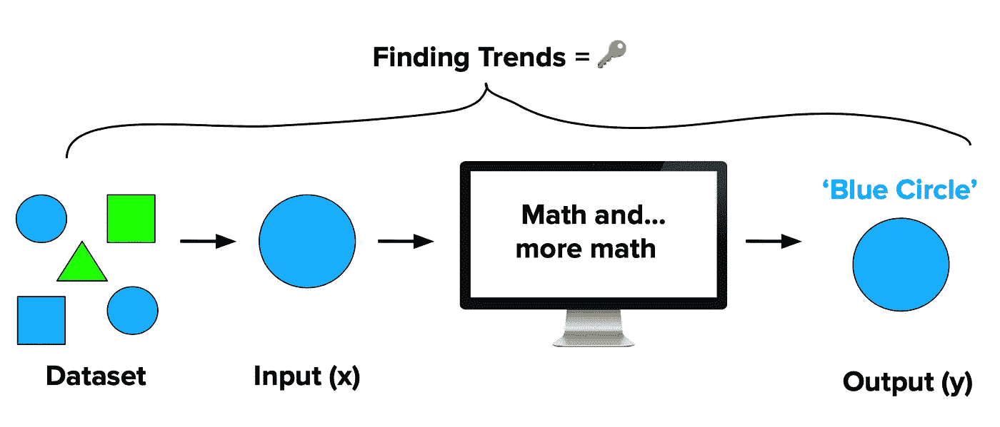
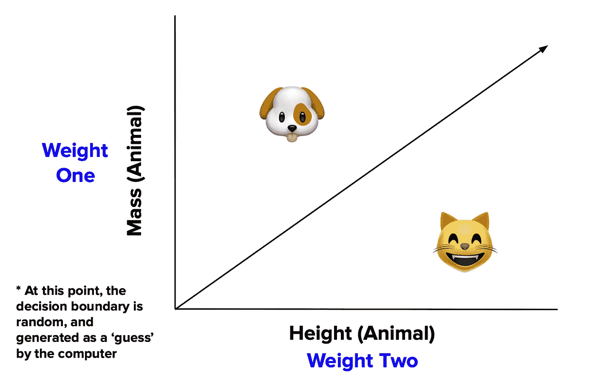
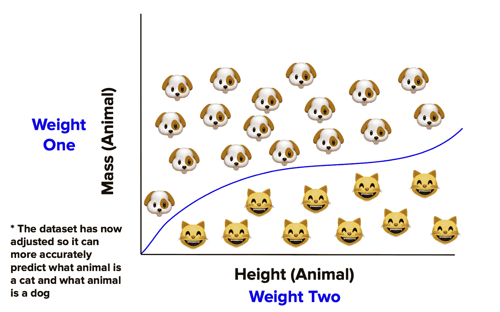
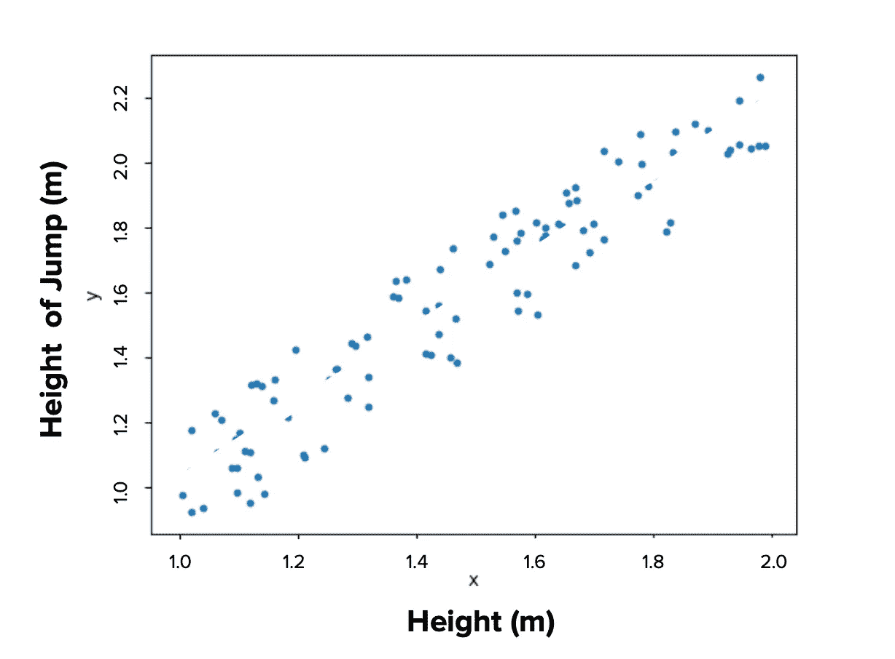
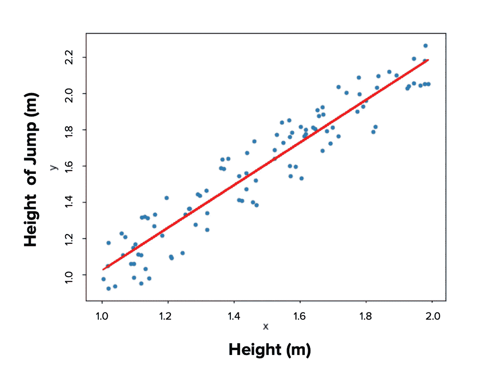
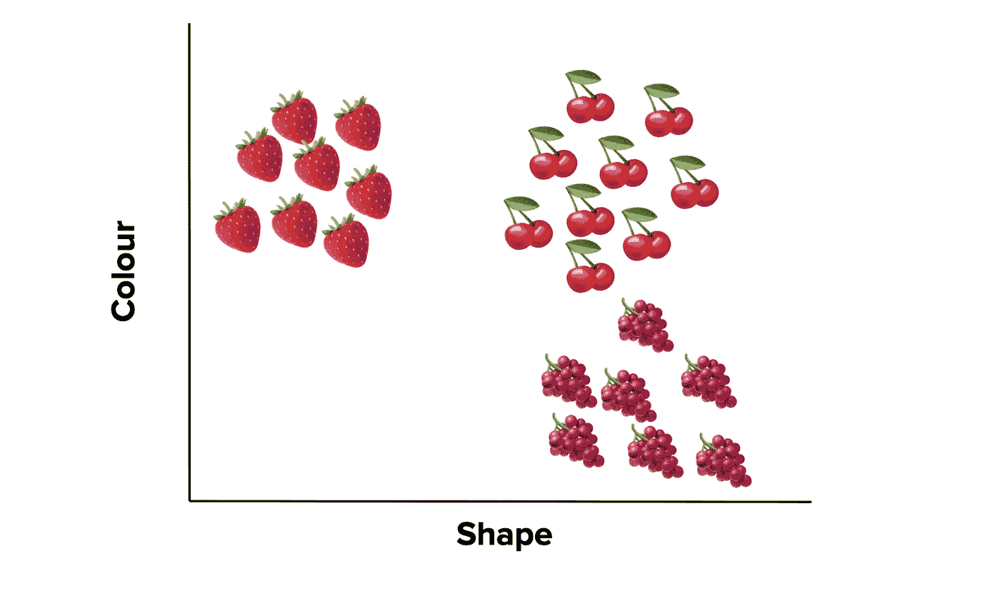
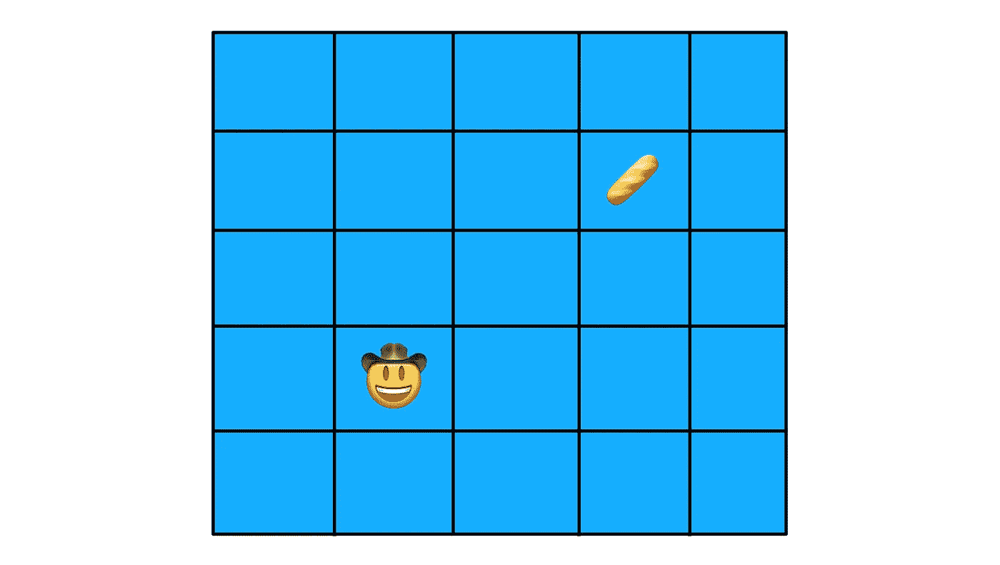
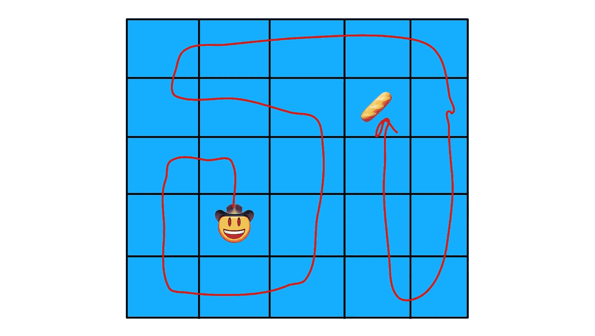
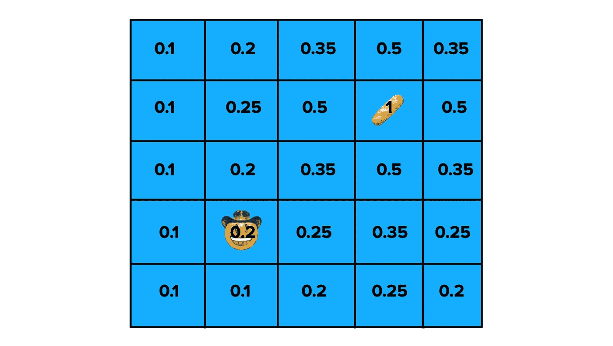
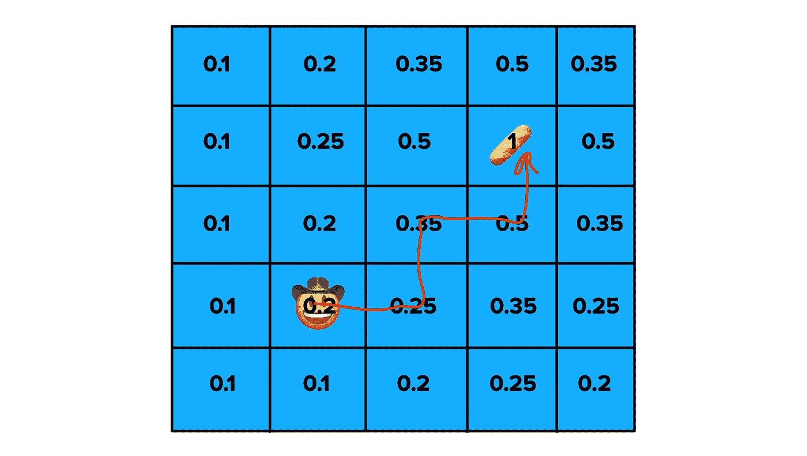

# 教机器学习

> 原文：<https://medium.datadriveninvestor.com/teaching-machines-to-learn-400c46138648?source=collection_archive---------8----------------------->

让我为你画一幅画。

那是一个周一的早晨，你坐在教室里，听着你六十多岁的老师对你大喊大叫，说“当他们像你这么大的时候”，他们不得不:

*   在雪地里走 15 公里去学校，同时上山(当然是双向的💪)
*   去图书馆阅读数千页来完成一项任务
*   看着油漆干，因为他们没有任何其他的娱乐方法

…这样的例子不胜枚举。虽然不断听你的老师抱怨“现在的孩子过得太轻松了”很烦人，但他/她的观点有一点是正确的。

> *🔑*我们的生活从根本上变得更有效率，因为我们创造了能让我们以更简单的方式做更多事情的技术*🤖*

我的意思是，拜托，1969 年把我们送上月球的火箭实际上还不如我们现代的计算器**强大🤯**

这种增长不是线性的。随着技术越来越先进，我们进步得越来越快。现在，我们看到机器使工作和工业自动化。但是，如果我们给机器学习的能力，会发生什么？复制人类技能和习惯的能力？*

 [## 金融中的机器学习|数据驱动的投资者

### 在我们讲述一些机器学习金融应用之前，我们先来了解一下什么是机器学习。机器…

www.datadriveninvestor.com](https://www.datadriveninvestor.com/2019/02/08/machine-learning-in-finance/) 

*好吧，好吧，好吧，这听起来有点粗略，但现在，我们离创造一个人工智能还很远→在这里阅读[这里](https://www.forbes.com/sites/cognitiveworld/2019/06/10/how-far-are-we-from-achieving-artificial-general-intelligence/#3de5ba466dc4)😉

# 👋向机器学习问好

机器学习是人工智能的一个子集，对我们的未来有着巨大的影响。如此多的行业将会并且正在受到这种影响。简而言之:

> *我们正在教计算机从模式、推理和趋势中学习，以便给出特定的输出，而不需要给出 100%的直接指令*

最终，我们希望计算机能够在没有人类帮助的情况下学习。

不过，机器学习并不是一个具体的系统。存在多种形式的机器学习，但它们都试图找到输入和输出之间的联系。

A general framework for how machine learning works

## 监督学习

监督学习是指计算机从标记的数据集进行学习。在整个过程中,“监督者”会指出计算机决策中的错误和失误。

计算机正在进行随机猜测，猜测被标记为正确或不正确。机器从正确的答案中学习，并使用它来提高其模式识别和输出识别技能。

让我们再深入一点。

机器学习的目标是让计算机在某种意义上像人类一样学习。为了达到这一点，计算机需要表现得有点像人脑，因此，它们被编程为像“人工神经元”一样工作。

为了开始，在 y = f(x) 处创建一个**映射函数。给人工神经元输入(x ),然后乘以不同的权重。这些权重都对应于信号的强度。然而，与大脑不同，这些权重可以变化。**

**等等……神经元不是应该有固定的重量吗？？？**

虽然权重可以变化，但它们都有一个特定的阈值，由一种叫做**偏差**的特殊权重来表示。这是可以调整的，以便改变“神经元”激发的可能性。所有输入乘以各自的权重，得到输出(y)。

This is what that^ (a neural network) looks like visually 😍

这些输出通常用于关联“真或假”语句**(注意:这是一种概括，在处理多变量数据集时略有不同)**，通常与给定输出是高于还是低于某个数字相关。

由于数据集是有标签的，计算机会得到关于其随机猜测是否正确的反馈。它从反复试验中学习。

这有点像学习侧手翻。你会看到做这件事的正确方法，从那以后就只有试错了。你知道什么有用，什么没用。最终，你可以开始你的体操了🤸‍♀️.

现在，这是一个总体概述，但是，我们可以更深入。监督学习分为两种主要类型的算法:**回归和分类**

## 分类

顾名思义，你试图用这种类型的算法对物体进行分类。这种方法最常见的应用是垃圾邮件检测，但是在各种场景中都可以看到。

#pawfection

啊，这么可爱的动物。现在，我们很容易分辨出一个是猫，一个是狗，但对计算机来说，这些词毫无意义。如果我们把其中的一个输入到一个分类算法中，计算机应该可以吐出它认为它是猫还是狗。

它用一组标记图像的数据集进行训练，其中一半是猫，另一半是狗。两个图像的属性将通过它们各自的权重被标记和分类，并被输入到函数中。

此时，为了进行分类，它们必须高于或低于某个值。但是计算机还不知道这是什么。它进行随机猜测，并从反复试验中学习。

Certain values above the line will be classified as dogs, while values below the line will be classified as cats 😎

高于该线的值可能与狗相关，而低于该线的值可能与猫相关。起初猜测是随机的，就像上面的照片，但最终，权重会调整以创建一个更准确的分类系统。

它们通常不是 100%准确的，但话说回来，大多数事情都不是这样😉。机器学习算法试图最大化正确答案，最小化错误答案，因为肯定会有一些重叠。

Now, when a cat or dog is inputted, it will make guesses based on the new line

## 回归

简而言之，通过回归算法，我们试图找到自变量和因变量之间的联系。

比方说，你想根据一个人的身高计算出他能跳多高，你需要回归算法的帮助。首先，你给它一组带标签的数据。

Here’s the dataset spread out in a scatter graph

一旦给出数据，就画出一条回归线，这样计算机就可以根据这条线进行估计🤯。

Bam 💥: Regression Lines

回归算法一直都在使用。你会看到它与金融预测，趋势分析，甚至像药物改造。

## 无监督学习

监督学习可以从标记的数据集中放松和学习。但是如果我们拿走标记的输出会怎么样呢？计算机如何学习？

这样做基本上就像给某人一个数字列表，并说:“现在，我不知道这是什么意思，但我相信你能想出一些东西来”。这是无监督学习必须经历的😅。

最常见的无监督学习形式是通过*聚类算法*。在这里，计算机根据它认为相似的特征对物品进行分组。

想象你有一篮水果，所有的水果看起来都像是:🍓或者🍒或者🍇

现在，我们很容易说这些水果是草莓、樱桃和葡萄，但是请记住，这对计算机来说没有任何意义。聚类算法意味着计算机正在试图找到所有这些组之间的相似之处(这些组也被不同的权重和偏见所修改)。

The machine would sort or ‘cluster’ the inputs into one of these three groups

无监督学习也有多种应用，但这些更多地局限于处理数据和加强计算机和人工智能系统(即训练[自动编码器](http://ufldl.stanford.edu/tutorial/unsupervised/Autoencoders/))。

## 强化学习

这就是有趣的地方。强化学习是通过“做”和试错来学习的过程。这听起来很像监督学习，但是有一个🔑差异。

想象你正在教一台电脑如何玩蛇和梯子。如果你使用监督学习，在每一步移动后，你会告诉计算机它是否做出了正确的决定。使用强化学习，你只能在游戏结束时告诉计算机它做出了正确的决定。如果是的话，太好了！你可以奖励它。如果没有，就没有奖励😔

这在教计算机如何玩游戏方面很有效，但是，还有更大的意义。通过强化学习，我们可以教会计算机如何完成我们自己都不理解的任务。你可以看到这已经被整合到机器人技术中。

Oregon State University programmed Cassie^ using Reinforcement Learning

见见凯西。凯西可以像人一样走路，因为她是用强化算法训练的。你看，没有 100%正确的走路方式。如果我们没有以准确、一致的速度行走，并且步伐之间有一定的角度，这并不是说行走不起作用。走路有不同的方式。

这使得它非常适合强化学习。这也意味着，我们无法通过监督学习来训练计算机，因为在我们获得最终输出，即行走之前，我们不会知道它是否在做正确的事情。

让我们更形象化一点。想象一下，你想设计一种在早上叫醒自己的方法。你可以设置闹钟，你可以找到一个特定的照明灯来叫醒你，或者你可以设计一个复杂的滑轮系统，最终让水泼向你来叫醒你。所有这些系统都实现了相同的最终目标，从技术上来说，它们都没有错。也许效率不高，但错了吗？不。这才是问题所在。

当计算机正确地做了一些事情，我们通过发送一个小的积极信号来奖励它，这相当于计算机因为做得好而得到了巧克力😊。

但并不是计算机做的每件事都有效率，而且很难确定哪些行为让我们得到了回报，哪些行为是次优的。这种困境被称为**信用分配**。

数据集将继续训练并适应它的环境。每当它获得奖励时，我们可以回头看看完成的任务，并试图找出哪些行动有助于获得积极的信号。

在这一点上，我们给这些不同的行动分配了**值**，并分配了一个**政策**，在这个政策下行动效果最好。这是强化学习真正发挥作用的原因。让我们付诸行动吧🙌

这是奈奈先生。他正试图得到这块面包。他可以走很多条路，但是，他只能走上、下、左或右。

Nay Nay 先生决定走最复杂的路。不错🤦‍♀️.现在，他得到了面包，但是，这比他所希望的花费了更多的时间和精力。奈奈先生决定继续练习寻找面包。

经过一系列的训练，Nay Nay 先生已经走过了多条道路。他给方块赋值，较高的值与帮助他到达那里的方块相关。这创建了一个策略。

现在 Nay Nay 先生可以追随更高的价值观。他仍然有多条路可以走，但是，这些路比他以前做的要有效得多。他现在可以有效地获得谷物🤩。

现在事情并不总是那么简单。人工智能代理(正在被训练的东西)可以通过几条路径，选择从事剥削。这是他们决定从他们已经接受的训练中选择最有效的路径并坚持下去的地方，因为他们知道这是正确的。

Nay Nay 先生在那里实现所有这些价值的做法是通过探索，在那里，尽管有不总是得到回报的风险，但也有更有效地做这件事的好处。

大多数强化学习问题的关键是找到探索和利用之间的平衡。

ML 的这个子集也有巨大的影响。它为我们提供了方向之类的东西(感谢上帝，我这辈子都不能用地图了)，并影响了许多行业，如医疗保健、能源优化、机器人等…

所以，尽管一开始提到的那位老师有点烦人，但他们确实说到点子上了。我们生活在一场技术革命之中。

人工智能和机器学习已经在我们周围随处可见。随着我们对它的不断投资，它将继续呈指数级增长，这项技术在未来 20 年内将走向何方只是一个太宽泛而无法回答的问题。

我们的生活更轻松了吗？也许吧。都是追溯。有一点很清楚，人工智能和机器学习正在推动我们未来的发展。

## 🔑关键要点

*   机器学习是 AI 的一个子集，指的是人工智能对不同事物进行分类的能力。
*   监督学习指的是从带有标签输出的标签数据集训练机器，并立即给出反馈。这可以分为分类和回归。
*   无监督学习带走标记的输出，依靠计算机进行推理和分类，而不知道最终结果会是什么。
*   强化学习类似于监督学习，但是，它不会立即给出反馈，而是等到结束时再给出反馈。它依赖于价值观和政策的创造。

👋**嘿！**如果你喜欢我的文章，并想阅读更多我的作品，请随时关注我的**媒体**！我也总是很感激听到这样的反馈，如果你想让[和我联系(我不咬人，给我发消息吧！)，在 **LinkedIn**](https://www.linkedin.com/in/victoria-dmitruczyk-b44922184) 上联系我！