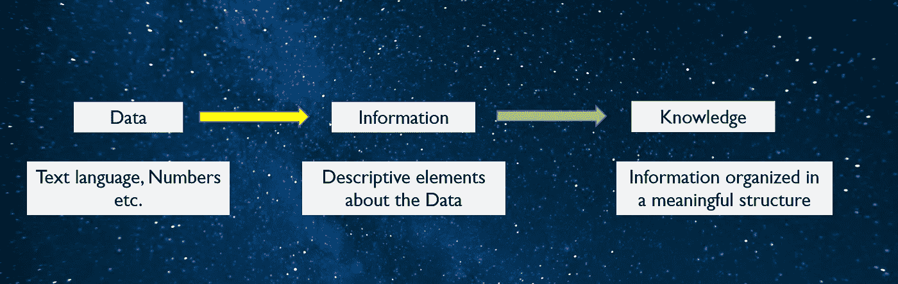
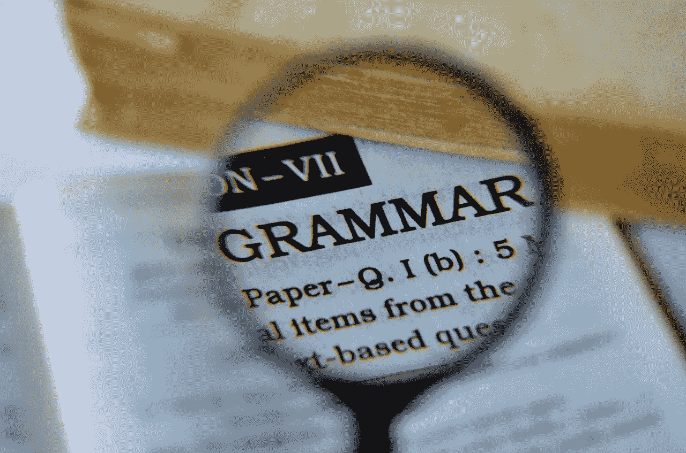
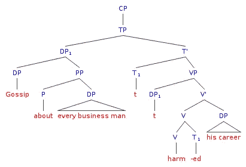
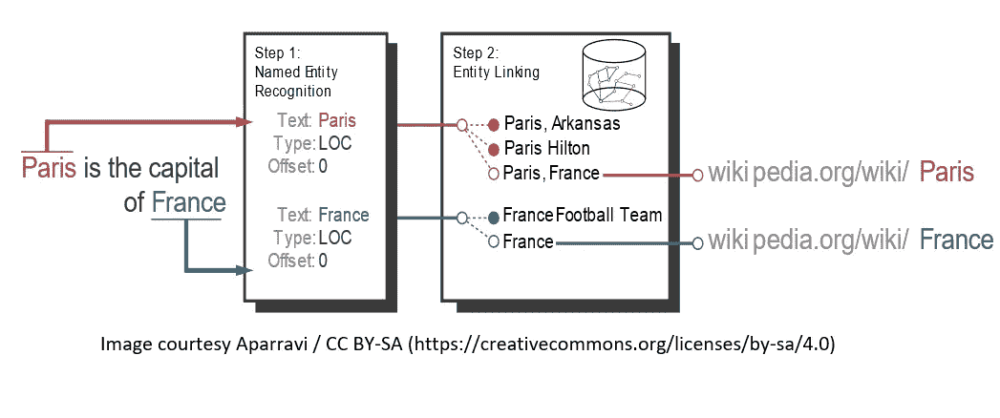
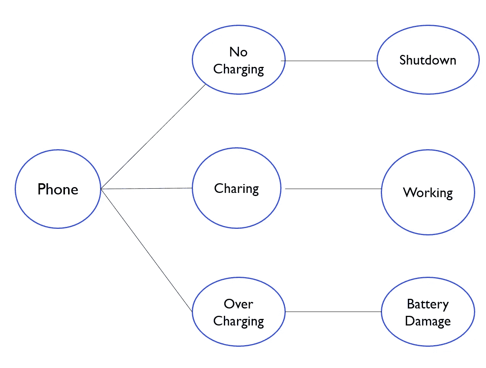

# 教你的人工智能阅读

> 原文：<https://medium.datadriveninvestor.com/teaching-your-ai-to-read-6d24b8134f2a?source=collection_archive---------15----------------------->

“在个人和社会生活中，语言是比任何其他因素都更重要的因素”。瑞士哲学家弗迪南·德·索绪尔的明智论断。他认为符号是语言的基本单位。他的理论构成了符号学学科的基础。符号学研究发现符号形成的规律和提取其意义的技术。这就是我们在自然语言理解方面的目标(NLU)。

Image courtesy Pexels.com

语言是人类最基本也是最重要的交流形式。今天，产生的大部分数据都是自然语言的形式。自然语言的分析和理解的提取是人工智能的关键能力之一。这样人工智能就可以与应用程序和社会无缝集成。

这意味着我们需要教我们的人工智能阅读。

# 高级方法

有了这个动机，让我们看看我们可以采取什么样的高级方法来为人工智能系统构建 NLU(自然语言理解)。

(Concept adapted from) Intelligent Systems Architecture, Design and Control by Alexander M. Meystel and James S. Albus

知识可以被定义为一种足够有趣和确定的模式。语境中的知识是对自然语言的理解。

我们研究 NLU 的方法是分析文本。生成关于此文本的描述性元素和标签。然后对这些信息元素进行组织，提取其中的含义或理解。

# 自然语言分析过程

自然语言分析的过程与一个孩子如何学习阅读没有什么不同。他们将首先学会识别一些常用词。然后他们把这些单词变成简单的句子。进一步完成对话。

自然语言分析的过程大致有以下几个部分，

# 文本分析

分析任何文本或信息的第一步包括识别不同的文档、句子和单词。

Image courtesy Pexels.com

## 文档分类

必须首先准备文档(一个或多个)用于分析。这就是文档分类阶段的目的。首先解析文档以识别语言。这叫做**语言识别**。这个阶段的下一步是从文档中提取所有的文本信息。这意味着省略额外的元素，如图像、表格、链接和任何格式。这一步称为**文本分段**。现在可以对文本进行进一步处理了。

## 文本分割

**句子分割**

这是一个识别句子边界并将文本分解成单个句子的过程。

**分词**

这是一个识别单词边界并将它们分解成单个单词的过程。这可以有效地用于各种算法中。这个过程也常被称为**标记化**。独立的单词被称为记号。

# 词汇分析

自然语言处理的下一步是从同一基本单词的变体中映射或提取单词。考虑我们有一组词*{连接，连接，连接，连接}* 。我们可以很容易地看出，所有这些词都是在处理基词*连接*。人工智能还需要具备这种能力，将单词中的变体与基本单词联系起来。

Image courtesy Pixabay.com

## 堵塞物

词干化是将单词中的变化减少到单个基本单词的过程。这可以通过像切片这样的操作来完成。给定变体中的附加字符被移除以显示基本单词。这个过程有时会导致一种情况，即基本单词可能不是语言中的真实单词。

## 词汇化

词汇化是一种将单词的变体映射到基本单词或“词汇”的技术。保证了基础词是真实的词，是语言的一部分。考虑一组单词{selling，sale，sold}，这里所有 3 个单词都应该映射到同一个基本单词 Sell。这是切片做不到的。通过词汇化技术，单词可以映射到同一个基本单词。

 [## 语音没有死亡——人工智能如何改变呼叫技术游戏|数据驱动的投资者

### 语音死了吗？这是一个公平的问题。关于流程数字化、新应用和增强型移动银行的讨论…

www.datadriveninvestor.com](https://www.datadriveninvestor.com/2020/10/08/voice-isnt-dead-how-ai-is-changing-the-call-tech-game/) 

# 语法分析

下一步是使用语言的语法来解析文本的结构。

Image courtesy Pixabay.com

## **词性标注**

词性标注是对文本进行分析的过程。文本的不同部分被识别并用语音的相关部分标记。这可能是名词、动词、形容词、副词等。这有助于从文本中提取意思。

## **语法树**

表示文本的一种标准方式是语法树的形式。语法树是倒置的树。这允许我们根据不同的语法规则对给定的文本进行分类。语法树有助于理解句子所指的是什么？正在进行什么行动？诸如此类。

Image Simplified syntax tree for Reinhart 1983 by wikipedia.org

## 命名实体识别

命名实体识别是信息抽取的一部分。它从给定文本中识别各种命名实体。基于域，实体可以是人、组织、地点或数字。这是用于识别被处理文本的上下文的关键技术之一。

# 语义分析

NLU 的主要目标是提取正在处理的文本的含义。

## **本体语言**

本体是给定领域中各种对象、动作和关系的模式或结构。本体可以将文本中的对象分类到已知领域的结构中。使得能够提取含义。

就拿这句话来说吧，“罗杰一炮而红”。

而使用棒球的本体意味着罗杰击球非常好。如果我们切换到电影的本体论，这意味着罗杰的电影被许多人观看，并变得流行。

Image courtesy Florian Thiery / CC BY-SA (https://creativecommons.org/licenses/by-sa/4.0)

## 知识图表

在知识图中，文本中的实体、动作和关系被映射到图形结构中。这使得人工智能能够处理和导航图表，以推断正在处理的文本的含义。

考虑一句话“不给手机充电，会导致手机关机”。"过度充电可能会导致电池故障。"从这句话生成的知识图示例如下所示。

现在如果我们 AI 再收到一句类似“罗杰手机充电过度”的话。人工智能可以识别风险并提醒罗杰。它还可以通过遍历图形来推荐更安全的替代方案。

# 实施方法

实现自然语言处理解决方案的一些可能的方法，

## 机器学习库

使用机器学习和文本分析库。我们使用这些库从文本中分析、分类、预测和提取信息。这些有时也被称为统计技术。到目前为止，Python 是这些实现最流行的语言。

NLTK(自然语言工具包)、spaCy、scikit-learn 是一些流行的库。

对于这种方法，一个好的起点是 Edward Loper、Ewan Klein 和 Steven Bird 所著的《Python 中的自然语言处理》。

Image courtesy Pexels.com

# 深度学习

使用深度学习算法从自然语言中分析和提取信息。

对于这种方法，一个很好的起点是，*用 PyTorch 进行自然语言处理:使用深度学习构建智能语言应用程序，作者是 Brian McMahan 和 Delip Rao* 。

tensor flow(【www.tensorflow.org】)也是一个值得考虑的平台。

## 即插即用

还可以使用提供各种 NLU 解决方案的即插即用组件。当您希望快速构建解决方案 NLU 时，这种方法特别有用。其他方法将花费大量的时间和精力。

微软 Azure([https://Azure . Microsoft . com/en-us/services/cognitive-services/language-understanding-intelligent-service/](https://azure.microsoft.com/en-us/services/cognitive-services/language-understanding-intelligent-service/))是一个非常可靠的云解决方案。

人们也可以根据偏好和用例使用谷歌云([https://cloud.google.com/natural-language)或 AWS(https://aws.amazon.com/comprehend/](https://cloud.google.com/natural-language) or AWS (https://aws.amazon.com/comprehend/))。

Image courtesy Pexels.com

# 自然语言理解的挑战

自然语言不是直截了当的。理解给定自然文本的上下文、意图和含义有很多挑战。

人们必须解决几个已知的模糊性，

词汇歧义(一个单词甚至在领域和上下文中都有多重含义)

句法歧义(一个句子可以有多种解释)

引用不明确(一个引用可能针对多个对象)

考虑英语以外的语言只会进一步增加挑战。

# 结束语

雅克·德里达对符号学的工作做出了贡献。他说，即使是最简单的文本也充满了“aporia”意思的谜题。他认为，说了什么的意义取决于说了什么之后，意义也取决于没说什么。所以这意味着文本在意义上总是不完整的。这个有趣的论点显示了自然语言理解领域的复杂性。

Image courtesy Pixabay.com

在人工智能和自然语言理解领域已经取得了很大的进展。今天我们有令我们惊讶的系统。整形测试经常通过，而且是由几个人工智能代理通过的。

毕竟，人类并不总是相互理解。考虑到挑战的性质。自然语言理解领域的进展。我对人工智能在这一领域的成就持积极态度。

## 访问专家视图— [订阅 DDI 英特尔](https://datadriveninvestor.com/ddi-intel)