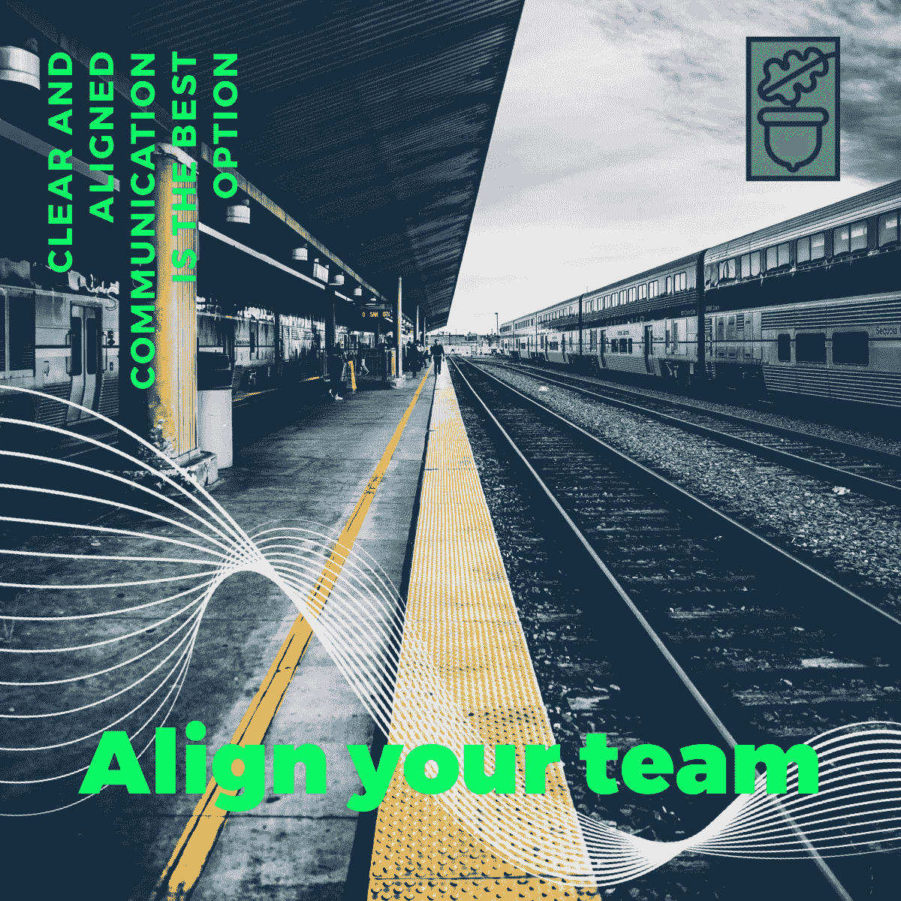
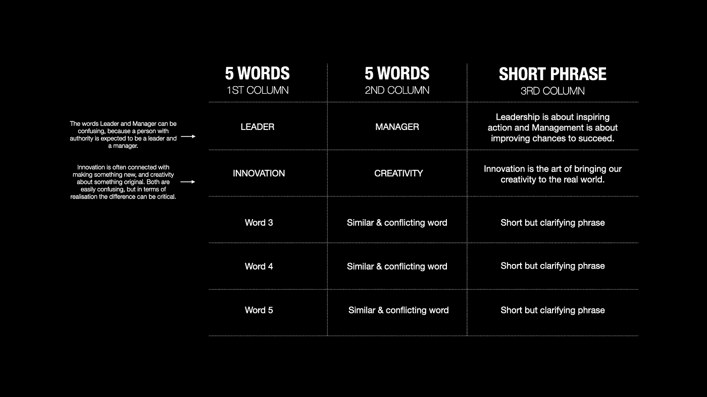

# 团队协调方法

> 原文：<https://medium.datadriveninvestor.com/team-alignment-methodology-cf82522d561?source=collection_archive---------25----------------------->

你听说过 [7%的交流过程是口头的，剩下的是肢体语言和语气](https://www.psychologytoday.com/intl/blog/beyond-words/201109/is-nonverbal-communication-numbers-game)吗？想象一下，如果这 7%没有被正确使用，沟通过程可能会以一团糟告终。

There is a person that didn’t get the meaning of the yellow lines there…

在这篇文章中，我想把重点放在那 7%上。特别是因为**我们使用语言来构建我们的思想**，我认为改进我使用语言来思考和与他人交流的方式肯定会增加我取得成就的机会。

> 如果我改进了我使用语言的方式，而其他人没有，我可能会让其他人更难理解我。有没有可能让所有人在语言上处于同一水平？

如你所见，为了有效地沟通，我们需要流程中的所有参与者达成某种一致。我想分享一个我已经使用了几年并取得积极成果的方法，但在此之前，我想让你想象一下，如果你和其他人在以下场景中不一致会发生什么:

1.  你的团队正在谈判一笔千载难逢的生意。
2.  你和一些团队成员正在为你的初创公司募集资金。
3.  作为一个好的领导者，你在解释疫情事件后公司将不得不采取的严厉措施。

正如您所看到的，所有这些场景都有可能产生混乱和更多问题。你可以逐步减少无效沟通带来的不必要的风险。以下是您可以使用和调整的方法:

# 团队协调

我假设你的团队有一些一起工作的经验，并且他们至少在某种程度上熟悉他们作为一个团队的目的。**为了发现需要改进的地方**，在调整实践之前，不要试图与您的团队谈论目的、使命、愿景或战略目标。

**第一部分:**

1.  将你的团队至少分成两组。
2.  要求每组找出十个他们认为对日常交流和他们的行动领域至关重要的词。这些话是每个团队成员都需要清楚理解的。
3.  在小组讨论时，提醒他们不需要定义单词 just jet。
4.  一旦小组完成，他们应该向其他小组展示他们的单词列表，以便进一步比较。
5.  分组，现在所有团队必须同意并选出 5 个最重要的词。

**第二部分:**

Image 1

1.  将你的团队分成至少两组。
2.  向他们展示上面的模板(图 1)
3.  在第一栏，他们应该列出在第一部分获得的五个单词。
4.  在第二栏中，他们应该写一个通常会引起混淆的相似的单词。例如，领导和经理。
5.  每个小组需要就每个单词的简短定义达成一致。请注意，这不是一场谁对谁错的竞赛；学会为重要的术语精心设计原始定义是一种实践。
6.  在第三栏中，他们应该写一个短语来总结同一行中两个单词之间的关系。例如，“领导力是激励行动，管理是增加成功的机会。”
7.  每个团队都应向团队的其他成员展示他们的五个短语，并分享他们对这些短语的理解。
8.  现在，整个团队已经准备好选择最佳短语并将其作为标准。

研讨会结束后，你可以继续谈论目的、愿景、使命和其他战略目标。我相信你会体验到一种奇妙的认同和理解的感觉。

 [## 夏普比率悖论:为什么还要投资风险资本？数据驱动的投资者

### 夏普比率是一种基于风险量化回报的方法，具体来说，它是超过…

www.datadriveninvestor.com](https://www.datadriveninvestor.com/2020/03/29/the-sharpe-ratio-paradox-why-still-invest-in-venture-capital/) 

随着团队的发展和变化，基本词汇和定义的列表也必须进行调整。重复上述校准练习是一个好主意。

请注意，您也可以采用以下方法进行个人校准。观看这段关于定位和生活目标的视频:

由于你和我还没有调整好我们的交流，我只能希望我们刚刚练习的 7%的口头交流能有效地传达出意义和一些实际的想法。如果您需要一些支持来为您的组织设置它，[联系我](http://linkd.in/N32LZH)。如果你想参加我的目标意识在线培训课程[，请访问此页面](https://bit.ly/2XQBgQ3)。

**访问专家视图—** [**订阅 DDI 英特尔**](https://datadriveninvestor.com/ddi-intel)