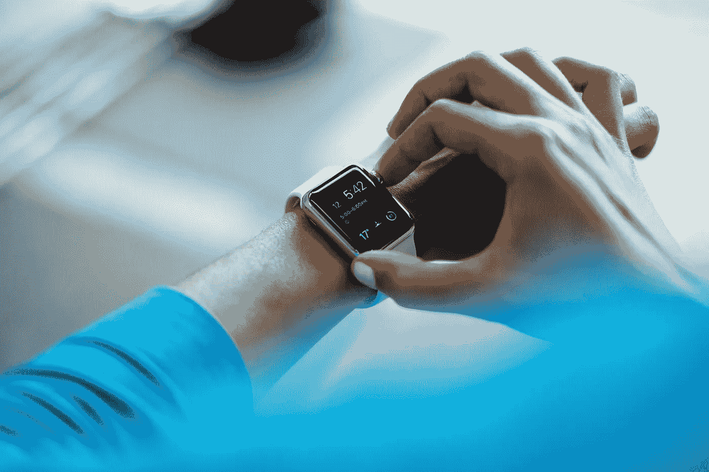
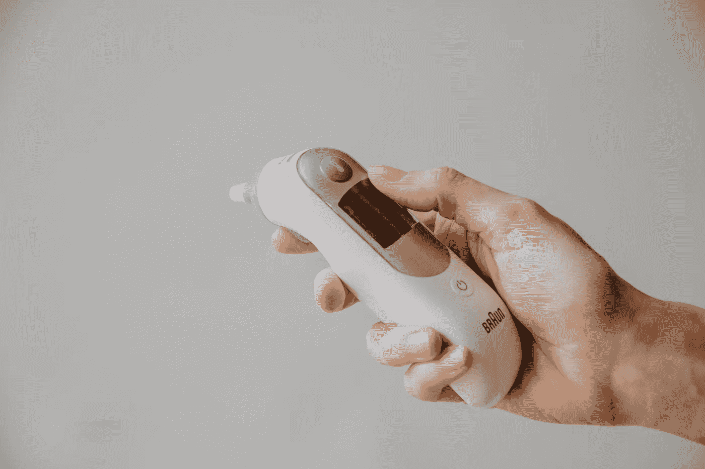
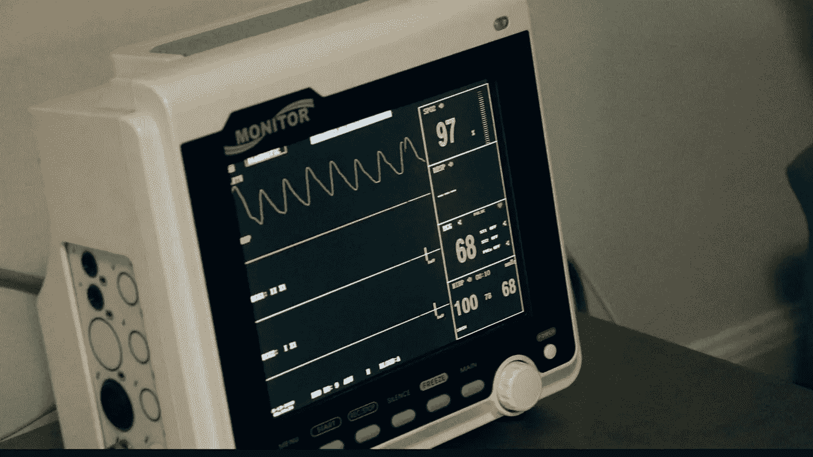
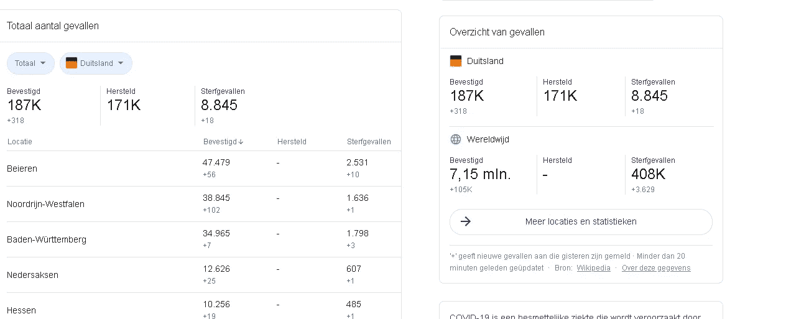
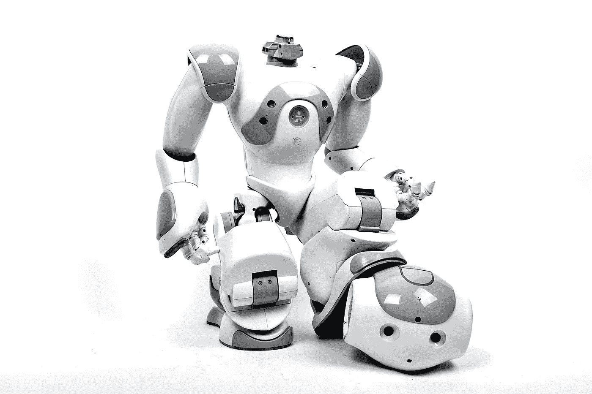
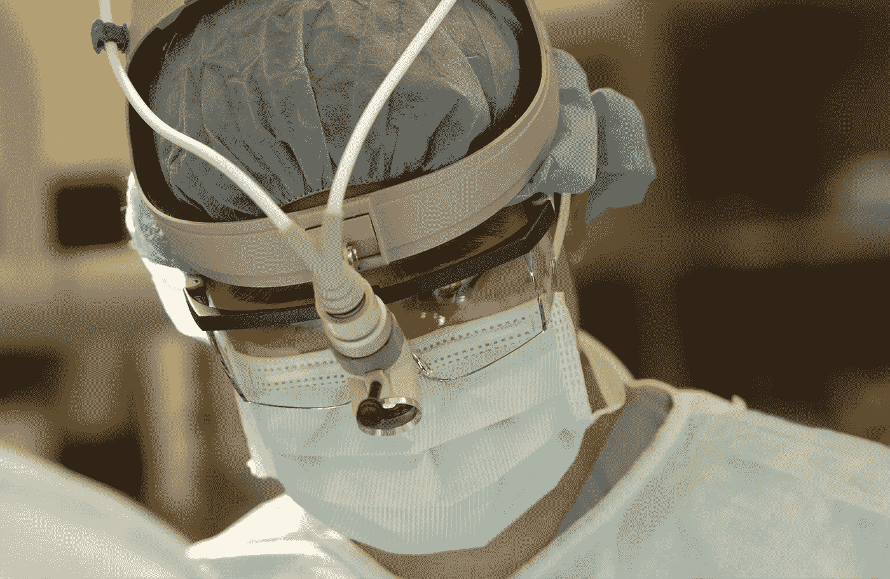

# 技术:智能设备如何帮助我们&医学拯救我们

> 原文：<https://medium.datadriveninvestor.com/tech-how-smart-gadgets-help-us-medicine-saves-us-f03169c3f299?source=collection_archive---------17----------------------->

Photo by Luke Chesser on Unsplash

## 它首先了解你的健康状况，然后邀请所有的智能设备。然而有时候，你别无选择，不得不去看医生，这很好。21 世纪我们有如此伟大的医学，这是值得庆祝的理由。

# 首先拥抱功能医学

功能医学和医疗体系之间的斗争是一个巨大的推动。在我们之前的[文章](https://medium.com/datadriveninvestor/tech-how-new-health-technology-makes-us-live-past-100-years-7b26299373b7)中，我们提到了这样一个事实，即我们中的许多人习惯于服用非处方药来解决特定的健康问题。但这是解决方案吗？

当事情变得更糟时我们该怎么办。身体是一台如此精密的机器，你必须了解根本原因，而不仅仅是症状。我喜欢 Ruscio 博士的方法，因为它让我们负责。他为你的直觉提供工具，但他总是试图让事情变得简单。

> “你放进去的=出来的”——菲特巴德

当你用垃圾给你的身体补充能量时，期待你的身体感觉到垃圾并且没有发挥出最佳状态。当你认为技术会让你感觉更好时，请三思。

## 从反应转向预防

当你掌控自己的健康，并将其与智能科学、小工具、应用程序和技术相结合，以指导你的决定并增强你的健康时，这令人印象深刻。它不必像你想的那样超级复杂。你必须先解决基本问题。

**安装几个应用程序来测量你的心率变异性——**你可以测量你的 [HRV](https://welltory.com/) ，不需要任何医生来帮助你。根据心率的测量和变化，你可以评估能量水平和整体恢复能力。

 [## 大笔资金和尖端技术:人工智能/人工智能投资将如何革新医疗保健…

### 在过去几年人工智能(AI)和机器学习(ML)的显著发展中…

www.datadriveninvestor.com](https://www.datadriveninvestor.com/2018/03/22/big-money-and-cutting-edge-technology-how-investment-in-ai-ml-will-revolutionize-the-healthcare-industry/) 

当你睡得好的时候，你的整体生活质量就在那里。你必须先解决这个问题，然后进入最佳睡眠状态。这就是 Phizz、InsightTimer 等[应用](https://pzizz.com/)大有帮助的地方。如果你有失眠症，你最好去检查一下。

**购买智能设备来跟踪你的睡眠—** 大约一年前，我购买了 Sport Watch 来测量我的睡眠质量。我喜欢戴着它，监控我每周的整体训练，并在周末看到训练量。

但仅此而已；不要执着于追踪每一件小事。它能让你做出更好的决定，当你衡量它的时候，你的感觉经常会浮现出来。

**测量您的血糖—** 对于许多糖尿病患者来说，醒来测量[血糖水平](https://www.healthline.com/nutrition/keto-strips#ketosis)是他们的第二天性。它始于在你抓住你的小玩意之前更加有意识。你应该明白，每一种淀粉和碳水化合物都会增加你的糖分。吃碳水化合物的时间是至关重要的。

Photo by Kelly Sikkema on Unsplash

当你吃这样的淀粉时，你应该得到报应。花更多的精力去研究为什么，如何，什么时候。

像我们的祖先一样，他们用较重的淀粉为冬天增肥。然而，我们整年都在增肥。难怪很多人肥胖。

> 倾听你的身体，这是关键！你的身体是最棒的科技产品。再读一遍声明。

> 当你掌控自己的生活时。你会惊奇地发现，你几乎从不生病。那是健康的顶峰，不是吗？

**邀请科学帮你**——让你的 [DNA](https://my.livingdna.com/) 成为指引线，你的祖先故事告诉你潜力是什么，有哪些危险，你在哪里挣扎，还有哪些可以改进的地方。

→你的微生物群，或者像 Steven Gundry 博士所说的那样— [全息生物群](https://www.youtube.com/watch?v=Uklt4zVVtS0)你的细菌环境也存在于我们的皮肤上。开始吃更多的必需品，而不是那些对你有害的东西。

**当你感觉糟糕时，去找功能性医生—** 功能性医学[医生](https://drruscio.com/)会做什么？他或她恢复正常的生理和健康的身体“功能”，而不是专注于特定疾病的治疗。我们发现，总的来说，如果我们能够恢复正常的身体功能，大多数疾病就会消失。

Photo by Modestas Urbonas on Unsplash

# 医疗保健如何帮助我们？

这太酷了，当你被紧急送往医院时，大多数情况下，你都在有能力的人手中。也许你断了胳膊或者在车祸中受伤了。我们可以非常感激能够接触到西医。

**一些最好的医疗保健设备**

*   排名第一的 AliveCor ECG 监护仪
*   #2 AirSonea 哮喘监测仪
*   #3 达里奥血糖监测仪
*   #4 生物基因组 DNA 监控器
*   #5 Tinke 呼吸监测器
*   #6 远程心脏监护仪
*   #7 情绪视觉大脑状态监视器
*   #8 AtmoTube 空气质量监测仪

Photo by Jair Lázaro on Unsplash

所以，再一次，让这一点击中要害。重温第一部分如果事情不太明朗，预防就是一切，甚至医疗保健系统也开始理解 T1。

## 挑战

尽管有这些伟大的设备和医生的努力，许多病人还是会死去。这不仅仅是因为他们不能被拯救；他们只是来得太晚了。

> “正如我的一位在德国诊所当医生的朋友曾经说过的那样，我们有最好的药物，但人们来晚了 30 年。”

**西医的力量**

如果你想一想，西方医学是有效的，它已经被证明是非常强大的，尤其是在德国。我们有大约 187，000 人被感染，8，845 人死于冠状病毒。这是一个相当大的数字，但与全球 40.8 万人的死亡人数相比，这个数字微不足道。

# 邀请健康技术人员来帮忙

有时候，可能是你受伤了，即使你过得非常健康，你还是会感染。这就是你伸手拿抗生素，请求医生帮助你修复断臂的时刻。

如果我们回到疫情，科技正在帮助我们加快速度，恢复得更快。

—

据[健康杂志](https://healthtechmagazine.net/)报道，以下是几种工具如何帮助全球对抗冠状病毒。

医疗保健技术有助于遏制新冠肺炎病毒的传播。已经使临床医生能够在一系列环境中简化和加快护理提供的工具正在帮助一些医生更快地诊断(或排除)冠状病毒病例，提供虚拟护理并防止病毒在人群中传播。

RAND 高级政策研究员 Jennifer Bouey 博士说，许多都是在疫情最严重的地方开发和部署的。

“由于医疗保健行业的需求快速增长，中国已经在一些医疗保健技术创新方面处于领先地位，”Bouey 说，他也是兰德公司中国政策研究的唐主席。

虚拟护理平台 Bright.md 的联合创始人兼首席执行官雷·科斯坦蒂尼博士说，通过在疫情期间更快地检测更多的人并分享更多的信息，官员们更有可能减缓传染病的传播，无论它的起源或严重程度如何。

“几年前，确定一种流行病需要几个月的时间；科斯坦蒂尼说:“由于技术和数据分析能力，我们现在只需几天就能做到这一点。

## 1.视频会议降低远程护理的风险

据《耶路撒冷邮报》**报道，本月早些时候，特拉维夫的谢巴医疗中心开设了一个冠状病毒远程医疗项目，对以色列患者进行物理隔离和治疗。一名联邦官员[上周告诉国家公共电台](https://www.npr.org/sections/health-shots/2020/02/13/799534865/would-the-u-s-health-system-be-ready-for-a-surge-in-coronavirus-cases)，如果冠状病毒病例增加，远程医疗驱动的模式可能会在美国扩展。**

*与此同时，许多被政府或自己隔离在家的中国员工正转向远程工作工具，如 Zoom 视频会议，[美国消费者新闻与商业频道报道。Bouey 说，该平台“在隔离区可能是有益的，因为它使人们能够交流并降低暴露的风险”。](https://www.cnbc.com/2020/02/03/zoom-video-is-seeing-record-usage-amid-coronavirus-fears-ceo-says.html)*

*一项反动措施是在四川大学华西医院安装 5G 网络和通信设备，允许供应商在远程医疗系统的帮助下进行首次冠状病毒远程诊断。商业内幕报道称，该计划将扩展到其他医院。*

## *2.机器人在病人护理方面伸出援助之手*

*一月下旬，华盛顿州埃弗雷特市普罗维登斯地区医疗中心的医生们。，[用机器人用听诊器检测一名感染者的生命体征](https://edition.cnn.com/2020/01/23/health/us-wuhan-coronavirus-doctor-interview/index.html)并通过内置屏幕进行交流。远程控制的远程医疗车允许医生执行基本的诊断功能，例如测量血压和体温。*

**

*Photo by Mathew Schwartz on Unsplash*

*该组织的首席临床官 Amy Compton-Phillips 博士[告诉福布斯](https://www.forbes.com/sites/jilliandonfro/2020/02/02/robots-to-the-rescue-how-high-tech-machines-are-being-used-to-contain-the-wuhan-coronavirus/#781aca7e1779)“技术使我们能够减少与冠状病毒接触相关的近距离互动的次数”。*

*中国新闻媒体引用的其他用例包括机器人送餐和垃圾清理。此外，设计用于通过发射紫外线 C 光来杀死细菌的机器人正在对疑似冠状病毒病例的设施进行消毒，以及从中国飞往洛杉矶国际机场的一些飞机的内部。*

## *3.软件识别健康记录中的冠状病毒模式*

*一些医疗保健 IT 供应商正在更新他们的软件，以更好地识别问题的模式和潜在迹象。*

*1 月下旬，电子健康记录巨头 Epic 与生物控制专家和传染病专家合作，根据疾病控制和预防中心的[冠状病毒指南](https://www.cdc.gov/coronavirus/2019-ncov/hcp/index.html)更新了其旅行筛查问卷。*

*目标:确保临床医生和其他一线医务人员询问患者最近的国际旅行和相关症状，以提示隔离预防措施，[医疗保健 IT 新闻报道](https://www.healthcareitnews.com/news/epic-pushes-out-software-update-help-spot-coronavirus)。*

*Athenahealth 和 Meditech 也都在他们自己的 EHR 软件中发布了新的指南、测试命令和筛选问题。“技术和工具有助于更快地将信息传递给患者和提供者，”科斯坦蒂尼说。*

## *4.聊天机器人有助于缓解患者对冠状病毒的恐惧*

*几家医疗保健公司已经更新了他们的算法，以创建聊天机器人，帮助用户在去医院或诊所之前筛查病毒。这个想法是为了帮助病人更早地识别症状，减少不必要的就诊。*

*一个名为 98point6 的按需初级保健应用程序在 1 月份发布了一个冠状病毒筛查聊天机器人。尽管结果喜忧参半，但根据 STAT 的说法，[设计者一直在根据症状的具体变化不断更新算法。](https://www.statnews.com/2020/02/05/chatbots-screening-for-new-coronavirus-are-turning-up-flu/)*

*人工智能支持的聊天机器人也与公众互动，回答有关疾病的问题。对话式人工智能公司 Haptik 的 WhatsApp nCov 服务台聊天机器人经过训练，可以回答有关病毒的问题，并为用户提供及时的信息。*

## *5.可穿戴设备支持远程监控冠状病毒患者*

*可穿戴设备还可以通过让医疗保健专业人员以更少的接触监测生命体征来帮助抗击冠状病毒。*

*上海公共卫生临床中心正在使用一种连续温度传感器来帮助减少冠状病毒在中国的传播。该传感器应用于患者，并向卫生专业人员发送实时信息和传感器读数。*

*这项技术正在被中国的其他四家医院使用，上海医院已经宣布，它也将应用传感器来监测患者的心率和呼吸频率。*

**

*Picture from Unsplash*