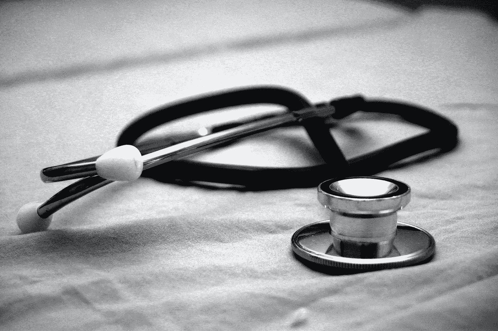
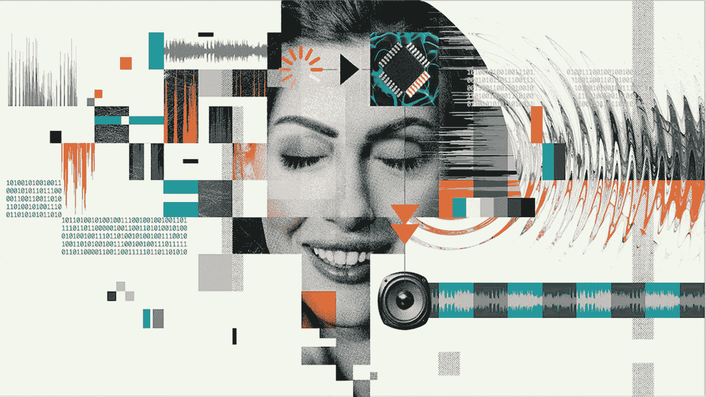
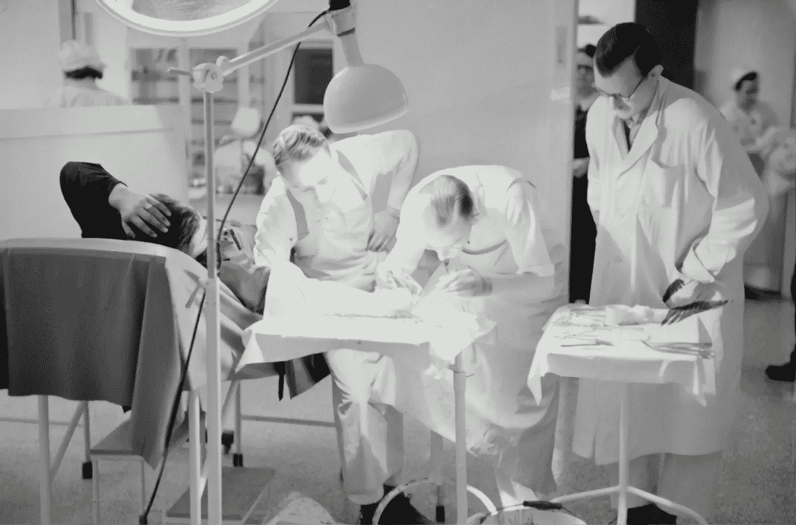
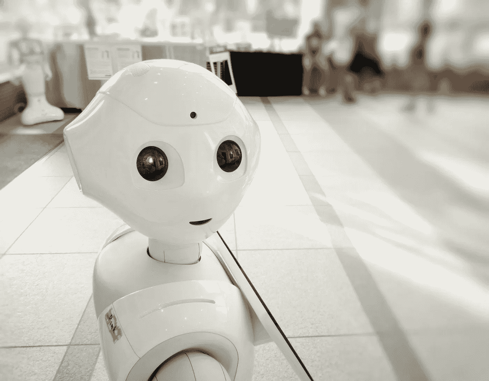

# 技术:人工智能如何改变医疗保健？

> 原文：<https://medium.datadriveninvestor.com/tech-hows-ai-transforming-healthcare-137f10543edf?source=collection_archive---------11----------------------->

Photo by [Daniele D’Andreti](https://unsplash.com/@danieledandreti?utm_source=unsplash&utm_medium=referral&utm_content=creditCopyText) on [Unsplash](/s/photos/healthcare-ai?utm_source=unsplash&utm_medium=referral&utm_content=creditCopyText)

## 在技术领域，快速获取最新发明从未如此重要。看看医疗保健领域的人工智能。一般聊天机器人可以处理几乎任何请求，这取决于你在后端给它什么数据。

这是一个令人兴奋的时刻，因为你不必每次都去看医生，你只需要在家里与聊天机器人聊天，输入所有的问题。基于聊天机器人是如何基于自然语言处理进行编程的，它会吐槽正确或错误的答案。

人工智能给医疗保健领域带来的东西令人兴奋。

> “你不会找到很多去医学院成为数据文员的医生。但很多人都变成了这样。有时他们背对着病人，坐在电脑屏幕前，打字和点击。有些人可能会在输入数据时试图与病人进行对话。但是很艰难。科技阻碍了医患关系。人工智能可能有助于消除这一障碍。”—格雷格·弗莱厄

# 来自西门子健康热线的信息

## 自然语言处理(NLP)适用的领域

智能算法——以自然语言处理为燃料——正在接受培训，以识别医生的问题和患者的答案，提取关键点，并将信息输入电子健康记录。这样做可能会节省医生三分之一到一半的工作日，可能会减少疲劳，让医生有更多的时间和病人在一起。

当然，关键词是“可能”

> 医疗人工智能的未来是高度投机的。但在某些情况下，这种猜测可能是有根据的。

这在很大程度上取决于人工医疗智能(AI)的推动者 NLP 的发展。多年来，人们已经知道，能够处理书面语言的算法可以提取实验室测试数据，甚至可以从非结构化的临床记录中提取数据。医生办公室也存在类似的潜力。

Photo by [Hush Naidoo](https://unsplash.com/@hush52?utm_source=unsplash&utm_medium=referral&utm_content=creditCopyText) on [Unsplash](/s/photos/healthcare-artificial-intelligence?utm_source=unsplash&utm_medium=referral&utm_content=creditCopyText)

我见过一个基于 NLP 的系统，监听医患交流；把所说的翻译成文本；提取关键字和短语，然后将它们插入到结构化医疗报告中。精心放置的麦克风拾取医生和患者的声音；智能算法会完成剩下的工作。

它几乎没有暗示 NLP 将如何改善医疗保健。2019 年 4 月下旬，研究人员描述了他们开发的基于 NLP 的系统，该系统可以将人类的想法翻译成合成语音。在 4 月 24 日发表在《自然》杂志上的一篇论文中描述了这项研究，一个植入人脑的电子传感器接收旨在产生语音的信号。

 [## 大笔资金和尖端技术:人工智能/人工智能投资将如何革新医疗保健…

### 在过去几年人工智能(AI)和机器学习(ML)的显著发展中…

www.datadriveninvestor.com](https://www.datadriveninvestor.com/2018/03/22/big-money-and-cutting-edge-technology-how-investment-in-ai-ml-will-revolutionize-the-healthcare-industry/) 

一种人工智能算法将这些信号翻译成合成语音。如果商业化，这项技术可能会让那些不能为自己说话的病人发出声音。中风、创伤性脑损伤或神经退行性疾病的受害者是严重的疾病。如巴金森氏症、多发性硬化症，或肌萎缩性侧索硬化症(楼格赫里希氏症)，耐心将获得重新拥有更健康生活的机会。

但是这种技术可能还需要很长时间。也许十年或更久。需要进行大量的开发。

> “在不久的将来，智能算法可能会帮助患者理解他们通过患者门户网站访问的内容。”—格雷格·弗莱厄

# 为什么人工智能可能很快改善医疗保健

在不久的将来，智能算法可能会帮助患者理解他们通过患者门户网站访问的内容——这是向患者传递医疗信息的渠道。NLP 在这方面的潜力已经被证明了。因此有可能使技术解释为公众所理解。

一种名为 Bold360ai 的“聊天机器人”正被出售给企业，为他们的客户翻译复杂的语言。据报道，由于 Bold360ai 拥有文本对话，它可以“记住”上下文。因此，相信健谈的人工智能算法同样可以在上下文中解释医学语言，这是不是有些牵强？

像这样的聊天机器人可能会产生巨大的影响。想象一下，医生只关注病人最复杂的问题，而病人完全理解他们的医疗信息。

NLP 可能会进一步扩展到病人问卷，就像病人现在在候诊室例行填写的问卷。

# 个性化医疗保健

如果智能算法将患者问卷中的数据转化为量身定制的医疗保健策略，会怎么样？针对特定女性的个体化筛查乳房 x 线摄影策略可能基于决定其易患乳腺癌的所有风险因素。

年龄目前是乳房 x 线摄影筛查指南的唯一依据，可能会与家族史一起考虑。智能算法可能会从患者的电子记录中提取乳腺密度和过去的活检结果；计算特定患者每年或每两年进行一次乳房 x 光筛查的效益/危害比，并将结果纳入医生和患者讨论的策略中。

如果能为有患肺癌风险的患者开发出类似的策略会怎样？糖尿病？心脏病？一家公司已经在开发一个 NLP 文本挖掘平台，该平台可以挖掘医疗风险因素，监控患者的这些风险，衡量护理质量，甚至改进患者的临床文档。

更进一步说，人工智能能为那些在疾病中的作用现在只是被怀疑的因素提供科学依据吗？其中包括:“食品不安全”——我们多少次听到关于人们必须在药物和食物之间做出选择的新闻报道？精神健康和药物滥用。

# 帮助医生回归本源

与此同时，人工智能可能会被内置到“虚拟医疗助理”中。它在医学文献的背景下处理关于患者互动的数据。它帮助医生应用临床指南，监控他们提供的护理质量，预测药物不良事件，甚至识别罕见疾病。

如果这些可能性变成现实，医生也许能够做当初引导他们进入医学院的事情。

Photo by [Franck V.](https://unsplash.com/@franckinjapan?utm_source=unsplash&utm_medium=referral&utm_content=creditCopyText) on [Unsplash](/s/photos/ai?utm_source=unsplash&utm_medium=referral&utm_content=creditCopyText)

# 来自读写网的关于人工智能重大突破的信息

许多技术方面正在改变我们的时代，从机器人医生到精准医疗。然而，特殊的复杂性挑战使进展复杂化。

**机器人医生:**

*   人工智能最令人兴奋的方面是机器人。机器人不仅取代了训练有素的医务人员，也让他们在一些领域更有效率。机器人有助于控制成本，同时可能提供更好的护理，并在有限的空间内进行精确的手术。
*   中国和美国已经开始投资研发支持医生的[机器人。【2017 年 11 月，中国的一个机器人仅使用一个人工智能大脑通过了医疗许可考试。此外，这是有史以来第一个半自动操作机器人，用于缝合 0.03 毫米的血管。](https://readwrite.com/2019/02/12/robotics-and-big-data-are-transforming-nursing-4-key-insights/)
*   此外，冠状病毒病例数量的上升已经威胁到全球人口。
*   为了防止冠状病毒传播，美国医生依靠一种可以测量病人行为和生命体征的机器人。此外，机器人正被用于恢复和咨询援助和运输单位。这些机器人展示了在未来革新医疗程序的巨大潜力。

**精准用药:**

*   精准医疗是一种新兴的疾病预防和治疗方法。精确用药方法允许研究人员和医生预测更准确的治疗和预防策略。
*   [精准医疗技术](https://readwrite.com/2019/10/09/5-reasons-why-artificial-intelligence-is-important-to-you/)的出现使医疗保健部门能够主动实时跟踪患者的生理状况，获取多维数据，并创建使用集体学习来计算个体结果的预测算法。
*   近年来，人们非常关注直接面向消费者的基因组学。现在，公司的目标是在数字化过程和与在诊所订购复杂测试相关的基因组学中创造以病人为中心的产品。
*   2020 年 1 月，总部位于旧金山的初创公司 ixLayer 推出了一个正确的精确健康测试平台，以增强[诊断测试](https://readwrite.com/2018/08/04/as-food-allergy-rates-grow-connected-tech-creates-safety-net/)的交付，并缩短医生、精确健康测试和患者之间的复杂关系。

Photo by [Austrian National Library](https://unsplash.com/@austriannationallibrary?utm_source=unsplash&utm_medium=referral&utm_content=creditCopyText) on [Unsplash](/s/photos/healthcare-artificial-intelligence?utm_source=unsplash&utm_medium=referral&utm_content=creditCopyText)

# 应对医疗保健行业的人工智能挑战

释放人工智能在医疗保健行业的全部潜力不是一件容易的事情。医疗保健提供商和人工智能开发商将不得不一起解决新技术集成道路上的所有障碍。

清除所有障碍需要技术改进和心态转变的结合。随着人工智能趋势变得更加根深蒂固，它正在引起高度普遍的讨论。AI 会取代医生和医疗专业人员，尤其是放射科医生和内科医生吗？答案是，它将提高医疗专业人员的效率。

# 提高医疗专业人员的效率

IBM Watson 和谷歌 DeepMind 的倡议将很快解开关键答案。然而，人工智能的目标是在医疗保健、社会判断和直觉方面模仿人脑，这是不可替代的。

尽管人工智能正在增强该行业的现有能力，但它不太可能完全取代人工干预。AI 技术部队只会交换那些不想拥抱技术的人。

# 医疗机构、政府管理部门投资人工智能以降低成本

为了开发更好的医疗技术，企业家、医疗服务提供商、投资者、政策制定者和患者正走到一起。

这些因素将展示人工智能在医疗保健行业更光明的未来。未来几年，人工智能集成技术可能会得到广泛应用和巨大进步。此外，医疗保健提供商应该投资于足够的 IT 基础设施解决方案和数据中心，以支持新技术的发展。

医疗保健公司应该不断整合新技术，以创造实质性价值并保持患者的注意力。

Photo by [Franck V.](https://unsplash.com/@franckinjapan?utm_source=unsplash&utm_medium=referral&utm_content=creditCopyText) on [Unsplash](/s/photos/ai?utm_source=unsplash&utm_medium=referral&utm_content=creditCopyText)

**访问专家视图—** [**订阅 DDI 英特尔**](https://datadriveninvestor.com/ddi-intel)