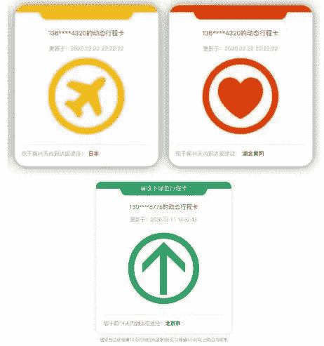

# [新冠肺炎的技术人员]数字身份证—从开发到部署一周

> 原文：<https://medium.datadriveninvestor.com/tech-in-covid-19-digital-id-1-week-from-dev-to-deploy-f4450142c7bc?source=collection_archive---------16----------------------->

## 与 17 年前的 SARS 爆发相比，新冠肺炎疫情在多个方面更加严重，例如潜伏期更长，症状有限或无症状，传染性更强，多种感染途径。

随着中国(以及韩国和日本)在减缓疫情蔓延方面取得进展，如何恢复工作和生产已成为当务之急。以前，如果你要出去，你会面临三个典型的，有些甚至可以说是哲学性的问题:“你是谁？你是哪里人？你要去哪里？”现在，你将面临第四个问题“你感觉还好吗？”

 [## 幸福的算法？数据驱动的投资者

### 从一开始，我们就认为技术正在使我们的生活变得更好、更快、更容易和更实用。社交媒体…

www.datadriveninvestor.com](https://www.datadriveninvestor.com/2019/03/08/an-algorithm-for-happiness/) 

以我自己为例。我在广东深圳。广东省是第一个宣布进入公共卫生紧急状态的省份(大约在 1 月 25 日)。外出时，我需要社区管理办公室的通行证，此外，当我去商场时，我必须进行几次体温测试(一次在商场入口处，另一次在餐厅，另一次在星巴克，当我购买昂贵但非常好的咖啡时)。而且我去超市买菜的时候，量过 3 次以上的体温(一次在门口，一次进超市，再一次买咖啡的时候——我知道，我是个瘾君子)。如果你要回去工作，深圳的公司被政府要求在复工时为工人准备口罩和消毒剂。

但随着疫情得到控制和缓解，旅行和日常通勤中也出现了更复杂的情况，例如——从非疫情地区返回的居民是否必须再隔离 14 天？居民短期出差后能否返回社区？非本地居民(如送货员或邮递员)可以进入小区吗？上述这些情况使得上述许多离线检查变得过时或无用。

这就是为什么数字身份证(在英语中直接翻译为“健康代码”)成为补充离线检查的高效和有效的解决方案。

# 健康代码是如何工作的？

春节后(从 2 月 22 日开始)，腾讯和阿里巴巴几乎同时推出了一款名为健康码的产品，以响应协助深圳和杭州政府恢复工作和生产。健康码是一种带有个人健康信息登记(如当前居住地、最近 14 天的去向等)的二维码，是基于现有产品——腾讯的[微信](https://en.wikipedia.org/wiki/WeChat)和阿里巴巴的[支付宝](https://en.wikipedia.org/wiki/Alipay)的功能更新。(这里有一点背景:大多数中国人都有微信和支付宝，这两个应用程序都正在成为整合各种公共服务的终极应用程序。想象一下，使用脸书不仅可以与朋友交流，还可以支付水电费、预约医生、给优步打电话、在 Yelp 上查看评论等。想想脸书，但是是在 steriods 上。

截至 2 月底，腾讯健康码在深圳实施后，迅速在 20 个省份推广，阿里巴巴健康码也在 200 多个城市广泛使用。2 月 29 日，国家政府事务部在全国范围内推广健康代码，带来并加速了数字身份证在公民中的部署。

《卫生法》解决了许多挑战:

1.健康代码取代了纸质通行证，成为证明居民身份和健康状况的电子方式。通过手机填写信息是避免交叉感染的好方法；

2.网上数据采集方便疫情信息汇总分析，比手工填写节省了地方疾控中心大量的记录上报时间；

3.在城市防疫中使用卫生代码作为“协议”,大大提高了居民日常通勤和社区一线检测/检查的效率；

4.由于数据实时更新，CDC 可以在必要时采取行动以应对新的紧急情况。

# 健康代码是如何工作的？

以杭州的阿里巴巴健康码为例，居民填写个人信息(包括姓名、居住地、出发地、健康状况等)后，)，系统会根据位置信息(周围是否有确诊病例)和居民健康状况(是否有类似发烧、咳嗽等症状)创建一个二维码。)来确定风险等级。就像下面这样，被归类为无风险的人的二维码显示为绿色，被归类为潜在风险的人显示为黄色，被归类为严重风险的人显示为红色。

同时，个人的手机号码也是所需的重要信息，因为后端系统可以通过使用移动运营商提供的大数据来验证个人在过去 14 天内的行踪。

通过新冠肺炎，我们可以看到数字身份证背后的技术支持逻辑:首先，统一的认证系统(基于公民身份证)，以确保一人一个身份证(健康代码)，易于访问，实现全国覆盖。第二，交叉引用来自医疗、航空/铁路、移动运营商的其他数据集可以验证信息的准确性，并有效地定位疑似患者。

# 适应性和灵活性

理论上，通过居民的报告和系统的数据分析，卫生代码系统可以确定一个人是否有新冠肺炎风险，或者一个人是否与感染者有密切接触。但在这个过程中也有许多技术问题，因为从开发到推出只花了 1 周时间。再者，每天高频使用的用户有几百万。

截至 3 月中旬，腾讯健康码累计访问量 16 亿次，覆盖 20 个省份，300 个城市。因此，这个应用程序必须在产品改进中具有适应性和灵活性，因为在产品最初设计时没有考虑到基于场景的新产品需求。

首要问题是跨区域的数据共享。在疫情爆发的早期，几乎每个地区都在基于腾讯微信和/或阿里巴巴支付宝建立自己的卫生代码系统，用于自己的防疫和人口控制。然而，随着越来越多的跨省旅行以恢复工作和生产，有必要识别城市和省份之间的卫生代码数据。

到目前为止，浙江、广东、四川、湖南、河南等劳务输出大省取得了一些进展。政府对数据平台和数据共享越来越重视和投入，以提高行政效率和决策水平。

另一个问题是系统判断的准确性。

黄色或红色代码意味着中度或高度感染风险，个人必须立即隔离 14 天。那么，如何做出准确的风险预警，同时避免健康个体中的错误警报呢？

目前，它依靠移动运营商提供的电信数据来检查一个人在过去 14 天内是否去过疫区。但是可能会有一些错误的结果，特别是在省边界附近的地区，因为位置信息是由移动电话访问的网络接口确定的。

更重要的是，卫生代码必须逐渐整合全网络的数据(如交通、医疗保健等)以进行更全面的判断，以防有人不愿意如实披露信息。此外，数据安全和隐私保护是数据监管的优先事项。

# 期待…

新冠肺炎的爆发推动了这项将在如此短的时间内惠及十多亿人的全国性应用。《卫生法典》不仅解决了人们的交通和感染可追溯性这一棘手问题，也是一项如何授权和激励前线(政府部门、社区、公民)作为一个扁平的社会合作组织开展工作的实验。它还实现了公共行政部门以传统方式可能需要几个月才能完成的公民数据收集和汇总，并且成本大大降低。

在数字身份证和卫生代码的背后，更有价值的是卫生信息流，它达到了政府数据平台数字化改造的更高水平，特别是随着城市化程度的提高。

这里有太多的想象力。例如，通过公民数据授权，健康代码数据可以连接到公民的医疗保险和医疗系统，并根据定期检查、医疗以及社会保障计划和个人医疗投资定制医疗保健建议。这也可以为保险公司等商业利益相关者提供很大的灵活性。比如，对于做定期体检或锻炼的人，保险公司可以考虑给予保险奖励或保费豁免。

由于中国正在规划未来十年以 5G 网络、数据中心和人工智能为重点的新基础设施，卫生法典是迈向全面数字社会的开创性一步。展望未来，实现这一愿景需要数年时间，但政府的第一步也是关键的一步是解决数据碎片问题。解决这一问题不仅可以实现跨地区、跨部门、跨领域的数据共享，还可以通过使用大数据分析为公民提供多维度的价值。

退一步说，新冠肺炎是一个非常独特的情况，那里的公民被要求公开他们的健康数据，几乎不受阻碍地访问，为了他们自己的利益，也为了更大的社会利益。在未来，如何让人们心甘情愿地分享自己的健康数据，这需要许多利益相关者付出巨大努力，仍将是一个挑战。