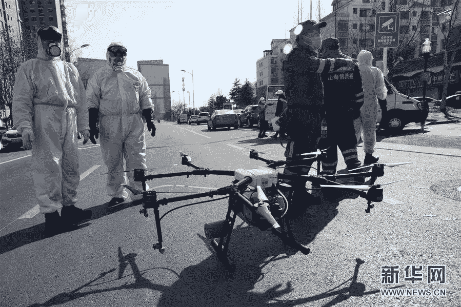

# [新冠肺炎科技]无人机

> 原文：<https://medium.datadriveninvestor.com/tech-in-covid-19-drones-87a52046d1b1?source=collection_archive---------19----------------------->

一天，当我在家工作时，我突然听到有人在我的阳台周围大声说话。我的公寓在 18 楼，所以我排除了有人闯入的可能性(XD)。当我走到阳台上看时，我没有看到强盗或蜘蛛侠，而是看到一架无人机就在我的窗外广播新冠肺炎的最新消息。

这让我觉得分享中国的科技如何帮助控制疾病的传播并减轻政府的工作量可能会很有趣。我看看能不能做成系列:)

在新冠肺炎防疫中，无人机发挥了巨大的作用，因为它比人工流程效率高 10 倍，如安全巡逻，广播更新和卫生提示，温度测量等。越来越多的一线部门正在投资引入和部署无人机服务，因为我们试图稳步将事情拉回正轨(恢复工厂运营/餐馆就是一个典型的例子)。

与此同时，在当前形势的需求推动下，我们也看到了创新和实用无人机应用的加速发展。为了解决培训无人机飞行员、高服务成本、缩短部署时间的紧迫性、飞行员和一线工人之间的协作以及潜在的交叉感染等问题，无人机解决方案需要在电池充电、调度和自主飞行、数据收集和分析方面实现“自动化”。到目前为止，DJI 已经与超过 18 个省的 50 多个县市合作，使用无人机进行防疫。也有一些企业和商业无人机应用公司在地方政府运营管理中进一步探索无人机解决方案，如 [DY Innovations](http://www.dyinnovations.com/index.html) 、 [Antwork](https://www.antwork.link/build/pages/index.html) 和 [SKYSYS](http://www.skysys.cn/) 。

# **场景 1:防疫突发事件**

配备扬声器的无人机是一种简单高效的广播和通信应用，音量高达 130 dbs，覆盖范围为 300 米。医务人员和警察等一线工作人员可以在公共场所发现没有戴口罩的人时，高效地远程进行实时通知和劝导，同时还可以在无人机巡逻期间宣传健康安全习惯和知识。这大大缩短了跨社区的彻底检查时间，进一步保护了一线工人的健康和安全。

*(视频中的无人机在要求人们不要聚集。我在这里看着你……”)*

这里有一点背景:在中国，警察岗亭是作为警察局的补充作用而设立的，用于监控特定区域，如社区/道路/十字路口，因为岗亭更多地位于前线，能够靠近社区并处理紧急情况，而警察局更像是控制中心和后勤后端，以支持各种“卫星”。这就是为什么无人机安全应用程序根据该系统有效地工作:基于警察岗亭部署多架无人机的无人系统解决方案，然后一键释放，开始巡逻和检查。

# **场景 2:高速公路检查站**

公路作为人员流动的重要通道，对疫情防控也至关重要。设置检查站进行安检和测温，造成交通拥堵和交叉感染的潜在风险。无人机在这里可以帮助缓解一线交警的很多压力。在关键路段的收费站部署无人机机场后，交通官员可以远程管理多个飞行任务，而无需学习驾驶无人机或前往现场。他们可以在指挥中心创建无人机检查任务，规划时间表和路线，然后将任务和计划调度到不同收费站周围的无人机机场。此外，任务可以定期自动设置和完成。

无人机大大减轻了前线的工作量。然后，交通警察可以更加关注特殊情况，例如是否每个人都戴口罩，或者是否因收费而造成交通堵塞等。他们可以在指挥中心远程工作，同时在前线“监视”多项任务。

最后，无人机在一整天的工作后飞回机场，精确地降落在机场并充电，同时将数据上传到指挥中心。人不需要参与整个操作过程。

# **其他场景:空投&消毒**

在受灾严重的地区，如湖北省和浙江省，生活物资的物流是一个主要问题。有了无人机，用非接触的方式给居民分发生活用品，是一种安全高效的方式。

在疫情爆发期间，为了提供安全的公共卫生，DJI 与不同的城市合作支持消毒工作。DJI 分享了无人机效率的惊人结果:无人机需要 15 分钟来完成公共消毒工作，而完成同样的工作可能需要 4-5 名卫生专业人员和数小时。截至 2 月 3 日，DJI 农业无人机已完成 2 亿多平方米、3000 多个村庄的消毒任务，作业时间超过 4000 小时。

# **关于技术创新的思考**

技术创新总是由需求推动和加速。这又让我想起了今年早些时候我对创新和整合的思考。整合，而不仅仅是创新，是重要的未实现商业价值的来源。

当谈到“创新”时，我们大多数人都对酷产品/技术感兴趣，当然还有那些工程问题背后的独角兽或初创企业。但是在那些啊哈时刻的背后，我们总是忽略了产品或解决方案的扩展问题。在大多数情况下，创新解决方案变成了绿地，部署变成了破坏性创新，这意味着传统行业需要为当前运营建立单独的业务流程。

查看中国新冠肺炎的无人机解决方案:快速部署、**不间断操作、无人全自动操作、同时支持多种设备和任务在实际着陆和扩展中非常重要。**

当我们重新思考为什么数字化转型如此困难时，重要的是要平衡我们何时需要优先考虑当前的业务运营，何时需要彻底改变当前的运营。