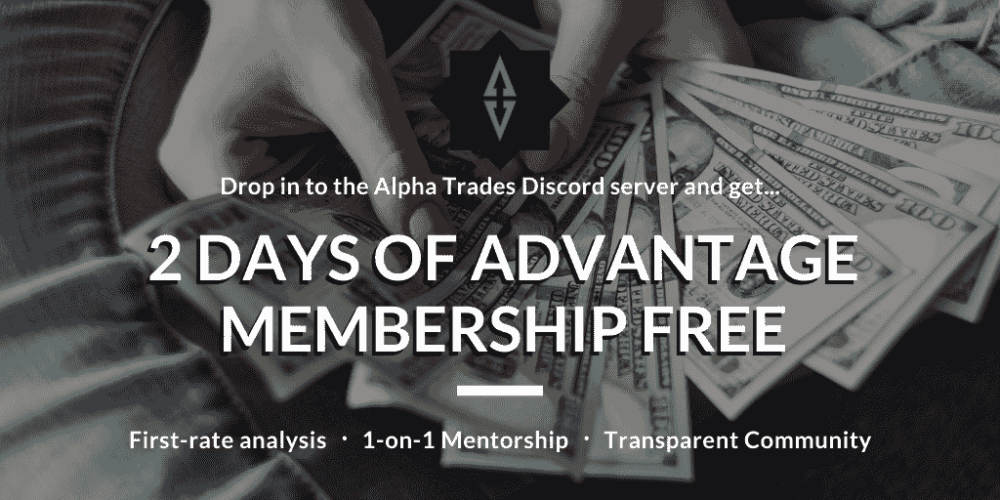

# 技术是市场的霸主

> 原文：<https://medium.datadriveninvestor.com/tech-is-the-market-top-dog-1e9f3889f55b?source=collection_archive---------18----------------------->

## **DDI 英特尔技术| 8 月 28 日的一周 Alpha 交易**

大量的首次公开募股，中国做他们自己的事，微软政府的灾难应对，以及一首抖音时代的歌谣。

# DDI 会员之角

我们感谢每个人对调查的回应。你说完了吗？我们想听听你的意见。

您是否介意填写一份简短的调查问卷，了解一下您目前对我们的新闻稿和出版物的体验？

[让我们知道你的想法](https://stoneba1992.typeform.com/to/gkpWMtS1)。

**【等等，不要发表到媒体上！]**

让我们在 DDI 时事通讯和我们的主页上刊登你的迷人故事。它将为你打开通往全球 6 万多订户和观众的大门。

你在大数据、人工智能、物联网、创业文化或科技相关领域挖掘出了什么独特的东西吗？请在 members@datadriveninvestor.com 给我们寄一张汇票

**我们正在投资:**

**【科技】**

你对未来有愿景吗？可能是一个应用程序、一项新服务或一个问题的独特解决方案？

需要具备特定技能的人，或者需要特定类型的资源或数据？

还是你项目的投资人？

让我们知道 DDI 能帮上什么忙——你可以发送一些基本信息给 ventures@datadriveninvestor.com。

**【交易】**

如果你有一个能产生稳定业绩的交易策略，请告诉我们。我们也许能为你的扩建提供资金。联系我们在 research@datadriveninvestor.com 的研究团队。

**最新 DDI 问题:**

*   [加密货币](https://www.datadriveninvestor.com/2020/08/26/were-in-for-a-wild-ride/)
*   [市场&经济](https://www.datadriveninvestor.com/2020/08/24/injection-for-the-market-faang-continues-to-ride-that-perma-bull-energy/)
*   [技术](https://www.datadriveninvestor.com/2020/08/13/rocky-start-for-reels-global-tech-splinters-5g-gets-a-boost/)

(注:如果你喜欢这封邮件，请考虑把它转发给某个会从中获益匪浅的人。如果有朋友给你发了这封邮件，你可以 [*订阅 DDI 简讯*](https://data-driven-investor.ck.page/a258e80d70) *来一分不差。)*

# DDI 编写器亮点

在每一期中，我们喜欢从展示一些来自 DDI 社区的发人深省的故事开始。为了让你的话出现在我们的订户面前，你需要提交到我们的领先网站，*而不是*Medium.com。[在这里提交你最好的](https://datadriveninvestor.com/mainsubmission)。

[围绕 GPT 3 号的炒作是什么？](https://www.datadriveninvestor.com/2020/08/24/whats-the-hype-surrounding-gpt-3/)

“随着 GPT-3 的到来，可以肯定的是，人工智能领域正在发生非凡的进步。”-拉曼迪普·塞尼

[什么是数据目录，它如何帮助机器学习取得成功？](https://www.datadriveninvestor.com/2020/08/27/what-is-a-data-catalog-and-how-does-it-enable-machine-learning-success/)

要避免的五个数据目录错误

在胁迫时期提高美国劳动力的技能

“混乱中有机会。一个人只需要知道去哪里找。”穆罕默德·西迪基

[区块链投票和美国大选](https://www.datadriveninvestor.com/2020/08/26/blockchain-voting-and-the-american-elections/)

“区块链投票的好处将大大减少选民的冷漠，甚至鼓励更多人投票。”-迪帕·拉玛钱德拉

[如何以交易为生](https://www.datadriveninvestor.com/2020/08/17/how-to-trade-for-a-living/)

"没有游戏计划，你只是在赌博."-阿莫尔·加特

# 在新闻报道中出现

**就像那部 *Twister* 的电影，但是用的是机器人:**随着飓风季节的肆虐，风暴[在美国中西部肆虐](https://edition.cnn.com/2020/08/21/us/iowa-derecho-recovery/index.html)，能源部[与](https://www.wsj.com/articles/microsoft-energy-dept-to-develop-disaster-response-ai-tools-11597755601)和微软合作开发灾难响应人工智能。

他们称之为“ [First Five Consortium](https://cloudblogs.microsoft.com/industry-blog/microsoft-in-business/government/2020/08/19/department-of-energy-announces-the-first-five-consortium/) ”，暗指大规模灾难响应的前五分钟的重要性。

[**白宫全力投入**](https://www.theverge.com/2020/8/26/21402274/white-house-ai-quantum-computing-research-hubs-investment-1-billion) 人工智能和量子计算:美国政府将投资 10 亿美元用于人工智能和量子计算研发&除了改善灾难应对工作，投资尖端技术的动机并不令人惊讶；领先中国。

全球人工智能投资[将在四年内翻一番](https://www.idc.com/getdoc.jsp?containerId=prUS46794720)(1100 亿美元)，尽管据报道只有 10%的美国公司使用它。

IPO 狂潮:这很好地延续了一个事实，即在过去几周，一批科技初创公司申请了 IPO。引起我们兴趣的一家公司是桌面金属公司，这是一家 3D 打印公司，在特殊目的收购公司领先的首次公开募股后，估值为 25 亿美元。投资者包括福特、BMV 和谷歌。

# **为抖音申奥起舞**

Windows 95 Launch Party

沃尔玛正式与微软联手收购抖音。这笔 200-300 亿美元的交易将包括字节跳动在美国、加拿大、澳大利亚和新西兰的抖音业务。

我们期待一些特别的抖音迷因从中产生。

**复习:**上周，抖音[起诉美国政府](https://www.nytimes.com/2020/08/24/technology/tiktok-sues-us-government-over-trump-ban.html)，称行政命令剥夺了公司的正当程序。

特朗普已经延长了字节跳动的时间窗口，但仍需在 90 天内达成协议。

竞争:在一个角落里的是甲骨文公司，它无疑是出价收购抖音的最无聊的公司。该应用的 1 亿多美国用户主要由 Z 世代人群组成，他们中的大多数对跳舞比企业软件和云计算解决方案更感兴趣。然而，甲骨文可能有几个重量级人物准备提供支持，即红杉资本，通用大西洋，和[共和党](https://www.wsj.com/articles/general-atlantic-sequoia-capital-are-key-drivers-in-oracle-bid-for-tiktok-11598310734)。

在另一个角落，你有微软，与沃尔玛合作。微软[有优秀舞蹈视频的历史](https://youtu.be/lAkuJXGldrM)，所以这可能是一个福音。

微软在游戏和工作场所软件数据方面已经是一个大数据强国。将抖音加入其剧目将使该公司获得大量的社交媒体行为数据资源。更不用说该公司可以将抖音纳入其 70 亿美元的广告业务。

微软已经拥有以商业为中心的社交媒体公司 LinkedIn，以及《我的世界》背后的公司 Mojang。哦，他们还拥有 Xbox 和 Github，这可能是一件大事。过去的这些收购让这些公司大部分时间做自己的事情，微软也讨论过让抖音独立运营。

另外两个角落有 Twitter 和网飞，但这两家公司达成交易的可能性很小。竞争对手拥有更强大的火力和联系(微软的现金储备超过甲骨文三倍以上)。

你认为你能用你的抖音收购迷因打破互联网吗？在 Twitter 上给我们贴标签 : @dd_invest

# 其他中国科技新闻

**具有中国特色的开源:**当美中紧张局势威胁到中国开发者对 Github 的访问时，开源代码库 Gitee 作为 Github 的替代方案正在中国获得关注。中国中部的技术政策制定者工业和信息化部(MIIT)在一个项目中选择了 Gitee，为中国建立一个“独立的开源代码托管平台”( [TechCrunch](https://techcrunch.com/2020/08/21/china-is-building-its-github-alternative-gitee/) )

那是一只巨大的蚂蚁:中国金融科技巨头蚂蚁集团准备上市，在过去六个月中获得了高达 35 亿美元的利润。阿里巴巴拥有蚂蚁金服 33%的股份，蚂蚁金服又拥有支付宝，中国超过 9 亿人依赖的移动支付网络。蚂蚁计划以 2000 亿美元的估值上市，比高盛更有价值，与贝宝目前的 2200 亿美元相当。([华尔街日报](https://www.wsj.com/articles/jack-mas-ant-group-posts-3-5-billion-profit-in-six-months-ahead-of-ipo-11597939394))

# 世界工厂已不复存在

随着美中贸易战升温，台湾电子制造商富士康和和硕计划在墨西哥开设工厂。今年早些时候，富士康宣布将在印度[建厂。](https://www.reuters.com/article/us-india-manufacturing-smartphone/apples-taiwan-suppliers-samsung-apply-for-indias-smartphone-scheme-idUSKBN24X3MA)

**为何如此重要:**在经济普遍衰退之际，总部位于亚洲的跨国公司有可能向拉丁美洲注入数十亿美元。这些天在白宫被抛来抛去的一个概念是“近岸”，在这个概念中，公司可能会有动机将他们的业务从亚洲转移到美国、拉丁美洲和加勒比海。

资本和工业从亚洲向墨西哥这样的地方转移，对这个国家和整个地区来说都是一件好事。

# 现在是 IPO 季节

Palantir、雪花、Asana、JFrog、Sumo Logic 和 Unity 都在过去几天申请了 IPO。

云数据仓库初创公司 Snowflake 本周提交了 S-1 文件。公司的收入在激增，但支出也在激增。雪花的目标是 200 亿美元的估值。

**本周 IPO 奖授予了** [Unity](https://www.forbes.com/sites/mattperez/2020/08/24/epic-games-rival-unity-software-files-to-go-public/#4a4210772d6b) ，游戏开发者、汽车设计师和电影制片人使用的 Unity 引擎的创造者。Unity 占据了 50%的游戏开发市场，每月有超过 150 万的创作者使用该引擎。该公司最近的估值为 60 亿美元。

**竞争加剧:** Unity 是 Epic Games 及其虚幻引擎的直接竞争对手。Unity 放弃了他们的 S-1，而 Epic 正在与苹果和谷歌进行法律斗争，因为他们违反了通过 Epic 的病毒式流行游戏堡垒之夜进行应用内支付的政策。

**堡垒之夜最新消息:**[地方法院裁定](https://techcrunch.com/2020/08/24/apple-ordered-to-not-block-epic-games-unreal-engine-but-fortnite-to-stay-off-app-store/)苹果不必恢复堡垒之夜的 iOS 应用商店。但是，苹果无法阻止 iOS 开发者社区使用虚幻引擎。法官表示，取消开发者对虚幻引擎的访问将严重损害整个游戏行业。

博彩业将接管这个星球。 [在数据驱动的投资者](https://medium.com/datadriveninvestor/engage-me-or-enrage-me-gamification-will-run-the-world-dfb4cf1f4adc)那里得到破败。

# 当人们问“比特币是如何工作的？”我们推荐这本电子书。

比特币被一些人誉为“数字黄金”，被另一些人誉为“纯粹的货币”，对许多人来说，它意味着许多东西。 [**比特币基础知识:比特币入门**](https://www.amazon.com/dp/B08FBP9W4Y) 帮助你开启比特币之旅。

这本书将帮助你对构成比特币的基本概念感到舒适，无论你是寻求了解还是准备亲自参与比特币。**了解比特币网络的关键特征**，解释如何将比特币从一个人转移到另一个人，探究**比特币的历史**，等等。

# 其他科技新闻

苹果 **成为一家 2 万亿美元的公司**，这个科技巨头只用了两年时间就完成了。

[**亚马逊**](https://techcrunch.com/2020/08/25/amazon-rolls-out-a-new-ar-shopping-feature-for-viewing-multiple-items-at-once/) **掉了一个新的 AR 购物工具:**这个差点把我拉下了潜在的兔子洞，那就是增强现实。我不得不反抗，否则这篇时事通讯永远不会结束。

自从有人向我介绍了 Pokemon Go，我就知道 AR 将对电子商务和实体零售产生巨大影响。这是两者之间的桥梁。亚马逊的房间装饰应用程序会给你同样的神圣感觉，就像我们中的一些人在玩模拟人生和装饰你的数字梦想房子时所记得的一样。

**Fitbit 发布了 Sense 智能手表，**它配备了压力管理规格，如最先进的心率技术、PurePulse 2.0 和检测发烧的皮肤温度传感器。随着 COVID 撼动医疗技术领域，这款设备在今年圣诞节的销量肯定会大幅增长。这种感觉的价格标签是 329.95 美元。([市场观察](https://www.marketwatch.com/story/fitbit-unveils-new-sense-smartwatch-revamps-inspire-and-versa-devices-2020-08-25)

**SpaceX 的 Starlink 还有很长的路要走:**目前 Starlink 的下载速度约为 42.8Mbps，上传速度约为 4.5Mbps 至 17.7Mbps。尽管距离该公司 1Gbps 的最终目标还很远，但这对许多农村互联网用户来说仍是一个进步。( [PCMag](https://www.pcmag.com/news/how-fast-is-spacexs-satellite-internet-beta-tests-show-it-hitting-up-to) )

SpaceX 已经向 Starlink megaconstellation 发射了 600 颗卫星，其中数千颗计划进入轨道，以实现速度高达 1Gbps 的全球宽带覆盖。

# 乐趣&有趣

**炫目的空间意象**

[五张太阳喷发照片会炙烤你的大脑](https://www.inverse.com/science/5-solar-eruption-photos-will-sizzle-your-brain)(逆)

# 回顾上一期

[**目标**](https://techcrunch.com/2020/08/19/target-sets-sales-record-in-q2-as-same-day-services-grow-273/)**[**沃尔玛**](https://www.wsj.com/video/walmart-doubles-its-e-commerce-revenue-as-sales-surge/B19CA901-BF0B-43BA-BC4B-C2651475D219.html) **在电子商务中兴风作浪**为行业[爆](https://fred.stlouisfed.org/graph/?g=unh2&utm_source=twitter&utm_medium=SM&utm_content=stlouisfed&utm_campaign=36d2c793-1904-4e45-bb55-6aab2b73c29d)。两家公司都加入了这一趋势，在几项指标上实现了创纪录的增长。随着人们继续避免亲自购物，电子商务的浪潮势不可挡。**

**[**中国**](https://www.wsj.com/articles/china-to-expand-testing-of-a-digital-currency-11597385324?utm_source=morning_brew) **正在将**数字货币/电子支付试验扩展到京、港和其他城市。[华为](https://www.coindesk.com/huawei-builds-blockchain-platform-so-beijing-govt-can-better-manage-peoples-data)助阵。**

**[**软银**](https://markets.businessinsider.com/news/stocks/softbank-invests-billions-tech-giants-stock-market-tesla-amazon-netflix-2020-8-1029513600) **本月在大型科技公司上双倍下注**，投资亚马逊、Alphabet、微软和特斯拉。名单上的其他大牌还有 Adobe、网飞、Nvidia、Shopify、Paypal 和 DocuSign。**

# **观看表演**

**我们在 Alpha Trades 的朋友们本周深入研究了市场、密码和经济。通过最新剧集找到您的优势:**

**[完美的密码交易策略](https://youtu.be/msaG_wjX6p4)**

**[比特币关卡买 Dip |有哪些山寨币要关注](https://youtu.be/23qTm_5tyo0)**

**科技股空头会是 9 月份最好的风险回报交易吗？**

****

**[订阅 Alpha Trades Discord 服务器](https://discord.com/invite/a97qq2s)学习技术分析以及如何投资获利。询问 2 天的高级会员试用！**

****注意，订阅者:**你们中的一些人可能已经订阅了 DDI 的媒体出版物简讯和主要网站的简讯。我们欣赏粉丝，但两个简讯是同一只野兽。**

**如果你在这种情况下，我们建议坚持使用领先的网站。你会注意到正确的一个缺乏媒体品牌。如果你有任何问题，给我们发邮件:*members@datadriveninvestor.com***

# **放弃**

**数据驱动投资者(DDI)提供的信息不用于做出任何金融决策，也不是购买、持有和/或出售特定证券或金融工具的请求或建议。**

**Alpha Trades，LLC 提供的信息不用于制定任何财务决策，也不是购买、持有和/或出售特定证券或金融工具的请求或建议。**

**访问 Alpha Trades 的完整服务条款:[https://bit.ly/3faVeeV](https://bit.ly/3faVeeV)**