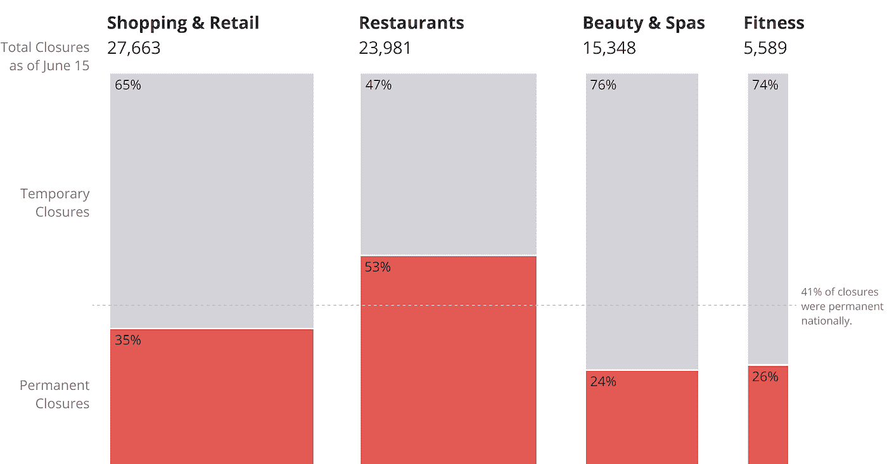
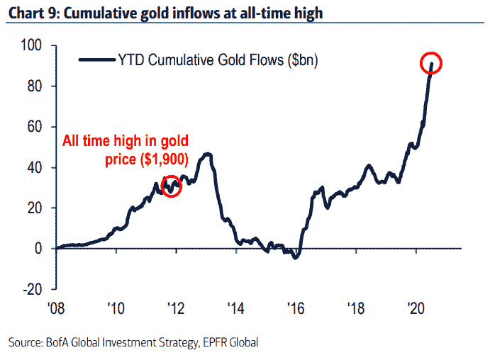
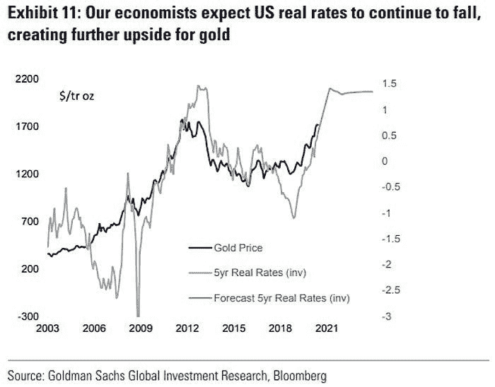

# 科技领袖在 COVID 复苏中下滑，经济将迎来决定性转折

> 原文：<https://medium.datadriveninvestor.com/tech-leaders-slip-amid-covid-resurgence-economy-set-for-a-decisive-turn-aec14d426abb?source=collection_archive---------11----------------------->

## **7 月 19 日当周股票简讯| Alpha 交易**

*被困在 Medium 的付费墙后面？* [*注册我们的 Discord 服务器*](https://discord.gg/a97qq2s) *查看#公告免费获取全文:*[*https://discord.gg/a97qq2s*](https://discord.gg/a97qq2s)

Everything is Canceled; Photo by Jeffrey Czum from Pexels

## 更新—7 月 24 日

*我们在 7 月 20 日和 22 日发布了加密货币的视频分析，并在 24 日发布了股票讨论，请保持知情！*

[【值得关注的前 3 名德菲币| BTC 横向移动，德菲攀升】](https://youtu.be/s3oLm04LC8I)

[🌊乘坐 DeFi Wave |项目的最佳选择，具有+1000%的潜力！】](https://youtu.be/kzvBZR5yYWI)

[【特斯拉和微软为什么在财报利好后抛售？]](https://youtu.be/TfrsaloCFpQ)

## 关于市场的炉边谈话

*   [最拥挤的交易——黄金](#b343)
*   医疗保健机构看起来很有希望。
*   美联储是否已将市场带入狂热阶段？
*   [超越美国](#fd5a)
*   [播放 EV 回调](#8e3b)
*   [自动化汽车时代的保险](#3402)

## 外卖:

*   标准普尔指数反弹，资本从科技龙头流向更受打击的行业。
*   **COVID 第二波是真实的。**
*   世界在为实体经济的衰退做准备，而亿万富翁和投资者在寻求交易和漏洞。

结束一周，这样你就不必。这是最新一期的阿尔法交易通讯。阅读上一期我们的加密货币简讯 [***【此处】***](https://medium.com/datadriveninvestor/bitcoin-and-equities-reveal-a-line-in-the-sand-1ac6126d2b23) *以及所有关于股票和经济的* [***【此处】***](https://medium.com/datadriveninvestor/best-strategy-for-q3-china-the-dollar-and-a-persistent-virus-f7a9f290b31c) *。*

[【复制我们的 S & P 500 主图，设置警报！]](https://www.tradingview.com/chart/12yl2kNH/)

## 概述

股票[本周收盘走高](https://www.reuters.com/article/us-usa-stocks/sp-500-ends-higher-as-traders-weigh-stimulus-and-virus-worries-idUSKCN24I1G4)，尽管对 COVID 复苏的担忧日益加剧。对进一步经济刺激的预期为市场提供了支撑。在周一科技股领跌后，市场反弹，并一直保持关键支撑。一个[几个主要的名字](https://wolfstreet.com/2020/07/11/wild-ride-to-nowhere-appl-msft-amzn-goog-and-fb-soar-to-new-high-rest-of-the-stock-market-is-a-dud-has-been-for-years/)继续引导股票市场，尽管上周在[非技术玩家](https://graphics.reuters.com/USA-STOCKS/WEEK/rlgpdldzdpo/)中看到更多的看涨行动。

 [## 回购市场注入对经济有何影响——跟踪面包屑|数据驱动的投资者

### 我们发现人们倾向于忘记(包括我们自己)重要的因素、事件或定义…

www.datadriveninvestor.com](https://www.datadriveninvestor.com/2020/05/13/what-repo-market-injections-say-about-the-economy-follow-the-breadcrumbs/) 

# 每周节拍

关于全球市场、COVID 和底层经济，有大量的坏消息。我们已经尽了最大努力策划最好的坏消息，提前为皮质醇激增道歉。

[【新冠肺炎统计全球互动地图】](https://coronamap.it/)

**COVID 经济，全球观点|** 房间里的大象是世界是否会回到封锁状态，以阻止 COVID [的复苏](https://www.theguardian.com/world/2020/jul/19/global-wrap-hong-kong-critical-as-covid-cases-rise-worldwide)。共识似乎是“不是整个世界，而是它的一部分”，你的医生可能认为这太少，太晚了。我们在秘鲁的编辑报道，带着堆积如山的卫生纸冲出超市的人数又开始上升了。我们在哥伦比亚的人说，该国跟随世界其他地区恢复封锁措施。说真的，[拉丁美洲陷入了困境](https://www.bloomberg.com/news/articles/2020-07-01/latin-america-gdp-likely-worst-since-at-least-1901-world-bank)。甚至像新加坡这样的区域性经济强国也面临着严重的衰退。欧洲委员会也预计会出现严重的衰退。

本月美国预算赤字创历史新高，原因是大规模失业吞噬了税收收入，以及 COVID 救济项目支出增加。

**不是每个人都回来了|**[Yelp 经济影响季度报告](https://www.yelpeconomicaverage.com/yelp-coronavirus-economic-impact-report)发现，虽然许多企业正在缓慢重新开业，但超过 41%的企业永久关闭，零售业和餐饮业受打击最大。

Closures, temporary and permanent; Source: Yelp Quarterly Economic Impact Report

与此同时，多个城市的驱逐事件激增，威胁到超过 2800 万美国人无家可归。经济压力导致大量人口离开昂贵的租赁市场，比如曼哈顿，那里的空置率已经达到[的历史新高](https://rightwingeconomics.com/2020/07/10/manhattan-rental-market-implodes-median-rent-plunges-most-ever-as-vacancies-hit-record-high/)。自三月以来，将近四分之一的纽约租户没有支付租金。公寓列表的在线调查报告显示，13%的家庭支付了部分房款，19%的家庭没有支付任何房款。专家敦促美国政府测试紧急现金支付，以避免止赎和驱逐的浪潮。

[【尽管重新开放，错过的住房付款仍然很高】](https://cdn.substack.com/image/fetch/c_limit,f_auto,q_auto:good,fl_progressive:steep/https%3A%2F%2Fbucketeer-e05bbc84-baa3-437e-9518-adb32be77984.s3.amazonaws.com%2Fpublic%2Fimages%2F65836d66-95ea-47ee-964d-6f8257950c28_980x514.png)

**丑，但是喝了几杯|** 也不能*都*坏吧？人们连续几个月被困在家里的一个好处是他们倾向于存更多的钱，并且这些钱中的大部分用于偿还创纪录水平的信用卡债务。

封锁还加剧了人们远程或在家工作的趋势，迫使企业为了生存而快速升级过时的系统。永远领先的谷歌[承诺投资 100 亿美元](https://www.reuters.com/article/us-google-india/alphabets-google-commits-10-billion-to-accelerate-digitization-in-india-idUSKCN24E0YL)在印度推动数字化，并让另外 5 亿人上网。

**建造它，他们会来|** 至少，这是这些[6 月房屋建筑数字](https://apnews.com/977ea44bef956755e059d8e8072d94bc)会让你想到的。增长 17.3%，建筑热潮可能是短暂的，因为数据是在新的 COVID 病例急剧增加和几个州取消检疫措施之前获得的。

# 中国戏剧继续

美国对中国技术的制裁可能会对华为产品的质量产生负面影响。作为准备，英国计划在 2027 年底前将华为产品从 5G 基础设施中移除。

**扎克伯格为抖音客户而来|** 脸书正准备在全球推出 [Instagram Reels](https://www.nbcnews.com/tech/tech-news/facebook-readies-global-launch-its-tiktok-competitor-n1234013) ，这是抖音的直接竞争对手。此举出现在美国政府考虑以国家安全为由削弱或完全禁止中国应用程序的时候，这并不令人惊讶。不怕在对手倒下时踢他一脚，脸书计划统治愚蠢舞蹈视频剪辑的世界。

# 本周洞察

我们之前提到过黄金在经济放缓时期作为可靠对冲工具的潜力。对大多数人来说，这是显而易见的，但我们希望用一张累计黄金流入的图表来传递这一信息。高盛(Goldman Sachs)的第二张图表预测，美国 5 年期实际国债利率将进一步下降，12 个月内黄金价格将达到每盎司 2000 美元。

Talk about the strong demand for gold!

Gold is in, bonds are out. What’s that mean for the global economy in terms of international commerce?

【[时间戳:27:56](https://youtu.be/hXbdNkl8_YE?t=1676) 】黄金交易是一个拥挤的房间，值得一进。我们关注的名字:黄金现货(XAU-美元)，VanEck Vectors 黄金矿工 ETF (GDX)，和柯克兰湖(吉隆坡)。我们的分析师也是从 17.05 左右开始长 iShares 银信(SLV)。

**类别获奖者|** 之前的时事通讯分享了对[社会资本](https://www.socialcapital.com/)首席执行官[查马斯·帕里哈皮提亚](https://twitter.com/chamath?ref_src=twsrc%5Egoogle%7Ctwcamp%5Eserp%7Ctwgr%5Eauthor)的价值包装[采访](https://unchainedpodcast.com/chamath-palihapitiya-why-bitcoin-will-be-the-category-winner/?utm_campaign=Investor%20Letters&utm_medium=email&_hsmi=91103417&_hsenc=p2ANqtz-_knatsGPjVKzdDnuuIDxrdppztsbd61ed4JjTHhHCmhOK--lcHnmjpjwwxcyYiT8k9v6e2V-oNFxz77gfYhgFRrH80kw&utm_content=91103417&utm_source=hs_email)。我们发现最重要的一点是，查马斯认为比特币(BTC)是一种与全球混乱不相关的对冲。值得一听。

## 医疗保健机构看起来很有希望。

[ [时间戳:4:27](https://youtu.be/hXbdNkl8_YE?t=267) ] **艾伯维(ABBV)** 周日形成了一场精彩的突破交易，守住了 97.86 的关键水平。ABBV 是另一家受益于冠状病毒疫苗研发竞赛的制药公司。我们的分析师预计 ABBV 将向 121-122 区域攀升，这是 2018 年 2 月以来的前一个高点。一个更保守的观点是，ABBV 的目标是最后的价格差距约为 106。

[ [时间戳:5:45](https://youtu.be/hXbdNkl8_YE?t=335) ]医疗保健仍然是一个看涨的行业，我们认为本周关注强生公司&强生(JNJ)是至关重要的，因为他们[报告了一个不错的季度](https://www.jnj.com/johnson-johnson-reports-2020-first-quarter-results)。该股最近突破了一个多周的下降趋势线，如果它能保持在 149 至 150 区域上方，动力可能仍有利于多头。

[[Timestamp:7:30](https://youtu.be/hXbdNkl8_YE?t=450)]我们希望制药行业的领导者通过参与 COVID 疫苗试验来获得大力支持。我们期待在 JNJ 发生的一个例子是阿斯利康(AZN)，它因[疫苗新闻](https://www.npr.org/sections/health-shots/2020/07/20/893211400/early-oxford-astrazeneca-coronavirus-vaccine-data-encouraging-scientists-say)而爆发。尽管几名医学官员表示，世界距离大规模生产疫苗还有几个月的时间(T4 ),但股票市场情绪反映出，任何关于疫苗的消息都足以改变市场情绪，即使只是在短时间内。我们的分析师表示，他们将在本月早些时候做空赌场名称，由此产生的疫苗新闻给这些设置带来了漏洞。

## 美联储是否将市场带入了狂热阶段？

**我们预计高增长领域将出现大幅回落。**

## 超越美国

我们认为将会有大量资金转向非美国股票。欧洲不在我们的名单上，但中国可能是今年唯一增长的经济体。考虑到向网上购物的转变，像阿里巴巴这样的名字仍然相对便宜。

## 玩电动汽车回调

我们预计特斯拉会下跌，因为这是目前散户交易者中最拥挤、价格最高的交易。如果 TSLA 表现疲软，我们希望对其竞争对手尼古拉(NKLA)建立空头头寸。

## 自动化车辆时代的保险

[ [时间戳:42:54](https://youtu.be/hXbdNkl8_YE?t=2574) ]保险领域本周显示出诱人的迹象。看看进步保险(PGR)。该公司本季度创下历史新高，主要是因为他们在此期间不需要为事故支付那么多费用。对于汽车保险公司来说，我们可能正在进入一个短暂的黄金时代。有了自动驾驶，事故可能会大幅下降。在某种程度上，由于全自动驾驶汽车带来的安全改善，人们可能看不到支付保险的必要性。可能发生的情况是，像 TSLA 这样的公司将把保险单与他们提供的其他产品和服务捆绑在一起，或者与 AppleCare 这样的公司合作，提供个性化的全包保险。

# 意见

道德崩溃，还是资源配置不当？| 当银行为[违约潮](https://www.wsj.com/articles/this-is-not-a-normal-recession-banks-ready-for-wave-of-coronavirus-defaults-11594746008)和[特大破产](https://www.bloomberg.com/news/articles/2020-07-15/father-of-the-z-score-predicts-a-surge-in-mega-bankruptcies)做准备时，为 PPP 贷款提供贷款服务的机构准备好了总计[180 亿美元](https://theintercept.com/2020/07/14/banks-cares-act-ppp/)。此外，如果有资格获得贷款的企业违约，损失的是小企业协会，而不是银行。另一个有趣的事实是，小型企业更有可能得到中型金融机构的服务，这意味着企业的生存往往取决于该地区的银行结构。

与此同时，破产公司的高管在破产前几周甚至几天就获得了高达 1.31 亿美元的奖金。这一消息引发了大量争议，即当这些公司中的一些在疫情之前表现不佳时，高额的绩效奖金是否合理。

考虑到最近关于[亿万富翁接受 PPP 贷款](https://www.cnbc.com/2020/07/07/the-billionaires-and-country-clubs-that-received-ppp-loans.html)的沸沸扬扬，这条新闻可能会触动一些读者的神经。

当我们谈到疫情的经济衰退时，一些分析师预计在失业率上升的背景下，经济可能会迅速复苏。这种想法是，企业在收益疲软的季节削减支出，以提高收益，为投资者描绘一幅更加绚丽的经济前景。随着 Q2 的收益预计[下降 44%，这是自 2008 年金融危机以来最糟糕的情况，真正的问题是我们在这里谈论的是哪个经济体。当低收入的美国家庭](https://www.cnbc.com/2020/07/10/market-heads-into-worst-earnings-season-in-12-years-amid-worries-virus-is-slowing-recovery.html)[发现很难把食物放在桌子上](https://www.bloombergquint.com/global-economics/low-income-american-households-suffer-inflation-shock-from-virus)时，如果投资者站出来获利，人们只能期待会有后果。

# 其他新闻

上周，Twitter 的大约 130 个账户遭到黑客攻击，骗子骗取了该应用用户近 10 万美元的加密货币。

**千禧一代有赌博问题|** 上周，特斯拉(TSLA)一度看到每小时有 [1 万名交易员购买股票](https://www.bloomberg.com/news/articles/2020-07-13/ten-thousand-day-traders-an-hour-pour-into-tesla?sref=KkPzpZvz)。日间交易游戏正在火热进行中。

在栅栏的另一端， **Workhorse** 获得了在美国所有 50 个州销售其电动货车的许可，这是继联合包裹服务公司(UPS)今年早些时候下订单后的又一好消息。在同一个俱乐部，电动汽车初创公司菲斯克的目标是[上市](https://www.cnbc.com/2020/07/13/ev-startup-fisker-to-go-public-through-merger-with-apollo-backed-firm-at-combined-value-of-2point9-billion.html)。该公司价值 29 亿美元，将与特殊目的收购公司 Spartan Energy Acquisition 合并。说到 SPACs —

随着比尔阿克曼的空白支票公司打算[为另一项未披露的收购筹集 40 亿美元](https://www.bloomberg.com/news/articles/2020-07-13/ackman-s-blank-check-company-increases-ipo-target-to-4-billion?sref=KkPzpZvz)，SPACs 继续占据头条。

# 编辑推荐

每周，我们都会为读者带来一些精选的故事，这些故事来自《数据驱动投资者》的朋友。

[**大迁徙:寻找更好的地方**](https://www.datadriveninvestor.com/2020/07/16/the-great-exodus-searching-for-the-better-place/) **|** 如今，当当地经济几乎把人们挤出城镇时，人们搬到更好的地方去住变得越来越普遍。卡蒂亚·雷分享了一些关于为什么数百万人为了追求更好的生活而逃离昂贵的大都市地区的见解。人口流动和特大城市的增长让我们了解到社会当前和未来面临的挑战。

[**如何在罗宾汉时期不破产交易期权**](https://www.datadriveninvestor.com/2020/07/01/how-to-not-go-broke-trading-options-on-robinhood/) **|** 蒂姆·加尔利克的这篇文章非常及时。考虑到一些可怕的故事，以及丑陋的结果往往被夸大的一夜暴富的故事所掩盖，我们敦促读者在交易复杂的工具时保持冷静。像 Robinhood 这样的平台让做傻事变得极其容易。做任何决定前，保持安全和研究。

# 罗宾汉家族会喜欢这个的

除非你一直生活在岩石下，否则你现在可能对加密货币很熟悉。但在加密生态系统中有一个利基，最近引起了交易员和投资者的大量关注。

在来自我们社区的巨大压力下，我们最终跳回了替代硬币和 [DeFi](https://defipulse.com/#__next:~:text=What%20is%20DeFi%3F) 空间的最深处，为您提供一些杀手交易设置。

我们不会止步于图表。我们每周都会介绍几个项目背后的基本原理，这样即使是精明的投资者也能做出明智的决定 [**【在我们的 Discord server 了解更多】**](https://discord.gg/a97qq2s) 。

**保持安全**

Sunday Equities Talk by Alpha Trades. Please like and subscribe if you find this content valuable.

# 想免费试用 Advantage 两天吗？

[订阅 Discord 服务器](https://bit.ly/2KJ1oor)学习技术分析以及如何投资获利。询问 2 天的高级会员试用！

# 放弃

Alpha Trades，LLC 提供的信息无意用于做出任何财务决策，也不是购买、持有或出售特定产品、数字资产或 ICO 的请求或建议。

访问我们的完整服务条款:[https://bit.ly/3faVeeV](https://bit.ly/3faVeeV)

**访问专家视图—** [**订阅 DDI 英特尔**](https://datadriveninvestor.com/ddi-intel)