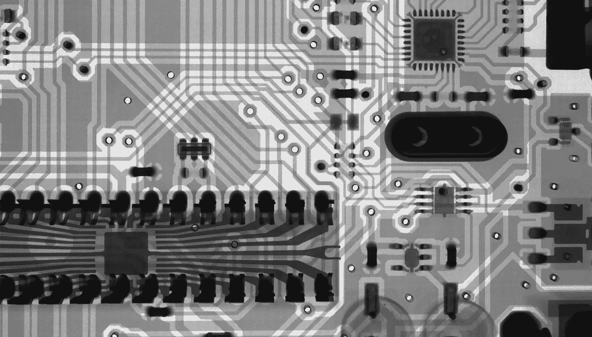
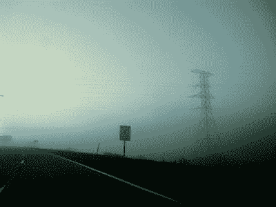
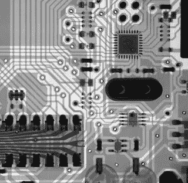

# 科技周二:5G 阴谋

> 原文：<https://medium.datadriveninvestor.com/tech-tuesday-the-5g-conspiracy-49ec26a960dc?source=collection_archive---------21----------------------->

## 技术

## “妄想症是会传染的。”安德森

Photo by [Mathew Schwartz](https://unsplash.com/@cadop?utm_source=unsplash&utm_medium=referral&utm_content=creditCopyText) on [Unsplash](https://unsplash.com/s/photos/technology?utm_source=unsplash&utm_medium=referral&utm_content=creditCopyText)

早在 90 年代，我们当地的能源供应商明尼苏达电力公司就试图通过增加与芝加哥电网的连接来支撑其电力资源。这种复制可以作为极端情况下的备份资源。这意味着在威斯康辛州增加了一条新的高压线走廊。

Photo by the author.

正如你所料，有很多人反对这样做。“不要在我的后院”适用于各种事情，并且对大多数人来说，在后院绑上电线并不总是有很大的吸引力。

有一天，我们当地的报纸上刊登了一整页的广告，是由这些反对者付费的。其中包括我的一个朋友的话，他是电力公司的公关发言人。广告宣称他个人和电力公司在这片土地上架设致命的电线是多么邪恶。该广告告知读者，60 名儿童和婴儿死于穿过加拿大保留地时产生的低频磁场。

60 名儿童死亡？这是一个相当大的控诉。这是真的吗？电力线有这么不安全吗？这个想法很荒谬。

当我读到凯特琳·蒂芙尼在《大西洋》*五月号上的文章《空气中有东西》时，这个故事浮现在我的脑海里这篇文章是关于与一般技术相关的阴谋论，特别是关于 5G 的阴谋论。*

* [## 新的健康技术如何让我们活过 100 岁？数据驱动的投资者

### 不久前，我们都在看一台黑色电视，不得不带着天线跑遍整个公寓，以确保…

www.datadriveninvestor.com](https://www.datadriveninvestor.com/2020/08/12/how-new-health-technology-makes-us-live-past-100-years/#) 

她首先指出，在 70 年代，电线导致的癌症是许多人的主要信念。电视和微波炉被认为是对人类健康的威胁。最近，把手机放在我们大脑旁边的想法导致了大脑损伤。(这就是为什么我总是让你开免提。JK)

简而言之，蒂芙尼在文章的开头引用了当我们不理解技术时，我们的偏执会被助长的方式。

我曾经写过一篇文章，关于我们如何不断地被无线电波、声波和其他种类的波轰击，如果我们能看到这一切，我们会看到我们正坐在一堆坚实的波中。看起来空空如也的东西，其实一点也不空。

这篇文章的引言旨在提醒我们，根据历史(我很惊讶卢德分子在这一点上没有被注意到)，当前对 5G 的抵制不应该让我们感到惊讶。然而，令人惊讶的是它的激烈程度。她写道:

在 5G(无线网络的最新技术标准)全球铺开的同时，一个疯狂迷失方向的疫情到来了，这只会让事情变得更糟。“5G 在中国启动。2019 年 11 月 1 日。人们纷纷倒下死去，”歌手凯莉·希尔森在 3 月份发给她 420 万粉丝的一条现已被删除的推文中写道。随着冠状病毒在欧洲蔓延，对 5G 的担忧似乎引发了一系列破坏和纵火移动基础设施的事件，其中包括仅在 4 月的前 10 天在英国发生的 30 多起事件。据报道，在荷兰的一起纵火案中，有人在现场发现了潦草的“操 5G”字样。

这篇文章研究得很透彻，引用了人们不同的观点。流行病学家大卫·萨维茨指出，在大约十年的时间里，手机是如何从无到有的。同时，wifi 和手机信号塔变得无处不在。“现在几乎每个城市公共场所都有 Wi-Fi，”他说，“我们很快就会每隔几个街区就有一个小基站。不管你是否相信这会让你得脑癌，你都没有机会选择退出。”

在文章的后面，Tiffany 写了一些保护我们免受所有这些技术(包括产品和服务)负面影响的企业。你想检查你的新家，以确保它不会杀死你吗？每小时 150 美元，这是可以做到的。如果你知道该给谁打电话。(我猜是 21 世纪版的《捉鬼敢死队》。)

上面的一切只是触及了 5G 部署遇到阻力的原因。环绕式监控技术文化的另一个方面。无论我们去哪里，他们都可以监视和监听我们。他们通过我们的手机追踪我们。为什么不是我们物联网世界中的所有其他传感器？

一句话:这是对一个复杂问题的深入探究。无论你站在这个问题的哪个角度，我相信 Kaitlyn Tiffany 都为我们这个混乱的时代带来了公平而全面的概述。

下面是链接:
[**https://www . theatlantic . com/technology/archive/2020/05/great-5g-阴谋/611317/**](https://www.theatlantic.com/technology/archive/2020/05/great-5g-conspiracy/611317/)* 

**原载于***。***

## **访问专家视图— [订阅 DDI 英特尔](https://datadriveninvestor.com/ddi-intel)**