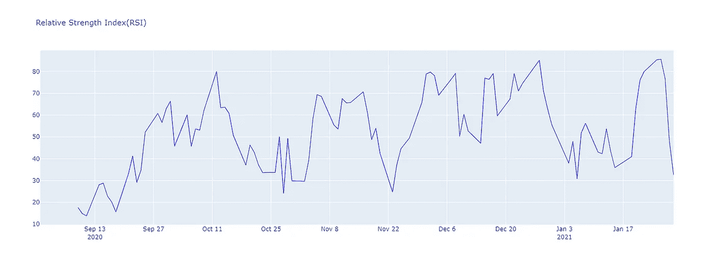
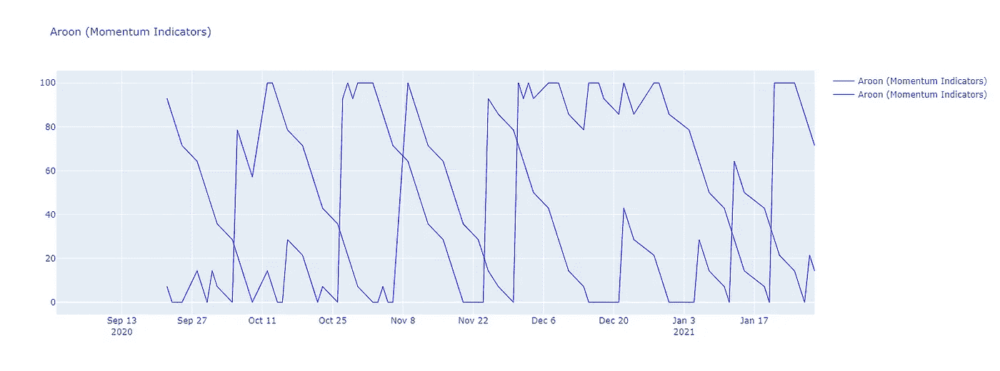

# 外汇股票数据的技术指标-第 2 部分

> 原文：<https://medium.datadriveninvestor.com/technical-indicators-for-forex-stock-data-part-2-b503bb509f5c?source=collection_archive---------10----------------------->

利用数据库进行股票数据分析


Photo by [Markus Spiske](https://unsplash.com/@markusspiske?utm_source=medium&utm_medium=referral) on [Unsplash](https://unsplash.com?utm_source=medium&utm_medium=referral)

本文是该系列的第二部分。为了开始使用，请阅读第一部分，包括基本安装和初始参数发现。第一部分的链接如下:

[](https://medium.com/datadriveninvestor/technical-indicators-for-stock-data-part-1-3abd03eb8a82) [## 股票数据的技术指标-第 1 部分

### 利用数据库进行股票数据分析

medium.com](https://medium.com/datadriveninvestor/technical-indicators-for-stock-data-part-1-3abd03eb8a82) 

在上一篇文章中，我们从安装所需的库 Ta-Lib 和 YFinance 开始。我们找到了用于股票数据分析的五个参数，在这一部分中，我们将探索更多有助于预测股票方向和动量的参数。

让我们开始吧。在本文中，我还为折线图创建了一个新函数，这样可以使用图表绘制的参数就可以使用这个函数来创建。

# 折线图功能

```
def plot_line_chart(indicator_data, title):
  df1 = pd.concat(indicator_data, axis=1)
  # Config graph layout
  layout = go.Layout({
      'title': {
          'text': title,
          'font': {
              'size': 15
          }
      }
  })
  data = []
  for i in indicator_data:
    trace1 = {
        'x': df.Date,
        'y': i,
        'type': 'scatter',
        'mode': 'lines',
        'line': {
            'width': 1,
            'color': 'blue'
                },
        'name': title
    }
    data.append(trace1)# Create Figure and plot
  fig = go.Figure(data=data, layout=layout)
  fig.show()
```

现在让我们从探索技术指标开始。

1.  **平均定向运动指数(动量指标)**

它可以用来帮助衡量一个趋势的整体实力。ADX 指标是不断扩大的价格区间值的平均值。

```
df['ADMI'] = ta.ADX(df['High'],df['Low'], df['Close'], timeperiod=5)
plot_line_chart([df.ADMI], 'Average Directional Movement Index')
```


ADX(Source: By Author)

2.**相对强弱指数**

相对强弱指数是一种用于金融市场分析的技术指标。它旨在根据最近一个交易周期的收盘价来绘制股票或市场当前和历史的强弱。

```
df['RSI'] = ta.RSI(df['Close'],5)
plot_line_chart([df.RSI], 'Relative Strength Index(RSI)')
```



RSI(Source: By Author)

3.**柴金模数转换线(音量指标)**

累积分布**线**是一个基于**量**的**指标**，用来衡量资金进出一只证券的累积流量。

```
df['AD'] = ta.AD(df['High'], df['Low'], df['Close'], df['Volume'])
plot_line_chart([df.AD], 'Chaikin A/D Line (Volume Indicators)')
```


Chaikin(Source: By Author)

4.**柴金模数振荡器(音量指示器)**

**柴金振荡器**是一个基于**成交量的**技术指标**试图确认当前的价格走势或预示未来的价格反转。**


Chaikin Oscillator(Source: By Author)

5.**阿隆(动量指标)**

**Aroon 指标**是一个技术**指标**，用于识别资产价格的**趋势**变化，以及该**趋势**的强度。

```
df['AROON_UP'], df['AROON_DOWN'] = ta.AROON(df['High'], df['Low'], timeperiod=14)
plot_line_chart([df.AROON_UP, df.AROON_DOWN], 'Aroon (Momentum Indicators)')
```



Aroon(Source: By Author)

这就是如何使用 Ta-Lib 来分析股票数据。试试这个，让我知道你在回复部分的经历。

**本文与**[**Piyush Ingale**](https://medium.com/u/40808d551f5a?source=post_page-----b503bb509f5c--------------------------------)**合作。**

# 在你走之前

***感谢*** *的阅读！如果你想与我取得联系，请随时通过 hmix13@gmail.com 联系我或我的* [***LinkedIn 个人资料***](http://www.linkedin.com/in/himanshusharmads) *。可以查看我的*[***Github***](https://github.com/hmix13)**简介针对不同的数据科学项目和包教程。还有，随意探索* [***我的简介***](https://medium.com/@hmix13) *，阅读我写过的与数据科学相关的不同文章。**