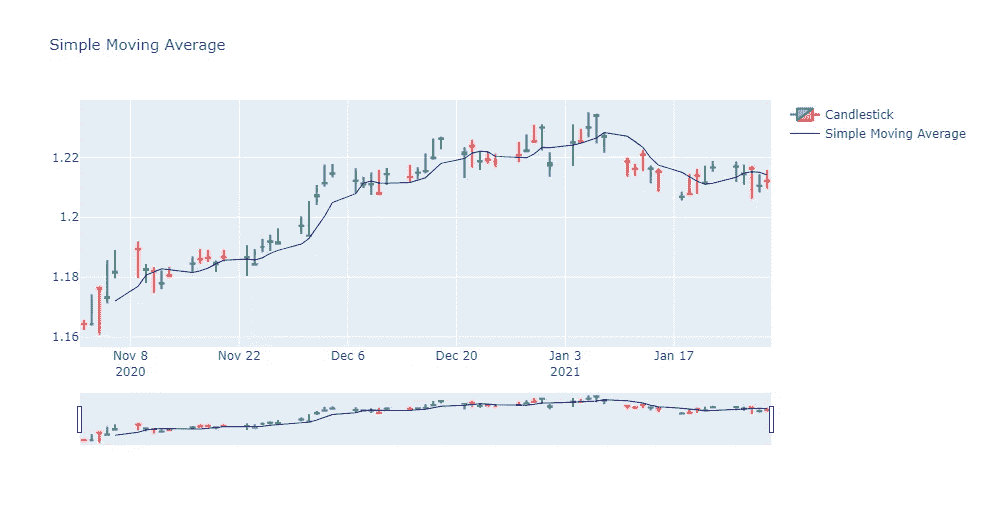
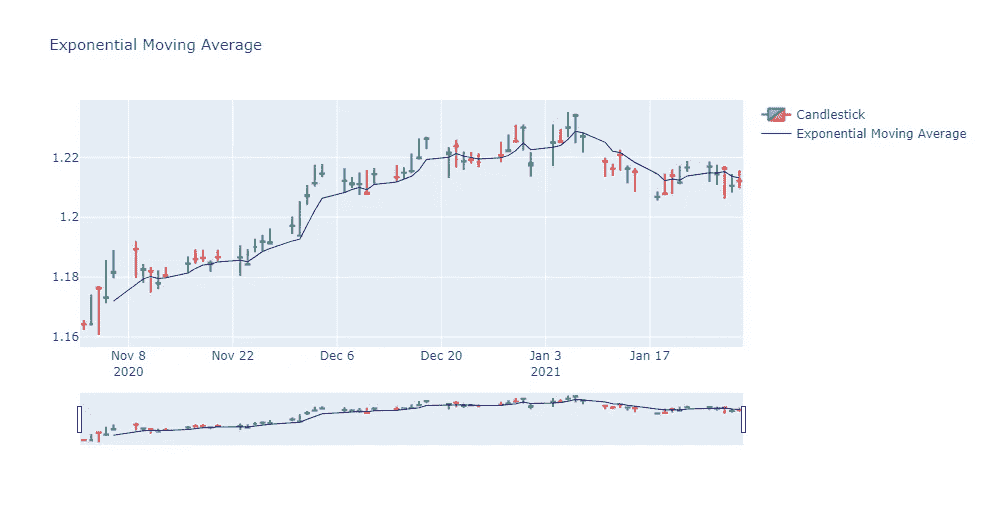
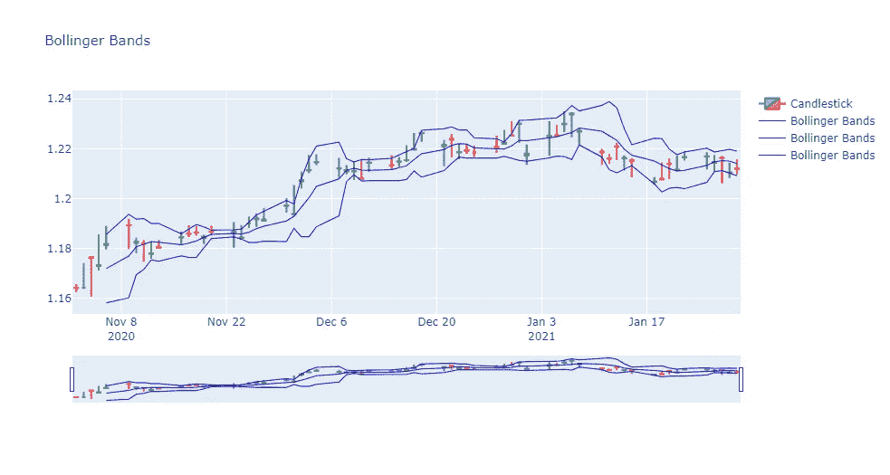
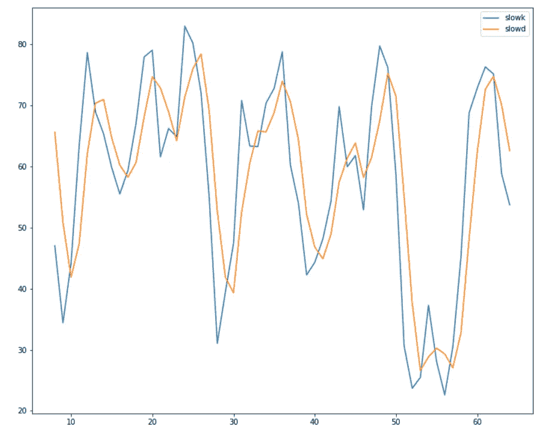
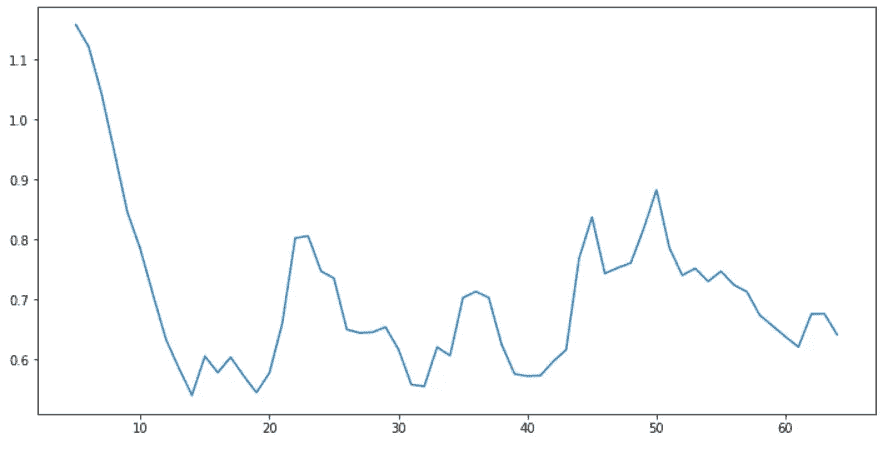

# 外汇股票数据的技术指标-第 1 部分

> 原文：<https://medium.datadriveninvestor.com/technical-indicators-for-stock-data-part-1-3abd03eb8a82?source=collection_archive---------13----------------------->

利用数据库进行股票数据分析


Photo by [Jamie Street](https://unsplash.com/@jamie452?utm_source=medium&utm_medium=referral) on [Unsplash](https://unsplash.com?utm_source=medium&utm_medium=referral)

技术性能指标是对不同的股票参数如成交量、价格等进行的数学计算。它们帮助我们识别一只股票在特定时间内遵循或将遵循的不同模式。这些性能指标通常使用图表和图形来可视化。

TA-Lib 是一个开源 python 库，用于分析股票市场的历史数据，如股价、成交量等。为了预测未来的价格或市场方向，以便我们能够相应地进行投资。

Ta-Lib 包含大量用于研究市场的技术指标。我们可以将大量的指标可视化，以便决定我们未来的战略。在本文中，我们将探讨如何使用 TA-Lib 创建不同的技术指标。

# 安装磁带库

Ta-lib 安装不同于其他 python 库，因为它不能使用 pip install 直接安装。正式上市。首先我们需要访问[链接](https://www.lfd.uci.edu/~gohlke/pythonlibs/#ta-lib)，根据我们的 windows 版本下载 Ta-Lib 的 whl 文件。之后，我们可以使用 pip install 安装它，如下所示。

```
pip install <filename.whl>
```

# 导入所需的库

接下来，我们将导入一些必需的库，它们将有助于下载数据和执行技术分析。

```
import yfinance as yf
import talib as ta
import pandas as pd
import plotly.graph_objects as go
import matplotlib.pyplot as plt
```

现在让我们看看一些有助于股票市场分析的指标。在这篇文章中，我将创建一个烛台图表，并在图表上，我将绘制不同的指标。因此，让我们首先创建一个函数来解决这个问题。

```
def plot_chart(indicator_data, title):
  trace1 = {
      'x': df.Date,
      'open': df.Open,
      'close': df.Close,
      'high': df.High,
      'low': df.Low,
      'type': 'candlestick',
      'name': 'Candlestick',
      'showlegend': True
  }
  # Aggregate all instances and define 'data' variable
  data = [trace1]for i in indicator_data:
    trace2 = {
        'x': df.Date,
        'y': i,
        'type': 'scatter',
        'mode': 'lines',
        'line': {
            'width': 1,
            'color': 'blue'
                },
        'name': title
    }
    data.append(trace2)
  # Config graph layout
  layout = go.Layout({
      'title': {
          'text': title,
          'font': {
              'size': 15
          }
      }
  })
  # Create Figure and plot
  fig = go.Figure(data=data, layout=layout)
  fig.show()
```

现在让我们找出一些指标，并将其形象化。

1.  **简单移动平均线**

简单移动平均线(SMA)通过该范围内的周期数来计算选定范围内收盘价的平均值。

```
df['MA'] = ta.SMA(df['Close'],5)
plot_chart([df.MA], 'Simple Moving Average')
```



SMA(Source: By Author)

2.**指数移动平均线**

指数移动平均线(EMA)是一种移动平均线(MA ),它对最近的数据点赋予更大的权重和重要性。也就是说，它通常被称为指数加权移动平均线。



EMA(Source: By Author)

3.**布林线**

布林线是一种统计图表，使用约翰·布林格提出的公式方法来描述金融工具或商品的价格和波动性。

```
df['up_band'], df['mid_band'], df['low_band'] = ta.BBANDS(df['Close'], timeperiod =5)
plot_chart([df.up_band, df.mid_band, df.low_band], 'Bollinger Bands')
```



BBands(Source: By Author)

4.**随机振荡器**

**随机**振荡器是**动量**的技术**指标**，用于将收盘价与给定时间段内的价格范围进行比较。

```
df['slowk'], df['slowd'] = ta.STOCH(df['High'], df['Low'], df['Close'], fastk_period=5, slowk_period=3, slowk_matype=0, slowd_period=3, slowd_matype=0)
df[['slowk', 'slowd']].plot(figsize=(12,10))
plt.show()
```



STOCH(Source: By Author)

5.**归一化平均真实范围(波动指标)**

归一化平均真实范围是波动性的一种度量。因为归一化平均真实范围是归一化的，所以在比较不同价格水平时，它比平均真实范围更有用。

```
df['NATR'] = ta.NATR(df['High'], df['Low'], df['Close'], timeperiod=5)
df['NATR'].plot(figsize=(12,10))
plt.show()
```



NATR(Source: By Author)

这就是如何使用 Ta-Lib 来分析股票数据。试试这个，让我知道你在回复部分的经历。

**本文与** [**皮尤什·英格尔**](https://medium.com/u/40808d551f5a?source=post_page-----3abd03eb8a82--------------------------------) **合作。**

# 在你走之前

***感谢*** *的阅读！如果您想与我取得联系，请随时通过 hmix13@gmail.com 联系我或我的* [***LinkedIn 个人资料***](http://www.linkedin.com/in/himanshusharmads) *。可以查看我的*[***Github***](https://github.com/hmix13)**简介针对不同的数据科学项目和包教程。还有，随意探索* [***我的简介***](https://medium.com/@hmix13) *，阅读我写过的与数据科学相关的不同文章。**