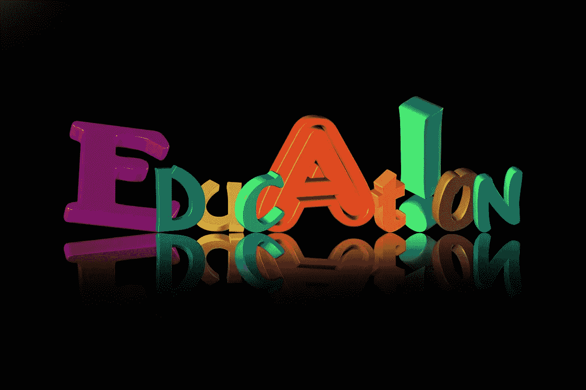
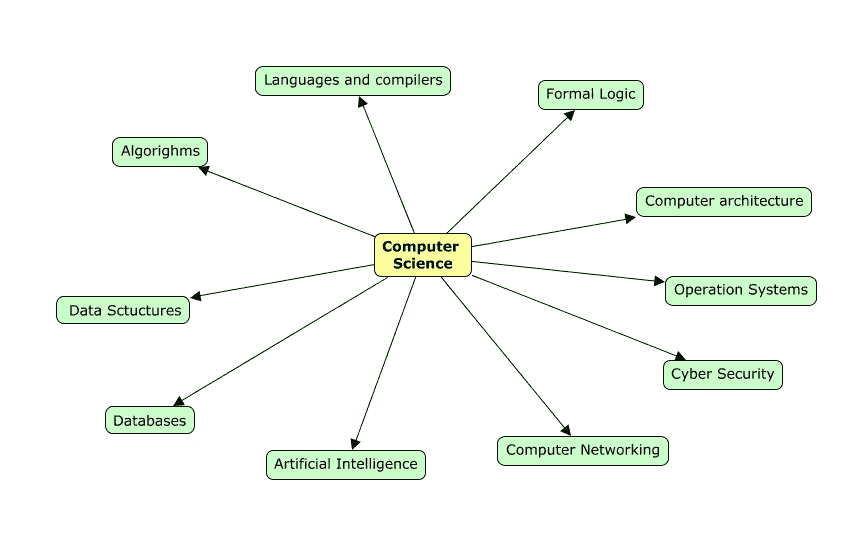
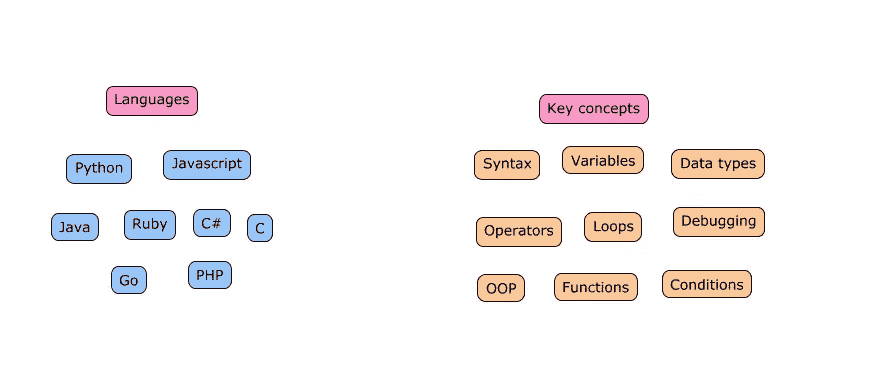
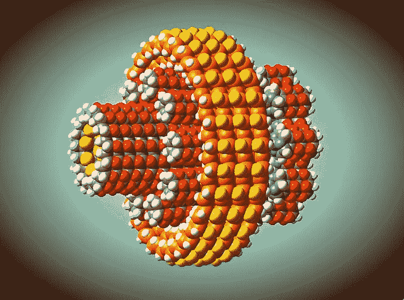

# 技术自我教育

> 原文：<https://medium.datadriveninvestor.com/technological-self-education-4635f85ca70b?source=collection_archive---------30----------------------->

我在麻省理工学院的同事法扎德启发了我，让我对自己开始学习计算机和数据科学以来的学习过程进行系统化思考。在这篇文章中，我将试着对学习过程中的关键部分做一个简短而精确的总结，尤其是当你非常严格的时候。

Image by [geralt](https://www.freeimg.net/photo/449664/education-letters-font-lettering)

**战争迷雾**

当我们学习一门全新的学科时，我们不知道自己不知道什么。而我们没有这样一个讲座，作为一个教授可以为我们映射。所以我们必须自己做。起初，我会专注于关键概念，而没有不必要的二元化。例如经过简短的研究后，计算机科学的近似高层次地图可以看起来是这样的:

它应该是一张活地图，因为，你不知道你不知道的东西。当你发现新的东西时，地图应该更新。现在，当我们绘制出你的主题的本体时，那种你在保护无限的感觉虽然没有消失，但应该会大大减少。现在我们可以选择块并开始分解它。

假设你和我一样，选择从“编程语言”开始。现在，我们需要规划出有哪些编程语言可以帮助我们朝着目标前进。还有什么是编程语言的通用关键概念。我有这样的地图:

现在你可以选择语言并开始学习/练习。我认为从哪种语言开始取决于你想用计算机科学做什么。如果你对 web 开发感兴趣，那么 JavaScript 是你最好的朋友。如果你对人工智能更感兴趣，那就选 python 吧。

现在我们有了一些我们可以关注的细节，大计划的细节在一段时间内不会困扰我们。你可以找到许多免费的在线课程，涵盖了你所选择的语言的基础知识。现在我们开始学习吧！

**勘探工程**

即使你不得不从视频和文本中吸收一些信息，这也不是一种非常有效的学习方式。

Image by [Walterdenkens](https://commons.wikimedia.org/wiki/File:Nanob.jpg)

术语**探索工程**是由 Eric Drexler 引入的，作为一种在我们拥有所有技术来实际构建系统之前设计系统的方法。德雷克斯勒用这种方法来设计纳米组装器，但我们可以把它应用到计算机科学的学习过程中。

假设你有一个你想要构建的应用程序或游戏的想法，但是你不知道如何构建。在德雷克斯勒的案例中，知识的缺乏可以类比为技术的缺乏。你开始学习编程的基础，同时开始构建你的项目。当你在这个项目中工作时，你会实践你所学的东西，并发现你知识中的空白点。您可能会创建应用程序的机制，并意识到您需要一些地方来存储数据，这意味着您需要了解数据库。或者突然你想创建数据的可视化，这意味着你需要学习如何使用 JavaScript 和前端库。另一个选择是，你可以为开源项目做贡献，解决一些超出你最近技能范围的问题。这是我在研究[日冕追踪器](https://medium.com/datadriveninvestor/open-source-for-good-716d40cc1dda)时的策略。

探索工程可以应用于任何学习和发展的主题。我甚至在一家面包店应用它来开发新的羊角面包配方。

**一致性**

即使你没有很多时间花在学习上，你仍然可以进步得很快。重要的是坚持和定期做。每天学习 1 小时比每周学习 7 小时要好。日常练习将有助于把你大脑中的知识从短期记忆转移到长期记忆中。

**走出去**

学习的社会方面和方法一样重要。对话是检验你对概念理解程度的基本方法。即使你觉得问题很明显，不值得问，也不要害怕问。youtube 上有许多开发者网络研讨会，你可以参加并提问。参与开源项目是参与对话和向其他开发者学习的好方法。所以，走出去，与世界交流你正在学习的东西。

**结论**

自学现实的新知识很有挑战性。但是如果你坚持不懈地做，并将你新学到的技能应用到实际项目中，你会成功的！