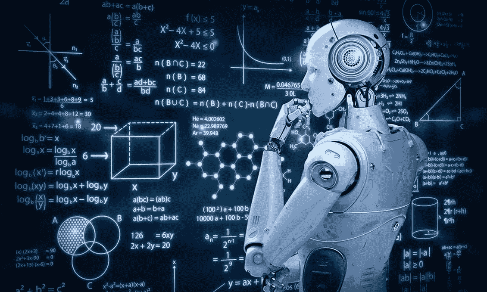

# 技术奇点——机器会达到吗？

> 原文：<https://medium.datadriveninvestor.com/technological-singularity-will-machines-reach-it-a4f65b6ce9d1?source=collection_archive---------4----------------------->

> “任何足够先进的技术都和魔法没什么区别”。—亚瑟·C·克拉克(科幻作家)

我们给机器编程。我们的程序和机器硬件变得越来越先进，然后又越来越先进。从两位:0 和 1 以及晶体管，数字世界从单纯的数字计算器发展到机器学习和人工智能。越来越多来自物理世界的对象被克隆到数字世界。

算法变得如此智能，包含它们的机器也是如此。智能机器开始创造新的改良机器。这就形成了一个循环，智能机器创造出新的智能机器。智能爆炸发生了。机器在每个周期变得越来越智能，它们自己创造改进的硬件来支持改进的算法。这些机器变得如此智能，以至于未来将是高度不可预测的。他们会探索我们所能想象的智力范围。世界，政治，经济，文化，一切都是突然的，不可预测的。未来我们所有的猜测都会被打破。技术奇点已经到来。

在物理学中，时空中有一个点，在这个点上，天体的质量和引力变得无穷大，并使时空无限扭曲。这就是黑洞里发生的事情。物理定律在这里被打破了。现实达到了一个全新的水平。这就是众所周知的引力奇点。

就像引力奇点让我们对现实感到困惑一样，技术奇点让我们对智能感到困惑。智力达到了一个全新的水平。整个终结者系列都围绕着这个主题，机器甚至建造时间机器，改变不同的时间线来达到他们的目标。是好是坏是另一个问题。这篇文章会让你思考这样的奇点是否可能。

想想当前的技术进步，从轮子的发明到宇宙飞船的发明，从火到导弹的发明，从草药到锁眼手术和基因工程的发明，从基本的符号表示到控制数字世界的算法，整个旅程花了不到一万年的时间。

对于一个生活在一万年前的人来说，飞机可能只是一个梦想，不会想到它在任何意义上都是可能的。在这种情况下，我们对可能性的质疑受到了极大的质疑。那么，当机器在更短的时间内，也许在十年内，也许在一年内，达到生产类似改进的阶段时，会发生什么呢？想象一下这种影响，想想这种疯狂而不可预测的可能性。如果技术能如此快速地改进，技术上的惊人和彻底的变化是可以预期的。一个做梦都想不到的未来。

 [## 技术成瘾-是真的吗？数据驱动的投资者

### 通知铃声响起。你很想检查一下。你拿起手机检查了一下。“哇...再来一个喜欢的…

www.datadriveninvestor.com](https://www.datadriveninvestor.com/2020/12/16/technology-addiction-is-it-real/) 

# 会有智力爆炸吗？

如果我们继续开发机器的智能，很有可能会出现智能爆炸。唯一的问题是多快能到达？

摩尔定律表明，芯片中的晶体管数量每两年翻一倍，这一预测不断成为现实。硬件的这种指数级发展支持了软件的指数级增长。当两者成指数关系时，没有什么好理由不相信会出现智力爆炸。

但是摩尔定律不会在某个时候失效吗？会不会有一个点，更多的晶体管不能被限制在同一空间？物理定律不会阻止智能爆炸吗？

诚然，摩尔定律会在某个时间点失效，但不会在不久的将来。即使不能在同一个空间中引入更多的晶体管，也会有新的方法来解决这个问题。例如，量子计算机将会出现并进化。化石燃料耗尽后会发生什么？我们将从其他资源中找到能源。更多的特斯拉会来到市场。

所以物理定律或者硬件不足未必能成为阻止智能爆炸的好理由。

还有另一种观点认为，如果机器变得智能，它们会做几乎所有由人类做的日常工作，而且速度会快得多。那么，难道经济不会崩溃，人们会收入不足，导致人工智能的资金减少，从而停止发展吗？当计算机被引进时，人们害怕。他们认为大多数人会失业，也许有些人会。但是也创造了更多的工作机会，趋势也变得不同了。这里也是如此，整个经济或推动它的力量，一切都将被改变，一个新的趋势将被设定。也许人类自己试图在生物层面上连接技术，以实现超人类主义，此后将不会有机器或人类，而是一个融合了神经元生物学和具有惊人智力和生理能力的电路技术的新物种。

最后，信号通过电路的速度比神经元快得多。神经元最多可以以 80 米/秒的速度传递信号，但在电子电路中，信号以光速传递。这在速度方面是一个惊人的优势，使用这些电路的智能机器可能会比我们想象的发展得更快。在机器的情况下，硬件所需的空间在减少，同时性能在提高。惊人的计算性能可以在很小的硬件空间内展现出来。当芯片变得比我们的大脑密度更大、功能更强时，难道没有任何可能达到奇点吗？如果是这样，他们将在我们中间提出一个严肃的问题:**作为一个人，到底意味着什么？**

# 参考

1.  【https://en.wikipedia.org/wiki/Nerve_conduction_velocity 

**访问专家视图—** [**订阅 DDI 英特尔**](https://datadriveninvestor.com/ddi-intel)