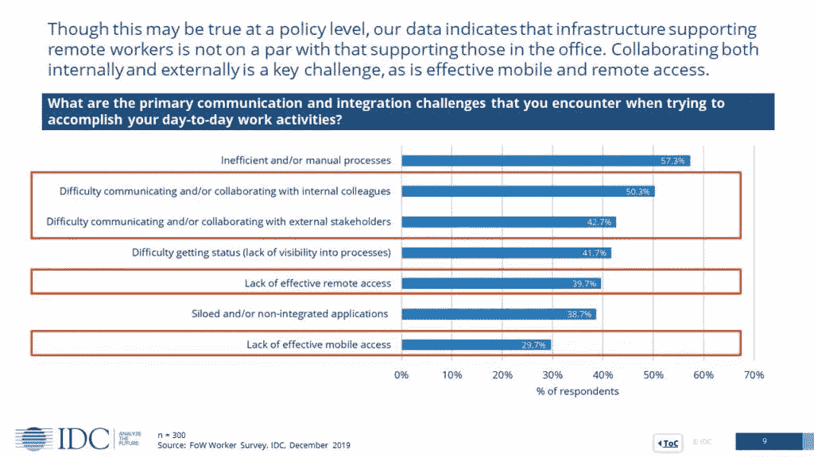
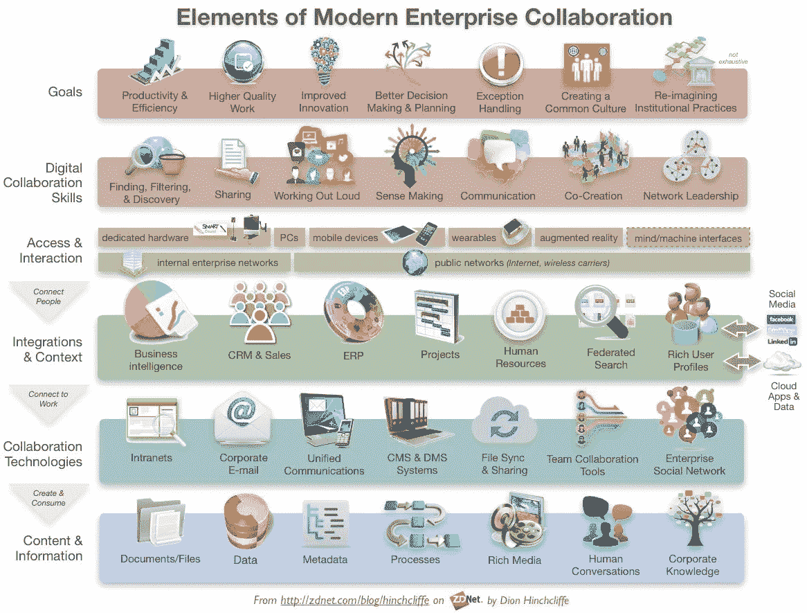

# 促进远程工作并引领数字化工作场所

> 原文：<https://medium.datadriveninvestor.com/technologies-you-need-to-slay-remote-work-in-style-8fce648b9d6?source=collection_archive---------14----------------------->

更好的工具有很多，但是在技术/工具上做出正确的投资是至关重要的。在做购买决定时利用网上正确的信息是理想的**等同于**为你的产品锁定正确的受众。

我们常犯的错误是，我们在决定技术/工具时，只考虑它们对一个基于财务稳定性的组织来说有多实惠。但除了定价，还有其他几个因素，如**生产力优势、兼容性、学习曲线、可伸缩性、集成/连接器、安全性、**等，都占据着重要位置。

尽管市场上有太多的免费工具，但它只在一定程度上符合小型组织的目的。许多公司都有创业包，包括工具和打折的小技巧，以帮助大规模增长的企业家精神。

对于拥有庞大团队的组织/企业来说，这些正义的事情变得无用，因此寻求一个与**业务指标**和**结果紧密结合的可靠实施计划。**此外，随着部门和组织内工具许可证数量的增长，数据安全也扮演着重要角色。

虽然在新冠肺炎·疫情事件爆发之前，情况是通过缓慢而谨慎的行动逐渐转变的，但现在组织正在对远程工作场景采取激烈的行动。如果决策不明智，这种草率可能会导致企业破产。现在，技术投资正处于巅峰状态，它可以成就一家公司，也可以毁掉一家公司。

虽然**远程工作**在这个领域并不新鲜，但与现场工作相比，它的采用率一直较低。但事实上，公司正在做出进一步的决定，将最低比例的员工永久转移到远程工作岗位。

> [*Gartner 首席财务官调查显示，74%的人打算将部分员工永久转移到远程工作岗位*](https://www.gartner.com/en/newsroom/press-releases/2020-04-03-gartner-cfo-surey-reveals-74-percent-of-organizations-to-shift-some-employees-to-remote-work-permanently2)

随着深入的对话和调查逐渐明朗，同样地， [IDC UK & Ireland](https://medium.com/u/84c0e5967c74?source=post_page-----8fce648b9d6--------------------------------) 对组织处理新冠肺炎过渡的研究获得了一些关于**基础设施兼容性**的有趣数据，

Image Source: IDC

在这种不确定的情况下，有几种工具/技术可以提供帮助，这些工具/技术不仅是业务连续性计划的一部分，而且可以通过扩展和满足**不断发展的业务需求**来继续提供更好的服务。根据你的组织的**去中心化**或**集中化**程度，工具可以是孤立的，也可以是统一的。

任何组织的梦想都是通过雇佣能够独立发展的员工，让组织变得极度分散。首先，组织可以开始打破部门壁垒，鼓励跨部门合作。为了支持这一运动，组织需要统一的工具，让工作从一边顺畅地流向另一边。**依赖性、灵活性、优化**和**创新**需要通过合并所有与工作场所相关的内部和外部工具来解决。

一般来说，远程工作需要更多的灵活性和可能性，通常它与本地需求并不完全相同。远程工作需求都可以在一个“**统一数字工作场所平台**中完成，但目前只有少数类别/模块可以汇聚成一个统一的解决方案。比如，

## [BPM(业务流程管理)](https://kissflow.com/bpm/bpm-tools-comparison-features/)

## [适应案例或项目管理](https://kissflow.com/case/adaptive-case-management-software/)

## [协作](https://medium.com/datadriveninvestor/if-not-contextual-why-collaborate-in-the-first-place-635716fa324e?source=---------4------------------)(包含社交馈送、即时消息、视频会议、会议解决方案、文档同步、存储和协作)

## [内部网](https://www.g2.com/categories/employee-intranet)

这里有一个 [**工具列表**](https://www.capterra.com/digital-workplace-software/) ，根据你所采用的数字化工作场所方法，这些工具可以满足部门、个人和组织的需求。

迪翁·欣奇克利夫的一张关于调整合适的工具、人员和业务目标的精彩图表。

再见。