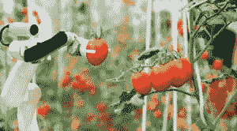

# 食品工业的技术进步和挑战

> 原文：<https://medium.datadriveninvestor.com/technology-advancements-and-challenges-in-food-industry-faca7602e999?source=collection_archive---------6----------------------->

Photo by [Dan Gold](https://unsplash.com/@danielcgold?utm_source=medium&utm_medium=referral) on [Unsplash](https://unsplash.com?utm_source=medium&utm_medium=referral)

## 来源: [CIOReview](https://www.cioreview.com?utm_source=medium&utm_campaign=articles&utm_medium=mediumpost)

## 食品工业的增长

技术改变了不同行业的运作方式。今天，食品工业中的技术是饮食结构中最受欢迎的部分。食品行业已经向基于创新技术的服务敞开了大门，这导致了食品行业运营方式的巨大转变。食品和技术的配方诞生于食品技术。通过拥抱技术创新，食品公司可以利用新的力量来增强他们的组织，实现可能无法实现的目标。继续读下去，了解更多。

在包括儿童在内的新消费者群体中，主要目标已经转移到产品的可持续性、健康和新鲜度上，因此食品技术行业也在相应地发展。世界正在逐渐适应时代的变化，提供更健康的饮食习惯，避免食品掺假。基于区块链的移动应用程序通过跟踪和记录交易来加强食品管理，以确保食品行业的安全和质量。区块链还有助于提供品牌透明度和处理大数据。

 [## 新的健康技术如何让我们活过 100 岁？数据驱动的投资者

### 不久前，我们都在看一台黑色电视，不得不带着天线跑遍整个公寓，以确保…

www.datadriveninvestor.com](https://www.datadriveninvestor.com/2020/08/12/how-new-health-technology-makes-us-live-past-100-years/) 

随着[增强和虚拟现实](https://www.cioreview.com/news/ar-and-vr-redefining-food-production--nid-29535-cid-29.html?utm_source=medium&utm_campaign=articles&utm_medium=mediumpost)在食品行业的出现，创意食品图像变得越来越小。食品透明度现在是最重要的事情。在增强和虚拟现实的帮助下，消费者的卡路里摄入量现在与他们点的菜肴相关联。技术还通过弥合不同文化之间的差距来支持消费者。食品移动应用程序正在利用基于人工智能的聊天机器人来联系他们的消费者。这些聊天机器人发送支持饮食行为的食物推荐。通过聊天机器人的支持是全天候的。

食品和饮料行业正在转型——这是显而易见的。技术的快速发展，数字化的可能性——在一个传统的低技术、复杂的行业中——正在向世界范围内的有机现象开放应用范围。

> **食品和饮料行业面临的挑战**

就口味、偏好、包装、制造、储存、运输等方面而言，食品和饮料行业始终是变化最快的行业之一。由于消费者行为、技术进步和法规的快速变化，该行业在过去十年中经历了许多变化。这些因素也给该行业带来了一系列障碍。作为一个消费者驱动的行业，这个行业正面临着严峻的挑战，这里有更多关于它的信息。

## 塑料禁令

塑料消费的增加和处理不当是当今食品和饮料管理者面临的主要挑战之一。在这种情况下，一个被命名为“生态友好”的产品比一个危害环境的产品更能吸引消费者，更有可能带来利润。食品和饮料制造商现在正通过采用多种回收措施，努力使食品制造过程高度环保。

## 注重健康的消费者

与食物相关的疾病的增加促使消费者在饮食和生活方式上带来巨大的变化，使他们比以往任何时候都更加注重健康。因此，人们的想法转向购买不添加防腐剂的食品，因为防腐剂可能会损害健康。对贴有“健康”标签的产品的需求必然会减少，并保持在首位。消除产品中人工成分的需求已经成为食品和饮料管理者面临的一个重大挑战。

## 对产品可追溯性的担忧

可追溯性是食品和饮料行业的主要挑战之一，不仅是为了记录管理，也是为了实现底线。消费者越来越想知道他们的食品中含有什么，这使得成分标签成为包装过程的一个主要部分。随着公众对食品供应链的信任度急剧下降，以及近几年来对供应链故障的关注，端到端可追溯性已成为食品和饮料行业的大趋势之一。

## 新闻来源:

## 科技是如何加速食品行业发展的？

**访问专家视图—** [**订阅 DDI 英特尔**](https://datadriveninvestor.com/ddi-intel)